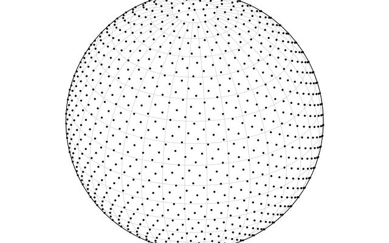

## ddgi update (9/30)

scene 에 변화가 없더라도 매 프레임 DDGI 호출

- Ray tracing 구조 (TLAS, BLAS bvh) 없으면 스킵
- DDGI 버퍼 없으면 스킵
- Ray tracing이 아직 처리 중이면 스킵

```c
//wiRenderPath3D.cpp:921-927
if (wi::renderer::GetDDGIEnabled() && getSceneUpdateEnabled())
{
  wi::renderer::DDGI(*scene, cmd);
}
```

DDGI 함수 내부 조건
```c
// wiRenderer.cpp:12063
void DDGI(const wi::scene::Scene& scene, CommandList cmd)
{
  if (!scene.TLAS.IsValid() && !scene.BVH.IsValid())
	  return;  // Ray tracing 구조 없으면 스킵

  if (GetDDGIRayCount() == 0)
	  return;  // Ray 개수가 0이면 스킵

  if (!scene.ddgi.ray_buffer.IsValid())
	  return;  // DDGI 버퍼 없으면 스킵

  if (wi::jobsystem::IsBusy(raytracing_ctx))
	  return;  // Ray tracing이 아직 처리 중이면 스킵

  // 이후 DDGI 업데이트 수행 (ray tracing, sh)
}
```

scene 변화가 없는 정적인 환경에서는 inconsistency 매우 감소 
-> 각 probe의 ray 개수 감소 (최소 4개)
- inconsistency 를 감지하기 위해서 ray 개수 최소값 보장장


## DDGI 개요

DDGI는 실시간 글로벌 일루미네이션을 위해 3D 공간에 light probe들을 배치하고, 이들 간의 보간을 통해 간접광을 계산하는 기법입니다.

tlas blas - 광선-오브젝트 교차 테스트를 빠르게 수행하기 위한 가속 구조(Acceleration Structure)

atlas - 여러 텍스쳐를 한 파일로 저장


# DDGI Spherical Harmonics 계산 과정

- probe 배치
    
    자동 Grid Bounds 조정 코드
    
    1. 씬 bounds 계산
    
    ```c
    // wiScene.cpp:630-637
    float3 grid_min = bounds.getMin();  // 씬의 최소 좌표
    grid_min.x -= 1; grid_min.y -= 1; grid_min.z -= 1;  // 여유 공간
    float3 grid_max = bounds.getMax();  // 씬의 최대 좌표
    grid_max.x += 1; grid_max.y += 1; grid_max.z += 1;  // 여유 공간
    ```
    
    - bounds.getMin(), getMax()
        1. 개별 Object AABB 계산
        
        ```c
        // wiScene.cpp:4401-4404
        // 각 오브젝트마다
        const MeshComponent& mesh = *meshes.GetComponent(object.meshID);
        const TransformComponent& transform = *transforms.GetComponent(entity);
        
        XMMATRIX W = XMLoadFloat4x4(&transform.world);  // World 변환 행렬
        aabb = mesh.aabb.transform(W);  // 메시 바운딩 박스를 월드 좌표로 변환
        ```
        
        - 과정:
            - 메시 AABB: 모델 로컬 좌표의 바운딩 박스
            - World 변환: Position, Rotation, Scale 적용
            - 결과: 월드 좌표계의 Object AABB
        1. 병렬 AABB 병합 
        
        ```c
        // wiScene.cpp:4679-4687
        // 병렬 처리로 그룹별 AABB 계산
        AABB& shared_bounds = parallel_bounds[args.groupID];
        if (args.isFirstJobInGroup) {
        	shared_bounds = aabb_objects[args.jobIndex];  // 첫 번째 오브젝트
        } else {
        	shared_bounds = AABB::Merge(shared_bounds, aabb_objects[args.jobIndex]);  // 병합
        }
        ```
        
        2. 최종 Scene AABB 계산 
        
        ```c
        // wiScene.cpp:411-415
        bounds = AABB();  // 빈 AABB로 초기화
        	for (auto& group_bound : parallel_bounds) {
        	bounds = AABB::Merge(bounds, group_bound);  // 모든 그룹 AABB 병합
        }
        ```
        
    1. 점진적 블렌딩 
    
    ```c
    // wiScene.cpp:644-645
    float bounds_blend = 0.01f;  // 1% 씩 천천히 조정
    ddgi.grid_min = wi::math::Lerp(ddgi.grid_min, grid_min, bounds_blend);
    ddgi.grid_max = wi::math::Lerp(ddgi.grid_max, grid_max, bounds_blend);
    ```
    
    1. 첫 프레임 예외 
    
    probe 배치 
    
    ```c
    // wiScene.cpp:640-643
    if (ddgi.frame_index == 0 || area < 0.001f) {
    	bounds_blend = 1;  // 첫 프레임은 즉시 조정
    }
    ```
    

## 1단계: Ray Tracing

### 각 probe 마다 ray 개수 및 해상도?

~~매 프레임마다~~ 각 probe 마다 최대 512개의 ray 사용

ddgi_rayallocationCS.hlsl 에서 probe 의 중요도에 따라 해당 probe 에 할당되는 ray 의 개수를 정함

- 할당 기준
    1. Inconsistency (불일치도)
        
        ```c
        // Line 25-27: 각 프로브의 inconsistency 값 확인
        inconsistency = max(inconsistency, varianceBuffer[...].inconsistency);
        
        // Line 47: inconsistency에 비례하여 ray 개수 결정
        uint rayCount = saturate(max_inconsistency) * push.rayCount;
        ```
        
        Inconsistency 의미:
        
        - 조명 변화가 큰 영역: 높은 값
        - 안정된 조명 영역: 낮은 값
        - 분산(Variance) 기반: 이전 프레임과의 차이
        
        각 probe의 텍셀들의 radiance 변화량을 이용 → inconsistency 에 사용
        
    2. 카메라 프러스텀
        
        ```c
        // Line 52-55: 카메라 시야 밖 프로브는 ray 개수 10% 감소
          if (!GetCamera().frustum.intersects(sphere))
          {
              rayCount *= 0.1;
          }
        ```
        
    3. 제약 조건들
        
        ```c
        	// Line 57-58: 정렬 및 범위 제한
          rayCount = align(rayCount, DDGI_RAY_BUCKET_COUNT);  // 4의 배수 단위 정렬
          rayCount = clamp(rayCount, DDGI_RAY_BUCKET_COUNT, DDGI_MAX_RAYCOUNT);  // 최소-최대 범위
        
          // Line 60-61: 첫 프레임은 최대 ray 사용
          if(push.frameIndex == 0)
              rayCount = DDGI_MAX_RAYCOUNT;
        
        // 예외 : 카메라 시야 밖 프로브는 10% 로 감소
        // ddgi_rayallocationCS.hlsl:52-55
          if (!GetCamera().frustum.intersects(sphere)) {
              rayCount *= 0.1;  // 10% 감소 → 51.2개 → 정렬 후 52개
          }
        ```
        

ray 방향 결정 : Spherical Fibonacci + 매 프레임 랜덤하게 회전

```c
Spherical Fibonacci:
float3 spherical_fibonacci(float i, float n)
{
float phi = 2.0 * PI * madfrac(i, PHI - 1);
float cos_theta = 1.0 - (2.0 * i + 1.0) * (1.0 / n);
float sin_theta = sqrt(clamp(1.0 - cos_theta * cos_theta, 0.0f, 1.0f));
return float3(cos(phi) * sin_theta, sin(phi) * sin_theta, cos_theta);
}
```

- 균등 분포: 구 전체에 ray를 균등하게 분산



- 매 프레임 회전: random_orientation 행렬로 패턴 변경

```c
// wiRenderer.cpp:12172-12181
// 랜덤 파라미터 생성
float angle = wi::random::GetRandom(0.0f, 1.0f) * XM_2PI;  // 0~2π 랜덤 각도

XMVECTOR axis = XMVectorSet(
    wi::random::GetRandom(-1.0f, 1.0f),  // 랜덤 X 축
    wi::random::GetRandom(-1.0f, 1.0f),  // 랜덤 Y 축
    wi::random::GetRandom(-1.0f, 1.0f),  // 랜덤 Z 축
    0
);
//회전 행렬 생성
axis = XMVector3Normalize(axis);  // 축 벡터 정규화
XMStoreFloat4x4(&cb.g_xTransform, XMMatrixRotationAxis(axis, angle));  // 회전 행렬 계산

// shader 로 전달
device->BindDynamicConstantBuffer(cb, CB_GETBINDSLOT(MiscCB), cmd);
// → g_xTransform으로 셰이더에 전달됨
```

따라서 해상도에 제약 없이 모든 방향으로 raytracing 가능

```c
// ddgi_raytraceCS.hlsl:52
// 1. 각 프로브에서 구 방향으로 광선 발사 (Spherical Fibonacci 분포 사용 -> 구 표면에 균일한 랜덤 방향)
const float3 raydir = normalize(mul(random_orientation, spherical_fibonacci(rayIndex, rayCount)));
// 2. 정적 라이트들로부터 직접 조명 샘플링
if (light.IsStaticLight()) {
	// 방향성 라이트, 포인트 라이트, 스포트라이트 등 처리
	lighting.direct.diffuse = lightColor;
}
// 3. 환경 맵에서 간접 조명 계산
radiance += EvaluateEnvironmentMap(raydir) * GetFrame().horizon_color.a;
// 4. Ray 데이터를 버퍼에 저장
DDGIRayDataPacked rayData;
rayData.direction_distance = PackDirectionDistance(raydir, hit_distance);
rayData.radiance = PackRGBE(radiance);
rayBuffer[rayBufferIndex] = rayData;
// Ray depth 처리
float depth;
if (ray.depth > 0) {
    depth = clamp(ray.depth - 0.01, 0, maxDistance);  // 약간의 bias
} else {
    depth = maxDistance;  // Miss = 최대 거리
}

// 방향 유사도로 가중치 계산
float weight = saturate(dot(texel_direction, ray.direction));
weight = pow(weight, 64);  // Depth는 더 Sharp한 필터링

if (weight > WEIGHT_EPSILON) {
    result += float2(depth, sqr(depth)) * weight;  // 평균과 분산 저장 (chebyshev 부등식을 적용하기 위해)
    total_weight += weight;
}
```

### raytracing 이 어떤 과정으로 이루어지는지

probe 에서 광선 발사

- 충돌 표면의 lighting 계산 (Monte Carlo Integration)
    - raytracing 충돌 알고리즘 blas tlas
    - scene 모든 조명 중 하나의 조명 선택
    - 조명의 영향 여부 계산 : 그 조명이 충돌 표면에 영향을 주는 조명인지 계산 (거리, 방향, 각도)
    - 조명 그림자 계산 : 충돌 위치 → 조명 방향 shadow ray 발사, 조명이 다른 표면에 의해 가려지는지 체크
    - 조건이 모두 맞을시, 충돌 표면(material, 색상 등)과 해당 조명 정보 이용 - 표면에서 probe로 반사되는 직접광 계산
    - 결과에 scene 모든 조명 개수 곱함
- 충돌 표면 주변 8개 probe 이용 간접 조명 (첫 프레임은 0)
    - 각 probe 에서 해당 충돌 표면 방향 radiance 값 계산
    - trilinear interpolation 및 depth 이용 visibility test
    - 에너지 보존 계수 0.95 (무한 반사 방지)
    - 광선 발사 probe 랑 겹치면?
- 충돌하지 않음 → 환경맵 처리

결국 radiance 값이 octahedral 텍셀 단계에서 매 프레임마다 블렌딩 되므로, 점차 정확한 lighting 동작

1. 초기화
    
    ```c
    // ddgi_raytraceCS.hlsl:52
    float3 radiance = 0;  // 최종 radiance 값
    const float3 raydir = normalize(mul(random_orientation, spherical_fibonacci(rayIndex, rayCount)));
    ```
    
2. Direct Light Sampling
    
    ```c
    // ddgi_raytraceCS.hlsl:64
    // 정적 조명들로부터 직접 조명 계산
      const uint light_index = lights().first_item() + rng.next_uint(light_count);
      ShaderEntity light = load_entity(light_index);
    
      switch (light.GetType()) {
          case ENTITY_TYPE_DIRECTIONALLIGHT:
              lighting.direct.diffuse = lightColor;
              break;
          case ENTITY_TYPE_POINTLIGHT:
              lighting.direct.diffuse = lightColor * attenuation_pointlight(dist2, range, range2);
              break;
          // 스포트라이트, 직사각형 라이트 등...
      }
    
      // Shadow Ray로 가려짐 체크 후 기여분 추가
      radiance += light_count * max(0, shadow * lighting.direct.diffuse * NdotL / PI);
    ```
    
3. Primary Ray Tracing
    
    ```c
    RayDesc ray;
      ray.Origin = probePos;        // 프로브 위치에서 시작
      ray.Direction = raydir;       // Fibonacci 방향
      ray.TMax = FLT_MAX;          // 무한 거리
    
      // Ray 발사
      if (miss) {
          // 환경맵/하늘 샘플링
          if (IsStaticSky()) {
              envColor = GetStaticSkyColor(ray.Direction);
          } else {
              envColor = GetDynamicSkyColor(ray.Direction, true, false, true);
          }
          radiance += envColor;  // 하늘색 기여
      }
    ```
    
4. Surface Hit 처리
    
    ```c
    if (hit) {
          // Surface 정보 로드
          surface.load(hit.primitiveID, hit.bary);
          surface.P = ray.Origin;
          surface.V = -ray.Direction;
          surface.update();
    
          // 표면에서의 직접 조명 계산 (위와 동일한 light sampling)
          // ...
    
          // 간접 조명 (이전 프레임 DDGI 결과 사용)
          if (push.frameIndex > 0) {
              float energy_conservation = 0.95 / PI;
              float3 ddgi = ddgi_sample_irradiance(surface.P, surface.facenormal, ...);
              hit_result += ddgi * energy_conservation;
          }
    
          // Material 적용
          hit_result *= surface.albedo;      // 표면 반사도
          hit_result += surface.emissiveColor;  // 자체 발광
    
          radiance += hit_result;
      }
    ```
### raytracing 가속 구조 (9/30)

하드웨어 RT 호출시에 scene_acceleration_structure 을 파라미터로 사용합니다.
각 메시들은 변형시에만 blas 를 재구성하고,
tlas 의 경우 매 프레임 메시들의 움직임을 추적해서 재구성합니다.

BVH (Bounding Volume Hierarchy) 구조:

TLAS Root 
├── Instance A (Car) 
│ └── BLAS A 
│     ├── BV: Wheels 
│     │ ├── Triangle 1,2,3... 
│     └── BV: Body 
│         ├── Triangle 100,101... 
├── Instance B (Building) 
│ └── BLAS B 
│     ├── BV: Floor 
│     └── BV: Walls

BLAS (Bottom Level AS)
- MeshComponent 내부에 저장
- 인스턴스 공유 / 복사
```c
// wiScene_Components.h:758
// MeshComponent : 공유되는 메시 데이터
struct MeshComponent {
  wi::vector<wi::graphics::RaytracingAccelerationStructure> BLASes; // one BLAS per LOD
  // lod 에 따라 디테일 차이
  mutable BLAS_STATE BLAS_state = BLAS_STATE_NEEDS_REBUILD;
  
  wi::graphics::GPUBuffer streamoutBuffer; // 애니메이션 데이터

  // 버퍼 내 섹션들
  BufferView so_pos;  // 현재 위치
  BufferView so_pre;  // 이전 위치
  BufferView so_nor;  // 노말
  BufferView so_tan;  // 탄젠트
  // ... 기타 메시 데이터
};
```
- Scene의 ComponentManager 에서 관리

```c
// wiScene.h:35
class Scene {
  wi::ecs::ComponentManager<MeshComponent>& meshes =
	  componentLibrary.Register<MeshComponent>("wi::scene::Scene::meshes", 4);
  // 각 MeshComponent가 자체 BLAS들을 포함
};
```


- 구조적 계층:
  Scene
  └── ComponentManager< MeshComponent > meshes
      └── Entity 1: MeshComponent
          └── BLASes[0] (LOD 0)
          └── BLASes[1] (LOD 1)
          └── BLASes[2] (LOD 2)
          └── BLAS_state
      └── Entity 2: MeshComponent
          └── BLASes[0]
          └── BLAS_state
      └── 


```c
// 각 메시별로 생성, 동일 메시들의 경우 원본 blas를 복사 (공유 x, 각 인스턴스가 다른 애니메이션을 할 수 있으므로)
  for (각 메시) {
      BLAS blas;
      blas.geometryDesc = {
          .vertices = mesh.vertices,
          .indices = mesh.indices,
          .triangles = mesh.triangleCount
      };
      // GPU에서 BVH 트리 구축
      device->BuildBLAS(blas);
  }
```


TLAS (Top Level AS)

```c
// 씬 전체 구조
  TLAS tlas;
  for (각 오브젝트 인스턴스) {
      InstanceDesc instance = {
          .blasIndex = object.meshBLAS,
          .transform = object.worldMatrix,
          .instanceID = object.id
      };
      tlas.instances.push_back(instance);
  }
  device->BuildTLAS(tlas);
```

blas 생성 과정

```c
// BLAS 생성 과정 (wiScene_Components.cpp:1460+)
  void MeshComponent::StreamOutBLAS() {
      RaytracingAccelerationStructureDesc desc;
      desc.type = Type::BOTTOMLEVEL;

      // 각 서브셋(Material Group)별로 geometry 추가
      for (uint32_t subsetIndex = first_subset; subsetIndex < last_subset; ++subsetIndex) {
          const MeshSubset& subset = subsets[subsetIndex];
          desc.bottom_level.geometries.emplace_back();
          auto& geometry = desc.bottom_level.geometries.back();

          // 삼각형 데이터 설정
          geometry.type = TRIANGLES;
          geometry.triangles.vertex_buffer = generalBuffer;     // 정점 버퍼
          geometry.triangles.vertex_byte_offset = vb_pos_wind.offset;
          geometry.triangles.index_buffer = generalBuffer;      // 인덱스 버퍼
          geometry.triangles.index_count = subset.indexCount;   // 삼각형 개수
          geometry.triangles.vertex_count = vertex_positions.size();
      }

      // GPU에 BLAS 리소스 생성
      device->CreateRaytracingAccelerationStructure(&desc, &BLASes[lod]);
  }
```

tlas 생성 과정

```c
// TLAS 생성 과정 (wiScene.cpp:440+)
  RaytracingAccelerationStructureDesc desc;
  desc.type = Type::TOPLEVEL;
  desc.top_level.count = instanceArraySize * 2;  // 인스턴스 최대 개수

  // Instance Buffer 생성 (인스턴스 Transform + BLAS 참조 저장)
  GPUBufferDesc bufdesc;
  bufdesc.misc_flags |= ResourceMiscFlag::RAY_TRACING;
  bufdesc.stride = device->GetTopLevelAccelerationStructureInstanceSize();  // 인스턴스 크기
  bufdesc.size = bufdesc.stride * desc.top_level.count;
  device->CreateBuffer(&bufdesc, nullptr, &desc.top_level.instance_buffer);

  // TLAS 리소스 생성
  device->CreateRaytracingAccelerationStructure(&desc, &TLAS);
```

blas 업데이트 (메시가 변형될 때만 업데이트)

- NEEDS_REBUILD: 메시 지오메트리가 완전히 바뀜 (새 정점/삼각형)
    - BVH 구조 완전 재구축
    - 메시 생성/초기화 시
    - 지오메트리 플래그 변경 시
- NEEDS_REFIT: 정점 위치만 바뀜 (애니메이션, 스키닝)
    - 기존 BVH 구조 유지, 바운딩 박스만 업데이트
    - 삼각형 추가/제거 불가 - 버텍스 위치만 수정 가능
    - Streamout Buffer 존재 시
	    - 스켈레탈 애니메이션 -> 버텍스 위치 변경
	    - Morph Targets 로 형태 변경
	    - GPU 버텍스 변형 후 결과를 Streamout buffer 에 저장
- COMPLETE: 변화 없음 → 스킵 (성능 최적화)

변형 감지 매커니즘
A. 정적 메시 (Static Mesh):
- streamoutBuffer 없음 → BLAS_STATE_COMPLETE (변형 없음)

B. 동적 메시 (Dynamic Mesh):
- streamoutBuffer 존재 → BLAS_STATE_NEEDS_REFIT (매 프레임 refit 고정)

C. 지오메트리 변경:
- 플래그 변경 감지 → BLAS_STATE_NEEDS_REBUILD (완전 재구축)

#streamoutBuffer
- GPU에서 버텍스를 변형한 결과를 저장하는 출력 버퍼 (GPU 애니메이션 결과 저장소)
- 생성 조건
	- skeletal Animation : vertex_boneindices 존재 (본 애니메이션)
	- Morph Target Animation : morph_targets 존재 (블렌드셰이프)
- 버퍼 구조
```c
//wiScene_Components.cpp:1396-1401
desc.size =
  AlignTo(vertex_positions.size() * sizeof(Vertex_POS32W), alignment) + // 현재 위치
  AlignTo(vertex_positions.size() * sizeof(Vertex_POS32W), alignment) + // 이전 위치 (motion
vector용)
  AlignTo(vertex_normals.size() * sizeof(Vertex_NOR), alignment) +      // 노말
  AlignTo(vertex_tangents.size() * sizeof(Vertex_TAN), alignment);      // 탄젠트

4개 섹션으로 구성:
- so_pos: 변형된 현재 버텍스 위치
- so_pre: 이전 프레임 버텍스 위치 (Motion Vector 계산용)
- so_nor: 변형된 노말
- so_tan: 변형된 탄젠트
```

BLAS 재구성

```c
// wiRenderer.cpp:5607+ - 매 프레임
  for (size_t i = 0; i < scene.meshes.GetCount(); ++i) {
      const MeshComponent& mesh = scene.meshes[i];
      for (auto& BLAS : mesh.BLASes) {
          switch (mesh.BLAS_state) {
          case BLAS_STATE_COMPLETE:
              break;                               // 변화 없음 - 스킵
          case BLAS_STATE_NEEDS_REBUILD:
              device->BuildRaytracingAccelerationStructure(&BLAS, cmd, nullptr);  // 완전 재구축
              break;
          case BLAS_STATE_NEEDS_REFIT:
              device->BuildRaytracingAccelerationStructure(&BLAS, cmd, &BLAS);    // 부분 업데이트
              break;
          }
      }
      mesh.BLAS_state = BLAS_STATE_COMPLETE;
  }
```

tlas 업데이트 (씬 전체)

- 매 프레임 재구축 (인스턴스 transform 변화 추적)
- 오브젝트가 움직이면 → TLAS 업데이트
- blas 업데이트 -> tlas 도 업데이트
- BLAS는 그대로 유지 (메시 자체는 안 바뀜)

```c
// wiRenderer.cpp:5689 - 매 프레임
  device->BuildRaytracingAccelerationStructure(&scene.TLAS, cmd, nullptr);
```

- 실제 작동 코드

```c
// ddgi_raytraceCS.hlsl:229
		RayDesc ray;
		ray.Origin = probePos;
		ray.TMin = 0; // don't need TMin because we are not tracing from a surface
		// 최소 거리 (surface가 아닌 공중(probe)에서 시작하므로 0)
		ray.TMax = FLT_MAX; // 최대 거리(무한대)
		ray.Direction = normalize(raydir);

#ifdef RTAPI 
		// Hardware RT (RTX/RDNA2+)
		wiRayQuery q; // Ray Query 초기화, Xbox Scarlett 용 또는 일반 RayQuery<0>
		q.TraceRayInline(
			scene_acceleration_structure,	// RaytracingAccelerationStructure AccelerationStructure, tlas 시작
			// RAY_FLAG_CULL_BACK_FACING_TRIANGLES |  // 뒷면 컬링
			RAY_FLAG_SKIP_PROCEDURAL_PRIMITIVES | // 절차적 지오메트리 스킵
			RAY_FLAG_FORCE_OPAQUE,			// uint RayFlags  투명도 무시, 불투명 처리
			push.instanceInclusionMask,		// uint InstanceInclusionMask 어떤 인스턴스 포함할지 (비트마스크)
			ray								// RayDesc Ray 구조체
		);
		while (q.Proceed());
			// GPU RT 코어가 자동 BVH 순회
		  // 내부적으로:
		  // 1. TLAS 루트에서 시작
		  // 2. Ray-AABB 테스트로 인스턴스 찾기
		  // 3. 해당 인스턴스의 BLAS로 이동
		  // 4. Ray-Triangle 테스트로 최종 충돌 찾기
		if (q.CommittedStatus() != COMMITTED_TRIANGLE_HIT)
		// COMMITTED_TRIANGLE_HIT: 삼각형과 충돌
	  // COMMITTED_PROCEDURAL_PRIMITIVE_HIT: 절차적 지오메트리 충돌
	  // COMMITTED_NOTHING: 충돌 없음
#else
		// Software RT (wicked engine 에서 compute shader로 직접 구현한 BVH traversal, 10~100배 느림) 
		RayHit hit = TraceRay_Closest(ray, push.instanceInclusionMask, rng);

		if (hit.distance >= FLT_MAX - 1)
#endif // RTAPI
		{
```

- instanceInclusionMask

// 예: 0xFF = 모든 인스턴스 포함 // 예: 0x01 = 첫 번째 레이어만 포함 (static geometry) // 예: 0xFE = 두 번째 레이어 제외 (동적 오브젝트 제외)

- 하드웨어 RT
    
    전달받은 scene_acceleration_structure (tlas) 부터 시작해서 AABB 충돌테스트
    
- Software RT 구현
    

```c
 // raytracingHF.hlsli:282+
 // Software RT
  inline RayHit TraceRay_Closest(RayDesc ray, uint mask, inout RNG rng) {
      uint stack[RAYTRACE_STACKSIZE];  // BVH 순회용 스택

      // BVH 루트부터 시작
      stack[stackpos++] = 0;

      do {
          uint nodeIndex = stack[--stackpos];  // 스택에서 노드 팝
          BVHNode node = bvhNodeBuffer.Load(nodeIndex);

          if (IntersectNode(ray, node)) {      // AABB 충돌 체크
              if (nodeIndex >= leafNodeOffset) {
                  // 리프 노드: 삼각형 충돌 체크
                  IntersectTriangle(ray, triangle);
              } else {
                  // 내부 노드: 자식들을 스택에 푸시
                  stack[stackpos++] = node.left;
                  stack[stackpos++] = node.right;
              }
          }
      } while (stackpos > 0);
  }
```


### rayData.direction_distance 용도

1. 정의
    - probe 에서 ray 의 hit point 까지의 거리 (miss 일 경우 최대 거리)
2. Probe Offset 계산
    
    ```c
    // ddgi_updateCS.hlsl:131
    if (depth < probeOffsetDistance) {
    	probeOffsetNew -= ray.direction * (probeOffsetDistance - depth);
    }
    ```
    
    - 너무 가까운 표면이 있으면 프로브를 반대 방향으로 밀어냄
    - offset 값은 ddgi.probe_buffer 에 int2 offset 으로 저장됨
3. Depth Texture 생성
    - Visibility 가중치 계산
        - Backface: 표면 뒤쪽 프로브 무시 (weight 감소)
        
        ```c
        // ShaderInterop_DDGI.h:217-218
          half3 probe_to_point = P - probe_pos + N * 0.001;  // Normal bias
          half3 dir = normalize(-probe_to_point);
        
          // 표면 뒷면에 있는 프로브는 사용하지 않음
          // (이는 depth texture 전에 1차 필터링)
          
          // 237: Bias 없는 순수 방향
          half3 true_direction_to_probe = normalize(probe_pos - P);  // 표면에서 프로브로
          
          // 핵심 필터링 코드!
          weight *= lerp(
              saturate(dot(dir, N)),  // 기본 backface test
              sqr(max(0.0001, (dot(true_direction_to_probe, N) + 1.0) * 0.5)) + 0.2,  // wrap shading
              (half)GetScene().ddgi.smooth_backface  // 블렌딩 파라미터
          );
        ```
        
        - Occlusion: 장애물로 가려진 프로브 weight 감소
        
        ```c
        // ShaderInterop_DDGI.h:260-274
          // Fragment에서 프로브까지의 거리 계산
          half dist_to_probe = distance(P, probe_pos);
        
          // Depth Texture에서 해당 방향의 depth 샘플링
          float2 tex_coord = encode_oct(normalize(P - probe_pos)) * 0.5 + 0.5;
          half2 temp = bindless_textures_half4[descriptor_index(GetScene().ddgi.depth_texture)]
              .SampleLevel(sampler_linear_clamp, tex_coord, 0).xy;
        
          half mean = temp.x;      // 평균 깊이
          half variance = abs(sqr(temp.x) - temp.y);  // 분산
        
          // Variance Shadow Map 기법 적용
          // Fragment가 저장된 depth보다 멀면 차폐 가능성 계산
          half chebyshev_weight = variance / (variance + sqr(max(dist_to_probe - mean, 0.0)));
          chebyshev_weight = max(pow(chebyshev_weight, 3), 0.0);  // 대비 증가
        
          // Final visibility weight
          weight *= (dist_to_probe <= mean) ? 1.0 : chebyshev_weight;
        ```
        
        - chebyshev
            
            
            
            차폐되었나?를 true false 대신 확률로 표현
            
            목적 : 확실한 가시성은 보존하고 애매한 경우는 보수적으로 처리
            
            
            
            Chebyshev's Inequality 의 단측형
            
            X (depth) ≥ t (distance from prove to fragment) 일 확률 (fragment 와 prove가 차폐되지 않을 확률)
            
            의 최대값을 구하는 부등식
            
            probe ————- fragment ————— ray hit point (차폐 x)
            
            probe ————- ray hit point ————— fragment (차폐 o)
            
            즉 깊이 값이 평균보다 멀리 떨어져 있을수록 확률이 점차 작아짐
            
            ```c
            // ShaderInterop_DDGI.h:273
              weight *= (dist_to_probe <= mean) ? 1.0 : chebyshev_weight;
              // 평균보다 t 가 클때만 chebyshev 사용 (확실한 가시성은 보존)
            ```
            

## 2단계: SH 계수 업데이트

과정 : 불규칙한 ray 데이터 → 16×16 규칙 격자 → 4개 SH 계수로 압축

ddgi.depth_texture 에 각 probe 마다 n*n 크기의 픽셀 받음 (RESOLUTION)

```c
// ShaderInterop_DDGI.h:9-10
  static const uint DDGI_DEPTH_RESOLUTION = 16;  // 16x16 per probe
  static const uint DDGI_DEPTH_TEXELS = 18;      // 18x18 with border
```

```c
// ddgi_updateCS.hlsl:100-160
// 각 텍셀마다 실행
	const float3 texel_direction = decode_oct((((GTid.xy % RESOLUTION) + 0.5) / (float2)RESOLUTION) * 2 - 1);
  //현재 thread 에서 담당한 텍셀 방향
  while (remaining_rays > 0) {
      // Ray buffer에서 ray 데이터 로드
      DDGIRayData ray = ray_cache[r];
      float3 radiance = ray.radiance.rgb;

      // Ray 방향과 텍셀 방향 비교하여 가중 평균
      float weight = saturate(dot(texel_direction, ray.direction));
      result += ray.radiance.rgb * weight;
  }
  // → shared_texels[8×8] 배열에 저장 완료
```

각 텍셀 마다, 텍셀의 방향에 대해서 모든 ray 방향과의 유사도 이용 가중치 적용 및 radiance 합산 

→ 해당 텍셀의 radiance 값 계산 

### 블렌딩 (progressive)

1. Radiance 블렌딩 (Texel 단위)

```c
// ddgi_updateCS.hlsl:210
if (GTid.x < DDGI_COLOR_RESOLUTION && GTid.y < DDGI_COLOR_RESOLUTION)  // 16x16 텍셀 각각
  {
      // 1. 각 octahedral 텍셀의 인덱스 계산
      const uint idx = flatten2D(GTid.xy, DDGI_COLOR_RESOLUTION);
      const uint variance_data_index = probeIndex * (16*16) + idx;

      // 2. 이전 프레임 데이터 로드 (텍셀별 temporal 데이터)
      DDGIVarianceData varianceData = varianceBuffer[variance_data_index].load();

      // 3. 첫 프레임이면 초기화
      if (push.frameIndex == 0) {
          varianceData.mean = result;  // 현재 radiance를 그대로 사용
      }

      // 4. ★ 여기가 블렌딩! ★
      MultiscaleMeanEstimator(result, varianceData, push.blendSpeed);

      // 5. 블렌딩 결과를 다시 저장 (다음 프레임용)
      varianceBuffer[variance_data_index].store(varianceData);

      // 6. 블렌딩된 결과를 octahedral 텍셀에 저장
      result = varianceData.mean;
      shared_texels[flatten2D(GTid, DDGI_COLOR_TEXELS)] = PackRGBE(result);
  }
```

- sh 계수 대신 octahedral 텍스쳐를 블렌딩 하는 이유
    1. 정보 손실
        1. sh 는 n 개 계수로 모든 방향 정보를 압축 - 디테일 손실 우려
    2. 방향별 독립적 블렌딩
        1. sh 는 모든 계수가 서로 연결됨
    3. 수학적 비선형성
        1. SH 변환은 비선형 함수이므로 블렌딩 순서가 중요

---

radiance 텍스쳐 형식 (shared_texels)

- probe 마다 8x8 = 64 텍셀
- RGBE 포맷으로 packed 저장(int4)
    
    ```c
    // PixelPacking_RGBE.hlsli:23
    // RGBE = RGB + Exponent (32bit 압축)
      // R(8bit) + G(8bit) + B(8bit) + E(8bit) = 32bit
      uint PackRGBE(float3 rgb) {
          float max_component = max(max(rgb.r, rgb.g), rgb.b);
          if (max_component < 1e-32) return 0;
    
          int exponent;
          float mantissa = frexp(max_component, exponent) * 256.0 / max_component;
    
          uint r = (uint)(rgb.r * mantissa);
          uint g = (uint)(rgb.g * mantissa);
          uint b = (uint)(rgb.b * mantissa);
          uint e = (uint)(exponent + 128);
    
          return (e << 24) | (b << 16) | (g << 8) | r;
      }
    ```
    

프레임 간 저장용 형식 (varianceBuffer)

기존 RGB에 추가로, 적응형 블렌딩을 위한 여러가지 변수들 저장

shared texels  병렬 처리 어떻게 동작?

- 각 Thread Group = 1개 Probe 담당
Gid.x = probeIndex (어떤 probe를 처리할지)
- 64개 텍셀의 temporal blending(무거움) 각 쓰레드에서 병렬 수행
- 블렌딩 결과 shared texels 에 저장
- SH 적분 계산은 누적 연산(가벼움) 이므로, 직렬로 처리 (각 probe 의 첫번째 쓰레드만 실행)

접근 패턴:

Phase 1: Write (64 threads) → shared_texels[0~63]
Phase 2: Barrier
Phase 3: Read (1 thread) → shared_texels[0~63]

```c
// ShaderInterop_DDGI.hlsl:86
struct DDGIVarianceData { // 텍셀별
float3 mean;           // (여러 프레임에서) 평균 radiance (RGB)  첫번째 ray tracing 결과
float3 shortMean;      // 단기 평균
float vbbr;           // 적응적 블렌딩
float3 variance;       // 분산 (RGB)
float inconsistency;   // 불일치도 (probe 의 ray 개수 할당에 사용)
};
// 총 11개 float = 44 bytes
```

- mean : 텍셀의 시간에 따른 평균 radiance 값 (RGB)
    - 초기값 : 첫 프레임 ray tracing 결과
- shortMean : lerp 속도가 더 빠른 단기 평균, mean 과의 차이값 → 조명 환경이 얼마나 바뀌는지 판단
    - 초기값 : mean 과 동일
- vbbr : Variance Based Blend Reduction (분산 기반 블렌딩 감소율)
    - 초기값 : 0
    - 신호 대 잡음비에 따른 블렌딩 속도 조절에 사용
    
    ```c
    // ShaderInterop_DDGI.hlsl:505-507, 513
      // - 높은 SNR (신호 강함, 노이즈 적음) → 빠른 블렌딩
      // - 낮은 SNR (신호 약함, 노이즈 많음) → 느린 블렌딩
      float varianceBasedBlendReduction = clamp(
          dot(rgb_weights, 0.5 * shortMean / max(1e-5, dev)),
          1.0/32, 1
      );
      vbbr = lerp(vbbr, varianceBasedBlendReduction, 0.1);
    
    // Line 511, 514 - 최종 mean 업데이트에 적용
      catchUpBlend *= vbbr;  // vbbr로 블렌딩 속도 조절
      mean = lerp(mean, y, saturate(catchUpBlend));
    ```
    
- variance : 분산, 노이즈 측정
    - 초기값 : (0,0,0)
    
    ```c
    // ShaderInterop_DDGI.hlsl:483-487 - Firefly 억제
      float3 dev = sqrt(max(1e-5, variance));
      float3 highThreshold = 0.1 + shortMean + dev * 8;
      float3 overflow = max(0, y - highThreshold);
      y -= overflow;  // 이상치 제거
    
      // Line 506-507 - 분산 기반 블렌딩 조절
      float varianceBasedBlendReduction = clamp(
          dot(rgb_weights, 0.5 * shortMean / max(1e-5, dev)),
          1.0/32, 1
      );
    ```
    
- inconsistency : 불일치도
    - 초기값 : 1
    - 최소 불일치 : 0
    - 조명 환경의 변화 정도를 정량화
    
    ```c
    // ShaderInterop_DDGI.hlsl:501-503
      float relativeDiff = dot(rgb_weights, abs(shortDiff) / max(1e-5, dev));
      inconsistency = lerp(inconsistency, relativeDiff, 0.08);
    ```
    
- 전체 시스템 동작 예시
    
    용어 모음
    
    - 신호(Signal) : 실제 조명 정보
        - 환경이 변하고 있으면 변동
    - 노이즈(Noise) : 측정 오차나 랜덤 변동
        - 실제로 환경이 변한게 아님
        
    
    **MultiscaleMeanEstimator 함수 진행 과정**
    
    초기 상황 설정:
    
    ```c
    // 입력값 예시
    float3 y = (0.8, 0.6, 0.4);          // 현재 프레임 새로운 radiance
    float3 mean = (0.5, 0.3, 0.2);       // 장기 평균 (여러 프레임 누적)
    float3 shortMean = (0.6, 0.4, 0.3);  // 단기 평균 (최근 몇 프레임)
    float3 variance = (0.01, 0.02, 0.015); // 분산 (노이즈 레벨)
    float inconsistency = 0.3;             // 불일치도
    float vbbr = 0.7;                     // 이전 블렌딩 감소율
    ```
    
    STEP 1: Firefly 억제 (이상치 제거)
    
    ```c
    // 분산에서 표준편차 계산
    float3 dev = sqrt(max(1e-5, variance)) = sqrt((0.01, 0.02, 0.015)) = (0.1, 0.14, 0.12);
    
    // 최대 허용 임계값 계산 (평균 + 8시그마) 0.1 : 어두운 환경에서 최소한의 여유
    float3 highThreshold = 0.1 + shortMean + dev * 8
    = 0.1 + (0.6, 0.4, 0.3) + (0.1, 0.14, 0.12) * 8
    = 0.1 + (0.6, 0.4, 0.3) + (0.8, 1.12, 0.96)
    = (1.5, 1.62, 1.36);
    
    // 초과분 계산 및 제거
    float3 overflow = max(0, y - highThreshold)
    = max(0, (0.8, 0.6, 0.4) - (1.5, 1.62, 1.36))
    = max(0, (-0.7, -1.02, -0.96))
    = (0, 0, 0);  // 초과하지 않음
    
    y -= overflow;  // y = (0.8, 0.6, 0.4) 그대로 유지
    // 초과될 경우 임계값으로 클램핑
    ```
    
    설명: 새로운 radiance 값이 통계적으로 극히 드문 밝은 값(firefly)이 아닌지 확인. 이 경우는 정상 범위.
    
    이상치 발생 원인 : 
    
    - ray 가 광원(emissive surface)에 직접 충돌
    - 완전 반사면에서 caustic 효과
        
        
        
    - Monte Carlo 샘플링의 한계
    
    8-Sigma Rule
    
    - 정규분포에서:
        - 1σ 범위: 68.3% 확률
        - 2σ 범위: 95.4% 확률
        - 3σ 범위: 99.7% 확률
        - 8σ 범위: 99.999999% 확률 (거의 모든 경우, 이상치만 제외)
        
        
        
    - 그래픽스에 적용 : 정상적인 radiance 범위
        - 임계값 = shortMean + 8 * dev
        - variance 에 비례하여 임계값 증가 → 환경에 따른 적응적인 특성
            - 노이즈가 많은 환경 : 임계값도 높아지므로 더 많은 밝기 허용
            - 안정적인 환경 : 엄격한 임계값 적용
    
    STEP 2: 단기 평균 업데이트
    
    ```c
    // 업데이트 전 차이 계산
    float3 delta = y - shortMean = (0.8, 0.6, 0.4) - (0.6, 0.4, 0.3) = (0.2, 0.2, 0.1);
    
    // 단기 평균 빠른 업데이트 (8% 블렌딩)
    shortMean = lerp(shortMean, y, 0.08)
    = lerp((0.6, 0.4, 0.3), (0.8, 0.6, 0.4), 0.08
    = (0.6, 0.4, 0.3) * 0.92 + (0.8, 0.6, 0.4) * 0.08
    = (0.552, 0.368, 0.276) + (0.064, 0.048, 0.032)
    = (0.616, 0.416, 0.308);
    
    // 업데이트 후 차이 계산
    float3 delta2 = y - shortMean = (0.8, 0.6, 0.4) - (0.616, 0.416, 0.308) = (0.184, 0.184, 0.092);
    ```
    
    설명: 단기 평균은 새로운 변화에 빠르게 반응. 8%씩 새로운 값을 받아들임.
    
    STEP 3: 분산 업데이트
    
    ```c
    // 분산 블렌딩 비율 (단기 평균의 절반, 4%)
    float varianceBlend = 0.08 * 0.5 = 0.04;
    
    // 새로운 분산 계산 (업데이트 전후 차이의 곱)
    float3 newVariance = delta * delta2 = (0.2, 0.2, 0.1) * (0.184, 0.184, 0.092) = (0.0368, 0.0368, 0.0092);
    
    // 분산 천천히 업데이트 (4% 블렌딩)
    variance = lerp(variance, newVariance, 0.04)
    = lerp((0.01, 0.02, 0.015), (0.0368, 0.0368, 0.0092), 0.04)
    = (0.01, 0.02, 0.015) * 0.96 + (0.0368, 0.0368, 0.0092) * 0.04
    = (0.0096, 0.0192, 0.0144) + (0.00147, 0.00147, 0.00037)
    = (0.01107, 0.02067, 0.01477);
    
    // 새로운 표준편차
    float3 dev = sqrt(max(1e-5, variance)) = (0.105, 0.144, 0.122);
    ```
    
    설명: 분산은 노이즈 레벨을 나타내므로 더 보수적으로 업데이트 (평균의 절반 속도),
    
    엄밀히 말하면 분산이 아님. 
    
    - 분산의 정의
        - variance = E[(X - μ)²]
        - = (모든 원소들과 평균의 차이)의 제곱의 평균
    - Welford’s Online Algorithm
        - n 개의 샘플들에, 새로운 샘플 x 가 들어올때,
        - 새로운 평균 = 기존 평균 + (x - 기존 평균) / (n+1)
        - 새로운 제곱합(분산 * n) = 기존 제곱합 + (x - 기존 평균) * (x - 새로운 평균)
        - 따라서, 새로운 분산 = 새로운 제곱합 / n
    - DDGI 에서 사용 (분산의 온라인 근사 추정치)
        - 위 식에서, (x - 기존 평균) * (x - 새로운 평균) → delta * delta2 만 사용함.
        - 절대적 정확한 분산 값이 필요하지 않고, 상대적 노이즈 레벨을 측정하는 것이 목적임.
        - 더 빠른 계산
    
    STEP 4: 불일치도 계산
    
    ```c
    // 장기-단기 평균 차이
    float3 shortDiff = mean - shortMean = (0.5, 0.3, 0.2) - (0.616, 0.416, 0.308) = (-0.116, -0.116, -0.108);
    
    // 휘도 가중치로 정규화된 차이 계산
    float relativeDiff = dot(float3(0.299, 0.587, 0.114), abs(shortDiff) / max(1e-5, dev))
    = dot((0.299, 0.587, 0.114), abs(-0.116, -0.116, -0.108) / (0.105, 0.144, 0.122))
    = dot((0.299, 0.587, 0.114), (0.116, 0.116, 0.108) / (0.105, 0.144, 0.122))
    = dot((0.299, 0.587, 0.114), (1.105, 0.806, 0.885))
    = 0.299*1.105 + 0.587*0.806 + 0.114*0.885
    = 0.331 + 0.473 + 0.101 = 0.905;
    
    // 불일치도 업데이트
    inconsistency = lerp(inconsistency, relativeDiff, 0.08)
    = lerp(0.3, 0.905, 0.08)
    = 0.3 * 0.92 + 0.905 * 0.08
    = 0.276 + 0.072 = 0.348;
    ```
    
    설명: 장기/단기 평균 차이가 크면 조명 환경이 변하고 있다는 신호. 불일치도 상승.
    
    - 장기 평균과 단기 평균의 차이를 실제 인간 시각에서의 차이로 정규화
    - 정규화
        - 절댓값 → 표준편차로 나누기
            - 표준편차가 크다 = 노이즈일 가능성을 고려해서 불일치도를 감소시킴
        - 휘도 가중 평균 grayscale
            - RGB 휘도 가중치:
                - Red (0.299): 인간 시각에서 빨강의 밝기 기여도
                - Green (0.587): 인간 시각에서 초록의 밝기 기여도 (가장 높음)
                - Blue (0.114): 인간 시각에서 파랑의 밝기 기여도
            - Green 채널의 변화가 시각적으로 가장 중요하므로 높은 가중치 적용함
            - dot 계산으로 가중치 적용한 rgb 총합 계산
    
    STEP 5: 신호 대 잡음비 기반 블렌딩 계수
    
    ```c
    // SNR(Signal-to-Noise Ratio) 기반 블렌딩 감소율 계산
    float varianceBasedBlendReduction = clamp(
    dot(float3(0.299, 0.587, 0.114), 0.5 * shortMean / max(1e-5, dev)),
    1.0/32, 1
    );
    
    = clamp(
    dot((0.299, 0.587, 0.114), 0.5 * (0.616, 0.416, 0.308) / (0.105, 0.144, 0.122)),
    0.03125, 1
    );
    
    = clamp(
    dot((0.299, 0.587, 0.114), (0.308, 0.208, 0.154) / (0.105, 0.144, 0.122)),
    0.03125, 1
    );
    
    = clamp(
    dot((0.299, 0.587, 0.114), (2.93, 1.44, 1.26)),
    0.03125, 1
    );
    
    = clamp(0.299*2.93 + 0.587*1.44 + 0.114*1.26, 0.03125, 1)
    = clamp(0.876 + 0.845 + 0.144, 0.03125, 1)
    = clamp(1.865, 0.03125, 1) = 1.0;
    ```
    
    SNR : signal / noise
    
    - 어두운 영역: shortMean이 작음 → SNR 낮음 → blend 더 많이 (noise 억제)
    - 밝은 영역: shortMean이 큼 → SNR 높음 → blend 적게 (detail 보존)
    - 변화량을 쓰면 정적인 밝은 영역도 낮은 SNR로 판단되어 과도하게 blur됨
    
    - 단기 평균 / 표준편차(노이즈의 크기) 에 휘도 가중 평균 적용 → 신호 대비 노이즈 비율
    - clamp 를 통해 감소율을 최소, 최대 지정
    
    STEP 6: 적응적 블렌딩 계수 계산
    
    ```c
    // 변화량과 불일치도에 따른 적응적 블렌딩
    float3 catchUpBlend = clamp(
    smoothstep(0, 1, relativeDiff * max(0.02, inconsistency - 0.2)),
    1.0/256, 1
    );
    
    = clamp(
    smoothstep(0, 1, 0.905 * max(0.02, 0.348 - 0.2)),
    0.004, 1
    );
    
    = clamp(
    smoothstep(0, 1, 0.905 * max(0.02, 0.148)),
    0.004, 1
    );
    
    = clamp(
    smoothstep(0, 1, 0.905 * 0.148),
    0.004, 1
    );
    
    = clamp(smoothstep(0, 1, 0.134), 0.004, 1);
    
    // smoothstep(0, 1, 0.134) ≈ 0.05 정도
    = clamp(0.05, 0.004, 1) = 0.05;
    
    // vbbr (SNR) 적용
    catchUpBlend *= vbbr = 0.05 * 0.7 = 0.035;
    ```
    
    설명: 상당한 변화가 감지되었지만, 점진적으로 적응하도록 적당한 블렌딩 계수 계산.
    
    - catchUpBlend : 최종 블렌딩 계수
        - relativeDiff (조도 변화량) * inconsistency (불일치도, 기준값(0.2) 이상일때만 변화로 간주함)
        - smoothstep(0, 1, …) : 입력값을 0~1 사이로 부드럽게 보간
        - clamp 로 블렌딩 강도 하한, 상한 설정
    
    STEP 7: 최종 업데이트
    
    ```c
    // vbbr (SNR) 업데이트
    vbbr = lerp(vbbr, varianceBasedBlendReduction, 0.1)
    = lerp(0.7, 1.0, 0.1)
    = 0.7 * 0.9 + 1.0 * 0.1
    = 0.63 + 0.1 = 0.73;
    
    // 최종 장기 평균 업데이트
    mean = lerp(mean, y, saturate(catchUpBlend))
    = lerp((0.5, 0.3, 0.2), (0.8, 0.6, 0.4), 0.035)
    = (0.5, 0.3, 0.2) * 0.965 + (0.8, 0.6, 0.4) * 0.035
    = (0.4825, 0.2895, 0.193) + (0.028, 0.021, 0.014)
    = (0.5105, 0.3105, 0.207);
    ```
    
    설명: 변화가 감지되었으므로 장기 평균도 약간 조정. 하지만 매우 보수적으로 (3.5%만).
    
    결과 요약:
    
    ```c
    // 최종 상태:
    mean = (0.5105, 0.3105, 0.207);     // 장기 평균 (약간 증가)
    shortMean = (0.616, 0.416, 0.308);  // 단기 평균 (빠르게 증가)
    variance = (0.01107, 0.02067, 0.01477); // 분산 (약간 증가)
    inconsistency = 0.348;               // 불일치도 (증가)
    vbbr = 0.73;                        // 블렌딩 감소율 (증가)
    ```
    
- packed 처리 후 uint4 로 압축 저장

blending 수식

```c
// ShaderInterop_DDGI.hlsl:469
void MultiscaleMeanEstimator(
	float3 y,  // 새로운 radiance
	inout DDGIVarianceData data, // 이전 데이터들
	float shortWindowBlend = 0.08f  // 단기 평균의 현재 프레임 블렌딩 비율
)
{
	float3 mean = data.mean;
	float3 shortMean = data.shortMean;
	float vbbr = data.vbbr;
	float3 variance = data.variance;
	float inconsistency = data.inconsistency;  // 불일치도

	// Suppress fireflies. 이상치 제거 (비현실적으로 밝은 값 억제)
	// 분산을 이용해 8시그마 규칙 적용. 통계적으로 극히 드문 밝은 값(firefly)을 제거
	{
		float3 dev = sqrt(max(1e-5, variance));
		float3 highThreshold = 0.1 + shortMean + dev * 8;
		float3 overflow = max(0, y - highThreshold);
		y -= overflow;
	}
	
	// 단기 평균 업데이트
	float3 delta = y - shortMean;
	shortMean = lerp(shortMean, y, shortWindowBlend);
	float3 delta2 = y - shortMean;

	// This should be a longer window than shortWindowBlend to avoid bias
	// from the variance getting smaller when the short-term mean does.
	float varianceBlend = shortWindowBlend * 0.5; // 분산 블렌딩 비율 : 4%
	variance = lerp(variance, delta * delta2, varianceBlend);
	float3 dev = sqrt(max(1e-5, variance));

	// 불일치도 계산
	float3 shortDiff = mean - shortMean;  // 장기/단기 평균 차이
	float relativeDiff = dot(float3(0.299, 0.587, 0.114),  // 휘도 가중치
		abs(shortDiff) / max(1e-5, dev));  // 정규화
	inconsistency = lerp(inconsistency, relativeDiff, 0.08);

  // 신호 대 잡음비 기반 블렌딩 계수
  // 신호/노이즈 비율로 블렌딩 속도 결정
	float varianceBasedBlendReduction =
		clamp(dot(float3(0.299, 0.587, 0.114),
			0.5 * shortMean / max(1e-5, dev)), 1.0 / 32, 1);

  // 상황별 적응적 블렌딩
	float3 catchUpBlend = clamp(smoothstep(0, 1,
		relativeDiff * max(0.02, inconsistency - 0.2)), 1.0 / 256, 1); // 변화량에 따른 가중치, 최소 1/256, 최대 1
	catchUpBlend *= vbbr; // SNR 적용

	vbbr = lerp(vbbr, varianceBasedBlendReduction, 0.1);  // vbbr 업데이트
	mean = lerp(mean, y, saturate(catchUpBlend));  // 장기 평균 업데이트 (적응적 블렌딩 계수 이용)

	// Output
	data.mean = mean;
	data.shortMean = shortMean;
	data.vbbr = vbbr;
	data.variance = variance;
	data.inconsistency = inconsistency;
}
```

SH 계산 수식

```c
// SH_Lite.hlsli:59
// 정규화 상수들
  static const half SqrtPi = 1.77245385090551602729;

  // L0 (1개 계수)
  static const half BasisL0 = 1 / (2 * SqrtPi);                    // Y₀⁰

  // L1 (3개 계수)
  static const half BasisL1 = sqrt(3) / (2 * SqrtPi);              // Y₁⁻¹, Y₁⁰, Y₁¹

  // L2 (5개 계수)
  static const half BasisL2_MN2 = sqrt(15) / (2 * SqrtPi);         // Y₂⁻²
  static const half BasisL2_MN1 = sqrt(15) / (2 * SqrtPi);         // Y₂⁻¹
  static const half BasisL2_M0 = sqrt(5) / (4 * SqrtPi);           // Y₂⁰
  static const half BasisL2_M1 = sqrt(15) / (2 * SqrtPi);          // Y₂¹
  static const half BasisL2_M2 = sqrt(15) / (4 * SqrtPi);          // Y₂²

  // L3 (7개 계수)
  static const half BasisL3_MN3 = sqrt(35) / (4 * SqrtPi);         // Y₃⁻³
  static const half BasisL3_MN2 = sqrt(105) / (2 * SqrtPi);        // Y₃⁻²
  static const half BasisL3_MN1 = sqrt(21) / (4 * SqrtPi);         // Y₃⁻¹
  static const half BasisL3_M0 = sqrt(7) / (4 * SqrtPi);           // Y₃⁰
  static const half BasisL3_M1 = sqrt(21) / (4 * SqrtPi);          // Y₃¹
  static const half BasisL3_M2 = sqrt(105) / (4 * SqrtPi);         // Y₃²
  static const half BasisL3_M3 = sqrt(35) / (4 * SqrtPi);          // Y₃³

  // L4 (9개 계수)
  static const half BasisL4_MN4 = 3 * sqrt(35) / (4 * SqrtPi);     // Y₄⁻⁴
  // ... (더 있음)
```

```c
 // SH_Lite.hlsli:693
 // 실제 투영
  L1_RGB ProjectOntoL1_RGB(half3 direction, half3 value) {
  // return L1_RGB sh;
  }
  -L0 계수 (1개) - ProjectOntoL0:

  // 상수항 (DC 성분)
  sh.C[0] = BasisL0 * value;  // Y₀⁰ = 1/(2√π) * value

  -L1 계수 (4개) - ProjectOntoL1_RGB:

  // L0 (상수)
  sh.C[0] = BasisL0 * value;                    // Y₀⁰

  // L1 (선형 성분)
  sh.C[1] = BasisL1 * direction.y * value;     // Y₁⁻¹ = √3/(2√π) * y * value
  sh.C[2] = BasisL1 * direction.z * value;     // Y₁⁰  = √3/(2√π) * z * value
  sh.C[3] = BasisL1 * direction.x * value;     // Y₁¹  = √3/(2√π) * x * value

  -L2 계수 (9개) - ProjectOntoL2_RGB:

  // L0
  sh.C[0] = BasisL0 * value;

  // L1
  sh.C[1] = BasisL1 * direction.y * value;
  sh.C[2] = BasisL1 * direction.z * value;
  sh.C[3] = BasisL1 * direction.x * value;

  // L2 (2차 성분)
  sh.C[4] = BasisL2_MN2 * direction.x * direction.y * value;                           // Y₂⁻²
  sh.C[5] = BasisL2_MN1 * direction.y * direction.z * value;                           // Y₂⁻¹
  sh.C[6] = BasisL2_M0 * (3.0 * direction.z * direction.z - 1.0) * value;             // Y₂⁰
  sh.C[7] = BasisL2_M1 * direction.x * direction.z * value;                            // Y₂¹
  sh.C[8] = BasisL2_M2 * (direction.x * direction.x - direction.y * direction.y) * value; // Y₂²
```

thread group : 8x8의 thread

shared_texels 로 공유

probe 단위, ray 단위 dispatch

- 사용 빈도 비교
    
    Octahedral 텍스처 (Temporal Blending):
    
    // ddgi_updateCS.hlsl - 매 프레임
    // 1000개 probe × 256개 텍셀 = 256,000번 접근 (전체)
    varianceBuffer[variance_data_index].load();   // 읽기
    varianceBuffer[variance_data_index].store();  // 쓰기
    빈도: 256,000 × 60fps = 15.36M 접근/초
    
    SH 계수 (실시간 렌더링):
    
    // fragment shader - 매 픽셀
    // 1920×1080 해상도 = 2,073,600 픽셀
    // 각 픽셀마다 ~8개 probe 접근
    float3 radiance = evaluate_SH(sh_coeffs, direction);
    빈도: 2M 픽셀 × 8 probe × 60fps = 960M 접근/초
    
    60배 더 많은 SH 접근!
    
- 메모리 접근 패턴
    
    Octahedral (Sequential):
    
    // Compute Shader에서 순차적 접근
    for (int i = 0; i < 256; i++) {
    varianceBuffer[probeIndex * 256 + i]  // 연속된 메모리
    }
    캐시 친화적: 순차 접근, 높은 캐시 적중률
    
    SH (Random):
    
    // Fragment Shader에서 랜덤 접근
    ddgi_sample_irradiance(worldPos, normal);  // 임의의 probe들
    캐시 비친화적: 랜덤 접근, 낮은 캐시 적중률
    

접근 빈도 차이, 연산 비용 차이 등 여러가지 이유로 SH 사용

1. Depth 레벨 블렌딩

```c
// ddgi_updateCS.hlsl:168-172 (Depth 업데이트)
  const float2 prev_result = output[pixel_current].xy;
  if (push.frameIndex > 0) {
      result = lerp(prev_result, result, 0.02);  // 2% 새 값, 98% 기존 값
  }
```

chebyshev 부등식에 사용하기 위해, 평균과 제곱의 평균을 depth texture 에 저장

Progressive 흐름 요약

Frame N-1: Ray → Texel → SH[old]
Frame N:   Ray → Texel → Blend(old_texel, new_texel) → SH[new]

## SH 계수 계산

텍셀 단위로 변환한 radiance 값을 SH 투영

각 텍셀에 대해서,

octahedral mapping : n*n 2차원 좌표 → 구 형태 3차원 방향 변환

해당 텍셀의 3차원 방향, 텍셀의 radiance 값 → SH projection

```c
// 첫 번째 스레드만 실행 (누적 합산 필요)
if(groupIndex == 0) {
// 각 SH 레벨별 계산 (L0~L4)
if (push.shLevel == 1) {
	SH::L1_RGB radiance = SH::L1_RGB::Zero();  
  // octahedral mapping의 각 텍셀에서 SH projection
  for (int x = 0; x < RESOLUTION; ++x) {
      for (int y = 0; y < RESOLUTION; ++y) {
          // octahedral mapping (구 -> 정사각형 좌표계로 균일하게 변환)
          const float3 direction = decode_oct(((float2(x, y) + 0.5) / RESOLUTION) * 2 - 1);

          // 해당 방향의 radiance 값 추출
          float3 value = UnpackRGBE(shared_texels[flatten2D(int2(x, y), DDGI_COLOR_TEXELS)]);

          // 중요: SH basis 함수로 projection
          radiance = SH::Add(radiance, SH::ProjectOntoL1_RGB(direction, value));
      }
  }

  // 텍셀 개수로 평균화, 구면 샘플링 보정
  radiance = SH::Multiply(radiance, rcp(RESOLUTION * RESOLUTION * SPHERE_SAMPLING_PDF));
}
```

SH Projection 함수의 구현

```c
// SH_Lite.hlsli:693
L1_RGB ProjectOntoL1_RGB(half3 direction, half3 value) {
	L1_RGB sh;
	// L0: 상수항 (ambient)
	sh.C[0] = BasisL0 * value;  // BasisL0 = 0.282095
  // L1: 선형항 (방향성)
  sh.C[1] = BasisL1 * direction.y * value;  // Y
  sh.C[2] = BasisL1 * direction.z * value;  // Z
  sh.C[3] = BasisL1 * direction.x * value;  // X

  return sh;
}
```

각 basis 함수는 구형 조화함수의 수학적 정의를 따릅니다:

- Y₀⁰ = 0.282095 (상수항)
- Y₁⁻¹, Y₁⁰, Y₁¹ = 0.488603 (선형항)

octahedral mapping


# DDGI Probe Sampling 과정

1. Fragment shader에서는 다음과 같이 DDGI를 호출 

```c
// shadingHF.hlsli:105
if (!surface.IsGIApplied() && GetScene().ddgi.probe_buffer >= 0) {
	lighting.indirect.diffuse = ddgi_sample_irradiance(
	surface.P,                    // 월드 공간 위치
	surface.N,                    // 표면 노말
	surface.dominant_lightdir,    // 주요 조명 방향 (출력)
	surface.dominant_lightcolor   // 주요 조명 색상 (출력)
	);
}
```

1. 기본 Grid 좌표 계산

```c
// ShaderInterop_DDGI.h:178
half3 ddgi_sample_irradiance(in float3 P, in half3 N, inout half3 out_dominant_lightdir, inout half3 out_dominant_lightcolor)
{
	// 1. 현재 fragment 위치에서 가장 가까운 probe grid의 기본 좌표(왼쪽 아래 앞쪽 모서리) 계산
	// 월드 좌표 -> 정규화 좌표(0~1) -> Grid 좌표
	const min16uint3 base_grid_coord = ddgi_base_probe_coord(P);
  // 2. 해당 좌표의 정확한 probe 위치 (rest pose 사용)
  const float3 reference_probe_pos = ddgi_probe_position_rest(base_grid_coord);

  // 3. 보간을 위한 alpha 값 계산 (0~1 사이)
  half3 alpha = saturate((P - reference_probe_pos) * ddgi_cellsize_rcp());
}
```

ddgi_base_probe_coord 함수:

```c
// ShaderInterop_DDGI.h:133
inline uint3 ddgi_base_probe_coord(float3 P)
{
	float3 normalized_pos = (P - GetScene().ddgi.grid_min) * GetScene().ddgi.grid_extents_rcp;
	return floor(normalized_pos * (GetScene().ddgi.grid_dimensions - 1));
}
```

1. 8개 인접 Probe 순회 (Trilinear Interpolation) 

```c
// ShaderInterop_DDGI.h:195
// 8개의 cube vertex들을 순회하여 trilinear interpolation 수행
for (min16uint i = 0; i < 8; ++i) {
	// i를 3D offset으로 변환 (000, 001, 010, 011, 100, 101, 110, 111)
	min16uint3 offset = uint3(i, i >> 1, i >> 2) & 1;
  // Grid 경계 내로 clamp
  min16uint3 probe_grid_coord = clamp(base_grid_coord + offset, 0u.xxx, GetScene().ddgi.grid_dimensions - 1);

  // 해당 probe 인덱스 계산
  uint probe_index = ddgi_probe_index(probe_grid_coord);
  DDGIProbe probe = probe_buffer[probe_index];

  // Probe의 실제 위치
  float3 probe_pos = ddgi_probe_position(probe_grid_coord);
}
```

1. Weight 계산 (여러 조건들의 곱)

```c
// ShaderInterop_DDGI.h:224
// 3.1 Trilinear 가중치 계산
half3 trilinear = lerp(1.0 - alpha, alpha, half3(offset));
half weight = 1.0;
// 3.2 Backface 테스트 (probe가 surface 뒤에 있는 경우 제외)
{
half3 probe_to_point = P - probe_pos + N * 0.001;  // Normal bias 적용
half3 dir = normalize(-probe_to_point);
half3 true_direction_to_probe = normalize(probe_pos - P);
  // Smooth backface weight - wrap shading 기법 사용
  weight *= lerp(
      saturate(dot(dir, N)),
      sqr(max(0.0001, (dot(true_direction_to_probe, N) + 1.0) * 0.5)) + 0.2,
      GetScene().ddgi.smooth_backface
  );
}

// 3.3 Visibility 테스트 (depth buffer 사용) (해당 fragment 와 light prove 가 서로 보이는지 확인)
{
	half2 depth_uv = ddgi_probe_depth_uv(probe_grid_coord, dir);
	half probe_depth = bindless_textures[GetScene().ddgi.depth_texture][depth_uv].r;
	half surface_depth = length(probe_to_point);
	  // Chebyshev visibility 테스트 (분산 그림자 맵 기법)
  half mean_distance = probe_depth;
  half variance = max(mean_distance * mean_distance * 0.01f, 0.0001f);
  half chebyshev_weight = variance / (variance + sqr(max(surface_depth - mean_distance, 0.0)));
  chebyshev_weight = max(chebyshev_weight, surface_depth <= mean_distance ? 1.0f : 0.0f);

  weight *= chebyshev_weight;
}
// 최종 trilinear weight 적용
weight *= trilinear.x * trilinear.y * trilinear.z;
```

1. SH 계수 Unpack 및 누적

```c
// ShaderInterop_DDGI.h:293
// 4.1 Probe의 packed SH 데이터를 unpack
SH::L4_RGB::Packed packed_radiance;
[unroll]
for (uint j = 0; j < 38; ++j) {
packed_radiance.C[j] = probe.radiance[j];
}
SH::L4_RGB probe_sh = packed_radiance.Unpack();
// 4.2 현재 SH 레벨에 따라 불필요한 계수 제거
uint sh_level = GetScene().ddgi.sh_level;
uint max_coeffs = (sh_level == 0) ? 1 : (sh_level == 1) ? 4 :
(sh_level == 2) ? 9 : (sh_level == 3) ? 16 : 25;
[unroll(25)]
for (uint i = max_coeffs; i < 25; ++i) {
probe_sh.C[i] = half3(0, 0, 0);
}
// 4.3 가중치를 적용하여 SH 계수 누적
sum_sh = SH::Add(sum_sh, SH::Multiply(probe_sh, weight));
sum_weight += weight;
```

1. 최종 Irradiance 계산

```c
// ShaderInterop_DDGI.h:321
if (sum_weight > 0) {
	// 가중치로 정규화
	sum_sh = SH::Multiply(sum_sh, rcp(sum_weight));
	// SH 레벨에 따라 적절한 계산 방법 선택
  uint sh_level = GetScene().ddgi.sh_level;
  half3 net_irradiance;

  if (sh_level <= 1) {
      // L0/L1 사용
      SH::L1_RGB sum_l1;
      sum_l1.C[0] = sum_sh.C[0];
      sum_l1.C[1] = (sh_level >= 1) ? sum_sh.C[1] : half3(0,0,0);
      sum_l1.C[2] = (sh_level >= 1) ? sum_sh.C[2] : half3(0,0,0);
      sum_l1.C[3] = (sh_level >= 1) ? sum_sh.C[3] : half3(0,0,0);

      // Lambert(diffuse) 확산을 위한 irradiance 계산
      net_irradiance = SH::CalculateIrradiance(sum_l1, N) / PI;

      // 주요 조명 방향/색상 추정
      SH::ApproximateDirectionalLight(sum_l1, out_dominant_lightdir, out_dominant_lightcolor);
  }
  else if (sh_level == 2) {
      // L2 사용
      SH::L2_RGB sum_l2;
      for (int i = 0; i < 9; ++i) {
          sum_l2.C[i] = sum_sh.C[i];
      }

      net_irradiance = SH::CalculateIrradiance(sum_l2, N) / PI;
      SH::ApproximateDirectionalLight(sum_l2, out_dominant_lightdir, out_dominant_lightcolor);
  }
  else {
      // L3/L4 사용 - full L4_RGB 계산
      net_irradiance = SH::CalculateIrradiance(sum_sh, N) / PI;
      // L4는 ApproximateDirectionalLight가 구현되어 있음
  }

  return max(0.0, net_irradiance * GetGIBoost());
}
return 0.0;
```

핵심 특징 요약

1. Trilinear Interpolation: 8개 인접 probe들의 가중 평균
2. Multi-factor Weighting:
- Trilinear 거리 기반 가중치
- Backface culling (surface 뒤의 probe 제외)
- Visibility 테스트 (occlusion 고려)
3. Dynamic SH Level: 런타임에 SH 계수 개수 조절 (성능/품질)
4. Cosine-weighted Irradiance: Lambert BRDF를 위한 최적화된 계산
5. Dominant Light Extraction: 주요 조명 방향/색상을 SH에서 추출