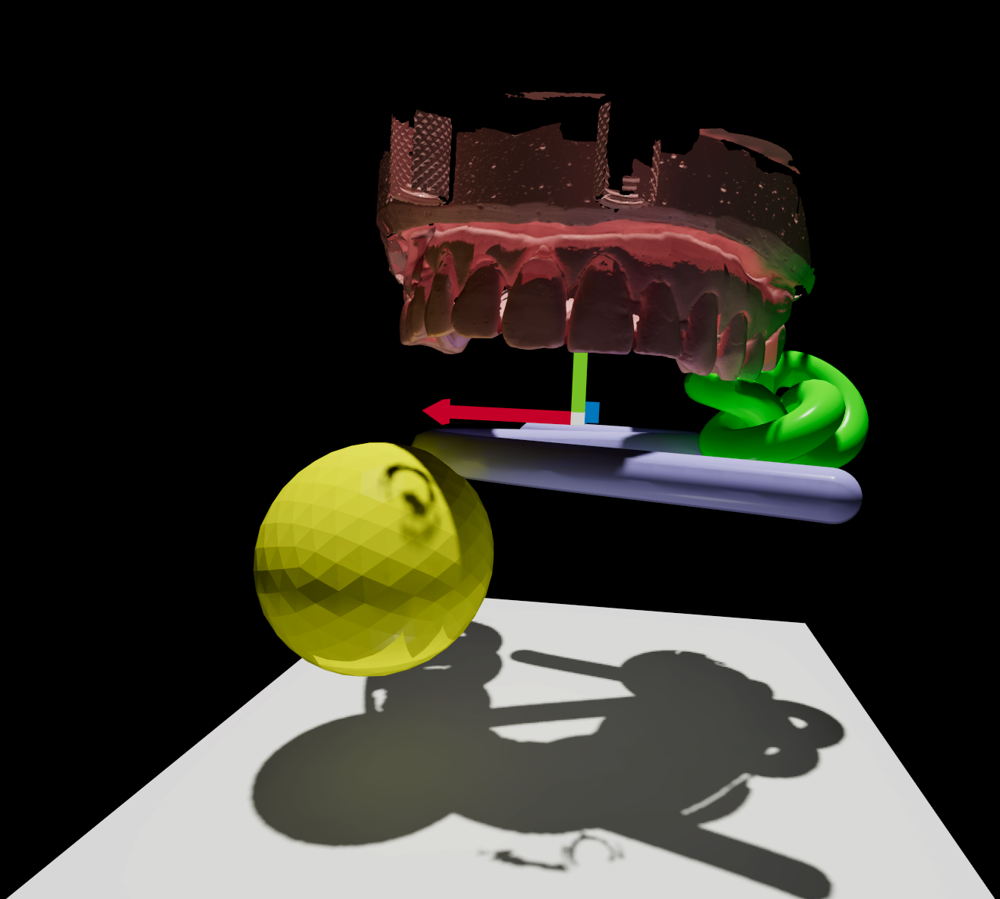

# DDGI Material Sampling Bug  
## 하나의 메시만 간접광에 영향을 주는 문제

---

## 문제 증상
Sample6에서 4개의 메시(icosahedron 구, torus knot, canal tube, floor)가 있는 씬에서 DDGI를 활성화했을 때:

- 오직 첫 번째 메시(icosahedron 구)의 `baseColor`만 DDGI 간접광에 반영됨
- 나머지 3개 메시의 색상은 완전히 무시됨
- 구가 빨간색이면 모든 probe가 빨간색으로, 구가 노란색이면 모든 probe가 노란색으로 염색됨
- 다른 메시들은 probe를 물리적으로 밀어낼 수 있지만 색상 정보는 샘플링되지 않음

---

## 원인 분석
5가지 버그가 복합적으로 작용하여 발생:

### 1. Instance ID 불일치 (SceneUpdate_Detail.cpp:683)
**문제:**
```cpp
instance.instance_id = args.jobIndex;  // WRONG
```
- TLAS(Top-Level Acceleration Structure)의 instance ID를 `args.jobIndex`로 설정
- 실제 ShaderMeshInstance 데이터는 `renderable.renderableIndex` 위치에 저장됨
- Ray tracing 시 `CommittedInstanceID()`는 TLAS의 instance ID를 반환 → 잘못된 인덱스로 접근

**해결:**
```cpp
instance.instance_id = renderable.renderableIndex;
```

---

### 2. TLAS Storage 위치 불일치 (SceneUpdate_Detail.cpp:716)
**문제:**
- TLAS 인스턴스 데이터를 `args.jobIndex` 위치에 저장
- 하지만 `instance_id`는 `renderableIndex`이므로 TLAS 배열 인덱스와 instance_id 불일치

**해결:**
```cpp
void* dest = (void*)((size_t)TLAS_instancesMapped +
(size_t)renderable.renderableIndex *
device->GetTopLevelAccelerationStructureInstanceSize());
```

---

### 3. Buffer Size 계산 오류 (SceneUpdate_Detail.cpp:1186)
**문제:**
- `ShaderInstanceResLookup` 구조체는 16바이트
- 체크할 때 `sizeof(uint) = 4`를 사용 → 실제 필요한 크기의 1/4만 할당
- GPU가 버퍼 범위를 벗어난 미초기화 메모리를 읽게 됨

**해결:**
```cpp
if (instanceResLookupUploadBuffer[0].desc.size <
(instanceResLookupSize * sizeof(ShaderInstanceResLookup)))
```

---

### 4. Upload Buffer 복사 누락 (임시 해결책)
**문제:**
- Non-UMA 시스템(대부분의 discrete GPU)에서 Upload → Default 버퍼 복사 코드가 구현되지 않음
- instanceBuffer, geometryBuffer, materialBuffer는 RenderPath3D_Detail.cpp에서 제대로 복사됨
- **instanceResLookupBuffer만 복사 코드 없음** → Default 버퍼가 비어있음

**원래 의도 (미완성):**
```cpp
// SceneUpdate_Detail.cpp:1172-1173
desc.bind_flags = BindFlag::NONE;         // Upload buffer는 셰이더 바인딩 불필요
desc.misc_flags = ResourceMiscFlag::NONE;

// SceneUpdate_Detail.cpp:1348
shaderscene.instanceResLookupBuffer = device->GetDescriptorIndex(&instanceResLookupBuffer, SubresourceType::SRV);

// RenderPath3D_Detail.cpp: Upload → Default 복사 (❌ 이 코드가 누락됨!)
```

**임시 해결책:**
```cpp
// SceneUpdate_Detail.cpp:1172-1173 - 주석 처리
// desc.bind_flags = BindFlag::NONE;
// desc.misc_flags = ResourceMiscFlag::NONE;

// SceneUpdate_Detail.cpp:1348 - Upload buffer 직접 사용
shaderscene.instanceResLookupBuffer = device->GetDescriptorIndex(
    &instanceResLookupUploadBuffer[pingpong_buffer_index], SubresourceType::SRV
);
```

**문제점:**
- Non-UMA에서 Upload buffer를 셰이더가 직접 읽음 (비효율적이지만 작동)
- D3D12는 Upload buffer 읽기를 허용하지만 성능이 떨어짐

---

### 5. instanceResLookupBuffer Upload → Default 복사 누락 (근본 해결)
**문제:**
- 문제 4의 임시 해결책은 작동하지만 Non-UMA 시스템에서 비효율적
- instanceResLookupBuffer는 생성되었지만 실제로 사용되지 않음
- instanceBuffer, geometryBuffer, materialBuffer는 RenderPath3D_Detail.cpp에서 Upload → Default 복사가 구현됨
- **instanceResLookupBuffer만 복사 코드가 완전히 누락됨**

**근본 원인:**
```cpp
// RenderPath3D_Detail.cpp:1746 - instanceResLookupBuffer에 대한 barrier 없음
barrierStack.push_back(GPUBarrier::Buffer(&scene_Gdetails->instanceBuffer, ...));
barrierStack.push_back(GPUBarrier::Buffer(&scene_Gdetails->geometryBuffer, ...));
barrierStack.push_back(GPUBarrier::Buffer(&scene_Gdetails->materialBuffer, ...));
// ❌ instanceResLookupBuffer barrier 누락!

// RenderPath3D_Detail.cpp:1802 - instanceResLookupBuffer에 대한 copy 없음
device->CopyBuffer(&scene_Gdetails->instanceBuffer, ...);
device->CopyBuffer(&scene_Gdetails->geometryBuffer, ...);
device->CopyBuffer(&scene_Gdetails->materialBuffer, ...);
// ❌ instanceResLookupBuffer copy 누락!
```

**해결:**
```cpp
// RenderPath3D_Detail.cpp:1746-1749 - Barrier 추가
if (scene_Gdetails->instanceResLookupBuffer.IsValid())
{
    barrierStack.push_back(GPUBarrier::Buffer(&scene_Gdetails->instanceResLookupBuffer,
        ResourceState::SHADER_RESOURCE, ResourceState::COPY_DST));
}

// RenderPath3D_Detail.cpp:1802-1813 - Upload → Default Copy 추가
if (scene_Gdetails->instanceResLookupBuffer.IsValid() && scene_Gdetails->instanceResLookupSize > 0)
{
    device->CopyBuffer(
        &scene_Gdetails->instanceResLookupBuffer,
        0,
        &scene_Gdetails->instanceResLookupUploadBuffer[device->GetBufferIndex()],
        0,
        scene_Gdetails->instanceResLookupSize * sizeof(ShaderInstanceResLookup),
        cmd
    );
    barrierStack.push_back(GPUBarrier::Buffer(&scene_Gdetails->instanceResLookupBuffer,
        ResourceState::COPY_DST, ResourceState::SHADER_RESOURCE));
}

// SceneUpdate_Detail.cpp:1172-1173 - Upload buffer flag 제거 (주석 해제)
desc.bind_flags = BindFlag::NONE;         // Upload buffer는 셰이더 바인딩 불필요
desc.misc_flags = ResourceMiscFlag::NONE;

// SceneUpdate_Detail.cpp:1348 - Default buffer 사용
shaderscene.instanceResLookupBuffer = device->GetDescriptorIndex(&instanceResLookupBuffer, SubresourceType::SRV);
```

**장점:**
- Non-UMA 시스템에서 최적의 성능 (GPU VRAM에서 직접 읽기)
- UMA 시스템에서도 정상 작동 (driver가 자동으로 최적화)
- 다른 버퍼들(instance, geometry, material)과 일관된 패턴

**비교:**

| 항목 | 임시 해결책 (문제 4) | 근본 해결 (문제 5) |
|------|---------------------|-------------------|
| Upload buffer 바인딩 | ✅ 필요 (셰이더가 직접 읽음) | ❌ 불필요 (복사만 사용) |
| Default buffer 사용 | ❌ 생성만 하고 미사용 | ✅ 셰이더가 읽음 |
| Non-UMA 성능 | ⚠️ 낮음 (PCIe 접근) | ✅ 최적 (VRAM 접근) |
| 코드 일관성 | ❌ 다른 버퍼와 다름 | ✅ 동일한 패턴 |

---

## Ray tracing 데이터 흐름

### 정상적인 데이터 흐름
1. **Ray Trace:** TLAS Hit
2. **Instance ID:** `CommittedInstanceID()` → `instance_id (= renderableIndex)`
3. **인스턴스 로드:** `load_instance(instanceIndex)` → `ShaderMeshInstance[renderableIndex] → resLookupIndex`
4. **리소스 룩업:** `load_instResLookup(resLookupIndex + subsetIndex)` → `materialIndex`
5. **머티리얼 로드:** `load_material(materialIndex)` → `baseColor`

### 버그 상태
- 2~3 단계에서 잘못된 인덱스를 사용 → 항상 첫 번째 메시의 데이터만 읽음

---

## 핵심 수정 사항

| 파일                   | 라인       | 변경 전                                      | 변경 후                                            |
|------------------------|------------|----------------------------------------------|----------------------------------------------------|
| SceneUpdate_Detail.cpp | 683        | `instance.instance_id = args.jobIndex`       | `instance.instance_id = renderable.renderableIndex` |
| SceneUpdate_Detail.cpp | 716        | `args.jobIndex * ...`                        | `renderable.renderableIndex * ...`                 |
| SceneUpdate_Detail.cpp | 1186       | `sizeof(uint)`                               | `sizeof(ShaderInstanceResLookup)`                  |
| SceneUpdate_Detail.cpp | 1172-1173  | 주석 처리됨 (임시)                           | 주석 해제 (근본 해결)                              |
| SceneUpdate_Detail.cpp | 1348       | Upload buffer 직접 사용 (임시)               | Default buffer 사용 (근본 해결)                    |
| RenderPath3D_Detail.cpp | 1746-1749  | instanceResLookupBuffer barrier 없음         | Barrier 추가                                       |
| RenderPath3D_Detail.cpp | 1802-1813  | instanceResLookupBuffer copy 없음            | Upload → Default Copy 추가                         |

---

## 디버깅 과정
1. Shader에서 `materialIndex`를 색상으로 출력 → 모든 probe가 `materialIndex=0 (빨강)`
2. `instanceIndex`, `resLookupIndex`, `materialIndex`를 RGB로 출력
3. 핵심 발견: `instanceIdx`는 변하지만 `resLookupIndex`가 항상 0
4. 근본 원인: TLAS `instance_id`와 ShaderMeshInstance 저장 위치 불일치
5. 추가 버그 발견: Buffer 크기 계산 오류, Non-UMA 접근 불가

---

## 테스트 결과
**수정 전:**
- 모든 probe가 icosahedron(구) 색상으로만 염색됨
- 디버그 출력: `materialIndex=0` (모든 probe)

**수정 후:**
- 각 probe가 실제로 hit한 메시의 색상을 정확히 샘플링
- 빨강(구), 초록(knot), 파랑(canal), 회색(floor) 모두 DDGI에 기여
- 디버그 출력: `materialIndex=0,1,2,3` (다양한 값)



---

## 교훈
1. **인덱스 일관성:** TLAS `instance_id`는 반드시 실제 데이터 저장 위치와 일치해야 함
2. **타입 안전성:** `sizeof(uint)` vs `sizeof(구조체)` → 정확한 타입 사용
3. **UMA vs Non-UMA:** 메모리 아키텍처에 따라 버퍼 접근 방식 고려 필요
4. **시각적 디버깅:** Shader에서 디버그 값을 색상으로 출력하면 문제를 빠르게 파악 가능
5. **버퍼 복사 일관성:** 새 버퍼 추가 시 기존 패턴(Upload → Default 복사)을 반드시 따라야 함
6. **임시 해결책의 위험성:** 작동하는 workaround라도 성능 저하나 미래의 버그를 야기할 수 있음
