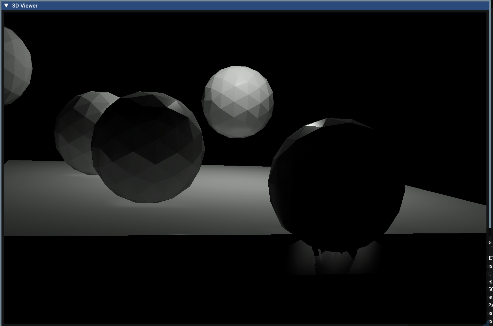
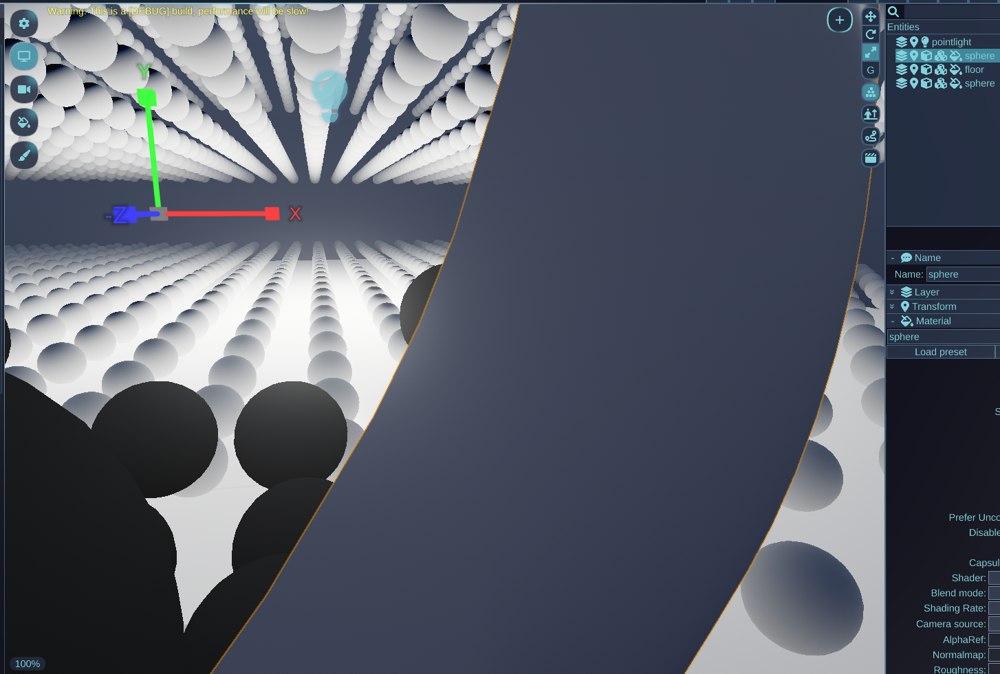
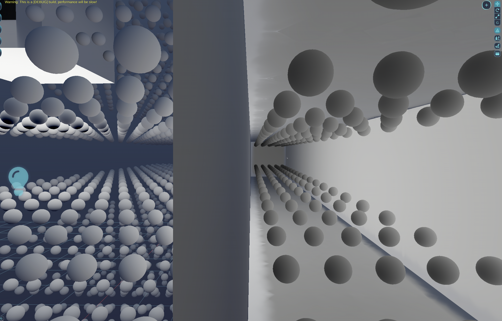
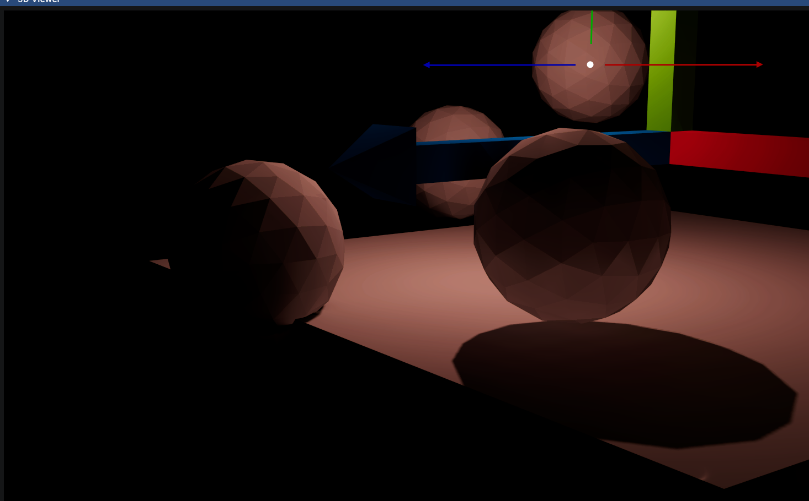
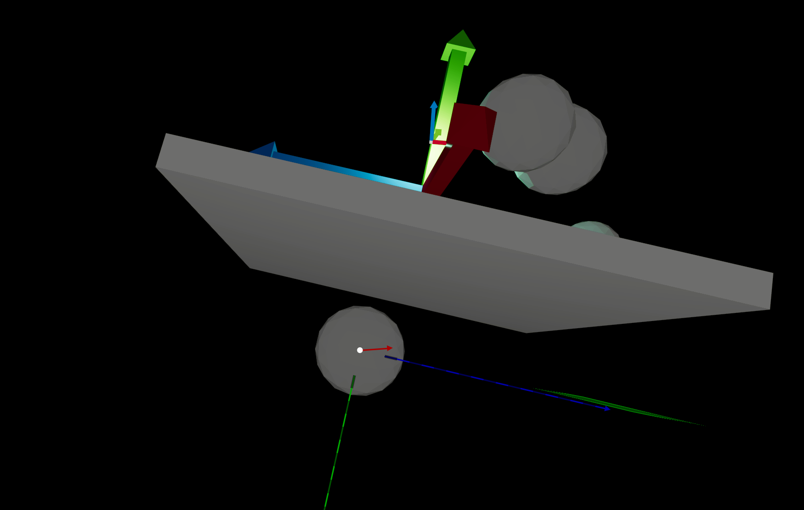
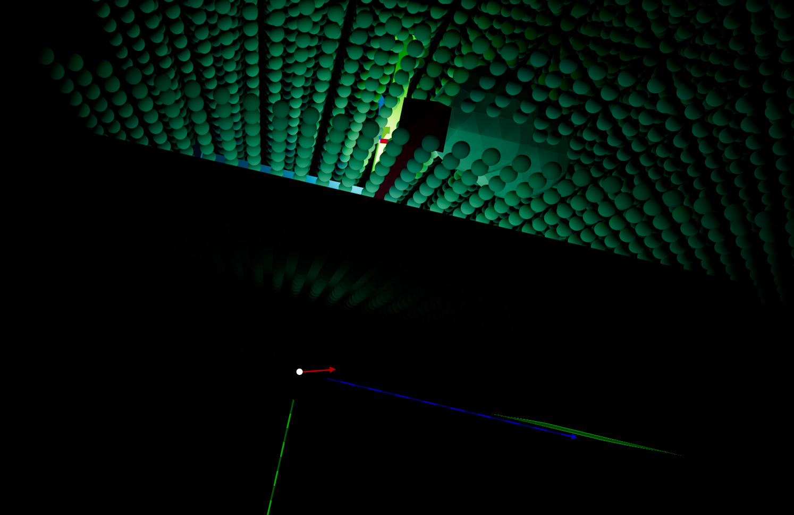
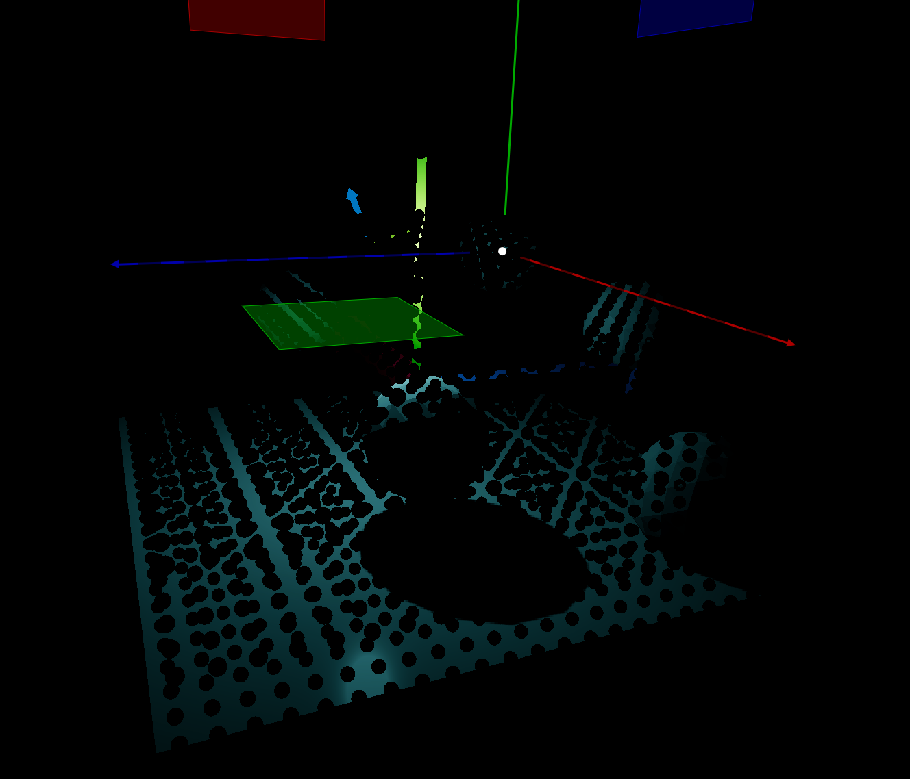
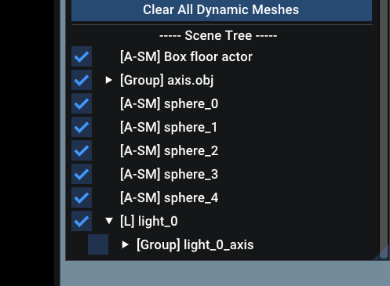
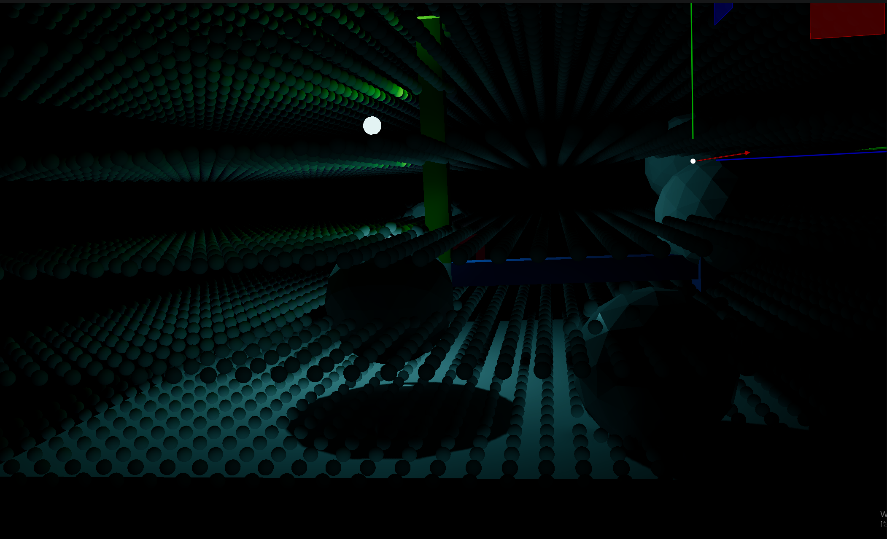

# DDGI Raytracing 문제 분석 및 수정

---

## 문제 1: Geometry 내부 Probe 빛 누수

### 현상

두 지오메트리가 약간 겹쳐 있을 때, 원래라면 빛이 닿을 수 없는 위치에 간접광이 보임.



- **왼쪽 구 2개**: 구의 그림자가 바닥 메시에 없음 + DDGI 간접광 = 빛을 직접 받는 바닥 메시보다 더 밝아지는 결과
- **오른쪽 구 1개**: 빛이 생기면 안 되는 위치 (구, 바닥 메시로 가려지는 부분)에 간접광 발생

왼쪽 구 2개의 현상은 아직 구현이 완전히 안되어 있던 point light 의 shadow 를 작동하게 하면 어느정도 개선이 가능하다.

**허나 오른쪽 구의 현상은 또다른 문제가 있음을 나타낸다.**

---

<https://github.com/user-attachments/assets/1858a026-f6c8-4f0a-bead-4a481cd0f258>

Probe 시각화를 통해 구 geometry 내부의 probe들이 간접광을 받고 있음을 발견. 특히 **빛과 가까운 쪽 probe보다 반대쪽(그늘진) probe들이 더 밝은** 역전 현상이 관찰됨.



Wicked Engine과 비교하면 결정적인 차이가 있음. Wicked Engine에서는 geometry 내부 probe들이 검은색으로 정상 처리됨.

### 원인 분석

DDGI ray trace는 두 단계로 동작한다:

1. **1단계**: probe 위치에서 직접광 샘플링 + shadow ray → `radiance`에 누적
2. **2단계**: probe에서 scene ray를 발사 → hit point(surface)에서 직접광 샘플링 + shadow ray + 이전 프레임 bounce → `hit_result` 누적 → `radiance`에 합산

즉, 1단계와 2단계 모두 직접광 + shadow ray를 수행하지만, 1단계는 probe 위치 자체에서, 2단계는 probe ray가 충돌한 표면 위치에서 계산한다.

`RAY_FLAG_CULL_BACK_FACING_TRIANGLES`가 주석 처리되어 있어 2단계의 probe ray는 front/back face 모두 hit 가능하다. Back face hit 시 normal을 반전(`N = -N`)하는데, 이 때 2단계 lighting이 그대로 실행되면서 잘못된 radiance가 축적된다.

```
probe ray → 구 내벽 hit (back face)
  → back face normal flip: N이 light 방향을 가리킴
  → hit point에서 직접광 + shadow ray 실행
  → NdotL > 0 → direct light 계산됨
  → probe에 잘못된 radiance 축적 → 밝아짐 ✗
```

Wicked Engine에서 geometry의 cast shadow를 끄자 VizMotive와 동일한 문제가 재현되었다. 이로써 shadow ray가 back face hit에서 빛을 차단하는 것이 핵심임을 확인.



**그늘쪽 probe가 더 밝아지는 역전 현상의 원인:**

나중에 설명 그림 추가
- 구 geometry 내부에 probe A, B, 외부에 probe C,D (정상적인 경우 비교용)

```
구 geometry, point light +X 방향 외부
probe A: 구 내부 그늘쪽 (-X)  /  probe B: 구 내부 밝은쪽 (+X)
```

**Probe A (그늘쪽):**
```
1. Probe A에서 -X 방향으로 ray 발사
2. 구 그늘쪽 내벽 hit (back face, 기하 outward normal = (-1,0,0))
3. back face flip → surface.N = (+1,0,0) ← light 방향을 가리킴
4. NdotL = dot((+1,0,0), light_dir) > 0 → 직접광 계산됨 → 밝음
```

**Probe B (밝은쪽):**
```
1. Probe B에서 +X 방향으로 ray 발사
2. 구 밝은쪽 내벽 hit (back face, 기하 outward normal = (+1,0,0))
3. back face flip → surface.N = (-1,0,0) ← light 반대 방향
4. NdotL = dot((-1,0,0), light_dir) < 0 → 직접광 = 0 → 어두움
```

Back face normal flip이 빛 계산 방향을 물리적으로 반전시키기 때문에 그늘쪽이 더 밝아지는 역전 현상이 발생한다.

### 해결 1: Back face hit 시 즉시 return

```hlsl
// 수정 전: back face hit 시 depth만 조정하고 lighting은 그대로 실행
if (surface.IsBackface())
{
    hit_depth *= 0.9;
}
// 이 아래에서 direct light + ddgi_sample_irradiance 계산 → 잘못된 radiance 누적

// 수정 후: back face hit 시 depth만 기록하고 즉시 return
if (surface.IsBackface())
{
    hit_depth *= 0.9;
    DDGIRayData rayData;
    rayData.direction = ray.Direction;
    rayData.depth = hit_depth;            // probe visibility 유지
    rayData.radiance = float4(radiance, 1); // 1단계 결과만 (≈ 0)
    rayBuffer[probeIndex * DDGI_MAX_RAYCOUNT + rayIndex].store(rayData);
    return;
}
// 이 아래는 front face hit만 도달 → 올바른 surface lighting 계산
```

depth는 그대로 기록해 probe visibility(주변 geometry와의 거리 인식)는 유지된다.

---

## Point Light Shadow 구현

더 자세한 디버깅을 위해 point light shadow를 정상 작동시켰다. Shadow 파이프라인 자체는 이미 포팅되어 있었으나 버그 3가지로 미작동 상태였다.

자세한 내용은 [PointLightShadow.md](https://github.com/insung52/Wicked-engine-Deep-Dive/blob/main/Lighting/PointLightShadow.md) 참고.



적용 후 : point light 의 shadow 가 정상적으로 나오고, 메시 내부의 probe 로 인해 빛이 새는 현상도 사라졌다.

<https://github.com/user-attachments/assets/e80a0319-2479-466c-8ae4-5ec1bc5a3331>

메시 내부의 probe 검은색 확인 완료

---

## 문제 2: Shadow Ray 충돌 감지 실패

### 현상

해결 1 적용 후 내부 probe 문제는 해소되었으나, 여전히 shadow ray가 작동하지 않아 빛이 새는 현상이 남아 있었다.

- DDGI probe는 특정 방향으로 ray를 쏘고, 충돌 지점에 들어오는 빛을 측정해 간접광으로 사용한다.
- 충돌 지점에서 빛 방향으로 shadow ray를 발사해 빛과 충돌 지점 사이 장애물을 감지한다.
- 그러나 shadow ray가 다른 geometry와의 충돌을 전혀 감지하지 못하고 있었다.
- 결과: 벽 뒤의 probe가 벽을 뚫고 반대편의 빛을 샘플링함.


납작한 구 아래 그림자가 져야 할 probe들이 바닥 위 probe와 동일하게 밝아져 있다.





cube 아래에 있는 sphere에서 반사된 빛이 cube 아랫면에 전달되는 현상.


Wicked Engine에서는 발생하지 않는 문제.

### 원인: BLAS non-opaque + empty `while(q.Proceed())` loop

Wicked Engine은 불투명 재질의 geometry를 BLAS 빌드 시 `FLAG_OPAQUE`로 설정한다. Opaque geometry는 ray hit 시 any-hit shader를 거치지 않고 자동으로 commit되므로, shadow ray가 `while(q.Proceed())` loop를 통과하더라도 hit가 확정된다.

VizMotive는 유연성을 위해 BLAS를 항상 non-opaque(`~FLAG_OPAQUE`)로 설정한다. Non-opaque geometry의 경우 `Proceed()`가 hit 후보를 반환하지만, loop body가 비어 있어(`CommitNonOpaqueTriangleHit()` 미호출) 모든 hit가 거부된다. 결과적으로 shadow ray가 모든 geometry를 통과한다.

```hlsl
// shadow ray 발사
q.TraceRayInline(
    scene_acceleration_structure,
    RAY_FLAG_SKIP_PROCEDURAL_PRIMITIVES |
    RAY_FLAG_ACCEPT_FIRST_HIT_AND_END_SEARCH,
    0xFF,
    newRay
);
while (q.Proceed()); // non-opaque hit 후보를 모두 거부 → 아무것도 commit되지 않음
shadow = q.CommittedStatus() == COMMITTED_TRIANGLE_HIT ? 0 : shadow; // 항상 shadow = 1 (가려지지 않고 100% 투과)
```

### 해결 2: Shadow cast instance에 FLAG_FORCE_OPAQUE 설정

TLAS instance 레벨에서 `FLAG_FORCE_OPAQUE`를 설정하면 BLAS의 non-opaque 설정을 override해 해당 geometry에 대한 hit가 자동으로 commit된다. 불투명하고 shadow casting이 활성화된 renderable에만 적용한다.

```cpp
// SceneUpdate_Detail.cpp — TLAS instance 빌드
// shadow cast 가 true 인 instance 를 OPAQUE 로 설정한다
instance.flags = 0;
if (!renderable.IsShadowCastDisabled() &&
    !(renderable.materialFilterFlags & GMaterialComponent::FILTER_TRANSPARENT))
{
    instance.flags |=
        RaytracingAccelerationStructureDesc::TopLevel::Instance::FLAG_FORCE_OPAQUE;
}
```

Shadow cast가 비활성화된 오브젝트(예: light visualizer)는 non-opaque 상태를 유지하므로 shadow ray가 통과한다.

---

## 문제 3: Light Axis Shadow Ray 충돌

### 현상

해결 2 적용 후 shadow ray가 geometry를 차단하기 시작했으나, 모든 probe가 전부 검은색이 되었다.



여러 디버깅 과정에서 shadow ray가 light 근처에서 반드시 무언가에 충돌함을 발견했다.



Scene Tree에서 `light_0` 하위에 `light_0_axis`(light 위치 표시용 axis helper mesh)가 있는 것을 발견. 이를 off 상태로 전환하자 DDGI가 정상 작동함을 확인.



그림자 영역의 probe들도 올바르게 어두워지는 것을 확인.

### 원인

`light_axis` mesh가 shadow cast 활성화 + opaque 상태로 TLAS에 포함되어 있었다. 해결 2에서 `FLAG_FORCE_OPAQUE`를 적용한 후 이 mesh도 함께 opaque 처리되어, 모든 shadow ray가 light 위치의 axis mesh에 차단되었다.

### 해결 3: Light Axis 기본 비표시 + Shadow cast 비활성화

vizmotive 여러 Sample 들에서 light axis 를 사용할때 기본적으로 비표시 상태로 시작되도록 수정하였다.

또한 사용자가 표시 상태로 바꾸더라도 shadow cast 를 하지 않게 설정해 shadow ray 와 충돌하지 않게 조치하였다.

```cpp
// Sample: axis_light 초기화 시
for (ActorVID vid : axis_helper_children)
{
    vzm::VzActorStaticMesh* mesh = vzm::NewActorStaticMesh(...);
    mesh->EnableShadowsCast(false); // shadow ray 차단 불가
}
axis_light->SetVisibleLayerMask(0, true); // 기본 OFF (layerMask=0 → TLAS 제외)
```

- `layerMask = 0` → `instance_mask = 0` → 모든 ray에서 제외되므로 TLAS에 포함조차 되지 않음
- `EnableShadowsCast(false)` → 사용자가 axis를 켜더라도 shadow ray를 차단하지 않음 (방어적 처리)

---

## 최종 결과

Point light shadow + 간접광 정상화. 그림자가 올바르게 드리워지며 간접광 누수가 사라졌다.


수정 전 밝게 빛나던 내부 probe들이 검은색으로 정상 처리되고, 역전 현상도 해소됨.

