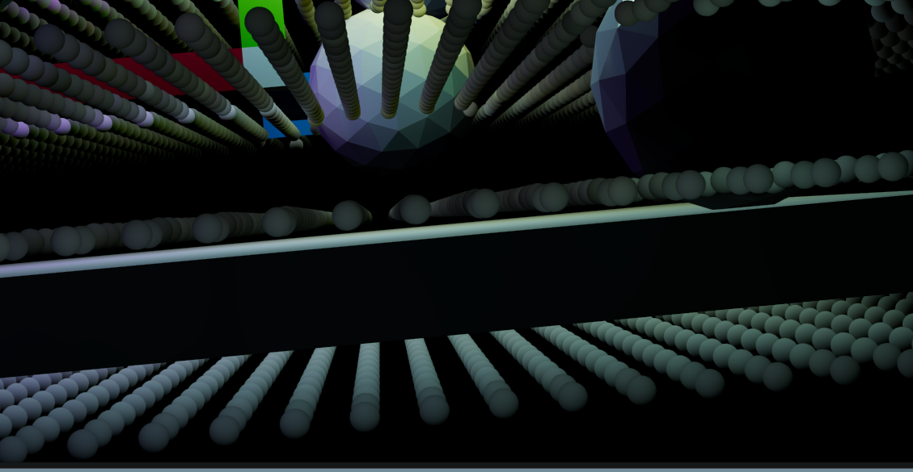
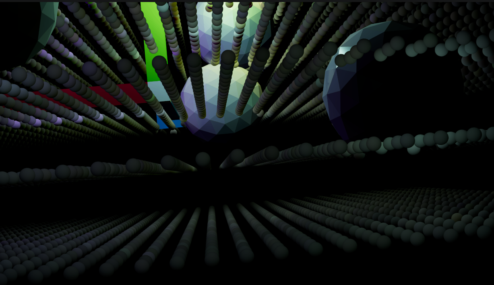
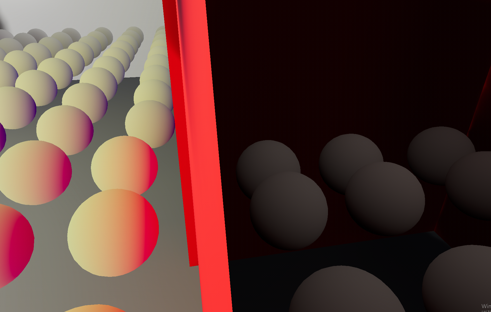
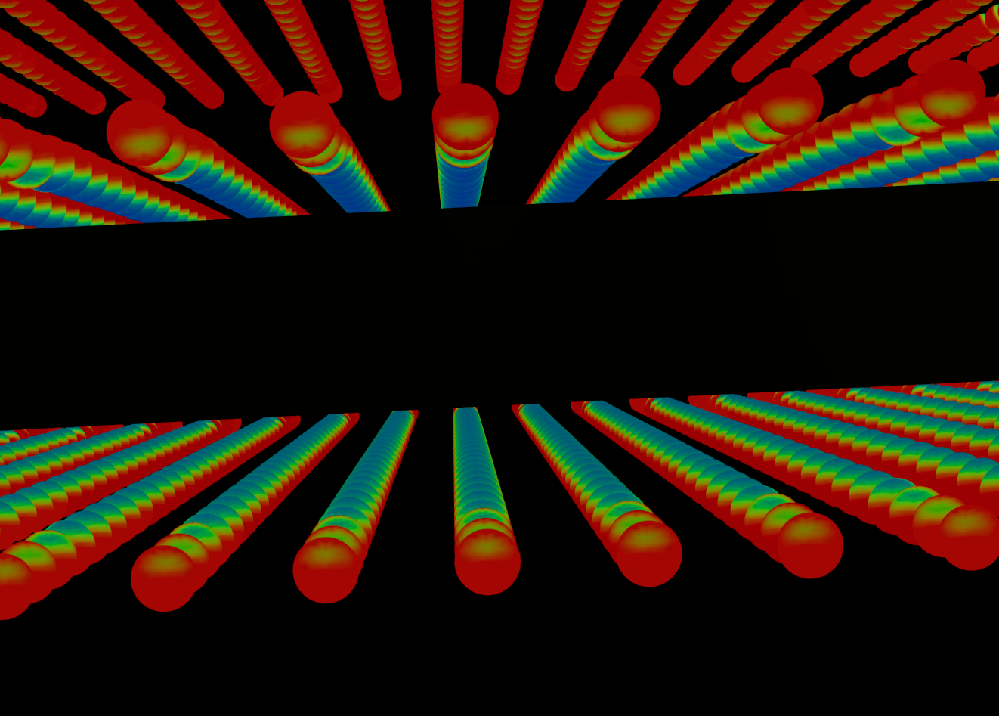
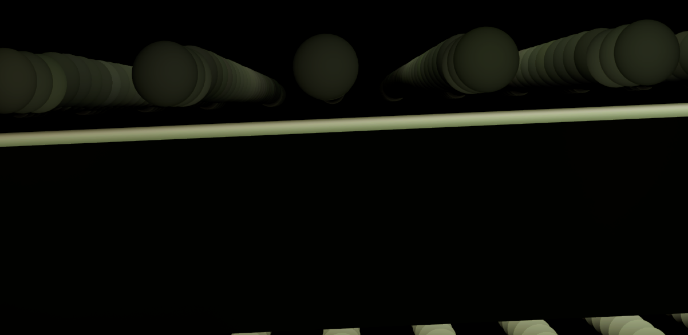
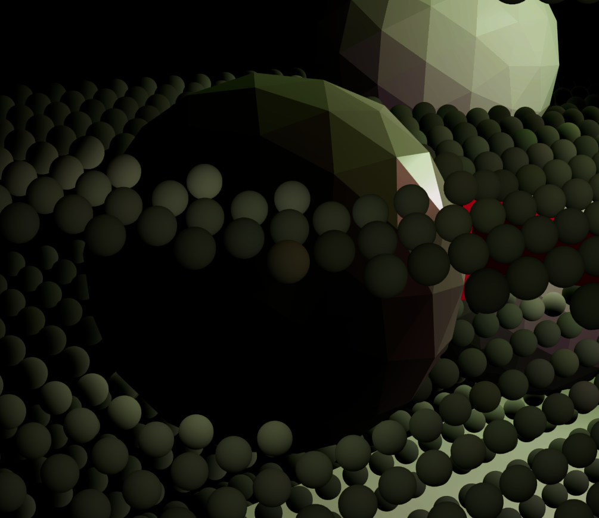
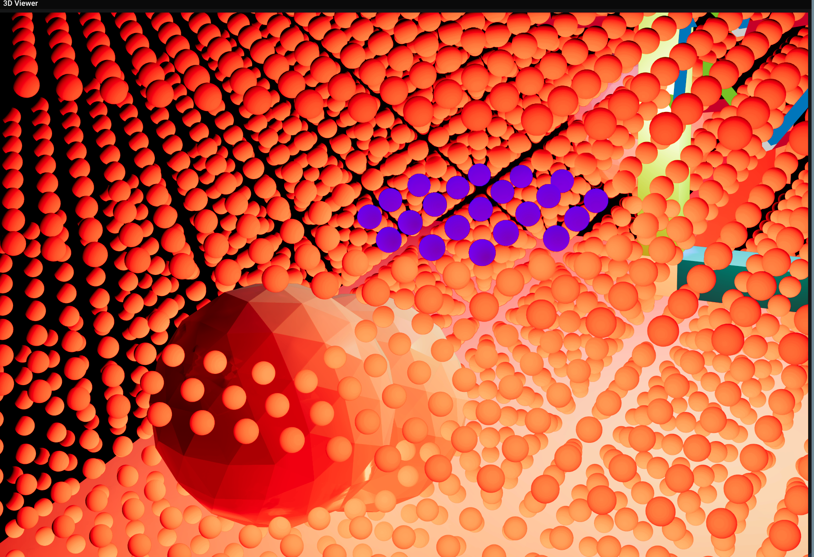

# 1. DDGI 문제 분석

바닥 메시 있을때 - 바닥 메시 아래의 probe 가, 바닥 메시의 아랫면을 무시하고, 바닥 메시 윗면의 밝은 간접광을 샘플링해서 밝아짐



바닥 메시 비활성화 시 - 다시 어두워짐



Wicked Engine 에서, 문제없음.



거리 텍스쳐 적용 (가까움 : 파란색, 멈 : 빨간색), 거리 텍스쳐에는 문제가 없는 듯 하다. (바닥 메시를 잘 인식함)



바닥 메시 윗면의 반사광을 샘플링 해야할 위쪽 probe 들이, 오히려 어두운 현상 발견



빛을 받는 메시의 면 근처보다, 그 반대 면 근처 probe 들이 더 밝음. 둘이 바뀐거 같음 -> probe 에서 출발한 ray 가, 메시에서 바깥으로 나가는 방향에서만 radiance 를 샘플링 한다는 1차 결론



probe 들이 메시의 앞면에 맞은 경우 (if (surface.IsBackface()==True)  ) 파란색, 뒷면에 맞은 경우 빨간색으로 디버깅한 결과



결론 : 모든 면들의 노멀 방향이 반대다! Surface 의 is_backface 를 결정하는 로직을 변경해야한다. (좌표계에 맞게)

# 2. DDGI 문제 해결

## 2.1. ROOT CAUSE 분석

### 문제의 핵심
VizMotive와 Wicked Engine의 **geometry winding order 차이**로 인한 DXR raytracing 결과 불일치

### Geometry Winding Order란?
- **CW (Clockwise)**: 삼각형 vertex를 시계방향으로 정의
- **CCW (Counter-Clockwise)**: 삼각형 vertex를 반시계방향으로 정의
- 외부에서 볼 때 어느 방향이 "앞면"인지 결정

### DXR의 기본 규칙
- **기본 (플래그 없음)**: CW winding = frontface
- **`D3D12_RAYTRACING_INSTANCE_FLAG_TRIANGLE_FRONT_COUNTERCLOCKWISE` 설정 시** (반사된 지오메트리?):
  CCW winding = frontface

### VizMotive vs Wicked Engine

| 엔진 | Geometry Winding | CCW Flag 설정 조건 | 결과 |
|------|------------------|-------------------|------|
| **Wicked Engine** | CCW | `det > 0` | ✓ 정상: CCW 지오메트리 + CCW 플래그 |
| **VizMotive (원래)** | CW | `det > 0` | ✗ 오류: CW 지오메트리 + CCW 플래그 |
| **VizMotive (수정 후)** | CW | `det < 0` | ✓ 정상: CW 지오메트리, 플래그 없음
  |

**Wicked Engine 은 CCW 지오메트리를 기본값으로 사용 -> 지오메트리에 CCW Flag 를 적용 -> CCW 가 앞면이 되도록 설정.**

**반대로 VizMotive 는 CW 지오메트리를 사용하고, 동시에 Wicked Engine 의 코드를 사용했기 때문에 오류가 발생!** 

### 코드 분석

**VizMotive의 Box Geometry 생성** (`GeometryGenerator.cpp:663-669`):
```cpp
// 첫 번째 삼각형: a-b-d
indices.push_back(a);  // 좌하단 (-0.5, -0.5, +0.5)
indices.push_back(b);  // 좌상단 (-0.5, +0.5, +0.5)
indices.push_back(d);  // 우하단 (+0.5, -0.5, +0.5)

카메라에서 볼 때:
    b(좌상)
    ↑ ↘
    a(좌하) → d(우하)
→ CW (Clockwise) winding 확인
```

원래 플래그 설정 로직 (SceneUpdate_Detail.cpp:707-713):
```cpp
float det = XMVectorGetX(XMMatrixDeterminant(W));
if (det > 0)  // ← 문제: 정상 transform에서 CCW 플래그 설정
{
    instance.flags |= FLAG_TRIANGLE_FRONT_COUNTERCLOCKWISE;
}
```

결과:
- VizMotive의 모든 객체: det > 0 → CCW 플래그 SET
- DXR 해석: CCW = frontface
- 실제 지오메트리: CW
- DXR이 모든 frontface를 backface로 잘못 인식!

Shader에서의 영향

RTAPI 경로 (ddgi_raytraceCS.hlsl:262):
```
surface.SetBackface(!q.CommittedTriangleFrontFace());
```

원래 상황 (CCW 플래그가 잘못 설정됨):
1. 실제 앞면 (CW) hit
2. DXR: CCW 플래그 때문에 CW를 backface로 해석
3. CommittedTriangleFrontFace() returns false
4. !false → SetBackface(true) → 앞면이 backface로 잘못 설정
5. surfaceHF.hlsli:390-393에서 노멀 뒤집힘
6. 조명 계산 오류 → probe가 반대 방향 밝기를 샘플링

## 2.2. 해결 방법

TLAS Instance Flag 조건 수정

파일: EngineShaders/ShaderEngine/SceneUpdate_Detail.cpp

변경 전: (일반 지오메트리에 CCW flag 적용)
```cpp
float det = XMVectorGetX(XMMatrixDeterminant(W));
if (det > 0)
{
    // There is a mismatch between object space winding and BLAS winding:
    instance.flags |= RaytracingAccelerationStructureDesc::TopLevel::Instance::
FLAG_TRIANGLE_FRONT_COUNTERCLOCKWISE;
}
```

변경 후: (반사 지오메트리에만 CCW flag 적용)
```cpp
float det = XMVectorGetX(XMMatrixDeterminant(W));
if (det < 0)
{
    // Mirrored/reflected transform: flip winding interpretation
    // VizMotive geometry is CW by default, so only set CCW flag when mirrored
    instance.flags |= RaytracingAccelerationStructureDesc::TopLevel::Instance::
FLAG_TRIANGLE_FRONT_COUNTERCLOCKWISE;
}
```
설명:
- det < 0: Transform이 mirror/reflection을 포함 → winding이 반대로 변환됨
- 이 경우에만 CCW 플래그를 설정하여 winding을 다시 원래대로 복원
- 정상 transform (det > 0)에서는 플래그 없음 → DXR이 CW를 frontface로 올바르게 해석

## 2.3. 검증

Transform Determinant 이해

Determinant > 0:
- Uniform scale, rotation만 포함
- Winding order 유지
- VizMotive 기본 상태

Determinant < 0:
- Mirror, reflection 포함
- Winding order 반전 (CW ↔ CCW)
- 이 경우에만 CCW 플래그 필요

수정 후 동작

| Transform | det | CCW Flag | Geometry | DXR 해석      | 결과  |
|-----------|-----|----------|----------|-------------|-----|
| Normal    | > 0 | 미설정      | CW       | CW = front  | ✓   |
| Mirrored  | < 0 | 설정       | CW → CCW | CCW = front | ✓   |