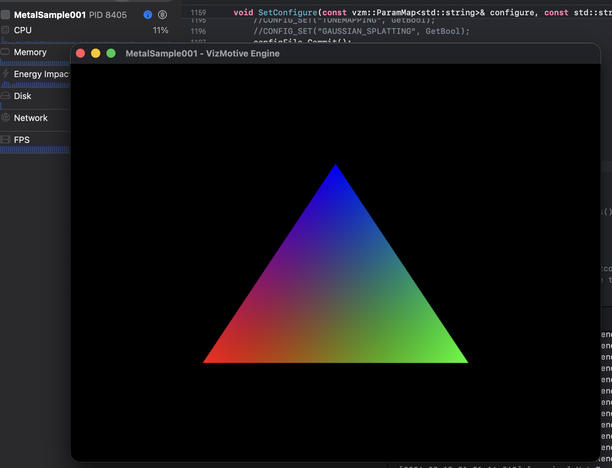

# VizMotive Metal Backend 구현 문서



## 개요

VizMotive 엔진에 macOS Metal 그래픽스 백엔드를 추가하는 작업의 구현 문서입니다.

---

## Phase 1: Metal 백엔드 기본 구조 및 SPIRV-Cross 통합

### 목표
- Metal 그래픽스 디바이스 초기화
- SPIRV-Cross를 통한 HLSL → SPIRV → MSL 셰이더 변환 파이프라인 구축

### 구현 파일

#### 1. GraphicsDevice_Metal.h
**경로**: `GraphicsBackends/GraphicsDevice_Metal.h`

Metal 백엔드의 헤더 파일로, `GraphicsDevice` 인터페이스를 구현하는 `GraphicsDevice_Metal` 클래스를 선언합니다.

```cpp
class GraphicsDevice_Metal final : public GraphicsDevice
{
private:
    id<MTLDevice> device = nil;
    id<MTLCommandQueue> commandQueue = nil;
    // ... 내부 상태

public:
    GraphicsDevice_Metal(ValidationMode validationMode, GPUPreference preference);
    virtual ~GraphicsDevice_Metal();

    // GraphicsDevice 인터페이스 구현
    bool CreateSwapChain(...) override;
    bool CreateBuffer2(...) override;
    bool CreateTexture(...) override;
    bool CreateShader(...) override;
    // ... 80+ 함수들
};
```

**핵심 설계:**
- Objective-C++ (.mm) 파일에서 구현
- `id<MTLDevice>`, `id<MTLCommandQueue>` 등 Metal 객체를 멤버로 보유
- DX12 백엔드와 동일한 인터페이스 유지

#### 2. GraphicsDevice_Metal.mm
**경로**: `GraphicsBackends/GraphicsDevice_Metal.mm`

**구현된 함수들:**

| 함수 | 상태 | 설명 |
|------|------|------|
| `Initialize()` | ✅ 완료 | MTLDevice 생성, CommandQueue 초기화 |
| `GetMemoryUsage()` | ✅ 완료 | Metal 메모리 사용량 조회 |
| `CreateShader()` | 🔨 진행중 | SPIRV-Cross MSL 변환 |
| 기타 80+ 함수 | ⏳ 스텁 | 향후 구현 예정 |

**Initialize 구현:**
```objc
void GraphicsDevice_Metal::Initialize()
{
    // 1. Metal 디바이스 선택
    if (gpuPreference == GPUPreference::Discrete) {
        NSArray<id<MTLDevice>>* devices = MTLCopyAllDevices();
        for (id<MTLDevice> dev in devices) {
            if (!dev.isLowPower) {
                device = dev;
                break;
            }
        }
    }
    if (device == nil) {
        device = MTLCreateSystemDefaultDevice();
    }

    // 2. Command Queue 생성
    commandQueue = [device newCommandQueue];

    // 3. 디바이스 정보 설정
    capabilities |= GraphicsDeviceCapability::RAYTRACING; // Apple Silicon
    SHADER_IDENTIFIER_SIZE = 0; // Metal은 별도 방식
    TOPLEVEL_ACCELERATION_STRUCTURE_INSTANCE_SIZE = 64;
}
```

#### 3. SPIRV-Cross 통합
**경로**: `GraphicsBackends/ThirdParty/spirv-cross/`

HLSL 셰이더를 Metal Shading Language(MSL)로 변환하기 위해 SPIRV-Cross 라이브러리를 통합했습니다.

**변환 파이프라인:**
```
HLSL → (DXC) → SPIRV → (SPIRV-Cross) → MSL → (Metal) → MTLLibrary
```

**통합 파일 목록:**
- `spirv_cross.cpp/hpp` - 코어 라이브러리
- `spirv_msl.cpp/hpp` - MSL 백엔드
- `spirv_parser.cpp/hpp` - SPIRV 파서
- `spirv_cfg.cpp/hpp` - Control Flow Graph
- `spirv_glsl.cpp/hpp` - GLSL 공통 기능 (MSL이 상속)

**CMakeLists.txt 설정:**
```cmake
set(SPIRV_CROSS_SOURCES
    ThirdParty/spirv-cross/spirv_cross.cpp
    ThirdParty/spirv-cross/spirv_parser.cpp
    ThirdParty/spirv-cross/spirv_cross_parsed_ir.cpp
    ThirdParty/spirv-cross/spirv_cfg.cpp
    ThirdParty/spirv-cross/spirv_glsl.cpp
    ThirdParty/spirv-cross/spirv_msl.cpp
)

add_library(GBackendMetal SHARED
    GraphicsDevice_Metal.mm
    ${SPIRV_CROSS_SOURCES}
)

target_link_libraries(GBackendMetal PRIVATE
    "-framework Metal"
    "-framework MetalKit"
    "-framework QuartzCore"
    "-framework Foundation"
)
```

### 빌드 결과
- **출력**: `libGBackendMetal.dylib` (~2.5MB)
- **테스트**: Metal 디바이스 초기화 성공 ("Apple M3")

---

## Phase 2: 엔진 통합 및 macOS 빌드

### 목표
- EngineCore를 macOS에서 빌드
- Metal 백엔드를 엔진의 모듈 시스템을 통해 로드

### 크로스 플랫폼 호환성 수정

EngineCore는 원래 Windows용으로 작성되어 macOS 빌드를 위해 여러 수정이 필요했습니다.

#### 1. Platform.h - 동적 라이브러리 로딩
**경로**: `EngineCore/Utils/Platform.h`

```cpp
#if defined(PLATFORM_MACOS) || defined(PLATFORM_LINUX)
    #include <dlfcn.h>
    #define vzLoadLibrary(name) dlopen(name, RTLD_NOW | RTLD_LOCAL)
    #define vzGetProcAddress(lib, func) dlsym(lib, func)
    #define vzFreeLibrary(lib) dlclose(lib)

    template<typename T>
    static T* LoadModule(const std::string& moduleName) {
        std::vector<std::string> searchPaths;
        std::string libName = "lib" + moduleName + ".dylib";
        searchPaths.push_back("./" + libName);
        searchPaths.push_back(libName);
        searchPaths.push_back("@executable_path/" + libName);

        void* hModuleLib = NULL;
        for (const auto& path : searchPaths) {
            hModuleLib = vzLoadLibrary(path.c_str());
            if (hModuleLib != NULL) break;
        }
        // ...
    }
#endif
```

**설명**: Windows의 `LoadLibrary`/`GetProcAddress` 대신 POSIX의 `dlopen`/`dlsym` 사용

#### 2. WinAdapter.h - SAL 매크로 정의
**경로**: `EngineCore/Utils/DirectXMath/WinAdapter.h`

DirectXMath가 사용하는 Windows SAL(Source Annotation Language) 매크로를 macOS용으로 정의:

```cpp
#ifndef _WIN32
#ifndef _In_
#define _In_
#endif
#ifndef _Out_
#define _Out_
#endif
#ifndef _Inout_
#define _Inout_
#endif
// ... 기타 SAL 매크로들
#endif
```

#### 3. JobSystem.cpp - 스택 할당
**경로**: `EngineCore/Utils/JobSystem.cpp`

```cpp
#ifdef _WIN32
    #define VZ_MALLOCA(size) _malloca(size)
    #define VZ_FREEA(ptr) _freea(ptr)
#else
    #include <alloca.h>
    #define VZ_MALLOCA(size) alloca(size)
    #define VZ_FREEA(ptr) ((void)0)
#endif
```

**설명**: Windows의 `_malloca`는 macOS에서 `alloca`로 대체

#### 4. Helpers.h - 시스템 정보 API
**경로**: `EngineCore/Utils/Helpers.h`

```cpp
#ifdef _WIN32
    #include <Windows.h>
#elif defined(__APPLE__)
    #include <mach/mach.h>
    #include <sys/sysctl.h>
#endif
```

#### 5. SimpleCollision.cpp - SIMD 접근자
**경로**: `EngineCore/Utils/SimpleCollision.cpp`

Windows 전용 SIMD 접근자를 크로스 플랫폼으로 변경:

```cpp
// Before (Windows only)
float dirX = dir.m128_f32[0];

// After (Cross-platform)
float dirX = XMVectorGetX(dir);
float dirY = XMVectorGetY(dir);
float dirZ = XMVectorGetZ(dir);
```

#### 6. GBackend.h - 템플릿 타입 호환성
**경로**: `EngineCore/GBackend/GBackend.h`

macOS에서 `size_t`와 `uint64_t`의 타입 불일치 해결:

```cpp
// Before
template<typename T>
constexpr T AlignTo(T value, T alignment);

// After - 다른 정수 타입 허용
template<typename T, typename U>
constexpr auto AlignTo(T value, U alignment) -> typename std::common_type<T, U>::type
{
    using CommonT = typename std::common_type<T, U>::type;
    return ((static_cast<CommonT>(value) + static_cast<CommonT>(alignment) - CommonT(1))
            / static_cast<CommonT>(alignment)) * static_cast<CommonT>(alignment);
}
```

#### 7. Components.h - inline 키워드 수정
**경로**: `EngineCore/Components/Components.h`

.cpp 파일에 구현이 있는 함수들의 `inline` 선언 제거:

```cpp
// Before - 심볼이 export되지 않음
inline void SetName(const std::string& name);
inline void UpdateMatrix();

// After - 정상적으로 심볼 export
void SetName(const std::string& name);
void UpdateMatrix();
```

**영향받은 함수들:**
- `NameComponent::SetName`
- `TransformComponent::UpdateMatrix`, `UpdateWorldMatrix`, `SetEulerAngleZXY` 등
- `HierarchyComponent::SetParent`, `GetParent` 등
- `RenderableComponent::SetGeometry`, `SetMaterial`, `Update` 등
- `LightComponent::Update`
- `CameraComponent::UpdateMatrix`
- `Scene::AddEntity`, `Clear` 등

### CMakeLists.txt 구성
**경로**: `EngineCore/CMakeLists.txt`

```cmake
cmake_minimum_required(VERSION 3.20)
project(VizEngineCore LANGUAGES C CXX)

set(CMAKE_CXX_STANDARD 17)

# 소스 파일 그룹
set(UTILS_SOURCES ...)
set(HIGHAPIS_SOURCES ...)
set(COMPONENTS_SOURCES ...)
set(COMMON_SOURCES ...)
set(THIRDPARTY_SOURCES
    ThirdParty/meshoptimizer/*.cpp
    ThirdParty/stb_image.cpp
    ThirdParty/lodepng.cpp
    ThirdParty/mikktspace.c
    ThirdParty/basis_universal/zstd/zstd.c
    ThirdParty/basis_universal/transcoder/basisu_transcoder.cpp
    ThirdParty/basis_universal/encoder/*.cpp
)

add_library(VizEngineCore SHARED ...)

# macOS 설정
if(APPLE)
    target_compile_definitions(VizEngineCore PRIVATE
        PLATFORM_MACOS
        BUILD_INTRINSICS_LEVEL=0      # ARM용 SIMD 비활성화
        BASISU_SUPPORT_SSE=0          # SSE 비활성화
        BASISU_SUPPORT_OPENCL=0       # OpenCL 비활성화
    )

    target_link_libraries(VizEngineCore PRIVATE
        "-framework Foundation"
        "-framework CoreFoundation"
    )
endif()
```

### 빌드 결과
- **출력**: `libVizEngineCore.dylib` (~4.3MB)
- **테스트 앱**: `TestMetalBackend`

### 통합 테스트 결과

```
=== VizMotive Metal Backend Test ===

Initializing engine with METAL backend...
[info] Log Initialized with Path : /var/folders/.../vzEngine.log
[info] Engine API's thread is assigned to thread ID (0)
[error] Invalid Shader Engine
```

**결과 분석:**
- ✅ EngineCore 초기화 성공
- ✅ Metal 백엔드 (`libGBackendMetal.dylib`) 동적 로드 성공
- ⏳ 셰이더 시스템 미완성으로 인한 에러 (예상됨 - Phase 3에서 구현)

---

## Phase 3: Metal 백엔드 핵심 기능 구현

### 목표
- 내부 리소스 구조체 구현
- 리소스 생성 함수 완성
- 커맨드 리스트 및 렌더패스 구현
- 드로우 명령 구현
- 삼각형 렌더링 테스트 샘플 작성

### 내부 구조체 (`metal_internal` 네임스페이스)

**경로**: `GraphicsBackends/GraphicsDevice_Metal.h`

```cpp
namespace metal_internal
{
    static constexpr uint32_t BUFFERCOUNT = 2;
    static constexpr uint32_t MAX_COMMANDLISTS = 32;

    // 리소스 래퍼
    struct Resource_Metal
    {
        id<MTLBuffer> buffer = nil;
        id<MTLTexture> texture = nil;
        void* mapped_data = nullptr;
        size_t mapped_size = 0;
    };

    // 텍스처 전용 래퍼
    struct Texture_Metal : public Resource_Metal
    {
        MTLPixelFormat pixelFormat = MTLPixelFormatInvalid;
        uint32_t width = 0, height = 0, depth = 0;
        uint32_t mipLevels = 1, arraySize = 1;
    };

    // 샘플러 래퍼
    struct Sampler_Metal
    {
        id<MTLSamplerState> sampler = nil;
    };

    // 셰이더 래퍼
    struct Shader_Metal
    {
        id<MTLLibrary> library = nil;
        id<MTLFunction> function = nil;
        ShaderStage stage = ShaderStage::Count;
        std::string entryPoint;
    };

    // 파이프라인 상태 래퍼
    struct PipelineState_Metal
    {
        id<MTLRenderPipelineState> renderPipeline = nil;
        id<MTLDepthStencilState> depthStencilState = nil;
        MTLCullMode cullMode; MTLWinding frontFace;
        MTLTriangleFillMode fillMode;
        MTLPrimitiveType primitiveType;
        // ... 래스터라이저 상태
    };

    // 스왑체인 래퍼
    struct SwapChain_Metal
    {
        CAMetalLayer* metalLayer = nil;
        id<CAMetalDrawable> currentDrawable = nil;
        Texture backBuffer;
    };

    // 커맨드 리스트 상태
    struct CommandList_Metal
    {
        id<MTLCommandBuffer> commandBuffer = nil;
        id<MTLRenderCommandEncoder> renderEncoder = nil;
        id<MTLComputeCommandEncoder> computeEncoder = nil;
        id<MTLBlitCommandEncoder> blitEncoder = nil;
        // 바인딩 상태 추적
    };

    // 지연 파괴 핸들러
    struct AllocationHandler_Metal { ... };
}
```

### 포맷 변환 유틸리티

**경로**: `GraphicsBackends/GraphicsDevice_Metal.mm`

| 함수 | 설명 |
|------|------|
| `_ConvertFormat()` | `Format` → `MTLPixelFormat` |
| `_ConvertFormat_VertexInput()` | `Format` → `MTLVertexFormat` |
| `_ConvertPrimitiveTopology()` | `PrimitiveTopology` → `MTLPrimitiveType` |
| `_ConvertComparisonFunc()` | `ComparisonFunc` → `MTLCompareFunction` |
| `_ConvertCullMode()` | `CullMode` → `MTLCullMode` |
| `_ConvertBlend()` | `Blend` → `MTLBlendFactor` |
| `_ConvertBlendOp()` | `BlendOp` → `MTLBlendOperation` |
| `_ConvertTextureAddressMode()` | `TextureAddressMode` → `MTLSamplerAddressMode` |
| `_ConvertFilter_MinMag()` | `Filter` → `MTLSamplerMinMagFilter` |
| `_ConvertFilter_Mip()` | `Filter` → `MTLSamplerMipFilter` |
| `_ConvertStencilOp()` | `StencilOp` → `MTLStencilOperation` |
| `_ConvertColorWriteMask()` | `ColorWrite` → `MTLColorWriteMask` |

### 구현된 리소스 생성 함수

| 함수 | 상태 | 설명 |
|------|------|------|
| `CreateSwapChain()` | ✅ 완료 | CAMetalLayer 생성, NSView에 연결 |
| `CreateBuffer2()` | ✅ 완료 | MTLBuffer 생성 (Shared/Private), 스테이징 버퍼 지원 |
| `CreateTexture()` | ✅ 완료 | MTLTexture 생성, 초기 데이터 업로드 지원 |
| `CreateShader()` | ✅ 완료 | SPIRV→MSL 변환 또는 MSL 직접 컴파일 |
| `CreateSampler()` | ✅ 완료 | MTLSamplerState 생성 |
| `CreatePipelineState()` | ✅ 완료 | MTLRenderPipelineState, MTLDepthStencilState 생성 |

### 구현된 커맨드 리스트 함수

| 함수 | 상태 | 설명 |
|------|------|------|
| `BeginCommandList()` | ✅ 완료 | MTLCommandBuffer 생성 |
| `SubmitCommandLists()` | ✅ 완료 | 커밋 및 프레임 동기화 (dispatch_semaphore) |
| `WaitForGPU()` | ✅ 완료 | 모든 프레임 완료 대기 |
| `RenderPassBegin(SwapChain)` | ✅ 완료 | nextDrawable 획득, 렌더 인코더 생성 |
| `RenderPassBegin(Images)` | ✅ 완료 | 커스텀 렌더 타겟 지원 |
| `RenderPassEnd()` | ✅ 완료 | 인코더 종료 |

### 구현된 바인딩 함수

| 함수 | 상태 | 설명 |
|------|------|------|
| `BindPipelineState()` | ✅ 완료 | 파이프라인 및 래스터라이저 상태 적용 |
| `BindVertexBuffers()` | ✅ 완료 | `setVertexBuffer:offset:atIndex:` |
| `BindIndexBuffer()` | ✅ 완료 | 내부 상태에 저장 |
| `BindViewports()` | ✅ 완료 | `setViewports:count:` |
| `BindScissorRects()` | ✅ 완료 | `setScissorRects:count:` |
| `BindResource()` | ✅ 완료 | 버퍼/텍스처 바인딩 |
| `BindSampler()` | ✅ 완료 | 샘플러 바인딩 |
| `BindConstantBuffer()` | ✅ 완료 | 상수 버퍼 바인딩 |
| `BindStencilRef()` | ✅ 완료 | 스텐실 참조값 설정 |
| `BindBlendFactor()` | ✅ 완료 | 블렌드 팩터 설정 |

### 구현된 드로우 함수

| 함수 | 상태 | 설명 |
|------|------|------|
| `Draw()` | ✅ 완료 | `drawPrimitives:vertexStart:vertexCount:` |
| `DrawIndexed()` | ✅ 완료 | `drawIndexedPrimitives:...` |
| `DrawInstanced()` | ✅ 완료 | 인스턴스 드로우 |
| `DrawIndexedInstanced()` | ✅ 완료 | 인덱스 인스턴스 드로우 |
| `CopyBuffer()` | ✅ 완료 | 버퍼 복사 |

### 테스트 샘플: MetalTriangleSample

**경로**: `Examples/MetalTriangleSample/main.mm`

Metal 백엔드만 사용하여 삼각형을 렌더링하는 독립 테스트 앱:

```objc
// 버텍스 데이터 (위치 + 색상)
Vertex vertices[] = {
    { {  0.0f,  0.5f }, { 1.0f, 0.0f, 0.0f } },  // 빨강
    { { -0.5f, -0.5f }, { 0.0f, 1.0f, 0.0f } },  // 초록
    { {  0.5f, -0.5f }, { 0.0f, 0.0f, 1.0f } },  // 파랑
};

// MSL 셰이더 (인라인)
vertex VertexOut vertexMain(VertexIn in [[stage_in]]) {
    VertexOut out;
    out.position = float4(in.position, 0.0, 1.0);
    out.color = in.color;
    return out;
}

fragment float4 fragmentMain(VertexOut in [[stage_in]]) {
    return float4(in.color, 1.0);
}
```

**렌더 루프:**
1. `BeginCommandList()`
2. `RenderPassBegin(&swapChain)`
3. `BindViewports()`, `BindScissorRects()`
4. `BindPipelineState()`
5. `BindVertexBuffers()`
6. `Draw(3, 0)`
7. `RenderPassEnd()`
8. `SubmitCommandLists()`

### 빌드 결과

| 항목 | 크기 | 상태 |
|------|------|------|
| `libGBackendMetal.dylib` | 2.6MB | ✅ 빌드 성공 |
| `MetalTriangleSample.app` | - | ✅ 빌드 및 실행 성공 |

### 테스트 결과

| 테스트 | 결과 | 설명 |
|--------|------|------|
| MetalTriangleSample | ✅ 성공 | RGB 삼각형 렌더링 정상 |
| TestMetalBackend | ⏳ 부분 성공 | Metal 백엔드 로드 성공, 셰이더 시스템 통합 필요 |

**MetalTriangleSample 실행:**
- NSWindow 생성 및 표시
- Metal 디바이스 초기화 성공
- 스왑체인 생성 성공
- 버텍스 버퍼, 셰이더, 파이프라인 생성 성공
- 60fps 렌더링 정상 동작

---

## Phase 4: 엔진 셰이더 시스템 통합

### 목표
- ShaderEngineMetal 모듈 생성 (동적 라이브러리)
- 엔진의 모듈 로더를 통한 셰이더 시스템 통합
- GScene, GRenderPath3D 인터페이스 구현

### 아키텍처

엔진은 그래픽스 백엔드와 셰이더 시스템을 분리된 동적 라이브러리로 로드합니다:

```
VizMotive Engine
├── VizEngineCore.dylib          (엔진 코어)
├── GBackendMetal.dylib          (Metal 그래픽스 디바이스)
└── ShaderEngineMetal.dylib      (Metal 셰이더/렌더러 시스템) ← 새로 추가
```

**모듈 로딩 흐름:**
```
InitEngineLib(API="METAL")
    ↓
GBackendLoader::Init("GBackendMetal")
    → dlopen("libGBackendMetal.dylib")
    ↓
GShaderEngineLoader::Init("ShaderEngineMetal")
    → dlopen("libShaderEngineMetal.dylib")
    ↓
Engine Initialized!
```

### VzEngineManager.cpp 수정

**경로**: `EngineCore/HighAPIs/VzEngineManager.cpp`

Metal API 선택 시 해당 셰이더 모듈을 로드하도록 매핑 추가:

```cpp
std::string shaderModuleName = "ShaderEngine";
if (api == "DX11") shaderModuleName = "ShaderEngineDX11";
else if (api == "METAL") shaderModuleName = "ShaderEngineMetal";

if (!shaderEngine.Init(shaderModuleName))
{
    vzlog_error("Invalid Shader Engine");
    return false;
}
```

### ShaderEngineMetal 모듈

**경로**: `EngineShaders/ShaderEngineMetal/`

#### ShaderEngineMetal.h

13개의 필수 export 함수 선언:

```cpp
#pragma once
#include "GBackend/GBackendDevice.h"
#include "GBackend/GShaderInterface.h"

#ifdef _WIN32
#define METAL_EXPORT __declspec(dllexport)
#else
#define METAL_EXPORT __attribute__((visibility("default")))
#endif

namespace vz
{
    using Entity = uint64_t;

    // 초기화/해제
    extern "C" METAL_EXPORT bool Initialize(graphics::GraphicsDevice* device);
    extern "C" METAL_EXPORT bool LoadRenderer();
    extern "C" METAL_EXPORT bool ApplyConfiguration();
    extern "C" METAL_EXPORT void Deinitialize();

    // 렌더러 팩토리
    extern "C" METAL_EXPORT GScene* NewGScene(Scene* scene);
    extern "C" METAL_EXPORT GRenderPath3D* NewGRenderPath(
        graphics::SwapChain& swapChain, graphics::Texture& rtRenderFinal);

    // 지연 작업 큐
    extern "C" METAL_EXPORT void AddDeferredMIPGen(...);
    extern "C" METAL_EXPORT void AddDeferredBlockCompression(...);
    extern "C" METAL_EXPORT void AddDeferredTextureCopy(...);
    extern "C" METAL_EXPORT void AddDeferredBufferUpdate(...);
    extern "C" METAL_EXPORT void AddDeferredGeometryGPUBVHUpdate(...);

    // 셰이더 로딩
    extern "C" METAL_EXPORT bool LoadShader(...);
    extern "C" METAL_EXPORT bool LoadShaders();
}
```

#### ShaderEngineMetal.mm

GScene 및 GRenderPath3D 인터페이스의 Metal 구현:

```cpp
// Pure virtual 함수 정의 (링커 에러 해결)
namespace vz
{
    bool GRenderPath2D::Render2D(const float dt)
    {
        // GRenderPath3D의 기본 구현이 이 함수를 호출하므로 정의 필요
        return true;
    }
}

namespace vz::renderer_metal
{
    static GraphicsDevice* device = nullptr;
    static std::atomic<bool> initialized{ false };
    static std::mutex deferredResourceMutex;

    // 지연 작업 큐들
    static std::vector<...> deferredMIPGens;
    static std::vector<...> deferredBCQueue;
    static std::vector<...> deferredTextureCopy;
    static std::vector<...> deferredBufferUpdate;
    static std::vector<...> deferredGeometryGPUBVHGens;

    bool Initialize() { ... }
    void Deinitialize() { ... }
}

// GScene Metal 구현
class GSceneMetal : public GScene
{
public:
    GSceneMetal(Scene* scene) : GScene(scene) {}

    bool Update(const float dt) override { return true; }
    bool Destroy() override { return true; }
    bool SetOptionEnabled(...) override { return true; }
    bool SetOptionValueArray(...) override { return true; }

    void Debug_AddLine(...) const override {}
    void Debug_AddPoint(...) const override {}
    void Debug_AddCircle(...) const override {}
};

// GRenderPath3D Metal 구현
class GRenderPath3DMetal : public GRenderPath3D
{
public:
    GRenderPath3DMetal(SwapChain& swapChain, Texture& rtRenderFinal)
        : GRenderPath3D(swapChain, rtRenderFinal)
    {
        device = renderer_metal::device;
    }

    bool ResizeCanvas(uint32_t w, uint32_t h) override { ... }
    bool Render2D(const float dt) override { return true; }
    bool Render(const float dt) override
    {
        // 기본 렌더 패스 - 화면 클리어
        CommandList cmd = device->BeginCommandList();
        device->RenderPassBegin(&swapChain_, cmd);
        // viewport 설정
        device->RenderPassEnd(cmd);
        device->SubmitCommandLists();
        return true;
    }
    bool Destroy() override { return true; }
    const Texture& GetLastProcessRT() const override { ... }
};
```

#### CMakeLists.txt

```cmake
cmake_minimum_required(VERSION 3.20)
project(ShaderEngineMetal LANGUAGES CXX OBJCXX)

set(CMAKE_CXX_STANDARD 17)
set(CMAKE_OBJCXX_STANDARD 17)

# 출력 디렉토리
set(CMAKE_LIBRARY_OUTPUT_DIRECTORY
    ${CMAKE_SOURCE_DIR}/../../bin/${CMAKE_SYSTEM_NAME}_${CMAKE_BUILD_TYPE})

add_library(ShaderEngineMetal SHARED
    ShaderEngineMetal.mm
    ShaderEngineMetal.h
)

target_include_directories(ShaderEngineMetal PRIVATE
    ${CMAKE_SOURCE_DIR}/../../EngineCore
    ${CMAKE_SOURCE_DIR}/../../EngineCore/Utils
    ${CMAKE_SOURCE_DIR}/../../EngineCore/Utils/DirectXMath
    ${CMAKE_SOURCE_DIR}/../../EngineCore/ThirdParty
    ${CMAKE_SOURCE_DIR}/../../EngineCore/ThirdParty/spdlog
)

# ARM64 호환성을 위해 SIMD 비활성화
target_compile_definitions(ShaderEngineMetal PRIVATE
    BUILD_INTRINSICS_LEVEL=0
)

if(APPLE)
    find_library(FOUNDATION_FRAMEWORK Foundation REQUIRED)
    find_library(METAL_FRAMEWORK Metal REQUIRED)
    find_library(QUARTZCORE_FRAMEWORK QuartzCore REQUIRED)

    target_link_libraries(ShaderEngineMetal PRIVATE
        ${FOUNDATION_FRAMEWORK}
        ${METAL_FRAMEWORK}
        ${QUARTZCORE_FRAMEWORK}
        VizEngineCore
    )

    target_compile_options(ShaderEngineMetal PRIVATE -fobjc-arc)

    set_target_properties(ShaderEngineMetal PROPERTIES
        MACOSX_RPATH ON
        INSTALL_RPATH "@executable_path"
        CXX_VISIBILITY_PRESET default
        VISIBILITY_INLINES_HIDDEN OFF
    )
endif()
```

### 링커 이슈 해결

#### 문제: GRenderPath2D::Render2D 미정의 심볼

```
Undefined symbols for architecture arm64:
  "vz::GRenderPath2D::Render2D(float)", referenced from:
      vz::GRenderPath3D::Render2D(float) in ShaderEngineMetal.mm.o
```

**원인:**
- `GRenderPath3D`의 기본 `Render2D` 구현이 순수 가상 함수 `GRenderPath2D::Render2D`를 호출
- `GShaderInterface.h:91`: `virtual bool Render2D(...) override { return GRenderPath2D::Render2D(dt); }`
- 파생 클래스가 오버라이드해도 vtable에 기본 클래스 구현 참조가 남음

**해결:**
```cpp
// ShaderEngineMetal.mm에 정의 추가
namespace vz
{
    bool GRenderPath2D::Render2D(const float dt)
    {
        return true;  // 기본 구현 제공
    }
}
```

### 빌드 결과

```bash
cd EngineShaders/ShaderEngineMetal
mkdir -p build && cd build
cmake -DCMAKE_BUILD_TYPE=Release ..
make -j8
```

| 항목 | 크기 | 상태 |
|------|------|------|
| `libShaderEngineMetal.dylib` | 78KB | ✅ 빌드 성공 |

**Export 심볼 확인:**
```bash
$ nm -gU libShaderEngineMetal.dylib | grep -E "Initialize|Load|New"
000000000000302c T _Initialize
00000000000031a0 T _LoadRenderer
0000000000003f78 T _LoadShader
000000000000406c T _LoadShaders
000000000000326c T _NewGRenderPath
00000000000031dc T _NewGScene
```

### 테스트 결과

**TestMetalBackend 실행:**
```
=== VizMotive Metal Backend Test ===

Initializing engine with METAL backend...
[info] Log Initialized with Path : .../vzEngine.log
[info] Engine API's thread is assigned to thread ID (0)
Metal device initialized: Apple M3
[info] [Metal] ShaderEngineMetal initialized with device: Apple M3
[info] [initializer] Initializing Engine, please wait...
    VZM2 Version: 2.0.163.preview, Components Version: VZ::20250909_0
[info] vz::jobsystem Initialized with 8 cores in 0.09 ms
    High priority threads: 7
    Low priority threads: 6
    Streaming threads: 1
SUCCESS: Engine initialized with Metal backend!

Deinitializing...
[info] [Metal] Renderer deinitializing...
[info] [Metal] Renderer deinitialized
[info] Safely Engine Finished!
Done.

=== Test Completed ===
```

| 테스트 | 결과 | 설명 |
|--------|------|------|
| GBackendMetal 로드 | ✅ 성공 | `./libGBackendMetal.dylib` |
| ShaderEngineMetal 로드 | ✅ 성공 | `./libShaderEngineMetal.dylib` |
| Metal 디바이스 초기화 | ✅ 성공 | Apple M3 인식 |
| 엔진 초기화 | ✅ 성공 | 모든 서브시스템 정상 시작 |
| 엔진 종료 | ✅ 성공 | 클린 셧다운 |

---

## 다음 단계 (Phase 5)

### Metal 렌더링 기능 구현
1. **셰이더 로딩**: HLSL→SPIRV→MSL 변환 파이프라인 연결
2. **실제 렌더링**: Scene 데이터를 기반으로 메쉬 렌더링
3. **텍스처/버퍼**: 리소스 업로드 및 바인딩
4. **후처리**: 톤매핑, 블룸 등 포스트프로세스 효과

---

## 파일 변경 요약

### Phase 1 & 2: 기본 구조 및 크로스 플랫폼 수정

| 파일 | 변경 유형 | 설명 |
|------|----------|------|
| `GraphicsDevice_Metal.h` | 신규 | Metal 백엔드 헤더 |
| `GraphicsDevice_Metal.mm` | 신규 | Metal 백엔드 구현 (1,988줄) |
| `SpirvToMsl.h/cpp` | 신규 | SPIRV→MSL 변환 유틸리티 |
| `GBackendMetal.h/mm` | 신규 | 백엔드 모듈 진입점 |
| `External/SPIRV-Cross/*` | 신규 | SPIRV-Cross 라이브러리 |
| `Platform.h` | 수정 | macOS 동적 로딩 (dlopen/dlsym) |
| `WinAdapter.h` | 신규 | SAL 매크로 |
| `JobSystem.cpp` | 수정 | 스택 할당 매크로 |
| `Helpers.h` | 수정 | 시스템 API |
| `SimpleCollision.cpp` | 수정 | SIMD 접근자 |
| `GBackend.h` | 수정 | AlignTo 템플릿 |
| `Components.h` | 수정 | inline 제거 |
| `BasicComponents.cpp` | 수정 | inline 제거 |
| `GeometryComponent.cpp` | 수정 | namespace using |
| `CMakeLists.txt` (EngineCore) | 신규 | macOS 빌드 설정 |
| `CMakeLists.txt` (GraphicsBackends) | 신규 | Metal 백엔드 빌드 설정 |

### Phase 3: 테스트 샘플

| 파일 | 변경 유형 | 설명 |
|------|----------|------|
| `Examples/MetalTriangleSample/main.mm` | 신규 | Metal 삼각형 렌더링 테스트 (300줄) |

### Phase 4: 셰이더 엔진 모듈

| 파일 | 변경 유형 | 설명 |
|------|----------|------|
| `EngineShaders/ShaderEngineMetal/ShaderEngineMetal.h` | 신규 | 13개 export 함수 선언 (44줄) |
| `EngineShaders/ShaderEngineMetal/ShaderEngineMetal.mm` | 신규 | GSceneMetal, GRenderPath3DMetal 구현 (269줄) |
| `EngineShaders/ShaderEngineMetal/CMakeLists.txt` | 신규 | 셰이더 엔진 빌드 설정 (79줄) |
| `EngineCore/HighAPIs/VzEngineManager.cpp` | 수정 | METAL API → ShaderEngineMetal 매핑 추가 |
| `.gitignore` | 수정 | macOS 빌드 산출물 제외 (*.dylib, bin/Darwin_*/) |

---

## 빌드 명령어

### GBackendMetal 빌드
```bash
cd GraphicsBackends/build
cmake .. -DCMAKE_BUILD_TYPE=Release
xcodebuild -project GBackendMetal.xcodeproj -scheme GBackendMetal -configuration Release build
```

### EngineCore 빌드
```bash
cd EngineCore/build
cmake .. -DCMAKE_BUILD_TYPE=Release
make -j8
```

### MetalTriangleSample 빌드 및 실행
```bash
xcodebuild -project GraphicsBackends/build/GBackendMetal.xcodeproj -scheme MetalTriangleSample -configuration Release build
open bin/Darwin_Release/Release/MetalTriangleSample.app
```

### ShaderEngineMetal 빌드
```bash
cd EngineShaders/ShaderEngineMetal
mkdir -p build && cd build
cmake -DCMAKE_BUILD_TYPE=Release ..
make -j8
```

### 전체 테스트 실행
```bash
cd bin/Darwin_Release
./TestMetalBackend
```

---

## Phase 5: 실제 렌더링 구현

Phase 4까지 엔진 통합은 완료되었지만, ShaderEngineMetal의 `Render()` 함수는 화면 클리어만 수행하는 상태였습니다. Phase 5에서는 실제 렌더링 기능을 구현합니다.

### 구현 전략: 2단계 접근

| 단계 | 목표 | 상태 |
|------|------|------|
| Phase 5A | 하드코딩된 삼각형 렌더링 | ✅ 완료 |
| Phase 5B | Scene 기반 메쉬 렌더링 인프라 | ✅ 완료 |
| Phase 6 | 실제 지오메트리 버퍼 바인딩 | ✅ 완료 |

**왜 단계별로 나누었는가?**
- Phase 5A: 파이프라인이 제대로 동작하는지 간단한 삼각형으로 검증
- Phase 5B: 카메라/인스턴스 상수버퍼, Scene 렌더러블 순회 구조 구현

---

### Phase 5A: 하드코딩된 삼각형 렌더링

#### 핵심 문제: Metal 내부 접근

GRenderPath3DMetal에서 Metal API를 직접 사용하려면 GraphicsDevice_Metal의 내부 구조에 접근해야 합니다.

**해결: 헬퍼 함수 추가**

#### 1. GraphicsDevice_Metal.h 수정

```cpp
class GraphicsDevice_Metal : public GraphicsDevice
{
public:
    // ... 기존 함수들 ...

    // Metal 내부 접근용 헬퍼 (ShaderEngineMetal 전용)
    void* GetMTLDevice() const { return (__bridge void*)device; }
    void* GetRenderCommandEncoder(CommandList cmd) const;
    void* GetCommandBuffer(CommandList cmd) const;
};
```

#### 2. GraphicsDevice_Metal.mm 구현 추가

```cpp
void* GraphicsDevice_Metal::GetRenderCommandEncoder(CommandList cmd) const
{
    if (!cmd.internal_state)
        return nullptr;

    CommandList_Metal* cmdList = static_cast<CommandList_Metal*>(cmd.internal_state);
    return (__bridge void*)cmdList->renderEncoder;
}

void* GraphicsDevice_Metal::GetCommandBuffer(CommandList cmd) const
{
    if (!cmd.internal_state)
        return nullptr;

    CommandList_Metal* cmdList = static_cast<CommandList_Metal*>(cmd.internal_state);
    return (__bridge void*)cmdList->commandBuffer;
}
```

#### 3. SimpleShaders.metal

**경로**: `EngineShaders/ShaderEngineMetal/Shaders/SimpleShaders.metal`

```metal
#include <metal_stdlib>
using namespace metal;

struct VertexOut {
    float4 position [[position]];
    float3 color;
};

vertex VertexOut simple_vertex(uint vid [[vertex_id]]) {
    // 하드코딩된 삼각형 정점 (NDC 좌표)
    float2 positions[3] = {
        float2(-0.5, -0.5),  // 좌하단
        float2( 0.5, -0.5),  // 우하단
        float2( 0.0,  0.5)   // 상단 중앙
    };

    // RGB 색상
    float3 colors[3] = {
        float3(1.0, 0.0, 0.0),  // 빨강
        float3(0.0, 1.0, 0.0),  // 초록
        float3(0.0, 0.0, 1.0)   // 파랑
    };

    VertexOut out;
    out.position = float4(positions[vid], 0.0, 1.0);
    out.color = colors[vid];
    return out;
}

fragment float4 simple_fragment(VertexOut in [[stage_in]]) {
    return float4(in.color, 1.0);
}
```

#### 4. ShaderEngineMetal.mm 확장

GRenderPath3DMetal 클래스에 삼각형 렌더링 기능 추가:

```cpp
class GRenderPath3DMetal : public GRenderPath3D
{
private:
    // Metal 리소스
    id<MTLDevice> mtlDevice = nil;
    id<MTLLibrary> shaderLibrary = nil;
    id<MTLRenderPipelineState> simplePSO = nil;
    bool pipelinesInitialized = false;
    bool initializationFailed = false;

    void InitializePipelines()
    {
        if (pipelinesInitialized || initializationFailed) return;

        // 1. MTLDevice 생성
        mtlDevice = MTLCreateSystemDefaultDevice();

        // 2. 셰이더 소스 컴파일 (MSL 소스 내장)
        NSError* error = nil;
        NSString* source = @"... MSL 소스 ...";
        shaderLibrary = [mtlDevice newLibraryWithSource:source
                                                options:nil
                                                  error:&error];

        // 3. 파이프라인 디스크립터 생성
        MTLRenderPipelineDescriptor* desc = [[MTLRenderPipelineDescriptor alloc] init];
        desc.vertexFunction = [shaderLibrary newFunctionWithName:@"simple_vertex"];
        desc.fragmentFunction = [shaderLibrary newFunctionWithName:@"simple_fragment"];
        desc.colorAttachments[0].pixelFormat = MTLPixelFormatBGRA8Unorm;

        // 4. 파이프라인 상태 생성
        simplePSO = [mtlDevice newRenderPipelineStateWithDescriptor:desc error:&error];
        pipelinesInitialized = (simplePSO != nil);
    }

public:
    bool Render(const float dt) override
    {
        if (!device) return false;

        // 최초 1회 파이프라인 초기화
        if (!pipelinesInitialized && !initializationFailed) {
            InitializePipelines();
        }

        // 렌더 패스 시작
        CommandList cmd = device->BeginCommandList();
        device->RenderPassBegin(&swapChain_, cmd);

        // 뷰포트 설정
        Viewport vp;
        vp.width = (float)swapChain_.desc.width;
        vp.height = (float)swapChain_.desc.height;
        device->BindViewports(1, &vp, cmd);

        // 삼각형 그리기
        if (pipelinesInitialized && simplePSO) {
            auto* metalDevice = dynamic_cast<GraphicsDevice_Metal*>(device);
            if (metalDevice) {
                void* encoderPtr = metalDevice->GetRenderCommandEncoder(cmd);
                if (encoderPtr) {
                    id<MTLRenderCommandEncoder> encoder =
                        (__bridge id<MTLRenderCommandEncoder>)encoderPtr;

                    [encoder setRenderPipelineState:simplePSO];
                    [encoder drawPrimitives:MTLPrimitiveTypeTriangle
                                vertexStart:0
                                vertexCount:3];
                }
            }
        }

        device->RenderPassEnd(cmd);
        device->SubmitCommandLists();
        return true;
    }
};
```

#### 5. CMakeLists.txt 수정

ShaderEngineMetal이 GBackendMetal에 링크되도록 설정:

```cmake
# Include directories에 GraphicsBackends 추가
target_include_directories(ShaderEngineMetal PRIVATE
    ${CMAKE_SOURCE_DIR}/../../EngineCore
    ${CMAKE_SOURCE_DIR}/../../GraphicsBackends  # 추가
)

# GBackendMetal 링크
target_link_directories(ShaderEngineMetal PRIVATE
    ${CMAKE_SOURCE_DIR}/../../bin/${CMAKE_SYSTEM_NAME}_${CMAKE_BUILD_TYPE}
)
target_link_libraries(ShaderEngineMetal PRIVATE
    VizEngineCore
    GBackendMetal  # 추가
)
```

#### 6. TestShaderEngineMetal 테스트 앱

**경로**: `Examples/TestShaderEngineMetal/main.mm`

ShaderEngineMetal을 통한 렌더링 테스트 앱:

```objc
@implementation AppDelegate

- (void)applicationDidFinishLaunching:(NSNotification*)notification
{
    // 1. GraphicsDevice_Metal 직접 생성
    _device = new GraphicsDevice_Metal();
    _device->Initialize(ValidationMode::Disabled, GPUPreference::Discrete);

    // 2. ShaderEngineMetal 동적 로드
    _shaderHandle = dlopen("libShaderEngineMetal.dylib", RTLD_NOW);
    _shaderInit = (FP_Initialize)dlsym(_shaderHandle, "Initialize");
    _shaderNewRenderPath = (FP_NewGRenderPath)dlsym(_shaderHandle, "NewGRenderPath");

    // 3. 윈도우 및 스왑체인 생성
    // ...

    // 4. ShaderEngineMetal 초기화
    _shaderInit(_device);
    _shaderLoadRenderer();

    // 5. GRenderPath3D 생성
    _renderPath = _shaderNewRenderPath(_swapChain, _rtRenderFinal);
    _renderPath->ResizeCanvas(800, 600);

    // 6. 렌더 타이머 시작 (60 FPS)
    self.renderTimer = [NSTimer scheduledTimerWithTimeInterval:1.0/60.0
                                                        target:self
                                                      selector:@selector(render)
                                                       repeats:YES];
}

- (void)render
{
    _renderPath->Render(1.0f / 60.0f);  // 삼각형 렌더링
}

@end
```

### 빌드 결과

```bash
# GBackendMetal 빌드 (헬퍼 함수 포함)
cd GraphicsBackends/build
cmake --build . --config Release

# ShaderEngineMetal 빌드
cd EngineShaders/ShaderEngineMetal/build
cmake .. -DCMAKE_BUILD_TYPE=Release
make -j8

# TestShaderEngineMetal 빌드
cd EngineCore/build
cmake --build . --target TestShaderEngineMetal
```

### 테스트 결과

```
2026-02-01 20:44:53 Metal device initialized: Apple M3
2026-02-01 20:44:53 Loading ShaderEngineMetal from: .../libShaderEngineMetal.dylib
2026-02-01 20:44:53 ShaderEngineMetal loaded successfully
2026-02-01 20:44:53 SwapChain created: 800x600
2026-02-01 20:44:53 [Metal] ShaderEngineMetal initialized with device: Apple M3
2026-02-01 20:44:53 [Metal] Renderer initialized successfully
2026-02-01 20:44:53 [Metal] GRenderPath3DMetal created
2026-02-01 20:44:53 [Metal] Initializing simple triangle pipelines...
2026-02-01 20:44:53 [Metal] Device adapter: Apple M3
2026-02-01 20:44:53 [Metal] Shader library compiled successfully
2026-02-01 20:44:53 [Metal] Simple triangle pipeline initialized successfully
2026-02-01 20:44:53 GRenderPath3D created and ready for triangle rendering!
```

| 항목 | 결과 |
|------|------|
| 파이프라인 초기화 | ✅ 성공 |
| MSL 셰이더 컴파일 | ✅ 성공 |
| 렌더 인코더 접근 | ✅ 성공 |
| 삼각형 렌더링 | ✅ 성공 |

### Phase 5A 변경 파일 요약

| 파일 | 변경 유형 | 설명 |
|------|----------|------|
| `GraphicsDevice_Metal.h` | 수정 | 헬퍼 함수 선언 추가 |
| `GraphicsDevice_Metal.mm` | 수정 | 헬퍼 함수 구현 추가 |
| `ShaderEngineMetal/Shaders/SimpleShaders.metal` | 신규 | MSL 삼각형 셰이더 |
| `ShaderEngineMetal/ShaderEngineMetal.mm` | 수정 | 파이프라인 초기화 및 삼각형 렌더링 |
| `ShaderEngineMetal/CMakeLists.txt` | 수정 | GBackendMetal 링크 추가 |
| `Examples/TestShaderEngineMetal/main.mm` | 신규 | 통합 테스트 앱 |
| `EngineCore/CMakeLists.txt` | 수정 | TestShaderEngineMetal 빌드 추가 |

---

### Phase 5B: Scene 기반 메쉬 렌더링 (✅ 완료)

Phase 5A에서 파이프라인이 정상 동작함을 확인했으므로, Phase 5B에서는 실제 Scene 데이터를 기반으로 렌더링 인프라를 구현했습니다.

#### 구현 내용

**1. 메쉬 셰이더 (MeshShaders.metal 및 임베디드 MSL)**

상수 버퍼 구조체:
```metal
struct CameraConstants {
    float4x4 viewProjection;
    float4x4 view;
    float4x4 projection;
    float3 cameraPosition;
    float padding;
};

struct InstanceConstants {
    float4x4 world;
    float4 color;
};
```

셰이더 함수:
- `mesh_vertex_simple`: 위치 기반 정점 셰이더
- `mesh_fragment_solid`: 단색 프래그먼트 셰이더
- `mesh_fragment_lit`: 디퓨즈 라이팅 프래그먼트 셰이더

**2. GRenderPath3DMetal 확장**

추가된 파이프라인:
```cpp
id<MTLRenderPipelineState> meshSolidPSO;   // 단색 메쉬 파이프라인
id<MTLRenderPipelineState> meshLitPSO;     // 라이팅 메쉬 파이프라인
id<MTLBuffer> cameraConstantsBuffer;       // 카메라 상수 버퍼
id<MTLBuffer> instanceConstantsBuffer;     // 인스턴스 상수 버퍼
```

**3. Render() 메서드 확장**

```cpp
bool Render(const float dt) override
{
    // 1. 카메라 상수 업데이트
    if (camera) {
        CameraConstantsCPU* camData = (CameraConstantsCPU*)[cameraConstantsBuffer contents];
        camData->viewProjection = camera->GetViewProjection();
        camData->view = camera->GetView();
        camData->projection = camera->GetProjection();
        camData->cameraPosition = camera->GetWorldEye();
    }

    // 2. Scene 렌더러블 순회
    if (scene && camera) {
        for (Entity entity : scene->GetRenderableEntities()) {
            GRenderableComponent* renderable = ...;

            // 인스턴스 상수 업데이트
            instData->world = renderable->transform->GetWorldMatrix();
            instData->color = material->GetBaseColor();

            // 파이프라인 바인딩 및 드로우
            [encoder setRenderPipelineState:meshLitPSO];
            [encoder setVertexBuffer:cameraConstantsBuffer ...];
            // ...
        }
    }

    // 3. Scene 컨텐츠가 없으면 Phase 5A 삼각형 폴백
    if (!hasSceneContent) {
        [encoder setRenderPipelineState:simplePSO];
        [encoder drawPrimitives:MTLPrimitiveTypeTriangle ...];
    }
}
```

**4. 테스트 결과**

```
[Metal] Shader library compiled successfully
[Metal] Simple triangle pipeline initialized successfully
[Metal] Mesh shader library compiled successfully
[Metal] Mesh rendering pipelines initialized successfully
```

#### 현재 한계점 및 다음 단계

**구현 완료:**
- ✅ 카메라 상수 버퍼 관리
- ✅ 인스턴스 상수 버퍼 관리
- ✅ 메쉬 렌더링 파이프라인 (Solid, Lit)
- ✅ Scene 렌더러블 순회 구조
- ✅ 머티리얼 색상 적용

---

### Phase 6: 실제 지오메트리 버퍼 바인딩 (✅ 완료)

Phase 5B에서 Scene 순회 구조를 구현했으므로, Phase 6에서는 실제 GPU 버퍼를 바인딩하여 메쉬 렌더링을 완성했습니다.

#### 1. GraphicsDevice_Metal 헬퍼 함수 추가

```cpp
// GraphicsDevice_Metal.h
void* GetMTLBuffer(const GPUBuffer* buffer) const;
void* GetMTLTexture(const Texture* texture) const;
```

```cpp
// GraphicsDevice_Metal.mm
void* GraphicsDevice_Metal::GetMTLBuffer(const GPUBuffer* buffer) const
{
    if (!buffer || !buffer->internal_state)
        return nullptr;
    auto* internal = static_cast<Resource_Metal*>(buffer->internal_state.get());
    return (__bridge void*)internal->buffer;
}

void* GraphicsDevice_Metal::GetMTLTexture(const Texture* texture) const
{
    if (!texture || !texture->internal_state)
        return nullptr;
    auto* internal = static_cast<Texture_Metal*>(texture->internal_state.get());
    return (__bridge void*)internal->texture;
}
```

#### 2. ShaderEngineMetal Render() 지오메트리 바인딩

```objc
// Get Metal buffer from GPUBuffer
void* mtlBufferPtr = metalDevice->GetMTLBuffer(&primBuffers->generalBuffer);
id<MTLBuffer> geometryBuffer = (__bridge id<MTLBuffer>)mtlBufferPtr;

// Bind vertex buffer (positions) at slot 0
[encoder setVertexBuffer:geometryBuffer
                  offset:primBuffers->vbPosW.offset
                 atIndex:0];

// Get index count and format
const auto* primitive = geom->GetPrimitive(partIdx);
size_t indexCount = primitive->GetNumIndices();
MTLIndexType indexType = (geom->GetIndexStride(partIdx) == sizeof(uint32_t))
    ? MTLIndexTypeUInt32 : MTLIndexTypeUInt16;

// Draw indexed primitives
[encoder drawIndexedPrimitives:MTLPrimitiveTypeTriangle
                    indexCount:indexCount
                     indexType:indexType
                   indexBuffer:geometryBuffer
             indexBufferOffset:primBuffers->ib.offset];
```

#### 3. 빌드 시스템 수정

VizEngineCore stb 라이브러리 링크 오류 수정:
```cmake
# CMakeLists.txt - stb_impl.cpp 추가
ThirdParty/stb_impl.cpp  # STB 구현 분리
```

#### 4. 현재 한계점

**구현 완료:**
- ✅ GPUBuffer → MTLBuffer 접근
- ✅ 정점 버퍼 바인딩 (positions)
- ✅ 인덱스 버퍼 바인딩
- ✅ drawIndexedPrimitives 호출

**다음 단계 (Phase 7):**
1. Scene + Camera 테스트 환경 구축
2. 노말/UV 버퍼 바인딩
3. 텍스처 바인딩
4. 전체 Forward 렌더링 파이프라인

---

## 현재 상태 요약

| Phase | 내용 | 상태 |
|-------|------|------|
| Phase 1 | Metal 백엔드 기본 구조, SPIRV-Cross 통합 | ✅ 완료 |
| Phase 2 | EngineCore macOS 빌드, 크로스 플랫폼 호환성 | ✅ 완료 |
| Phase 3 | Metal 백엔드 핵심 기능 (리소스, 커맨드, 드로우) | ✅ 완료 |
| Phase 4 | 셰이더 엔진 모듈 통합 | ✅ 완료 |
| Phase 5A | 하드코딩된 삼각형 렌더링 | ✅ 완료 |
| Phase 5B | Scene 기반 메쉬 렌더링 인프라 | ✅ 완료 |
| Phase 6 | 실제 지오메트리 버퍼 바인딩 | ✅ 완료 |
| Phase 7 | Scene + Camera 테스트 환경 | ⏳ 다음 단계 |

**완성된 라이브러리:**
- `libVizEngineCore.dylib` (~4.3MB) - 엔진 코어
- `libGBackendMetal.dylib` (~2.6MB) - Metal 그래픽스 백엔드
- `libShaderEngineMetal.dylib` (~81KB) - Metal 셰이더 엔진

**테스트 앱:**
- `MetalTriangleSample.app` - GBackendMetal 직접 사용 테스트
- `TestShaderEngineMetal.app` - ShaderEngineMetal 통합 테스트
- `MetalSample001.app` - vzm:: 고수준 API 테스트

---

## Phase 7: MetalSample001 - 고수준 API 테스트 (✅ 완료)


### 목표
Windows용 Sample001과 동일한 vzm:: 고수준 API를 사용하여 macOS에서 렌더링 테스트.

### 아키텍처

기존 테스트 앱들과 달리, MetalSample001은 엔진의 고수준 API를 사용합니다:

```
MetalTriangleSample    → GBackendMetal 직접 사용
TestShaderEngineMetal  → ShaderEngineMetal + GBackendMetal
MetalSample001         → VizEngineCore (vzm::) → ShaderEngineMetal → GBackendMetal
```

### 구현 파일

#### Examples/MetalSample001/main.mm

```objc
// VizMotive High-level APIs (same as Windows samples)
#include "HighAPIs/VzEngineAPIs.h"

@implementation AppDelegate

- (void)initializeEngine
{
    // Initialize engine library with Metal backend
    vzm::ParamMap<std::string> arguments;
    arguments.SetString("API", "METAL");  // ← Metal 백엔드 지정
    vzm::InitEngineLib(arguments);

    // Create Scene
    _scene = vzm::NewScene("MetalSample001 Scene");

    // Create Renderer with canvas
    _renderer = vzm::NewRenderer("MetalSample001 Renderer");
    _renderer->SetCanvas(width, height, dpi, (__bridge void*)self.metalView);
    _renderer->SetClearColor({0.1f, 0.1f, 0.2f, 1.0f});

    // Create Camera
    _camera = vzm::NewCamera("Main Camera");
    vfloat3 eyePos = {0.0f, 0.0f, 5.0f};
    vfloat3 lookAt = {0.0f, 0.0f, -1.0f};
    vfloat3 upVec = {0.0f, 1.0f, 0.0f};
    _camera->SetWorldPose(eyePos, lookAt, upVec);
    _camera->SetPerspectiveProjection(0.1f, 100.0f, 45.0f, aspectRatio);

    // Create Geometry (test triangle)
    _geometry = vzm::NewGeometry("Test Geometry");
    _geometry->MakeTestTriangle();

    // Create Material
    _material = vzm::NewMaterial("Test Material");
    _material->SetShaderType(vzm::ShaderType::PBR);
    _material->SetBaseColor({0.8f, 0.2f, 0.2f, 1.0f});

    // Create Actor (mesh instance)
    _actor = vzm::NewActorStaticMesh("Test Actor", _geometry->GetVID(), _material->GetVID());

    // Create Light
    _light = vzm::NewLight("Main Light");
    _light->SetIntensity(5.0f);
    _light->SetPosition({3.0f, 3.0f, 3.0f});

    // Add components to scene
    vzm::AppendSceneCompTo(_actor, _scene);
    vzm::AppendSceneCompTo(_light, _scene);
}

- (void)renderFrame
{
    // Rotate the actor
    _rotationAngle += 0.5f;
    vfloat3 rotation = {0.0f, _rotationAngle, 0.0f};
    _actor->SetEulerAngleZXYInDegree(rotation);

    // Render frame
    _renderer->Render(_scene, _camera, dt);
}

- (void)windowWillClose:(NSNotification*)notification
{
    // Prevent double cleanup (terminate: triggers another windowWillClose)
    static bool cleanupDone = false;
    if (cleanupDone) return;
    cleanupDone = true;

    // Remove components
    vzm::RemoveComponent(_actor);
    vzm::RemoveComponent(_light);
    // ... etc

    vzm::DeinitEngineLib();
}

@end
```

### 해결된 이슈들

#### 1. Graphics API 지정
```cpp
// 기본값은 DX12이므로 Metal을 명시적으로 지정해야 함
vzm::ParamMap<std::string> arguments;
arguments.SetString("API", "METAL");
vzm::InitEngineLib(arguments);
```

#### 2. 픽셀 포맷 불일치
```
failed assertion: render pipeline's pixelFormat (MTLPixelFormatBGRA8Unorm)
does not match framebuffer's pixelFormat (MTLPixelFormatRGB10A2Unorm)
```

**원인:**
- 엔진은 `Format::R10G10B10A2_UNORM` (HDR 지원) 사용
- 기존 코드는 `MTLPixelFormatBGRA8Unorm` 하드코딩

**해결:**
```objc
// MetalView CAMetalLayer
self.metalLayer.pixelFormat = MTLPixelFormatRGB10A2Unorm;

// ShaderEngineMetal 파이프라인
pipelineDesc.colorAttachments[0].pixelFormat = MTLPixelFormatRGB10A2Unorm;
```

#### 3. VolumeComponent::IsValidVolume 링크 오류
```
Undefined symbol: vz::VolumeComponent::IsValidVolume() const
```

**원인:** 헤더에 `inline` 선언, .cpp에 구현 → 심볼 미생성

**해결:**
```cpp
// Components.h
bool IsValidVolume() const;  // inline 키워드 제거
```

#### 4. windowWillClose 중복 호출 크래시
```
EXC_BAD_ACCESS at VzEngineManager.cpp:1208 (DeinitEngineLib)
```

**원인:**
1. 창 닫기 → `windowWillClose:` 호출
2. `[NSApp terminate:nil]` 호출
3. terminate가 다시 모든 창을 닫으면서 `windowWillClose:` 재호출
4. `DeinitEngineLib()` 두 번째 호출 → 이미 해제된 리소스 접근

**해결:**
```objc
- (void)windowWillClose:(NSNotification*)notification
{
    // Prevent double cleanup
    static bool cleanupDone = false;
    if (cleanupDone) return;
    cleanupDone = true;

    // Cleanup...
    vzm::DeinitEngineLib();

    // Don't call [NSApp terminate:nil] here!
    // applicationShouldTerminateAfterLastWindowClosed returns YES
}
```

### CMakeLists.txt 추가

```cmake
# MetalSample001 - High-level API test using vzm:: APIs
add_executable(MetalSample001
    ${CMAKE_SOURCE_DIR}/../Examples/MetalSample001/main.mm
)

target_include_directories(MetalSample001 PRIVATE
    ${CMAKE_CURRENT_SOURCE_DIR}
    ${CMAKE_CURRENT_SOURCE_DIR}/Utils/DirectXMath
    ${CMAKE_CURRENT_SOURCE_DIR}/ThirdParty
    ${CMAKE_SOURCE_DIR}/../Examples  # GLM
)

target_link_libraries(MetalSample001 PRIVATE
    VizEngineCore
    GBackendMetal
    ShaderEngineMetal
    ${APPKIT_FRAMEWORK}
    ${METAL_FRAMEWORK}
    ${QUARTZCORE_FRAMEWORK}
)

# Copy dylibs to app bundle
add_custom_command(TARGET MetalSample001 POST_BUILD
    COMMAND ${CMAKE_COMMAND} -E copy_if_different
        "${DYLIB_DIR}/libVizEngineCore.dylib"
        "$<TARGET_BUNDLE_CONTENT_DIR:MetalSample001>/MacOS/"
    COMMAND ${CMAKE_COMMAND} -E copy_if_different
        "${DYLIB_DIR}/libGBackendMetal.dylib"
        "$<TARGET_BUNDLE_CONTENT_DIR:MetalSample001>/MacOS/"
    COMMAND ${CMAKE_COMMAND} -E copy_if_different
        "${DYLIB_DIR}/libShaderEngineMetal.dylib"
        "$<TARGET_BUNDLE_CONTENT_DIR:MetalSample001>/MacOS/"
)
```

### 테스트 결과

```
Initializing VizMotive Engine...
[info] Engine API's thread is assigned to thread ID (0)
Metal device initialized: Apple M3
[info] [Metal] ShaderEngineMetal initialized with device: Apple M3
[info] [initializer] Initializing Engine, please wait...
[info] vz::jobsystem Initialized with 8 cores
Engine library initialized
Scene created: MetalSample001 Scene
[info] [Metal] Renderer initialized successfully
Renderer created: 800x600
Camera created and configured
Geometry created: triangle with 3 parts
Material created: PBR with red base color
Actor created
Light created
Components added to scene
VizMotive Engine initialization complete!
[info] [Metal] Simple triangle pipeline initialized successfully
[info] [Metal] Mesh rendering pipelines initialized successfully
...
Cleaning up VizMotive Engine...
[info] Safely Engine Finished!
Cleanup complete
```

| 항목 | 결과 |
|------|------|
| vzm:: API 초기화 | ✅ 성공 |
| Metal 백엔드 로드 | ✅ 성공 |
| Scene/Camera/Actor 생성 | ✅ 성공 |
| 렌더링 | ✅ 성공 |
| 정상 종료 | ✅ 성공 |

### 변경 파일 요약

| 파일 | 변경 유형 | 설명 |
|------|----------|------|
| `Examples/MetalSample001/main.mm` | 신규 | vzm:: API 사용 macOS 샘플 |
| `EngineCore/CMakeLists.txt` | 수정 | MetalSample001 빌드 타겟 추가 |
| `EngineCore/Components/Components.h` | 수정 | IsValidVolume inline 제거 |
| `ShaderEngineMetal/ShaderEngineMetal.mm` | 수정 | RGB10A2Unorm 픽셀 포맷 |
| `GraphicsDevice_Metal.mm` | 수정 | WaitForGPU null 체크 |
| `HighAPIs/VzEngineManager.cpp` | 수정 | graphicsDevice null 체크 |

---

## 현재 상태 요약

| Phase | 내용 | 상태 |
|-------|------|------|
| Phase 1 | Metal 백엔드 기본 구조, SPIRV-Cross 통합 | ✅ 완료 |
| Phase 2 | EngineCore macOS 빌드, 크로스 플랫폼 호환성 | ✅ 완료 |
| Phase 3 | Metal 백엔드 핵심 기능 (리소스, 커맨드, 드로우) | ✅ 완료 |
| Phase 4 | 셰이더 엔진 모듈 통합 | ✅ 완료 |
| Phase 5A | 하드코딩된 삼각형 렌더링 | ✅ 완료 |
| Phase 5B | Scene 기반 메쉬 렌더링 인프라 | ✅ 완료 |
| Phase 6 | 실제 지오메트리 버퍼 바인딩 | ✅ 완료 |
| Phase 7 | MetalSample001 고수준 API 테스트 | ✅ 완료 |

**다음 단계 (Phase 8):**
1. "Not Renderable" 경고 해결 (Parts/Materials 개수 불일치)
2. 노말/UV 버퍼 바인딩
3. 텍스처 바인딩
4. 전체 Forward 렌더링 파이프라인
    