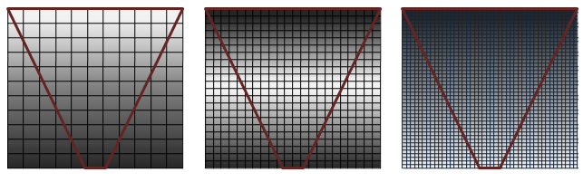

# cascade shadow map

# 0. 사전 지식

## 일반적인 Depth 값 규칙:

1. OpenGL (전통적)

- 가까우면: **1.0**
- 멀면: **0.0**
- NDC(Normalized Device Coordinates)에서 z는 [-1, 1] 범위

**2. DirectX / Vulkan**

- 가까우면: **0.0**
- 멀면: **1.0**
- NDC에서 z는 [0, 1] 범위

3. 대부분의 현대 엔진들

- 가까우면: **0.0** (DirectX 스타일 채택)
- 멀면: **1.0**

## shadow 원리

현재 픽셀이 그리는 위치(P2)의 조명기준 깊이 n2 가져옴

- 픽셀을 조명 공간으로 변환해서 간단하게 계산 가능

조명기준 같은 선 상에 있는 P1 P2 에 대해서

n1 < n2 라면

P2 는 물체에 가려졌다고 판단 → 그림자 적용

n1 ≥ n2 라면

P2 는 조명에 직접 영향을 받음

## 추가 아이디어 : depth 값 대신 mesh 번호 저장?

범위가 매우 큰 조명(태양빛) 등의 경우 float 의 자료형으로 표현이 어렵거나 오류가 발생가능

depth 대신 가장 가까운(빛을 받는) mesh 번호 저장

int 자료형의 경우 4억개 정도의 메시들까지 가능

투명도, 블렌딩이 어려움

# 1. cascade shadow map

## 기본 개념




개념 : (카메라 기준)거리에 따라 다른 해상도의 shadow map 사용

카메라 기준 프러스텀 생성 및 거리에 따라 분할


이를 바탕으로 light는 필요한 부분만 shadow map 계산

- 분할된 카메라 프러스텀의 8개 꼭짓점을 조명 공간으로 변환 (projection 공간까지는 x)
- 조명 공간에서의 꼭짓점들의 중심을 구하고, 중심에서 가장 먼 꼭짓점과의 거리 계산
    - z 축 제외, xy 평면에서의 거리 사용 (빛 방향)
- 해당 거리 * 2 를 한변의 길이로 하는 정사각형으로 shadow map 계산
    - 카메라 frustum 의 모든 꼭짓점을 포함하는 shadow map 범위 설정 가능

## Stochastic Dithering (Blending)

1. Linear Blending
- lod 의 레벨별 경계 처리와 비슷함
- 샘플링을 두번 해야함 (비용 증가)

1. Stochastic Dithering

shadow map 의 다음 레벨과의 경계에 가까운 uv 좌표일 수록 cascade_fade 값 증가

예 : cascade_fade 값 30% → shadow map 경계에서 30% 확률로 다음 레벨의 shadow map 사용

- pseudo random : bayer matrix 이용 이미 정해진 랜덤값 사용 → 같은 픽셀은 같은 값 유지 → 깜빡임 방지
- 명확한 패턴이 보임
- 샘플링 한번만 함


화면에 안 보이는 객체가 어떻게 그림자를 만들 수 있나

- shadow map 의 light VP가 커버하는 영역은 depth map 에 저장됨
- VP의 모든 영역을 높은 해상도로 커버 → 비용 매우 큼
- 카메라 프러스텀을 나누어 가까운 부분은 높은 해상도, 그 외 거리에 따라 낮은 해상도 적용
- 스크린에 보이지 않는 부분도 그림자 표현 가능

## Dithering


- 이미지 공간에서의 서로 다른 두 요소를 선택적인 coarse 샘플링으로 blending
- ex. opaque 파이프라인을 유지하면서 alpha 처리 가능
- cascade shadow map 에서는 두 cascade 사이 경계를 부드럽게 하는 기법에 사용 (aliasing 감소)

cascade blend factor : 현재 픽셀이 cascade 경계와 얼마나 가까운지 나타냄

특정 방법을 이용해 threshold 를 만들고, 이 값과 cascade blend factor 를 비교하여 어떤 cascade level 을 사용할지 결정

### Bayer Matrix (Ordered)

미리 정해진 정방행렬 패턴 사용 → 픽셀 좌표 기준으로 threshold 값 결정 → 같은 위치(픽셀)에서 같은 값 → 반짝임 없음

장점 : 구현이 빠름

단점 : 패턴이 눈에 잘보임


### Blue Noise (Noise)

주파수 스펙트럼에서 저주파 성분이 억제된 노이즈

1. 초기 랜덤 분포: 화면 공간에 균등하게 분포된 랜덤 샘플 포인트들을 생성
2. 스펙트럴 분석: 생성된 패턴의 주파수 도메인 분석을 통해 저주파 에너지 측정
3. 반복적 최적화: 저주파 에너지를 최소화하도록 샘플 위치를 조정
4. 거리 기준 재배치: 인접한 샘플들 간의 최소 거리를 유지하면서 클러스터링 방지
5. 수렴 확인: 스펙트럼이 blue noise 특성(고주파 우세)에 수렴할 때까지 반복

장점 : 공간적으로 균일하게 퍼짐 → 덩어리나 패턴 잘 안보임


(미리 최적화되어 계산된 blue noise 데이터 정수 배열을 사용)

### Temporal Blue Noise (Noise)

프레임마다 다른 패턴 사용, 평균화 → 눈에 띄는 패턴이나 aliasing 제거

단점 : 비용 증가, 가만히 있어도 그림자가 움직임


(여러 blue noise 를 사용하지 않고, 샘플링 위치에 시간에 따른 offset 적용(spatial shifting) → 낮은 비용으로 구현함)

### Void-and-Cluster (Noise, blue noise 생성법)

초기 랜덤 배치 → 각 점 주변 밀도 계산 → Cluster(너무 몰려있음) 와 Void(빈 곳) 찾음 → 점 이동 또는 교환 → 반복

장점 : 균일함, 규칙성 없음

단점 : 계산 비용 있음 → 미리 계산해서 사용


### Interleaved Gradient Noise (Noise)

픽셀 단위의 pseudo random noise 를 생성

```glsl
float hash(float x, float y) {
    return fract(sin(dot(vec2(x,y), vec2(12.9898,78.233))) * 43758.5453);
}
```

장점 : 계산이 매우 빠름

단점 : 균일하지 않음


### 그 외

white noise (픽셀별 완전 랜덤 값)


halftone (dot dithering)

