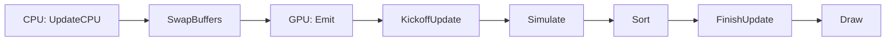
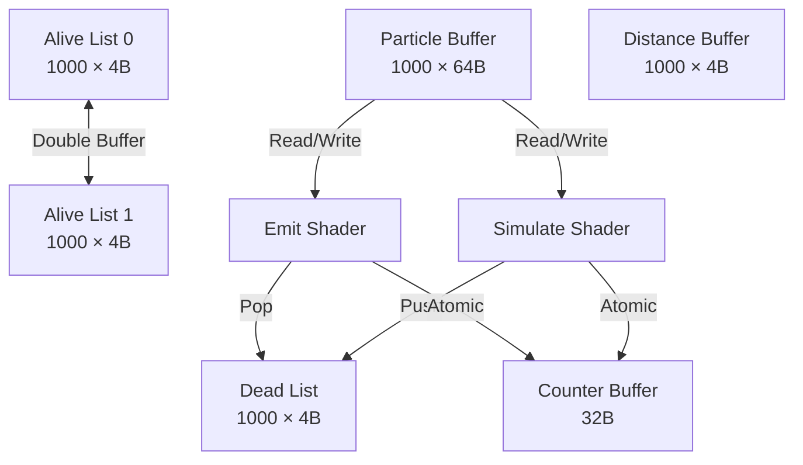

# VizMotive Engine - GPU-Based Particle System Implementation

**Author**: [Your Name]  
**Period**: 2024 ~ 2025. 01  
**Branch**: `particle`  
**Reference**: WickedEngine (MIT License)

---

## 📋 Executive Summary

### Project Overview
VizMotive Engine에 WickedEngine의 구조를 참고하여 **GPU 기반 파티클 시스템**을 구현했습니다. 모든 파티클 시뮬레이션이 GPU에서 실행되며, Compute Shader를 활용한 효율적인 파이프라인을 구축했습니다.

### Key Achievements
- ✅ **GPU-Driven Simulation**: 모든 파티클 업데이트가 GPU에서 실행 (CPU 개입 최소화)
- ✅ **Efficient Memory Management**: Dead list recycling으로 메모리 재사용
- ✅ **Double Buffering**: Read-write conflict 방지
- ✅ **Depth Sorting**: Bitonic sort를 통한 반투명 렌더링 품질 개선
- ✅ **Dynamic Configuration**: 런타임에 파티클 파라미터 변경 가능

### Technical Highlights
```
Pipeline: Emit → Simulate → Sort → Draw (모두 GPU)
Max Particles: 1,000,000 per emitter
Sorting: Bitonic Sort (512 particles/group)
Memory: ~84KB per 1000 particles
```

---

## 🏗️ System Architecture

### GPU Pipeline Overview



### Memory Architecture



### Core Data Structures

**Particle Structure** (64 bytes):
```cpp
struct Particle {
    float3 position;                    // 12 bytes
    float mass;                         // 4 bytes
    float3 velocity;                    // 12 bytes
    float maxLife;                      // 4 bytes
    float3 force;                       // 12 bytes
    float life;                         // 4 bytes
    float2 sizeBeginEnd;                // 8 bytes
    uint rotation_rotationVelocity;     // 4 bytes (packed)
    uint color;                         // 4 bytes (RGBA8 packed)
};
```

**Counter Buffer**: gpu 에서 파티클 상태를 추적하기 위한 카운터 버퍼
```cpp
struct ParticleCounters {
    uint aliveCount;                    // Current frame alive count
    uint deadCount;                     // Available dead particles
    uint realEmitCount;                 // Actual emitted this frame
    uint aliveCount_afterSimulation;    // Next frame alive count
    uint culledCount;                   // Frustum culled (future)
    uint cellAllocator;                 // SPH grid (future)
};
```

**Emit Location**: 파티클 생성 위치 및 개수 정보
```cpp
struct EmitLocation {
    ShaderTransform transform;          // 생성 위치 transform (4x4 matrix)
    uint count;                         // 생성할 파티클 개수
    uint color;                         // 초기 색상 (RGBA8 packed)
    int padding[2];                     // 16-byte alignment
};
```

**Constant Buffer**: 파티클 시스템 파라미터 (CPU → GPU)
```cpp
struct EmittedParticleCB {
    // Emitter settings
    uint   xEmitterMaxParticleCount;
    uint   xEmitterInstanceIndex;
    uint   xEmitterMeshGeometryOffset;
    uint   xEmitterMeshGeometryCount;
    
    // Particle properties
    float  xParticleSize;
    float  xParticleScaling;
    float  xParticleRotation;
    float  xParticleRandomPositionOffset;
    
    float  xParticleNormalFactor;
    float  xParticleLifeSpan;
    float  xParticleLifeSpanRandomness;
    float  xParticleMass;
    
    float  xParticleMotionBlurAmount;
    float  xParticleRandomColorFactor;
    float  xParticleRandomVelocity;
    float  xParticleRandomSize;
    
    uint   xEmitterOptions;             // Flags (frame blending, colliders, etc)
    float  xEmitterFixedTimestep;
    uint   padding[2];
    
    // Sprite animation
    uint2  xEmitterFramesXY;            // Sprite sheet dimensions
    uint   xEmitterFrameCount;
    uint   xEmitterFrameStart;
    
    float2 xEmitterTexMul;
    float  xEmitterFrameRate;
    uint   xEmitterLayerMask;
    
    // Physics
    float3 xParticleGravity;
    float  xEmitterRestitution;         // Bounce factor
    
    float3 xParticleVelocity;
    float  xParticleDrag;
    
    // Visual
    float  xOpacityCurvePeakStart;      // Fade in end (0~1)
    float  xOpacityCurvePeakEnd;        // Fade out start (0~1)
    float  xParticleRandomRotation;
    float  xParticleRandomRotationVelocity;
    
    float4 xParticleBaseColor;          // Base color (RGBA)
    
    float3 xParticleEmissiveColor;      // Emissive color (RGB)
    float  xParticleEmissiveStrength;   // Emissive strength
    
    ShaderTransform xEmitterBaseMeshUnormRemap;  // Mesh emission transform
};
```

### Double Buffering Strategy

**왜 2개 버퍼가 필요한가?**

GPU에서 **동시에 읽기와 쓰기**를 하면 **Race Condition** 발생:
```
만약 버퍼가 1개라면:
  Simulate (Thread 0): aliveList[0] 읽기 → 파티클 12 처리 중...
  Simulate (Thread 1): aliveList[0] 쓰기 → 파티클 99 추가
  
  문제: Thread 0이 읽는 동안 Thread 1이 쓰면 데이터 손상!
        또는 자기가 방금 쓴 데이터를 다시 읽는 문제 발생!
```

**해결책**: **읽기 버퍼**와 **쓰기 버퍼**를 분리


```
Frame N:
  SwapBuffers()  →  aliveList[0] ⇄ aliveList[1]
  
  Emit:
    Read:  없음 (새로 생성하므로 읽을 필요 없음)
    Write: aliveList[0] (clean buffer)
  
  Simulate:
    Read:  aliveList[1] (이전 프레임 결과) ← Emit와 다른 버퍼!
    Write: aliveList[0] (Emit 결과와 병합)  ← Emit와 같은 버퍼!
  
  Draw:
    Read:  aliveList[0] (최종 결과)
```

**중요**: Emit와 Simulate가 **같은 버퍼(aliveList[0])에 쓰는 것은 안전**
- Atomic counter로 **서로 다른 인덱스**를 할당받음
- Emit: aliveList[0][0~99] 사용
- Simulate: aliveList[0][100~579] 사용
- **충돌 없음!**

---

**구체적인 예시** (1000개 파티클, 500개 살아있음):

**Frame N 시작 전**:
```
aliveList[0]: [비어있음]
aliveList[1]: [12, 45, 78, ..., 234] (500개, 이전 프레임 Simulate 결과)
```

**Step 1: SwapBuffers()**:
```
aliveList[0]: [12, 45, 78, ..., 234] (500개) ← Simulate가 읽을 데이터
aliveList[1]: [비어있음]                     ← Emit/Simulate가 쓸 곳
```

**Step 2: Emit (100개 생성)**:
```
Read:  없음
Write: aliveList[1][0~99] = 새 파티클 100개
```

**Step 3: Simulate (500개 처리 → 480개 생존)**:
```
Read:  aliveList[0][0~499] (이전 프레임 결과 읽기)
Write: aliveList[1][100~579] = 살아남은 480개 (Emit 뒤에 추가)
```

**결과**:
```
aliveList[0]: [12, 45, 78, ..., 234] (500개, 이제 쓸모없음)
aliveList[1]: [새100개 + 살아남은480개] = 580개 (다음 프레임 사용)
```

---

**Double Buffering의 핵심**:
1. ✅ **Read-Write 분리**: Simulate가 읽는 버퍼 ≠ 쓰는 버퍼
2. ✅ **데이터 무결성**: 읽는 중인 데이터를 보호
3. ✅ **병렬 처리**: 여러 스레드가 안전하게 동시 실행
4. ✅ **Atomic 안전성**: Emit와 Simulate가 같은 쓰기 버퍼를 공유해도 안전

---

## 🔄 Implementation Timeline & Problem Solving

### Phase 1: Foundation (Commits: 14cec49 ~ e02be4c)

**Goal**: 기본 데이터 구조 및 GPU 리소스 설정

**Key Implementation**:
- `EmittedParticleComponent` 클래스 생성
- GPU 버퍼 구조 정의 (Particle, Alive, Dead, Counter)
- Shader interop 헤더 작성

**Challenges**: None (기초 설정 단계)

---

### Phase 2: Core Pipeline (Commits: 9a604a0 ~ a2e66d8)

**Goal**: Emit, Simulate, Render 셰이더 구현

**Key Implementation**:

**Emit Shader Logic**:
```c
// 1. Dead list에서 파티클 인덱스 가져오기 (LIFO)
int deadCount;
counterBuffer.InterlockedAdd(PARTICLECOUNTER_OFFSET_DEADCOUNT, -1, deadCount);
uint particleIndex = deadBuffer[deadCount - 1];

// 2. 파티클 초기화
Particle p;
p.position = emitPosition;
p.velocity = initialVelocity;
p.life = maxLife;
particleBuffer[particleIndex] = p;

// 3. Alive list에 추가
uint aliveIndex;
counterBuffer.InterlockedAdd(PARTICLECOUNTER_OFFSET_ALIVECOUNT_AFTERSIMULATION, 1, aliveIndex);
aliveBuffer_CURRENT[aliveIndex] = particleIndex;
```

**Simulate Shader Logic**:
```c
// 1. Alive list에서 읽기
uint particleIndex = aliveBuffer_CURRENT[DTid.x];
Particle p = particleBuffer[particleIndex];

// 2. 물리 시뮬레이션
p.force += gravity * p.mass;
p.velocity += p.force * dt;
p.position += p.velocity * dt;
p.life -= dt;

// 3. 생존 체크
if (p.life > 0) {
    // Alive → NEW list
    uint newIndex;
    counterBuffer.InterlockedAdd(PARTICLECOUNTER_OFFSET_ALIVECOUNT_AFTERSIMULATION, 1, newIndex);
    aliveBuffer_NEW[newIndex] = particleIndex;
} else {
    // Dead → Dead list
    uint deadIndex;
    counterBuffer.InterlockedAdd(PARTICLECOUNTER_OFFSET_DEADCOUNT, 1, deadIndex);
    deadBuffer[deadIndex] = particleIndex;
}
```

**Problem #1: Particles Not Spawning**
- **Symptom**: 아무것도 렌더링되지 않음
- **Root Cause**: Dead list가 초기화되지 않음
- **Solution**: `CreateGPUResources()`에서 dead list를 0~N-1로 초기화
```cpp
std::vector<uint32_t> deadIndices(maxParticles_);
std::iota(deadIndices.begin(), deadIndices.end(), 0);
device->UpdateBuffer(&deadList_, deadIndices.data(), cmd, ...);
```

**Problem #2: Billboard Orientation Wrong**
- **Symptom**: 파티클이 카메라를 향하지 않음
- **Root Cause**: View matrix 대신 inverse view matrix 사용해야 함
- **Solution**: Inverse view matrix에서 right/up 벡터 추출
```c
float3 right = float3(GetCamera().inverse_view._11, _21, _31);
float3 up = float3(GetCamera().inverse_view._12, _22, _32);
worldPos += right * quadPos.x + up * quadPos.y;
```

---

### Phase 3: Visual Enhancements (Commits: 0c7ec6f ~ 1e9feac)

**Goal**: Opacity curve, 색상, 모션 블러 추가

**Key Implementation**:

**Opacity Curve** (텍스처 → 계산 방식 변경):
```c
float t = input.lifePercent;
float opacityFactor;

if (t < xOpacityCurvePeakStart) {
    opacityFactor = t / xOpacityCurvePeakStart;  // Fade in
} else if (t < xOpacityCurvePeakEnd) {
    opacityFactor = 1.0f;  // Peak
} else {
    opacityFactor = 1.0f - (t - xOpacityCurvePeakEnd) / (1.0f - xOpacityCurvePeakEnd);  // Fade out
}
```

**Motion Blur**:
```c
if (xParticleMotionBlurAmount > 0.0f) {
    float3 velocityViewSpace = mul((float3x3)GetCamera().view, particle.velocity);
    quadPos += dot(quadPos, velocityViewSpace) * velocityViewSpace * xParticleMotionBlurAmount;
}
```

**Problem #3: Opacity Not Working**
- **Symptom**: 모든 파티클이 동일한 불투명도
- **Root Cause**: Draw call에서 constant buffer 바인딩 누락
- **Solution**: `DrawParticles()`에서 opacity 파라미터 포함하여 CB 바인딩

---

### Phase 4: Sorting System (Commit: e3ad8b6)

**Goal**: 깊이 정렬로 반투명 렌더링 품질 개선

**Algorithm**: Bitonic Sort (AMD GPUSortLib 기반)

```c
#define SORT_SIZE 512
groupshared float2 g_LDS[SORT_SIZE];  // Shared memory: (distance, particleIndex)

// 1. LDS(Local Data Share)에 데이터 로드
uint particleIndex = aliveBuffer[globalIndex];
float distance = distanceBuffer[particleIndex];
g_LDS[localIndex] = float2(distance, particleIndex);

// 2. Bitonic Sort 알고리즘
// - 시간 복잡도: O(log²n)
// - 병렬 처리에 최적화: 모든 비교를 동시에 수행 가능
// - 고정된 비교 패턴: 데이터 값과 무관하게 항상 같은 순서

// 외부 루프: Merge 크기를 2배씩 증가 (2 → 4 → 8 → ... → 512)
for (uint mergeSize = 2; mergeSize <= SORT_SIZE; mergeSize *= 2) {
    
    // 내부 루프: 각 merge를 점점 작은 단위로 분할
    // mergeSubSize: mergeSize/2 → mergeSize/4 → ... → 1
    for (uint mergeSubSize = mergeSize >> 1; mergeSubSize > 0; mergeSubSize >>= 1) {
        
        uint compareDistance = mergeSubSize;
        uint index = localIndex;
        
        // XOR 트릭: 비교할 대상 인덱스 계산
        // 예: compareDistance=1 → 0↔1, 2↔3, 4↔5, ...
        //     compareDistance=2 → 0↔2, 1↔3, 4↔6, ...
        uint swapIndex = index ^ compareDistance;
        
        // 중복 비교 방지 (각 쌍을 한 번만 비교)
        if (swapIndex > index) {
            
            // (index & mergeSize): Bitonic sequence의 방향 결정
            // == 0: 증가 방향 (ascending)
            // != 0: 감소 방향 (descending)
            
            if ((index & mergeSize) == 0) {
                // 증가 방향: 작은 값을 앞으로, 큰 값을 뒤로
                if (g_LDS[index].x > g_LDS[swapIndex].x) {
                    float2 temp = g_LDS[index];
                    g_LDS[index] = g_LDS[swapIndex];
                    g_LDS[swapIndex] = temp;
                }
            } else {
                // 감소 방향: 큰 값을 앞으로, 작은 값을 뒤로
                if (g_LDS[index].x < g_LDS[swapIndex].x) {
                    float2 temp = g_LDS[index];
                    g_LDS[index] = g_LDS[swapIndex];
                    g_LDS[swapIndex] = temp;
                }
            }
        }
        
        // 모든 스레드 동기화 (다음 단계로 진행 전 모든 비교-교환 완료 대기)
        GroupMemoryBarrierWithGroupSync();
    }
}

// 3. 정렬된 결과를 alive buffer에 다시 쓰기
// g_LDS[0] = 가장 먼 파티클 (먼저 그림)
// g_LDS[511] = 가장 가까운 파티클 (나중에 그림)
aliveBuffer[globalIndex] = (uint)g_LDS[localIndex].y;
```

**Bitonic Sort 핵심**:
- **XOR 연산**: `index ^ compareDistance`로 비교 대상을 빠르게 계산
- **방향 제어**: `(index & mergeSize)`로 증가/감소 방향 결정
- **병렬 처리**: 모든 스레드가 동시에 비교-교환 수행
- **동기화**: `GroupMemoryBarrierWithGroupSync()`로 단계별 동기화
- **결과**: 먼 파티클부터 정렬되어 반투명 렌더링 품질 향상

---

### Phase 5: Material Integration (Commits: 4c439ff ~ 4f4c26d)

**Goal**: MaterialComponent를 파티클에 연결

**Key Implementation**:
```cpp
// DrawParticles()에서 material 정보 읽기
Entity materialID = emitter.GetMaterialID();
if (materialID != INVALID_ENTITY) {
    MaterialComponent* material = compfactory::GetMaterialComponent(materialID);
    if (material) {
        cb.xParticleBaseColor = material->GetBaseColor();
        cb.xParticleEmissive = material->GetEmissiveStrength();
    }
}
```

**Pixel Shader**:
```c
float4 finalColor = texColor * xParticleBaseColor * input.color;
finalColor.a *= opacityFactor;
finalColor.rgb *= (1.0f + xParticleEmissive);  // HDR emissive
```

**Problem #4: Material Color Not Applied**
- **Symptom**: Material base color가 무시됨
- **Root Cause**: Draw call에서 material 데이터를 읽지 않음
- **Solution**: `DrawParticles()`에서 material 정보를 CB에 설정

---

### Phase 6: Rotation System (Commit: 3cd6ecb)

**Goal**: 파티클 회전 및 회전 속도 구현

**Packing Strategy** (메모리 절약):
```c
// Pack: 2 floats → 1 uint32 (각각 16bit)
uint rotationBits = uint((rotation + PI) / (2.0f * PI) * 65535.0f);
uint rotationVelBits = uint((rotationVel + PI) / (2.0f * PI) * 65535.0f);
uint packed = (rotationBits << 16) | rotationVelBits;

// Unpack
uint rotationBits = (packed >> 16) & 0xFFFF;
uint rotationVelBits = packed & 0xFFFF;
float rotation = (float(rotationBits) / 65535.0f) * 2.0f * PI - PI;
float rotationVel = (float(rotationVelBits) / 65535.0f) * 2.0f * PI - PI;
```

**Simulate Shader에서 회전 적용**:
```c
// Apply rotation velocity
rotation += rotationVel * dt;

// Wrap to [-PI, PI]
rotation = fmod(rotation + PI, 2.0f * PI) - PI;

// Pack back
particle.rotation_rotationVelocity = pack_rotation(rotation, rotationVel);
```

**Problem #5: Rotation Not Working**
- **Symptom**: 파티클이 회전하지 않음
- **Root Cause**: Simulate shader에서 rotation velocity를 적용하지 않음
- **Solution**: Simulate shader에 rotation update 로직 추가

---

### Phase 7: Critical Bug - Flickering (Commit: d98941c)

**가장 중요한 버그 해결 과정**

#### Problem Symptoms
- Sorting을 켜면 카메라에 가장 가까운 파티클이 빠르게 깜빡거림
- 새 파티클이 생성될 때마다 깜빡임 발생
- 파티클이 죽고 재생성되기 시작하면 깜빡임 시작

#### Investigation Process

**Step 1: 초기 가설 - Sorting 알고리즘 오류**
- Distance buffer 인덱싱 확인
- `distanceBuffer[particleIndex]` vs `distanceBuffer[aliveIndex]` 불일치 수정
- **결과**: 해결 안 됨 ❌

**Step 2: 디버그 시각화**
```c
// VS에서
output.particleIndex = particleIndex;
output.aliveListIndex = input.instanceID;

// PS에서
return float4(
    frac(input.aliveListIndex * 0.618033988749895),  // Golden ratio
    0.0f,
    0.0f,
    1.0f
);
```
- **발견**: `aliveBuffer[0]` (색상 0, 검은색) 위치의 파티클이 깜빡임

**Step 3: 사용자 디버깅 데이터 분석**
```
초반에는 안깜빡거리다가 life가 끝나는 파티클이 생기기 시작하니까 깜빡거리네

파티클 추적:
2 1 4 3 0
- 1 4 3 0  ← 0번 파티클 깜빡임 (2번이 죽음)
```

**Step 4: WickedEngine 코드 비교**

VizMotive (잘못된 순서):
```cpp
// UpdateGPU()
EmitParticles(...);
SimulateParticles(...);
SortParticles(...);
DrawParticles(...);
emitter.SwapBuffers();  // ← GPU 커맨드 후! (잘못됨)
```

WickedEngine (올바른 순서):
```cpp
// UpdateCPU()
std::swap(aliveList[0], aliveList[1]);  // ← GPU 커맨드 전!

// UpdateGPU()
EmitParticles(...);
SimulateParticles(...);
SortParticles(...);
DrawParticles(...);
```

#### Root Cause Analysis

**잘못된 파이프라인 (VizMotive)**:
```
Frame N:
  Emit    → writes to aliveList[0]
  Simulate → reads aliveList[0], writes to aliveList[1]
  Sort     → sorts aliveList[1]
  Draw     → reads aliveList[1]
  SwapBuffers → swap(aliveList[0], aliveList[1])  ← GPU 커맨드 후!

Frame N+1:
  Emit    → writes to aliveList[0] (이제 이전 프레임의 sorted list)
           → 정렬된 리스트 끝에 새 파티클 추가
           → 순서 깨짐! → Flickering!
```

**올바른 파이프라인 (WickedEngine)**:
```
Frame N (CPU):
  SwapBuffers → swap(aliveList[0], aliveList[1])  ← GPU 커맨드 전!

Frame N (GPU):
  Emit    → writes to aliveList[0] (clean buffer)
  Simulate → reads aliveList[0], writes to aliveList[1]
  Sort     → sorts aliveList[1]
  Draw     → reads aliveList[1]
```

#### Solution

**1. SwapBuffers 이동**:
```cpp
// EmittedParticle_Detail.cpp
void GRenderPath3DDetails::UpdateParticleSystem(...) {
    device->EventBegin("ParticleSystem Update", cmd);
    
    // Swap BEFORE GPU commands (like WickedEngine)
    emitter.SwapBuffers();  // ← 여기로 이동!
    
    EmitParticles(emitter, instanceIndex, cmd);
    // ... rest of pipeline
}
```

**2. Emit Shader 수정** (aliveBuffer_NEW 바인딩 추가):
```c
// Before (잘못됨)
RWStructuredBuffer<Particle> particleBuffer : register(u0);
RWStructuredBuffer<uint> aliveBuffer_CURRENT : register(u1);
// aliveBuffer_NEW 없음!

// After (올바름)
RWStructuredBuffer<Particle> particleBuffer : register(u0);
RWStructuredBuffer<uint> aliveBuffer_CURRENT : register(u1);
RWStructuredBuffer<uint> aliveBuffer_NEW : register(u2);  // 추가!
RWStructuredBuffer<uint> deadBuffer : register(u3);
```

**결과**: Flickering 완전히 해결! ✅

---

### Phase 8: Dynamic Configuration (Commits: 36317bc ~ 8a6fe5b)

**Goal**: UI에서 파티클 파라미터 동적 변경

**Problem #6: MaxParticles GUI Not Working**

**Initial Attempt** (실패):
```cpp
void SetMaxParticles(uint32_t count) {
    DestroyGPUResources();
    CreateGPUResources();  // 렌더링 중 호출 → Crash!
}
```
- **Error**: `Assertion failed: cmd.IsValid()`
- **Reason**: 렌더링 진행 중 커맨드 리스트 무효화

**WickedEngine Solution**:
```cpp
void EmittedParticleSystem::SetMaxParticleCount(uint32_t value) {
    MAX_PARTICLES = value;
    counterBuffer = {};  // will be recreated
}
```

**핵심**: 리소스를 즉시 파괴하지 않고, 플래그만 무효화!

**VizMotive Implementation**:
```cpp
void GEmittedParticleComponent::SetMaxParticles(uint32_t count) {
    if (maxParticles_ != count) {
        maxParticles_ = count;
        
        // Invalidate GPU resources (like WickedEngine)
        counterBuffer_ = {};
        gpuResourcesCreated_ = false;
        // Resources will be recreated in next CreateGPUResources() call
    }
}
```

**Additional Fix**: Virtual function 선언
```cpp
// Components.h
virtual void SetMaxParticles(uint32_t count);

// GComponents.h
void SetMaxParticles(uint32_t count) override;
```

---

## 📊 Results & Evaluation

### Performance Characteristics

**GPU Memory Usage** (1000 particles):
```
particleBuffer_:     64 KB
aliveList_[0]:       4 KB
aliveList_[1]:       4 KB
deadList_:           4 KB
distanceBuffer_:     4 KB
counterBuffer_:      32 B
indirectBuffers_:    80 B
emitBuffer_:         64 B
─────────────────────────
Total:               ~84 KB per emitter
```

**Compute Shader Dispatch**:
```
Emit:         (emitCount + 255) / 256 groups
Kickoff:      1 group (32 threads)
Simulate:     Indirect dispatch (based on aliveCount)
Sort:         (maxParticles + 511) / 512 groups
FinishUpdate: 1 group (1 thread)
```

**Sorting Performance**:
- Algorithm: Bitonic sort O(n log²n)
- Local size: 512 particles per group
- Shared memory: 4 KB per group
- Trade-off: Quality vs Performance (can disable)

### Key Features Implemented

✅ **GPU-Driven Simulation**
- All particle updates on GPU
- Minimal CPU intervention
- Indirect dispatch for efficiency

✅ **Memory Efficiency**
- Dead list recycling
- Packed rotation (16bit × 2)
- Packed color (RGBA8)
- Total: 64 bytes per particle

✅ **Visual Quality**
- Depth sorting (Bitonic)
- Opacity curve (fade in/out)
- Motion blur
- Material integration (color, emissive)
- Rotation and rotation velocity

✅ **Dynamic Configuration**
- Runtime parameter changes
- Safe resource recreation
- UI integration (Sample015)

### Known Limitations

- Max 1M particles per emitter (UI limit)
- Sorting limited to 512 particles per group
- No texture support yet
- No collision detection yet
- No bloom effect integration yet

---

## 🔧 Technical Deep Dive

### Random Number Generation
```c
float rand(uint seed, uint offset) {
    uint h = seed + offset;
    h = (h ^ 61u) ^ (h >> 16u);
    h *= 9u;
    h = h ^ (h >> 4u);
    h *= 0x27d4eb2du;
    h = h ^ (h >> 15u);
    return float(h) * (1.0f / 4294967296.0f);
}
```
- Type: Hash-based PRNG
- Quality: Good distribution for particle effects
- Performance: Very fast (no texture lookups)

### Atomic Operations Usage

**Counter Buffer**:
```c
// Emit: Get dead particle
int deadCount;
counterBuffer.InterlockedAdd(PARTICLECOUNTER_OFFSET_DEADCOUNT, -1, deadCount);

// Emit: Add to alive list
uint aliveIndex;
counterBuffer.InterlockedAdd(PARTICLECOUNTER_OFFSET_ALIVECOUNT_AFTERSIMULATION, 1, aliveIndex);

// Simulate: Add to dead list
uint deadIndex;
counterBuffer.InterlockedAdd(PARTICLECOUNTER_OFFSET_DEADCOUNT, 1, deadIndex);
```

### Indirect Dispatch

**KickoffUpdate Shader**:
```c
uint aliveCount = counterBuffer.Load(PARTICLECOUNTER_OFFSET_ALIVECOUNT_AFTERSIMULATION);
counterBuffer.Store(PARTICLECOUNTER_OFFSET_ALIVECOUNT, aliveCount);

// Prepare Simulate dispatch args
uint threadGroups = (aliveCount + 255) / 256;
indirectBuffer.Store(ARGUMENTBUFFER_OFFSET_DISPATCHSIMULATION + 0, threadGroups);
indirectBuffer.Store(ARGUMENTBUFFER_OFFSET_DISPATCHSIMULATION + 4, 1);
indirectBuffer.Store(ARGUMENTBUFFER_OFFSET_DISPATCHSIMULATION + 8, 1);
```

**FinishUpdate Shader**:
```c
uint aliveCount = counterBuffer.Load(PARTICLECOUNTER_OFFSET_ALIVECOUNT_AFTERSIMULATION);

// Prepare Draw args (DrawIndexedInstancedIndirect)
indirectBuffer.Store(ARGUMENTBUFFER_OFFSET_DRAWPARTICLES + 0, 6);  // indexCountPerInstance
indirectBuffer.Store(ARGUMENTBUFFER_OFFSET_DRAWPARTICLES + 4, aliveCount);  // instanceCount
indirectBuffer.Store(ARGUMENTBUFFER_OFFSET_DRAWPARTICLES + 8, 0);  // startIndexLocation
indirectBuffer.Store(ARGUMENTBUFFER_OFFSET_DRAWPARTICLES + 12, 0);  // baseVertexLocation
indirectBuffer.Store(ARGUMENTBUFFER_OFFSET_DRAWPARTICLES + 16, 0);  // startInstanceLocation
```

---

## 🎯 Future Work

### High Priority
- [ ] **Texture Support**: Sprite sheet animation
- [ ] **Collision Detection**: Depth buffer collision
- [ ] **Mesh Emission**: Emit from mesh surface
- [ ] **GPU Culling**: Frustum culling on GPU
- [ ] **Bloom Integration**: HDR bloom for emissive particles

### Medium Priority
- [ ] **Soft Particles**: Depth fade near geometry
- [ ] **Lighting**: PBR lighting for particles
- [ ] **Trails**: Particle trail rendering
- [ ] **Forces**: Wind, attractors, vortex

### Low Priority
- [ ] **SPH Simulation**: Fluid dynamics
- [ ] **Simulation Spaces**: World/Local/Custom
- [ ] **Sub-Emitters**: Particle spawning particles
- [ ] **GPU Readback**: Statistics and debugging

---

## 📚 References & Design Decisions

### WickedEngine
- **Repository**: https://github.com/turanszkij/WickedEngine
- **License**: MIT
- **Referenced Files**:
  - `wiEmittedParticle.h/cpp`
  - `emittedparticle_emitCS.hlsl`
  - `emittedparticle_simulateCS.hlsl`
  - `emittedparticle_kickoffUpdateCS.hlsl`
  - `ShaderInterop_EmittedParticle.h`

### AMD GPUSortLib
- **Algorithm**: Bitonic Sort
- **Used In**: `emittedparticle_sort_CS.hlsl`

### Key Design Decisions

1. **Double Buffering**: Prevents read-write conflicts
2. **GPU-Driven**: All simulation on GPU for performance
3. **Indirect Dispatch**: Efficient for varying particle counts
4. **Dead List Recycling**: Memory efficiency
5. **Lazy Resource Creation**: Recreate only when needed (WickedEngine style)
6. **Swap Before GPU Commands**: Critical for correct double buffering

---

## 🐛 Major Issues Summary

| Issue | Symptom | Root Cause | Solution |
|-------|---------|------------|----------|
| #1 Not Spawning | No particles | Dead list not initialized | Initialize with 0~N-1 |
| #2 Billboard Wrong | Not facing camera | Wrong matrix usage | Use inverse view matrix |
| #3 Opacity Broken | Same opacity | CB not bound | Bind CB in DrawParticles |
| #4 Material Ignored | Wrong color | Material not read | Read material in Draw |
| #5 No Rotation | No rotation | Velocity not applied | Apply in Simulate |
| #6 **Flickering** | **Random flicker** | **Swap timing wrong** | **Swap BEFORE GPU** |
| #7 GUI Not Working | No effect | Immediate recreation | Lazy invalidation |

---

## 📝 Appendix: Complete Commit History

```
Initial Setup:
  14cec49 - Ready to add particle components
  527ff0b - Setup basic particle structure
  e02be4c - particle basic structure 2
  9a604a0 - particle basic 3

Core Implementation:
  a2e66d8 - Particle simulation
  2db82a5 - Fix particle spawn
  8e129ad - Fix billboarding
  43e4e5a - Add particle buffer swap
  62b0ad0 - Fix dt calculate error

Visual Features:
  0c7ec6f - Remove opacitycurve texture
  6074ec1 - Fix opacity parameter
  c02daba - Add base color
  1e9feac - Add Motion blur

Sorting:
  e3ad8b6 - Add particle sorting

Material Integration:
  4c439ff - Add material to Particle
  4f4c26d - Fix particle to use material base color

Rotation:
  3cd6ecb - Fix particle rotation, rotation velocity

Critical Fixes:
  d98941c - Fix particle flickering

UI and Dynamic Config:
  36317bc - Add particle UI
  4301c55 - Add max particle count gui
  8a6fe5b - Fix max particle gui
```

---

## 📖 How to Use

### Code Location
```
VizMotive Engine: C:\graphics\vizmotive\origin\VizMotive-Engine
  ├─ EngineCore/Components/
  │  ├─ Components.h              (EmittedParticleComponent)
  │  └─ GComponents.h             (GEmittedParticleComponent)
  ├─ EngineShaders/
  │  ├─ Shaders/
  │  │  ├─ ShaderInterop_EmittedParticle.h
  │  │  ├─ CS/
  │  │  │  ├─ emittedparticle_emit_CS.hlsl
  │  │  │  ├─ emittedparticle_simulate_CS.hlsl
  │  │  │  ├─ emittedparticle_sort_CS.hlsl
  │  │  │  ├─ emittedparticle_kickoffUpdate_CS.hlsl
  │  │  │  └─ emittedparticle_finishUpdate_CS.hlsl
  │  │  ├─ VS/
  │  │  │  └─ emittedparticle_VS.hlsl
  │  │  └─ PS/
  │  │     └─ emittedparticle_simple_PS.hlsl
  │  └─ ShaderEngine/
  │     └─ EmittedParticle_Detail.cpp
  └─ Examples/Sample015/
     └─ sample15.cpp              (UI demo)
```

### Sample Code
```cpp
// Create particle emitter
VzParticleEmitter emitter;
emitter.Create();
emitter.SetMaxParticles(1000);
emitter.SetEmitCount(100.0f);
emitter.SetLife(5.0f);

// Create material
VzMaterial material;
material.Create();
material.SetBaseColor({1.0f, 0.5f, 0.2f, 1.0f});
material.SetEmissiveStrength(2.0f);

// Link material to emitter
emitter.SetMaterial(material.GetVID());

// Update each frame
emitter.UpdateCPU(dt);
emitter.UpdateGPU(cmd);
emitter.Draw(cmd);
```

---

**End of Documentation**
