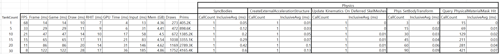
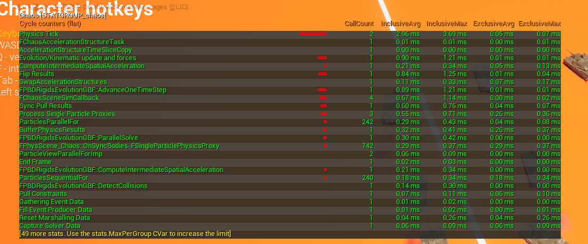
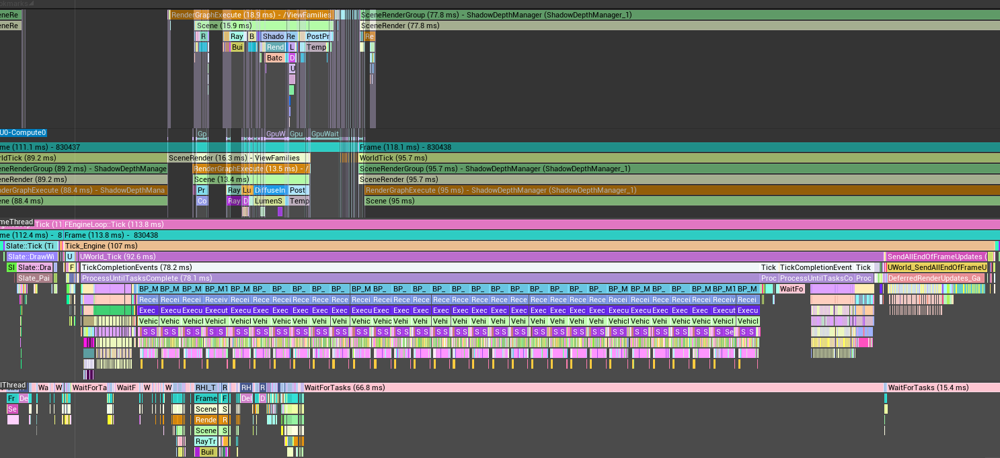
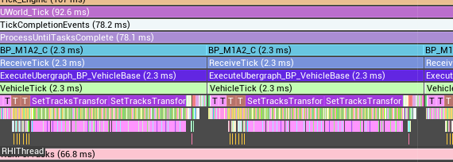
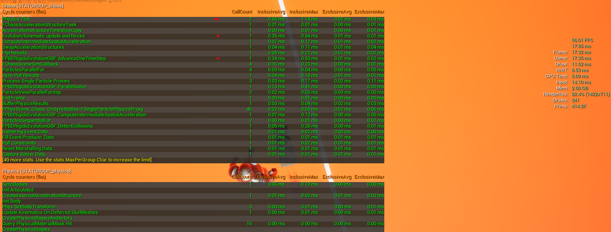
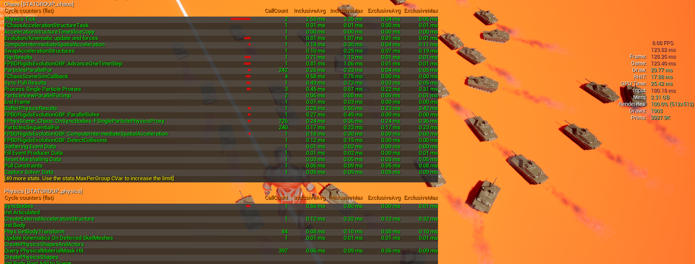

# Chaos Vehicle 다중 탱크 성능 디버깅 보고서

UE 5.7 / BP_M1A2 (Chaos Vehicle) / TankSTDriver (C++ AI 제어)  
측정 환경: 단일 클라이언트, PIE, Windows 11

---

## 핵심 결론 (요약)

| | 내용 |
|--|------|
| **증상** | 탱크 30대 PIE 실행 시 8 FPS (~122ms/frame) |
| **원인** | `SetTracksTransform` — 탱크 트랙 애니메이션의 CPU 스플라인 계산 |
| **비용** | VehicleTick 73ms 중 **52ms (71%)** 를 트랙 애니메이션이 단독 소비 |
| **구조적 문제** | Blueprint `USplineComponent` = CPU 전용. 30대가 게임 스레드에서 직렬 실행 |
| **착각했던 것** | Chaos 물리 솔버 (실제 2.63ms, 전체의 2%) |
| **최대 개선 가능** | 트랙 애니메이션 GPU 이전 시 52ms 절감 → **8 FPS → 20+ FPS 예상** |

---

## 1. 성능 벤치마크

`stat unit` 기준 탱크 수별 측정. 탱크가 늘수록 `Frame == Game` — **게임 스레드가 병목**임을 즉시 확인.



| TankCount | FPS | Frame (ms) | Game (ms) | Draw (ms) | RHIT (ms) | GPU (ms) |
|-----------|-----|-----------|----------|----------|----------|---------|
| 1  | 68 | 14  | 14  | 10 | 7  | 4  |
| 5  | 33 | 29  | 29  | 11 | 9  | 6  |
| 10 | 21 | 47  | 47  | 14 | 10 | 17 |
| 15 | 15 | 65  | 65  | 17 | 11 | 21 |
| 20 | 11 | 86  | 86  | 20 | 14 | 31 |
| 30 | 8  | 122 | 122 | 28 | 17 | 36 |

- `Frame == Game` 항상 일치 → 게임 스레드가 유일한 병목
- 탱크당 추가 비용 **~3.7ms, 선형 O(N)** → 특정 로직이 탱크 수에 비례해서 증가
- GPU 최대 36ms — 프레임 시간 대비 여유 있음. **GPU는 CPU를 기다리고 있는 상태**

---

## 2. 병목 원인 탐색 — 오답 과정

### 2-1. 렌더링 / 물리 / 오디오 순서로 소거

| 가설 | 검증 방법 | 결과 |
|------|-----------|------|
| 렌더링 (그림자/Lumen) | `r.Shadow.Virtual.Enable 0` | FPS 변화 없음 |
| GPU 스키닝 | `r.SkinCache.Mode 0` | FPS 변화 없음 |
| 프러스텀 컬링 | 카메라를 탱크 반대 방향으로 | FPS 변화 없음 |
| Chaos 물리 솔버 | `stat chaos` 측정 | **2.63ms — 전체의 2%, 무관** |
| 오디오 처리 | TankSTDriver 오디오 비활성화 후 재측정 | FPS 변화 없음 (실제 0.037ms로 무시 가능) |
| Blueprint VM | 초기 Insights (CPU trace 미포함) | K2Node 0ms 표시 → **측정 오류** |

### 2-2. Chaos 물리가 아님을 확인

`stat chaos` 로 탱크 수별 물리 솔버 비용 측정:



| TankCount | Physics Tick (ms) | 전체 프레임 대비 |
|-----------|------------------|----------------|
| 1  | 0.68 | 4.9% |
| 10 | 1.31 | 2.8% |
| 30 | **2.63** | **2.1%** |

30대 탱크의 물리 시뮬레이션 전체가 **2.63ms**. Chaos Solver는 Worker 스레드에서 30대를 Island 단위로 병렬 처리하기 때문에 탱크가 늘어도 비용이 거의 증가하지 않음. **물리 솔버는 병목 아님.**

---

## 3. 실제 병목 발견 — Unreal Insights

트레이스 수집: `Trace.Start default,cpu,frame` → `Trace.Stop`  
(초기 측정에서 CPU trace 미포함으로 BP 레벨 타이밍이 누락됐었음. 재수집 후 원인 확인.)

### 3-1. 타임라인 전체 구조



Frame 830438 (118.1ms) 기준:

| 스레드 | 구간 | 상태 |
|--------|------|------|
| **Game Thread** | ProcessUntilTasksComplete (78.1ms) | BP_M1A2_C 틱 30대 **순차 직렬 실행** |
| **RHIThread** | WaitForTasks (66.8ms) | **유휴** — GPU가 게임 스레드를 기다리는 상태 |
| **Render Thread** | SceneRenderGroup (95.7ms) | ShadowDepthManager_1 렌더 실행 중 |

RHIThread가 66.8ms 동안 유휴라는 것은, **게임 스레드의 BP 틱 직렬 실행이 GPU 커맨드 제출 자체를 막고 있음**을 의미. GPU 자원은 충분히 남아있는데 CPU가 병목.

### 3-2. ProcessUntilTasksComplete 내부 확대



```
TickCompletionEvents (78.2ms)
  └ ProcessUntilTasksComplete (78.1ms)
        └ WorldTick
              └ BP_M1A2_C (2.3ms) × 30대  ← 순차 반복
                    └ VehicleTick (2.3ms)
                          └ SetTracksTransform       ← 여기가 핵심
                                ├ FinalDistanceCalculation × 157회
                                ├ GetRotationAtDistanceAlongSpline × 157회
                                ├ GetLocationAtDistanceAlongSpline × 157회
                                ├ GetRightVectorAtDistanceAlongSpline × 157회
                                └ (VehicleMesh, NS_SkidMarks 등)
```

### 3-3. Timers 패널 수치 (30대, Timers 집계)

| Timer | Count | Incl (ms) | 비율 |
|-------|-------|-----------|------|
| `ProcessUntilTasksComplete` | 8 | 94.5 | — |
| `VehicleTick` | 32 | **73.6** | 프레임의 **60%** |
| **`SetTracksTransform`** | 63 | **52.4** | VehicleTick의 **71%** |
| `VehicleMesh` | 270 | 25.0 | |
| `FinalDistanceCalculation` | **4725** | 18.5 | |
| `NS_SkidMarks` | 123 | 17.7 | |
| `TrackPathAnimations` | 62 | 6.4 | |
| `TrackPathShift` | 62 | 5.7 | |

---

## 4. 근본 원인 분석

### 4-1. SetTracksTransform이 하는 일

탱크 트랙(캐터필러)의 각 링크 위치를 매 프레임 CPU에서 계산.

```
바퀴 회전량 누적
  → USplineComponent에 "거리 D에서의 위치는?"
  → GetLocationAtDistanceAlongSpline(D)    ← CPU 함수
  → GetRotationAtDistanceAlongSpline(D)   ← CPU 함수
  → ... × 157회 반복 (트랙 링크 1개당 1회)
  → 각 링크의 Instanced Static Mesh Transform 업데이트
```

프레임당 스플라인 쿼리 총량:

| 연산 | 탱크당 | 30대 합계 |
|------|--------|---------|
| `FinalDistanceCalculation` | 157회 | 4,725회 |
| `GetRotationAtDistanceAlongSpline` | 157회 | 4,725회 |
| `GetLocationAtDistanceAlongSpline` | 157회 | 4,725회 |
| `GetRightVectorAtDistanceAlongSpline` | 157회 | 4,725회 |
| `GetScaleAtDistanceAlongSpline` | 157회 | 4,725회 |
| **합계** | **785회** | **23,625회** |

**프레임당 약 23,600회의 스플라인 쿼리가 게임 스레드에서 직렬 실행.**

### 4-2. 왜 게임 스레드에서 직렬인가

**이유 1: TG_DuringPhysics의 비블로킹 실행**

```
LevelTick.cpp:
  RunTickGroup(TG_StartPhysics)          // 물리 시작
  RunTickGroup(TG_DuringPhysics, false)  // bBlock=false → 틱이 큐에만 쌓임
  RunTickGroup(TG_EndPhysics)            // 물리 완료 대기
    └ ProcessUntilTasksComplete
        └ pump loop: 쌓인 틱을 하나씩 꺼내 실행 ← 30대가 여기서 처리됨
```

**이유 2: Blueprint은 게임 스레드 전용**

`USplineComponent::GetLocationAtDistanceAlongSpline()` 등 BP에서 호출하는 모든 함수는 스레드 안전 보장 없음. UE가 의도적으로 BP 틱을 게임 스레드에 묶어둔 것.
→ 30대의 VehicleTick을 Worker 스레드에 분산하는 것이 BP 구조로는 불가능.

**이유 3: USplineComponent는 CPU 전용 시스템**

GPU는 `USplineComponent`에 접근할 방법이 없음. 따라서 157개 링크 위치 계산이 전부 CPU에서 순차 실행됨.

### 4-3. 트랙 애니메이션은 물리와 무관

중요한 점: **트랙 링크는 순수 비주얼 요소**.

```
Chaos 물리:  차체 + 바퀴 → 지형 충돌, 힘 계산 (Worker 스레드, 2.63ms)
트랙 링크:   "바퀴가 얼마나 돌았나" 라는 숫자만 받아서 위치 계산 (게임 스레드, 52ms)

트랙 링크 자체에는 콜리전 없음.
다른 물체와 상호작용 없음.
→ 물리 스레드 결과를 기다릴 필요도 없음.
→ 완전히 독립적인 시각 효과.
```

즉, 물리와의 의존성 때문에 CPU에서 실행되는 게 아니라, **BP + USplineComponent 구현 방식의 구조적 한계**로 CPU에서 실행되고 있음.

---

## 5. 프레임 시간 분해 (30대, ~122ms)

```
총 프레임: ~122ms (8 FPS)
│
├── VehicleTick Blueprint            73ms  (60%)
│     ├── SetTracksTransform         52ms  (43%) ← 핵심 병목
│     │     └── FinalDistanceCalc    18ms  (15%)
│     ├── VehicleMesh 업데이트       25ms  (20%)
│     └── NS_SkidMarks               18ms  (15%)
│
├── Chaos 물리 솔버                  3ms   ( 2%)  Worker 스레드
│
└── 렌더링 + 기타                    46ms  (38%)  Render/RHI 스레드
```

GPU(RHIThread)는 이 중 66.8ms를 유휴 상태로 대기. CPU 병목이 해소되면 GPU도 그 시간을 활용 가능.

---

## 6. 최적화 로드맵

### 방법 1: 거리 기반 LOD (즉시 적용 가능)

원거리 탱크는 트랙 애니메이션 불필요 — 어차피 안 보임.

```
< 50m  (근거리 5대):  전체 계산 유지     → 52ms × (5/30)  ≈ 8.7ms
50~200m (중거리 10대): 링크 수 절반      → 52ms × (10/30) × 0.5 ≈ 8.7ms
> 200m  (원거리 15대): 완전 비활성화     → 0ms

절감: 52ms → ~17ms (35ms 절감)
```

BP 레벨에서 카메라 거리 체크로 구현 가능. 코드 변경 최소.

### 방법 2: 트랙 애니메이션 GPU 이전 (근본 해결)

`USplineComponent` CPU 계산을 Vertex Shader 또는 Compute Shader로 대체.

**UV 스크롤 방식 (단기):**
```
트랙 메시에 이동 텍스처 적용
바퀴 회전속도 → Material Parameter로 전달 (CPU→GPU, 값 1개)
셰이더에서 텍스처 UV를 그 속도로 스크롤

CPU 비용: ~0ms (파라미터 전달만)
GPU 비용: 텍스처 샘플링 (무시 가능)
단점: 링크 개별 구부러짐 표현 없음 → 원거리 충분
```

**Vertex Shader 방식 (고품질):**
```
트랙 링크 157개 위치 = GPU 버퍼
스플라인 제어점 → Uniform Buffer로 GPU 전달
Compute Shader가 157개 링크를 병렬 계산

CPU 비용: ~0ms (30대 동일)
GPU 비용: 157 thread × 30대 = 4,710 thread 병렬 (GPU에겐 사소)
품질: 링크 개별 위치/회전 정확하게 표현
```

**예상 개선:**
```
현재:  SetTracksTransform 52ms → GPU 이전 후 ~0ms
절감:  52ms (프레임의 43%)
결과:  122ms → ~70ms → 14 FPS (8 FPS에서 75% 향상)
```

### 방법 3: C++ + ParallelFor 이전 (스레딩 해결)

SetTracksTransform을 C++로 이전하면 Worker 스레드 병렬 처리 가능.

```cpp
ParallelFor(Tanks.Num(), [&](int32 i) {
    UpdateTankTracks(Tanks[i]);  // 각 탱크가 별도 코어에서 실행
});
// 73ms → ~3ms (코어 수에 비례)
```

단, Blueprint 에셋이므로 C++ 이전 자체가 큰 리팩터링. GPU 이전과 병행하면 최대 효과.

### 방법 4: NS_SkidMarks LOD

```
원거리 탱크 스키드마크 파티클 비활성화
절감: 17.7ms 중 ~10ms
```

### 통합 예상 효과

| 최적화 | 절감 | 적용 난이도 |
|--------|------|------------|
| 거리 기반 트랙 LOD | ~35ms | 낮음 (BP 수정) |
| 트랙 GPU 이전 (UV 스크롤) | ~40ms | 중간 (Material 작성) |
| 트랙 GPU 이전 (Vertex Shader) | ~52ms | 높음 (C++ + HLSL) |
| C++ ParallelFor | ~70ms | 높음 (전면 재작성) |
| NS_SkidMarks LOD | ~10ms | 낮음 |

**현실적인 목표 (LOD + UV 스크롤):**
```
122ms → 약 47ms → 21 FPS
GPU 여유분(지금 66ms 유휴)이 채워지므로 실제 FPS 개선폭은 더 클 수 있음
```

---

## 7. 상세 측정 데이터 (부록)

### 7-1. stat unit (별도 실행 측정)

| TankCount | FPS | Frame | Game | Draw | RHIT | GPU | Input | Draws | Prims |
|-----------|-----|-------|------|------|------|-----|-------|-------|-------|
| 1  | 56.01 | 17.32 | 17.35 | 11.52 | 8.53  | 5.09  | 14.10  | 341  | 414.2K  |
| 5  | 30.23 | 32.79 | 32.75 | 17.80 | 10.55 | 8.14  | 43.86  | 823  | 913.9K  |
| 10 | 19.50 | 51.59 | 50.60 | 19.30 | 11.50 | 6.56  | 52.82  | 904  | 1287.7K |
| 15 | 14.45 | 68.30 | 68.48 | 21.43 | 12.31 | 18.52 | 85.41  | 1190 | 1767.3K |
| 20 | 11.31 | 87.08 | 87.78 | 25.13 | 14.74 | 26.98 | 140.64 | 1508 | 2758.8K |
| 30 |  8.08 | 128.26| 123.40| 29.77 | 17.83 | 25.42 | 180.18 | 1909 | 3927.9K |

### 7-2. stat chaos — Physics Tick 서브항목 (InclusiveAvg, ms)

| 항목 | 1대 | 5대 | 10대 | 15대 | 20대 | 30대 |
|------|-----|-----|------|------|------|------|
| **Physics Tick** | 0.68 | 1.15 | 1.31 | 1.58 | 1.96 | 2.63 |
| Evolution/Kinematic | 0.35 | 0.49 | 0.51 | 0.55 | 0.61 | 0.81 |
| AdvanceOneTimeStep | 0.34 | 0.48 | 0.50 | 0.54 | 0.60 | 0.81 |
| FChaosSceneSimCallback | 0.16 | 0.26 | 0.27 | 0.37 | 0.49 | 0.58 |
| Sync Pull Results | 0.04 | 0.11 | 0.18 | 0.26 | 0.34 | 0.49 |
| ParallelSolve | 0.13 | 0.18 | 0.19 | 0.19 | 0.21 | 0.27 |

### 7-3. stat chaos — CallCount 스케일링 패턴

| 항목 | 1대 | 10대 | 30대 | 패턴 |
|------|-----|------|------|------|
| OnSyncBodies | 46 | 262 | 726 | 선형 (~24/대) |
| ParticlesParallelFor | 4 | 33 | 242 | **준2차** |
| ParticlesSequentialFor | 2 | 31 | 240 | **준2차** |

### 7-4. 탱크 수별 스크린샷

| TankCount | 스크린샷 |
|-----------|---------|
| 1  |  |
| 5  |  |
| 10 |  |
| 15 |  |
| 20 |  |
| 30 |  |
