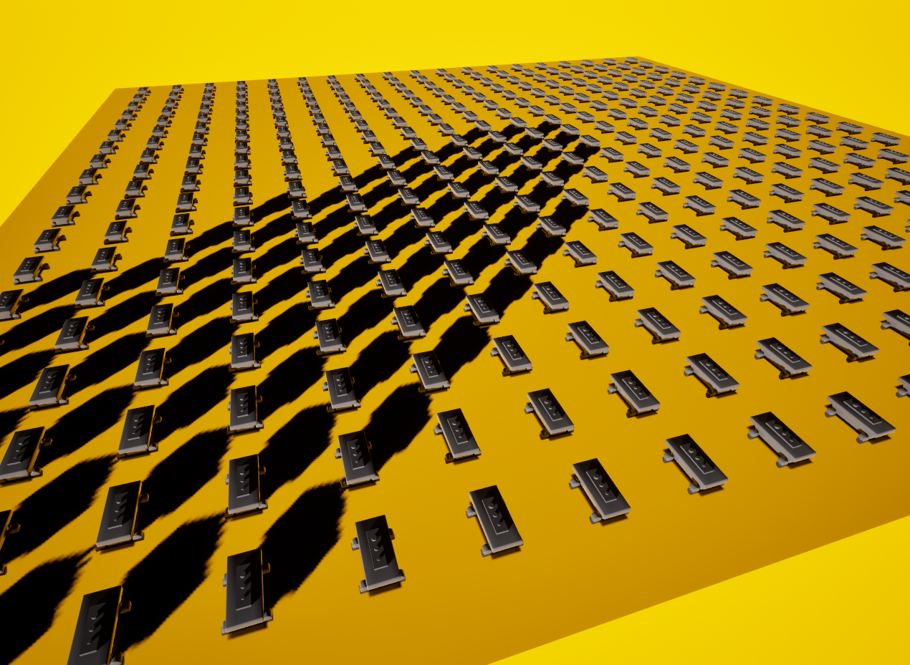

# UE5 Orthographic SceneCapture2D — Shadow Cascade 버그 분석



## 현상

SceneCapture2D를 Orthographic 모드로 위에서 아래로 찍을 때:

- Directional Light 각도 **> 45°** (평면 노말 기준)
- CaptureHeight(H) **< OrthoWidth/2 (= W/2)**

두 조건 동시 충족 시 일부 shadow caster의 그림자가 RT에 찍히지 않음.

**단, caster 자체는 RT에 정상적으로 찍힘** (일반 렌더링 경로는 정상).

---

## 핵심: 두 렌더링 경로는 완전히 별개다

SceneCapture 렌더링에는 서로 독립적인 두 경로가 있다.

```
경로 A: SceneCapture 일반 렌더링 (무엇을 RT에 그릴지)
  → orthographic projection matrix 직접 사용
  → caster가 OrthoWidth 범위 안에 있으면 정상 렌더링
  → "Hidden in Scene Capture"를 끄면 caster가 RT에 정확히 보임 ✓

경로 B: Shadow caster culling (shadow map에 포함할지 결정)
  → cascade bounding sphere + ShadowBoundsAccurate 기반으로 caster를 추려냄
  → [버그] orthographic 카메라에서 이 두 값을 잘못 계산
  → 일부 caster가 culled → shadow map에 포함 안 됨 → 그림자 없음 ✗
```

---

## Cascade Bounding Sphere란

Directional Light shadow map을 렌더링할 때 모든 오브젝트를 다 검사하면 비싸다.  
UE5는 "이 cascade에 그림자를 드리울 수 있는 caster가 어느 범위 안에 있는가"를  
**구(sphere) + convex frustum** 으로 근사해서 빠르게 추려낸다.

```
cascade bounding sphere:
  - 카메라 view frustum을 감싸는 최소 구
  - 이 구 바깥에 있는 shadow caster는 제거

ShadowBoundsAccurate (convex frustum):
  - cascade frustum vertices + 빛 방향으로 만든 convex volume
  - 더 정밀하게 어떤 caster가 그림자를 드리울 수 있는지 결정
```

둘 다 `GetShadowSplitBoundsDepthRange()` 에서 만들어진 **fake frustum vertices** 를 기반으로 계산된다.

---

## 버그 코드

**파일**: `Engine/Source/Runtime/Engine/Private/Components/DirectionalLightComponent.cpp`  
**라인 814–815**

```cpp
// cascade frustum 꼭짓점 계산에 쓰이는 카메라 FOV
float HalfHorizontalFOV = bIsPerspectiveProjection
    ? FMath::Atan(1.0f / ProjectionMatrix.M[0][0])  // Perspective: 실제 FOV 추출
    : UE_PI / 4.0f;                                  // Orthographic: 45° 하드코딩 ← 버그
```

Orthographic 카메라에서 실제 OrthoWidth 대신 **45° 고정값** 을 사용한다.  
이 값으로 cascade frustum의 꼭짓점 8개를 계산하고 (라인 820–843),  
그로부터 cascade bounding sphere와 ShadowBoundsAccurate 를 도출한다.

---

## 45° 하드코딩이 frustum을 어떻게 망가뜨리는가

Orthographic 카메라 실제 뷰:
```
어떤 거리에서든 가로 범위 = ±W/2 (OrthoWidth의 절반, 일정)
```

45° 하드코딩으로 계산된 fake frustum:
```
거리 d에서 가로 범위 = ±d × tan(45°) = ±d  (거리에 비례, perspective처럼)
```

Far plane (depth ≈ H) 에서:
```
실제 ortho 뷰 가로 범위    = ±W/2
fake frustum 가로 범위     = ±H
```

**H < W/2 이면 fake frustum이 실제 뷰보다 좁다.**

이 fake frustum 꼭짓점으로 계산된 cascade bounding sphere:
```
center = 지면 중심 (0, 0, 0) (근사값)
radius = H × sqrt(2)
```

실제 ortho 뷰 코너 caster 위치 `(W/2, W/2, 0)` 에서 sphere center까지의 거리:
```
distance = (W/2) × sqrt(2)
```

| 조건 | sphere radius | 코너 caster 거리 | 결과 |
|---|---|---|---|
| H < W/2 | H√2 **<** (W/2)√2 | (W/2)√2 | 코너 caster가 sphere 밖 |
| H = W/2 | (W/2)√2 | (W/2)√2 | 경계 |
| H > W/2 | H√2 **>** (W/2)√2 | (W/2)√2 | 코너 caster가 sphere 안 |

---

## Shadow caster culling 코드

**파일**: `Engine/Source/Runtime/Renderer/Private/ShadowSetup.cpp`  
**라인 4979–4993**

```cpp
const FVector PrimitiveToShadowCenter = ProjectedShadowInfo->ShadowBounds.Center - PrimitiveBounds.Origin;
const float ProjectedDistanceFromShadowOriginAlongLightDir = PrimitiveToShadowCenter | LightDirection;
const float PrimitiveDistanceFromCylinderAxisSq =
    (-LightDirection * ProjectedDistanceFromShadowOriginAlongLightDir + PrimitiveToShadowCenter).SizeSquared();
const float CombinedRadiusSq = FMath::Square(ProjectedShadowInfo->ShadowBounds.W + PrimitiveBounds.SphereRadius);

if (PrimitiveDistanceFromCylinderAxisSq < CombinedRadiusSq           // ① 실린더 테스트
    && !(ProjectedDistanceFromShadowOriginAlongLightDir < 0            // ② 구면 캡 테스트
         && PrimitiveToShadowCenter.SizeSquared() > CombinedRadiusSq)
    && ProjectedShadowInfo->CascadeSettings.ShadowBoundsAccurate       // ③ accurate frustum 테스트
        .IntersectBox(PrimitiveBounds.Origin, PrimitiveBounds.BoxExtent))
```

세 테스트를 모두 통과해야 shadow map에 포함된다.  
**ShadowBounds.W** (① ② 에 사용) = cascade bounding sphere 반지름 = 잘못 계산된 값  
**ShadowBoundsAccurate** (③ 에 사용) = fake frustum vertices + 빛 방향으로 만든 convex volume = 잘못 만들어진 값

---

## 왜 빛 45° 이상일 때 culling이 시작되는가

이것은 그림자가 어디에 떨어지느냐의 문제가 아니라, **빛 45°가 culling 조건 자체에 포함**된다.

`ShadowBoundsAccurate`는 `ComputeShadowCullingVolume()` 에서 만들어진다.

**파일**: `DirectionalLightComponent.cpp` 라인 101–155  
핵심 로직 (라인 147–155):

```cpp
// 카메라 frustum plane들 중 빛 방향을 등진 것(d < 0)만 shadow culling volume에 포함
for (int32 i = 0; i < 6; i++)
{
    FVector Normal(SubFrustumPlanes[i]);
    float d = Normal | LightDirection;
    if (d < 0.0f)
    {
        Planes.Add(SubFrustumPlanes[i]);
    }
}
```

fake frustum (45° FOV, 카메라가 아래를 봄)의 side plane 법선은  
**하드코딩된 45° FOV에서 파생된 45° 기울기**를 가진다.

```
fake frustum 오른쪽 side plane 법선 ≈ (1/√2, 0, 1/√2)
빛 방향 L = (sin(θ), 0, -cos(θ))

d = (1/√2)×sin(θ) + (1/√2)×(-cos(θ)) = (sin(θ) - cos(θ)) / √2

θ < 45°: d < 0  → 이 plane이 ShadowBoundsAccurate에 포함됨
θ = 45°: d = 0  → 경계 (접선)
θ > 45°: d > 0  → 이 plane이 ShadowBoundsAccurate에서 제외됨
```

빛 각도가 45°를 넘는 순간 ShadowBoundsAccurate를 구성하는 plane 집합이 바뀌고,  
이에 따라 convex volume의 형태가 바뀐다.  

H < W/2인 상태에서 fake frustum이 이미 실제 뷰보다 좁은데,  
빛 45° 이상에서 ShadowBoundsAccurate 형태까지 바뀌면서  
실제 ortho 뷰 경계의 caster들이 culling volume 밖으로 벗어나기 시작한다.

**두 45°의 관계**:  
하드코딩된 45° FOV → fake frustum side plane이 45° 기울기 가짐  
→ 빛 방향이 정확히 45°일 때 이 plane과 접선이 됨  
→ 빛이 이 각도를 넘는 순간 ShadowBoundsAccurate 구성이 변화  
→ H < W/2인 undersized frustum에서 edge caster culling 시작

---

## 왜 메인 카메라는 괜찮은가

Perspective 카메라는 projection matrix에서 실제 FOV를 추출한다:
```cpp
FMath::Atan(1.0f / ProjectionMatrix.M[0][0])  // 실제 FOV 사용
```

Cascade frustum vertices가 실제 view frustum과 일치하므로  
ShadowBoundsAccurate도 정확하게 만들어진다.

---

## 왜 VSM과 기본 Shadow Map 모두 동일하게 발생하는가

두 방식 모두 동일한 `GetShadowSplitBoundsDepthRange()` 를 호출해  
cascade bounding sphere와 ShadowBoundsAccurate를 구한다.  
버그 코드가 공통 경로에 있으므로 렌더링 방식과 무관하게 동일하게 발생한다.

---

## 올바른 수정 방향

```cpp
// 현재 (버그):
float HalfHorizontalFOV = bIsPerspectiveProjection
    ? FMath::Atan(1.0f / ProjectionMatrix.M[0][0])
    : UE_PI / 4.0f;  // orthographic에서 OrthoWidth 무시

// 수정 방향:
// orthographic frustum 꼭짓점은 FOV 기반이 아니라
// OrthoHalfWidth (= 1.0f / ProjectionMatrix.M[0][0]) 를 직접 사용해야 함
//
// 현재: far plane 가로 범위 = SplitFar × tan(45°) = SplitFar (거리 비례)
// 올바름: far plane 가로 범위 = OrthoHalfWidth (거리 무관, 일정)
//
// 꼭짓점 계산 전체를 orthographic 케이스로 분기 처리 필요
```

---

## 우회 방법 (현재)

`H ≥ W/2` 조건을 만족시키면 fake frustum이 실제 ortho 뷰를 커버하게 된다:

```
CaptureHeight = OrthoWidth × 0.6 = CatcherScale × 60
```

20% 마진을 두어 H = W/2 경계 근처의 불안정함을 방지한다.
