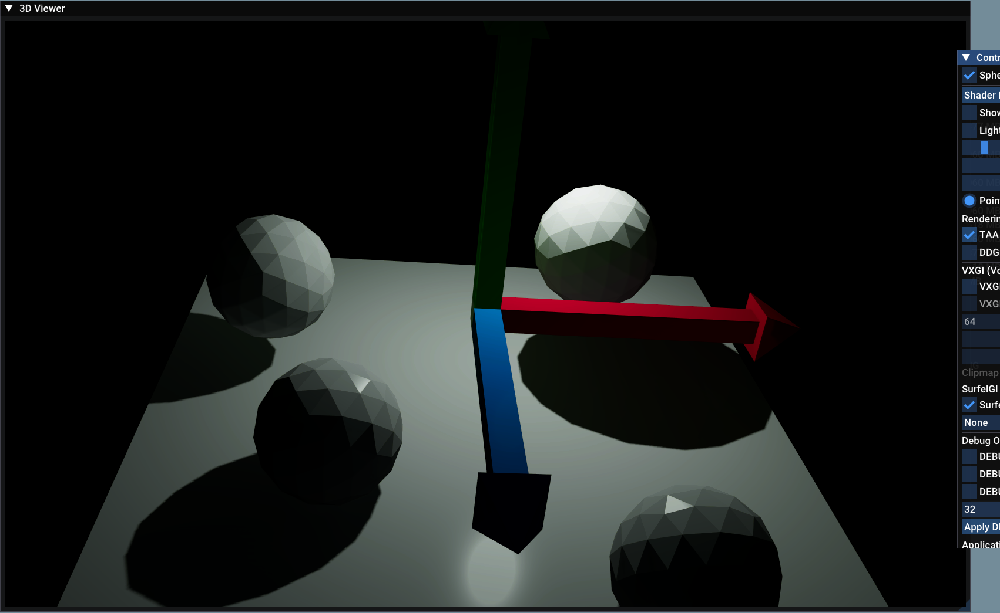
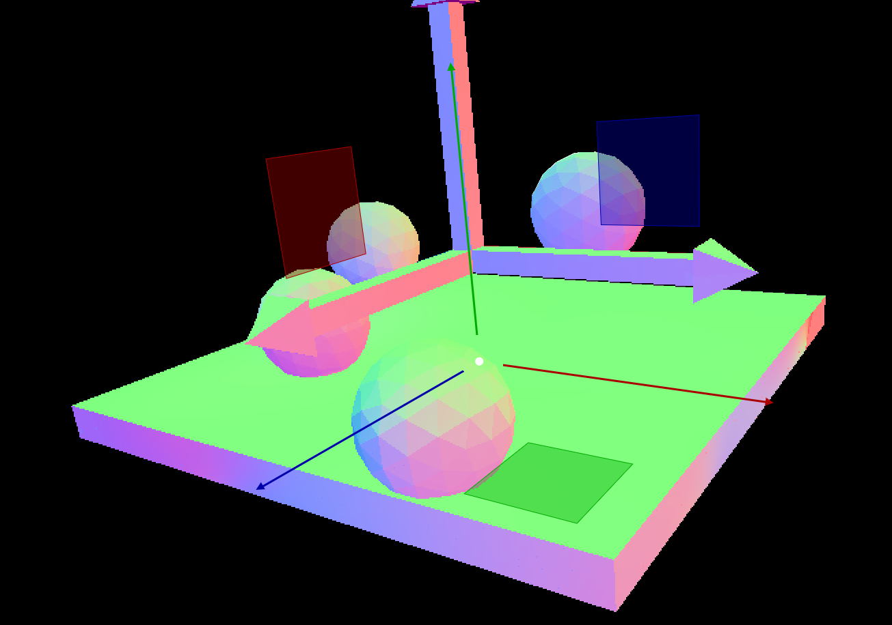
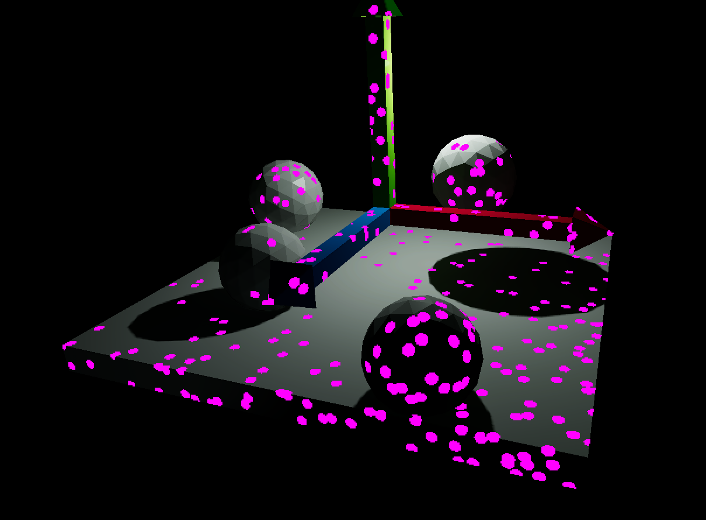
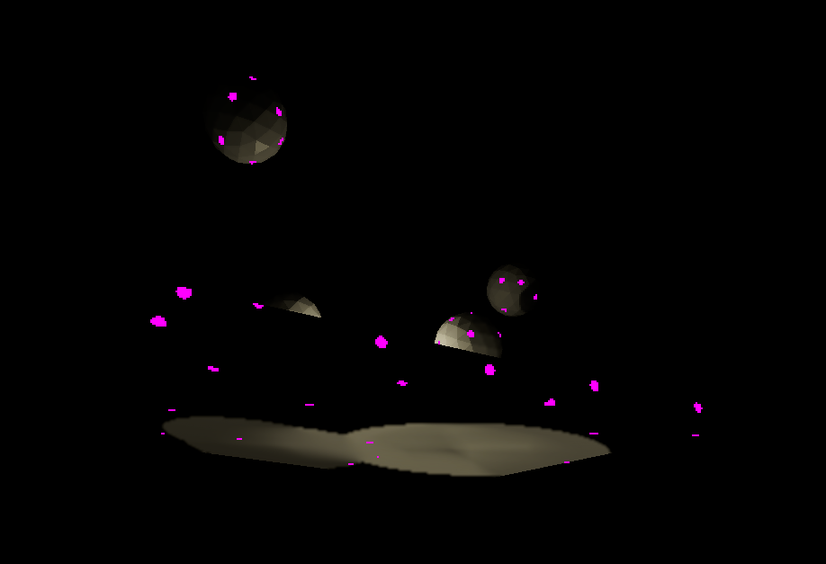
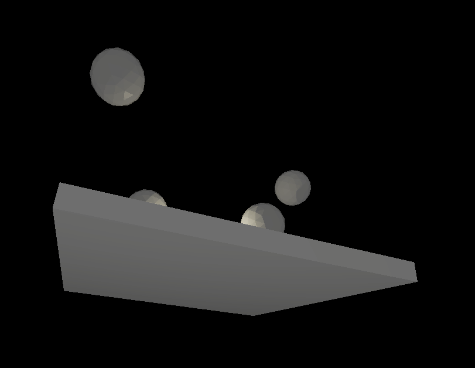
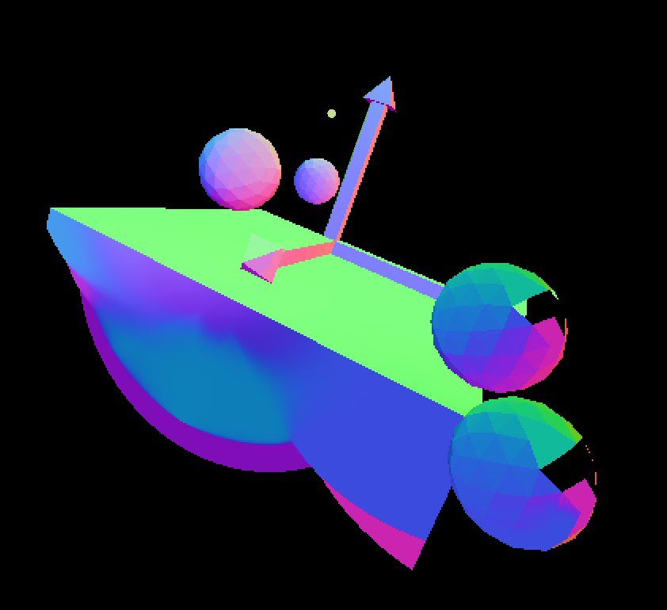

# VizMotive SurfelGI 구현 완료 보고서

Wicked Engine 9.2 의 SurfelGI 를 VizMotive Engine 에 이식한 작업의 최종 정리.

> 관련 문서:
> - Wicked 9.2 SurfelGI 원본 분석 (이론 + 구현): [surfelGI.md](surfelGI.md)
> - VizMotive 통합 계획: [vizmotive_surfelgi_plan.md](vizmotive_surfelgi_plan.md)
> - 디버깅 로그 (작업 중간 기록): [debugging_log.md](debugging_log.md)
> - 다음 액션 플랜 (작업 중간 단계): [next_action_plan.md](next_action_plan.md)
> - DDGI 의 mesh winding / backface 관련 backend 차이: [../DDGI/vizmotive DDGI.md](../DDGI/vizmotive%20DDGI.md)

---



normal debug



point debug



## 1. 구현 범위

### 1.1. 이식된 셰이더 (Wicked 와 logic 1:1)

| 셰이더 | 역할 |
|--------|------|
| `surfel_coverageCS.hlsl` | 화면 픽셀에서 surfel 분포 측정 + spawn |
| `surfel_indirectprepareCS.hlsl` | DispatchIndirect args 준비 |
| `surfel_updateCS.hlsl` | alive surfel 의 position/normal update, ray budget 분배 |
| `surfel_raytraceCS.hlsl` | surfel 의 hemisphere ray cast (NEE + multi-bounce) |
| `surfel_integrateCS.hlsl` | ray 결과를 MultiscaleMeanEstimator 로 cache 누적 |
| `surfel_binningCS.hlsl` | grid cell 별 surfel 분류 |
| `surfel_gridoffsetsCS.hlsl` | grid cell 의 offset 계산 |

### 1.2. C++ 측

- `GSceneDetails::SurfelGI` struct 의 GPU buffer 정의
- `Update_SurfelGI()`, `SurfelGI_Coverage()` 의 dispatch 시퀀스 (Wicked 의 `wiRenderer.cpp` 동일)
- Cmd queue: `QUEUE_COMPUTE` (cmd_prepareframe_async, cmd_maincamera_compute_effects)

### 1.3. 추가 진단 디버그 모드 (Wicked 에 없음)

| Mode | 시각화 |
|------|--------|
| Life | surfel 의 life counter (0~255) |
| RayCount | 매 frame 받은 ray 개수 |
| MomentWeight | Chebyshev moment weight (contribution chain 의 마지막 component) |
| MeanDepth | `surfelMomentsTexture` 의 mean depth (moment freeze 검증) |
| RadianceDC | surfel.radiance 의 SH 평가값 (mean freeze 검증) |
| ShadowTest | 픽셀별 NEE 검증 (light reach 여부 직접 확인) |

---

## 2. 발생한 핵심 문제

### 2.1. 문제: 빛 받는 표면도 stuck

**현상**: SurfelGI 활성화 후 10초 정도 지나면 모든 표면이 SurfelGI 영역에서 제외됨 (검정). 빛이 충분한 환경에서도 발생.

**Stuck Chain**:
```
[1] ray result = 0 (모든 ray)
[2] MultiscaleMeanEstimator: mean → 0, variance → 0
[3] inconsistency lerp → 0
[4] rayCountRequest = saturate(inconsistency) * 64 = 0
[5] ray 안 받음 → result = 0 (다음 frame 도) → 영원 stuck
```

### 2.2. 근본 원인

**`compute_barycentrics` 의 backface 판정 logic 과 VizMotive mesh winding 의 mismatch**.

`Globals.hlsli` 의 software intersection:
```hlsl
float det = dot(v0v1, pvec);  // pvec = cross(rayDir, v0v2)
is_backface = det > 0;        // ← CW winding 가정
```

수학적으로 `det = -(v0v1 × v0v2) · rayDir`:
- **CCW winding** (cross result = outward): frontface 시 det > 0
- **CW winding** (cross result = inward): frontface 시 det < 0

따라서 `is_backface = det > 0` 는 **CW winding 가정**.

VizMotive 의 실제 mesh winding (BoxGeometry, PolyhedronGeometry 등):
- `cross(v0v1, v0v2)` 결과가 outward normal 과 일치 → **CCW winding** (RHS, outward 기준)
- 6 face 모두 CCW 확인됨 (각 buildPlane 의 `udir/vdir` 부호 적용 후)

**Mismatch**:
- VizMotive CCW + ray from outside (frontface) → `det > 0` → `is_backface = true` 잘못 판정
- 그 후 `surface.load_internal:390` 의 `if (is_backface) N = -N;` 에 의해 **모든 frontface 의 surface.N 이 반전**
- → `NdotL = dot(inverted_N, light_dir) < 0`
- → second-stage NEE 의 `if (NdotL > 0 && dist > 0)` 분기 진입 안 함
- → NEE 결과 = 0 → ray result = 0 → stuck

**확정 증거**:
- `surfel_coverageCS` 에 `N * 0.5 + 0.5` 시각화 추가 → 모든 mesh 의 윗면 = 보라색 (Y = -1, inverted), 아랫면 = 민트색 (Y = +1, inverted)
- 정상 동작이라면 윗면 민트, 아랫면 보라이어야

### 2.3. 영향 범위 분석

**`compute_barycentrics` 의 ray+is_backface overload 사용처**: 단 2 곳

| 위치 | `surface.N` 사용? | 영향 |
|------|-----------------|------|
| `surfel_coverageCS.hlsl:79` | ✅ contribution 계산 + `SH::CalculateIrradiance(radiance, N)` | **N inverted → stuck 의 직접 원인** |
| `visibility_resolveCS.hlsl:86` | ❌ depth + material.shaderType 만 추출 | 무관 |

다른 셰이더 (DDGI, VoxelGI, Forward/Deferred PS, surfel_raytraceCS) 는 다른 path 사용:
- RTAPI: `q.CommittedTriangleFrontFace()` (DXR hardware) + DDGI 의 TLAS instance flag fix
- Raster: rasterizer 의 정확한 frontface 판정
- bary overload: caller 의 명시적 `SetBackface()`

→ `compute_barycentrics` 의 logic mismatch 가 SurfelGI 만 affected.

### 2.4. 해결

**`Globals.hlsli:1883` 의 backface logic 수정**:
```hlsl
// 변경 전
is_backface = det > 0;  // CW winding 가정 (Wicked LHS CCW = LHS 에서 CW 가정과 호환)
// 변경 후
is_backface = det < 0;  // VizMotive 의 RHS CCW winding 에 맞춤
```

**이유**:
- VizMotive 는 RHS 좌표계 + CCW geometry 가 고정 (mesh data 자체).
- DDGI 문서의 "VizMotive = CW" 표현은 RHS CCW geometry 가 DXR (LHS) 에서 인식 시 CW 로 보인다는 것 (RHS CCW = LHS CW).
- 그러나 `compute_barycentrics` 는 software intersection. coord system 무관, **순수 수학적 winding 가정**으로 작동.
- 따라서 VizMotive 의 RHS CCW vertex order 에 맞는 logic 사용 = `det < 0`.

**Wicked logic 과 다른 이유**:
- Wicked = LHS CCW geometry. LHS 에서 CCW.
- VizMotive = RHS CCW geometry. RHS 에서 CCW.
- 두 엔진의 vertex order 가 같은 의미의 CCW 이지만 coord system 의 의미 차이로 inside/outside 의 cross product 방향이 다름.
- `compute_barycentrics` 의 가정도 엔진의 coord system 에 맞춰 결정.

이 fix 로:
- `surfel_coverageCS` 의 `surface.N` 정확 → NEE 정상 → ray result > 0 → mean estimator alive → stuck 해소
- `visibility_resolveCS` 무관 (N 안 씀)
- 다른 셰이더 무관 (이 함수의 ray+is_backface overload 사용 안 함)

---

## 3. 부수 fix들

### 3.1. `surfel_raytraceCS` 첫 stage shadow ray (Wicked 와 1:1 정정)

- `TMin = 0` → `0.001` (self-intersection 회피)
- `RAY_FLAG_FORCE_OPAQUE` 추가 (non-opaque BLAS 의 빈 anyhit loop 회피)

### 3.2. `surfel_updateCS:35` Entity uid truncate

```hlsl
surface.uid_validate = (uint)surfel_data.uid;  // uint64_t → uint truncate
```
VizMotive 의 Entity 가 uint64_t 라 cast 필요.

### 3.3. PrimitiveID texture 분리 binding

`surfel_coverageCS` 의 visibility buffer 처리:
- VizMotive: 두 개 uint texture (`input_primitiveID_1/2`), `prim.unpack2(uint2)` 사용
- 다른 셰이더와 일관된 backend pattern

### 3.4. Fix-ddgi-light 브랜치 머지 (선행 작업)

`SceneUpdate_Detail.cpp` 의 TLAS instance flag 처리:
- **`FLAG_FORCE_OPAQUE`**: shadow casting + opaque material 인 instance 에 적용 → shadow ray 의 정상 차단 보장 (non-opaque BLAS 의 빈 anyhit loop 회피)
- `FLAG_TRIANGLE_FRONT_COUNTERCLOCKWISE`: `det < 0` 인 mirrored transform 에만 적용 (DDGI 의 backface 판정 정확)

sample14 의 `light_axis` 변경:
- `EnableShadowsCast(false)`: shadow ray 의 light 위치 self-intersection 방지
- `SetVisibleLayerMask(0)`: 기본 hidden (TLAS 에서 제외)

---

## 4. 알려진 한계 (Wicked 와 동일)

### 4.1. 빛 없는 공간의 stuck (의도된 동작)

빛 없는 영역의 ray result = 0 → mean estimator 가 stable state 로 수렴 → ray budget 절약.

이건 SurfelGI 의 design intent: 변화 없는 영역은 cache freeze 로 자원 절약. Wicked 도 동일.

### 4.2. 얇은 mesh 의 indirect leak





`SURFEL_MAX_RADIUS = 2m` 보다 얇은 mesh 에서 cell 안 surfel cache 가 mesh boundary 무시 → 빛 새는 현상.

원인: SurfelGI 의 visibility-unaware spatial caching. 같은 cell 안의 surfel 들이 다른 mesh 로 분리되어 있어도 multi-bounce 시 서로 영향!

바닥 메시의 두께가 surfel 반경 보다 작은 씬에서,

바닥 메시의 아랫면(빛을 받지 않는 면)의 surfel 이 바닥 메시를 뚫고 위에 있는 sphere 의 surfel 에 영향을 받아버림.



- surfel 반경만큼 인접 mesh 표면의 surfel 들이 영향을 받게된다.

Wicked 동등 환경에서 검증 시 동일 발생 (사용자 직접 확인).

향후 개선 가능성 (Wicked 도 미해결):
- visibility-aware multi-bounce (cell 안 surfel 끼리 visibility ray cast)
- adaptive cell radius (mesh thickness 기반)
- distance-based weighting

### 4.3. Spawn density 의 zoom (FOV) 의존

카메라가 FOV 기반 zoom 시 zoom in 후 첫 surfel spawn 의 밀도가 매우 높음.

원인: `surfel_coverageCS.hlsl` 의 spawn algorithm 이 **화면 thread group 단위** (16×16 픽셀당 1 그룹, 그룹당 max 1 surfel/frame spawn 시도) 작동:
- zoom in (FOV 작음) → 같은 mesh 의 화면 영역 커짐 → 더 많은 thread group → 더 많은 spawn 시도/frame
- zoom out (FOV 큼) → 적은 thread group → 적은 spawn 시도/frame
- 시간 흐름에 따라 결국 같은 max coverage 도달 (SURFEL_TARGET_COVERAGE = 0.8)

Wicked 동등 환경 (FOV 1~4°) 에서 같은 현상 확인. SurfelGI 의 inherent algorithm — 사용자 인지에 따른 quality issue 이지만 정상 동작.

VizMotive sample14 의 카메라 navigation 이 FOV 기반이라 일상적으로 관찰됨. Dolly (앞뒤 이동) 기반 navigation 사용 시 덜 두드러짐.

---

## 5. 결론

VizMotive Engine 에 Wicked 9.2 의 SurfelGI 가 성공적으로 이식됨. 핵심 fix:
- **`compute_barycentrics` 의 backface logic 을 VizMotive 의 RHS CCW winding 에 맞게 수정** (`det > 0` → `det < 0`)

이 fix 가 발견되기 전엔 SurfelGI 만 stuck 발생 (DDGI/VoxelGI 정상). 원인은 `surface.load(prim, ray.Origin, ray.Direction)` 의 ray overload 가 software intersection 의 backface 판정 사용. 이 overload 가 VizMotive 에서 `surfel_coverageCS` 와 `visibility_resolveCS` 두 곳에만 쓰이지만, 후자는 `surface.N` 미사용으로 영향 없었음.

수정 후:
- `surfel_coverageCS` 의 surface.N 정확
- NEE 정상 작동 → ray result > 0 → mean estimator alive → stuck 해소
- Wicked 와 동등한 quality (한계 포함)
