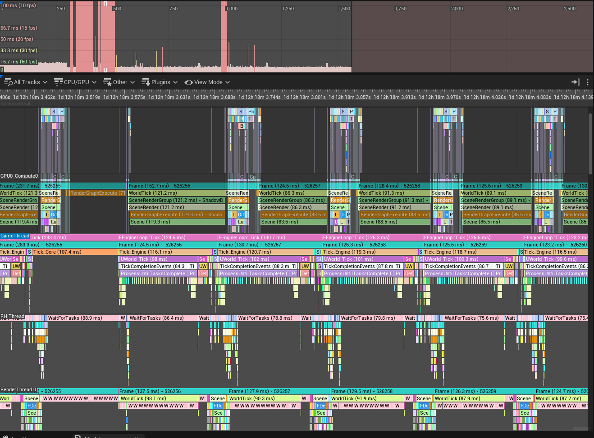
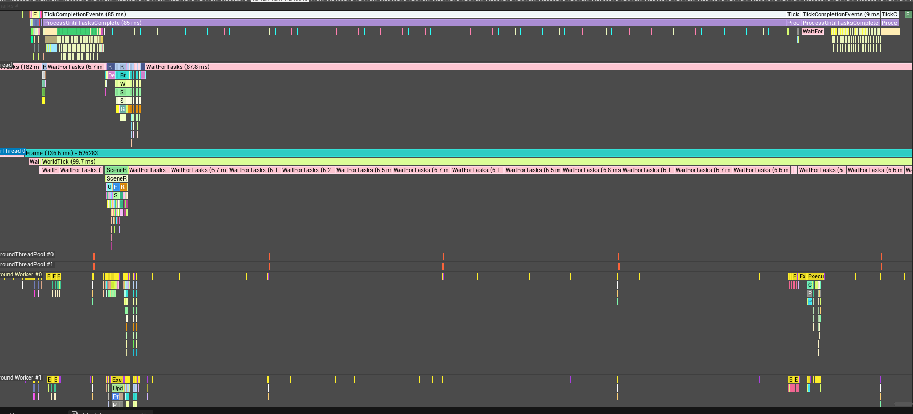
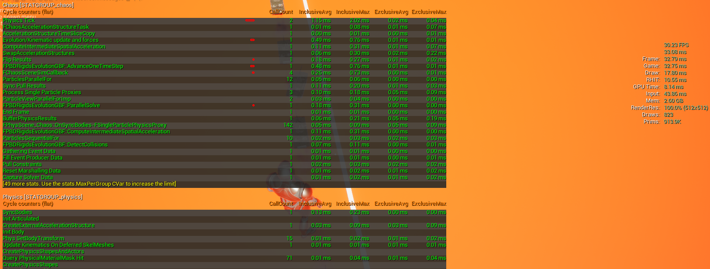
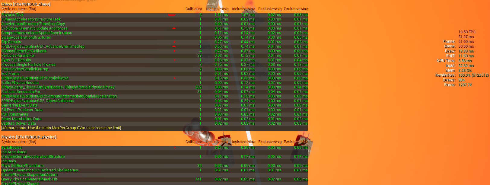
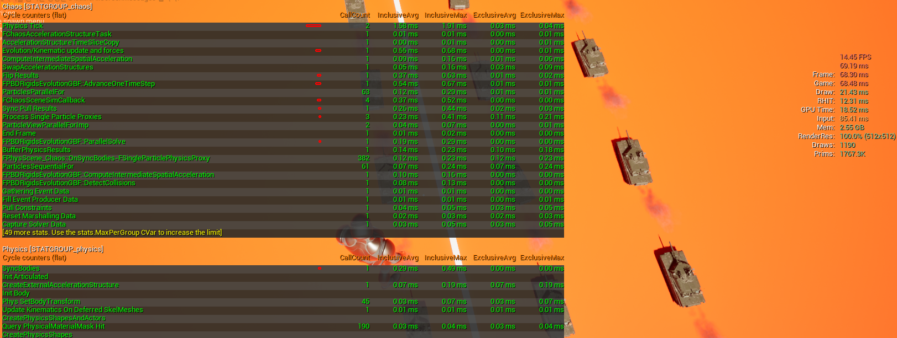
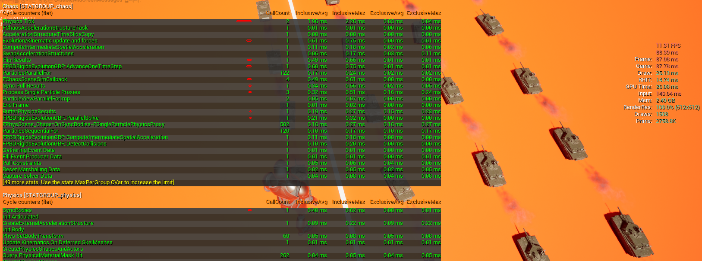

# Chaos Vehicle 다중 탱크 성능 디버깅 보고서

UE 5.7 / BP_M1A2 (Chaos Vehicle) / TankSTDriver (C++ AI 제어)  
측정 환경: 단일 클라이언트, PIE, Windows 11

---

## 1. 성능 벤치마크

`stat unit` 기준 탱크 수별 측정.


| TankCount | FPS | Frame (ms) | Game (ms) | Draw (ms) | RHIT (ms) | GPU (ms) | Input (ms) | Mem (GB) | Draws | Prims |
|-----------|-----|-----------|----------|----------|----------|---------|-----------|---------|-------|-------|
| 1  | 68 | 14  | 14  | 10 | 7  | 4  | 13  | 4.36 | 273  | 405K  |
| 5  | 33 | 29  | 29  | 11 | 9  | 6  | 31  | 4.41 | 472  | 899K  |
| 10 | 21 | 47  | 47  | 14 | 10 | 17 | 58  | 4.50 | 672  | 1385K |
| 15 | 15 | 65  | 65  | 17 | 11 | 21 | 83  | 4.54 | 1038 | 3355K |
| 20 | 11 | 86  | 86  | 20 | 14 | 31 | 146 | 4.62 | 1169 | 2789K |
| 30 | 8  | 122 | 122 | 28 | 17 | 36 | 185 | 4.86 | 1752 | 4165K |

**관찰:**
- `Frame == Game` 항상 일치 → 게임 스레드가 병목
- 탱크당 추가 비용: **~3.7ms (선형, O(N))**
- GPU는 최대 36ms — 프레임 시간 대비 여유 있음

---

## 2. 렌더링 병목 여부 검증

### 2-1. 에디터 vs PIE 비교

| 상태 | FPS | 조건 |
|------|-----|------|
| 에디터 (BeginPlay 없음) | 70+ | 탱크 30대 배치, Lumen·그림자 활성화 |
| PIE (BeginPlay 후) | 7~8 | 탱크 30대 활성화 |

렌더링 품질 설정은 동일. 차이는 오직 탱크 시뮬레이션 활성화 여부.

### 2-2. 추가 테스트

| 테스트 | 결과 |
|--------|------|
| `r.Shadow.Virtual.Enable 0` (그림자 비활성화) | FPS 변화 없음 |
| `r.SkinCache.Mode 0` (GPU 스키닝 → CPU) | FPS 변화 없음 |
| 카메라를 탱크 반대 방향으로 (프러스텀 컬링) | FPS 변화 없음 |

**결론: 렌더링, 그림자, Lumen, GPU 스키닝은 병목 원인 아님 (확인)**

---

## 3. stat chaos — Chaos 물리 솔버

`stat chaos` 명령으로 측정한 Physics Tick 비용.


| TankCount | Physics Tick InclusiveAvg |
|-----------|--------------------------|
| 1  | 0.68ms |
| 5  | 1.15ms |
| 10 | 1.31ms |
| 15 | 1.58ms |
| 20 | 1.96ms |
| 30 | 2.63ms |

**관찰:**
- 30대 기준 Chaos 솔버 총합 **~2.63ms** — 전체 122ms의 2.1%
- **Chaos 물리 솔버는 병목 아님 (확인)**

---

## 4. Unreal Insights 분석

트레이스 수집: PIE 30대 실행 중 `Trace.Start default,cpu,frame` → `Trace.Stop`  
파일: `Saved/Profiling/*.utrace`

### 4-1. 병목 확정 — VehicleTick Blueprint



ProcessUntilTasksComplete (94.5ms) 내부에서 게임 스레드가 30대 탱크의 Blueprint 틱을 순차 처리. 핵심 Timers 수치 (30대, 단위: ms):

| Timer | Count | Incl (ms) | 비고 |
|-------|-------|-----------|------|
| `ProcessUntilTasksComplete` | 8 | 94.5 | 게임 스레드 대기 루프 |
| `WorldTick` | 90 | 82.0 | 펌프 루프 안에서 실행됨 |
| `ReceiveTick` | 63 | 75.6 | |
| **`BP_M1A2_C`** | 32 | **74.2** | 탱크당 ~2.45ms |
| `ExecuteUbergraph_BP_VehicleBase` | 92 | 73.9 | |
| **`VehicleTick`** | 32 | **73.6** | **실질 병목** |
| **`SetTracksTransform`** | 63 | **52.4** | 트랙 스플라인 애니메이션 |
| `VehicleMesh` | 270 | 25.0 | 인스턴스 메시 업데이트 |
| `FinalDistanceCalculation` | **4725** | 18.5 | 탱크당 157회 스플라인 쿼리 |
| `NS_SkidMarks` | 123 | 17.7 | Niagara 스키드마크 파티클 |
| `TrackPathAnimations` | 62 | 6.4 | |
| `TrackPathShift` | 62 | 5.7 | |

### 4-2. 호출 계층 구조

```
ProcessUntilTasksComplete (94.5ms)
  └ WorldTick (82ms) ← 게임스레드 펌프 루프가 픽업
      └ ReceiveTick → BP_M1A2_C → ExecuteUbergraph_BP_VehicleBase
          └ VehicleTick (2.45ms/대 × 30대)
              └ SetTracksTransform (1.75ms/대)
                  ├ FinalDistanceCalculation × 157회/대
                  ├ GetRotationAtDistanceAlongSpline × 157회/대
                  ├ GetLocationAtDistanceAlongSpline × 157회/대
                  ├ GetRightVectorAtDistanceAlongSpline × 157회/대
                  ├ VehicleMesh (인스턴스 업데이트)
                  └ NS_SkidMarks (Niagara)
```

### 4-3. 스플라인 쿼리 규모

| 연산 | 총 횟수 | 탱크당 |
|------|---------|--------|
| `FinalDistanceCalculation` | 4725 | 157.5 |
| `GetRotationAtDistanceAlongSpline` | 4725 | 157.5 |
| `GetLocationAtDistanceAlongSpline` | 4725 | 157.5 |
| `GetRightVectorAtDistanceAlongSpline` | 4725 | 157.5 |
| `GetScaleAtDistanceAlongSpline` | 4725 | 157.5 |
| `SetLocationAtSplinePoint` | 620 | ~20 |

→ 프레임당 스플라인 쿼리 **총 ~23,000회**, 모두 게임 스레드에서 직렬 실행.

### 4-4. Worker 행 분석



- 일반 TaskGraph Worker: 대부분 idle (sparse tasks)
- physics 솔버(2.63ms), 애니메이션 평가 등 소규모 작업만 존재
- **게임 스레드가 직접 BP 틱을 처리하는 동안 Worker는 유휴 상태**

---

## 5. stat chaos / stat physics 탱크 수별 상세 데이터

각 탱크 수에서 `stat chaos` + `stat physics` + `stat unit` 동시 측정.

### 5-1. 스크린샷

| TankCount | 스크린샷 |
|-----------|---------|
| 1  |  |
| 5  |  |
| 10 |  |
| 15 |  |
| 20 |  |
| 30 |  |

### 5-2. stat unit 수치

| TankCount | FPS | Frame (ms) | Game (ms) | Draw (ms) | RHIT (ms) | GPU (ms) | Input (ms) | Draws | Prims |
|-----------|-----|-----------|----------|----------|----------|---------|-----------|-------|-------|
| 1  | 56.01 | 17.32 | 17.35 | 11.52 | 8.53  | 5.09  | 14.10  | 341  | 414.2K  |
| 5  | 30.23 | 32.79 | 32.75 | 17.80 | 10.55 | 8.14  | 43.86  | 823  | 913.9K  |
| 10 | 19.50 | 51.59 | 50.60 | 19.30 | 11.50 | 6.56  | 52.82  | 904  | 1287.7K |
| 15 | 14.45 | 68.30 | 68.48 | 21.43 | 12.31 | 18.52 | 85.41  | 1190 | 1767.3K |
| 20 | 11.31 | 87.08 | 87.78 | 25.13 | 14.74 | 26.98 | 140.64 | 1508 | 2758.8K |
| 30 |  8.08 | 128.26| 123.40| 29.77 | 17.83 | 25.42 | 180.18 | 1909 | 3927.9K |

> 별도 실행으로 측정. PIE 창 크기 차이로 Draw/GPU 수치가 섹션 1과 다소 차이 있음.

### 5-3. stat chaos — Physics Tick 서브항목 (InclusiveAvg, ms)

| 항목 | 1대 | 5대 | 10대 | 15대 | 20대 | 30대 |
|------|-----|-----|------|------|------|------|
| **Physics Tick** | 0.68 | 1.15 | 1.31 | 1.58 | 1.96 | 2.63 |
| Evolution/Kinematic | 0.35 | 0.49 | 0.51 | 0.55 | 0.61 | 0.81 |
| AdvanceOneTimeStep | 0.34 | 0.48 | 0.50 | 0.54 | 0.60 | 0.81 |
| FChaosSceneSimCallback | 0.16 | 0.26 | 0.27 | 0.37 | 0.49 | 0.58 |
| Sync Pull Results | 0.04 | 0.11 | 0.18 | 0.26 | 0.34 | 0.49 |
| Process Single Particle Proxies | 0.03 | 0.10 | 0.16 | 0.23 | 0.32 | 0.45 |
| BufferPhysicsResults | 0.03 | 0.06 | 0.09 | 0.14 | 0.19 | 0.28 |
| ParallelSolve | 0.13 | 0.18 | 0.19 | 0.19 | 0.21 | 0.27 |

### 5-4. stat chaos — CallCount 스케일링

| 항목 | 1대 | 5대 | 10대 | 15대 | 20대 | 30대 | 패턴 |
|------|-----|-----|------|------|------|------|------|
| OnSyncBodies (call) | 46 | 142 | 262 | 382 | 502 | 726 | 선형 (~24/대) |
| ParticlesParallelFor (call) | 4 | 12 | 33 | 63 | 122 | 242 | **준2차** |
| ParticlesSequentialFor (call) | 2 | 10 | 31 | 61 | 120 | 240 | **준2차** |

### 5-5. stat physics — CallCount 스케일링

| 항목 | 1대 | 5대 | 10대 | 15대 | 20대 | 30대 | 패턴 |
|------|-----|-----|------|------|------|------|------|
| Phys SetBodyTransform (call) | 3 | 15 | 30 | 45 | 60 | 84 | 선형 (3/대) |
| Query PhysicalMaterialMask Hit (call) | 15 | 71 | 141 | 190 | 262 | 397 | 선형 (~13/대) |
| SyncBodies (ms) | 0.06 | 0.13 | 0.21 | 0.29 | 0.40 | 0.56 | 선형 |

---

## 6. Chaos 스레딩 구조 분석 (소스 코드)

소스 경로: `D:\Epic games\UE_5.7\Engine\Source\Runtime\Experimental\Chaos\`

### 6-1. Chaos는 UE 내장 물리 엔진

UE4까지는 NVIDIA PhysX를 사용했고, UE5부터 Epic이 자체 제작한 Chaos로 교체됨. 별도 엔진이 아니라 UE 런타임에 통합되어 있음.

### 6-2. 물리 태스크 실행 위치

`PhysicsSolverBase.cpp`:
```cpp
FAutoConsoleTaskPriority CPrio_FPhysicsTickTask(
    TEXT("TaskGraph.TaskPriorities.PhysicsTickTask"),
    ENamedThreads::HighThreadPriority,   // Hi-Pri Worker 우선
    ENamedThreads::NormalTaskPriority,
    ENamedThreads::HighTaskPriority      // 없으면 일반 Worker
);
```

Hi-Pri TaskGraph Worker가 없는 환경(본 테스트)에서는 일반 TaskGraph Worker에서 높은 우선순위로 실행됨.

### 6-3. 동기화 흐름

```
FChaosScene::StartFrame()
  → Solver->AdvanceAndDispatch_External(dt)
      → FPhysicsSolverAdvanceTask (Worker에서 2.63ms)
      → BlockingTasks 반환
  → CompletionEvents.Add(SolverEvent)

FEndPhysicsTickFunction::ExecuteTick()
  → MyCompletionGraphEvent->DontCompleteUntil(
        FSimpleDelegateGraphTask(FinishPhysicsSim, GameThread)
    )

ProcessUntilTasksComplete (TG_EndPhysics)
  → physics 완료(2.63ms) 후 FinishPhysicsSim 실행
  → 그 사이 pump loop에서 TG_DuringPhysics 틱들을 처리
    → BP_M1A2_C VehicleTick × 30 ← 여기서 73ms 소비
```

### 6-4. ProcessUntilTasksComplete 구조

`TickTaskManager.cpp`:
```cpp
// 완료 이벤트 기다리는 동안 게임 스레드가 직접 태스크 실행
return FTaskGraphInterface::EProcessTasksOperation::ProcessOneOtherTask;
```

TG_DuringPhysics는 `bBlockTillComplete = false`로 실행돼 태스크가 큐에 쌓임. TG_EndPhysics의 ProcessUntilTasksComplete 펌프 루프가 이를 픽업하여 직렬 실행 → 73ms 소비.

---

## 7. 확인된 사실 요약

| 항목 | 결론 |
|------|------|
| Chaos 물리 솔버 | 병목 아님 (30대 기준 2.63ms) |
| Blueprint VM (K2Node) | 초기 측정 오류 — CPU trace 미포함 상태였음 |
| 애니메이션 평가 | 병목 아님 (4.5ms) |
| 렌더링 / 그림자 / Lumen | 병목 아님 (컬링·비활성화 테스트 확인) |
| **`VehicleTick` BP (SetTracksTransform)** | **병목 확정 — 30대 × 2.45ms = 73ms** |
| **스플라인 쿼리 (FinalDistanceCalculation)** | **병목 핵심 — 탱크당 157회 × 5종 × 30대** |

**프레임 시간 분해 (30대, ~122ms):**
- VehicleTick Blueprint: **~73ms** (60%)
- physics 솔버: **~2.6ms** (2%)
- 나머지 (렌더링, 애니메이션 등): **~47ms** (38%)

---

## 8. 최적화 방향

| 방법 | 예상 효과 |
|------|-----------|
| 트랙 세그먼트 수 감소 (157 → 50) | SetTracksTransform 비용 3× 감소 |
| 거리 기반 트랙 LOD (원거리 탱크 트랙 비활성화) | 화면 밖 탱크 비용 거의 0 |
| 스플라인 쿼리 결과 캐싱 (매 프레임 재계산 방지) | FinalDistanceCalculation 제거 |
| SetTracksTransform을 Worker 스레드로 이동 | 게임 스레드 직렬 병목 해소 |
| NS_SkidMarks LOD (원거리 비활성화) | 17.7ms 중 일부 제거 |
