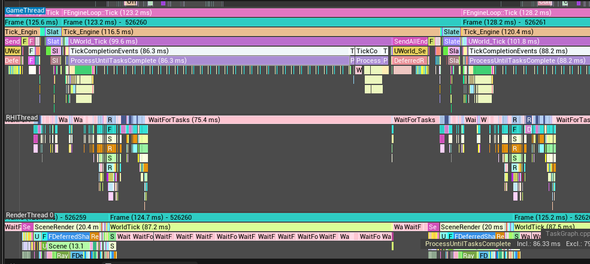

# Chaos Vehicle 다중 탱크 성능 디버깅 보고서

UE 5.7 / BP_M1A2 (Chaos Vehicle) / TankSTDriver (C++ AI 제어)  
측정 환경: 단일 클라이언트, PIE, Windows 11

---

## 1. 성능 벤치마크

`stat unit` 기준 탱크 수별 측정.

| TankCount | FPS | Frame (ms) | Game (ms) | Draw (ms) | RHIT (ms) | GPU (ms) | Input (ms) | Mem (GB) | Draws | Prims |
|-----------|-----|-----------|----------|----------|----------|---------|-----------|---------|-------|-------|
| 1  | 68 | 14  | 14  | 10 | 7  | 4  | 13  | 4.36 | 273  | 405K  |
| 5  | 33 | 29  | 29  | 11 | 9  | 6  | 31  | 4.41 | 472  | 899K  |
| 10 | 21 | 47  | 47  | 14 | 10 | 17 | 58  | 4.50 | 672  | 1385K |
| 15 | 15 | 65  | 65  | 17 | 11 | 21 | 83  | 4.54 | 1038 | 3355K |
| 20 | 11 | 86  | 86  | 20 | 14 | 31 | 146 | 4.62 | 1169 | 2789K |
| 30 | 8  | 122 | 122 | 28 | 17 | 36 | 185 | 4.86 | 1752 | 4165K |

**관찰:**
- `Frame == Game` 항상 일치 → 게임 스레드가 병목
- 탱크당 추가 비용: **~3.7ms (선형, O(N))**
- GPU는 최대 36ms — 프레임 시간 대비 여유 있음

---

## 2. stat chaos — Chaos 물리 솔버

`stat chaos` 명령으로 측정한 Physics Tick 비용.

| TankCount | Physics Tick InclusiveAvg |
|-----------|--------------------------|
| 1  | 0.68ms |
| 5  | 1.15ms |
| 10 | 1.31ms |
| 15 | 1.58ms |
| 20 | 1.96ms |
| 30 | 2.63ms |

**관찰:**
- 30대 기준 Chaos 솔버 총합 **~2.63ms** — 전체 122ms의 2.1%
- 스케일링: **준선형** (배칭 있음, 탱크당 한계비용 ~0.07ms)
- **Chaos 물리 솔버는 병목 아님 (확인)**

---

## 3. 렌더링 병목 여부 검증

### 3-1. 에디터 vs PIE 비교
| 상태 | FPS | 조건 |
|------|-----|------|
| 에디터 (BeginPlay 없음) | 70+ | 탱크 30대 배치, Lumen·그림자 활성화 |
| PIE (BeginPlay 후) | 7~8 | 탱크 30대 활성화 |

렌더링 품질 설정은 동일. 차이는 오직 탱크 시뮬레이션 활성화 여부.

### 3-2. 추가 테스트
| 테스트 | 결과 |
|--------|------|
| `r.Shadow.Virtual.Enable 0` (그림자 비활성화) | FPS 변화 없음 |
| `r.SkinCache.Mode 0` (GPU 스키닝 → CPU) | FPS 변화 없음 |
| 카메라를 탱크 반대 방향으로 (프러스텀 컬링) | FPS 변화 없음 |

**결론: 렌더링, 그림자, Lumen, GPU 스키닝은 병목 원인 아님 (확인)**

---

## 4. Unreal Insights 분석

트레이스 수집: PIE 30대 실행 중 `Trace.Start default,cpu,frame` → `Trace.Stop`  
파일: `Saved/Profiling/*.utrace`

### 4-1. Timers 패널 — 주요 항목 (30대 기준)

| 항목 | 비용 | 비고 |
|------|------|------|
| **ProcessUntilTasksComplete (Excl)** | **~83ms** | 게임 스레드 stall — 원인 미확정 |
| USceneComponent::UpdateOverlaps | 7.0ms (1979 calls) | 이동 탱크 충돌 오버랩 갱신 |
| USkeletalMeshComponent_CompleteParallelAnimationEvaluation | 4.9ms | 애니메이션 완료 |
| Niagara | 3.8ms | 엔진 파티클 |
| FActorComponentTickFunction::ExecuteTick | 3.6ms | 컴포넌트 틱 |
| Chaos_PhysicsParallelFor | 0.5ms | 물리 |
| **K2Node (Blueprint VM)** | **0ms** | Blueprint 로직은 병목 아님 (확인) |

### 4-2. ProcessUntilTasksComplete 분석

`UWorld_Tick → TickCompletionEvents → ProcessUntilTasksComplete` 구조.

**Callees (ProcessUntilTasksComplete 내부에서 실행되는 것):**

| Callee | Count | Incl |
|--------|-------|------|
| USkeletalMeshComponent_CompleteParallelAnimationEvaluation | 31 | 4.9ms |
| USceneComponent::UpdateOverlaps | 961+1018 | 7.0ms |
| FActorComponentTickFunction::ExecuteTick | 218 | 3.6ms |
| WaitForTasks | 1 | 2.4ms |
| UInstancedStaticMeshComponent::CalcBoundsImpl | 480 | 0.5ms |

- Callees 합계: ~18ms
- ProcessUntilTasksComplete Excl: **83ms** (순수 대기/스핀)
- 83ms 동안 TaskGraph Worker 행: **대부분 idle (sparse tasks)**

### 4-3. Timeline — Worker 행

- GameThread: ProcessUntilTasksComplete 85ms 블록
- RHIThread: WaitForTasks ~75-89ms
- RenderThread: WorldTick (99ms) 내에서 WaitForTasks **~6.5ms × 13회 반복**
- TaskGraph Worker #0, #1: **대부분 idle**, sparse한 작은 태스크만 존재

---

## 5. 확인된 사실 요약

| 항목 | 결론 |
|------|------|
| Chaos 물리 솔버 | 병목 아님 (2.63ms) |
| Blueprint VM | 병목 아님 (0ms) |
| 애니메이션 평가 | 병목 아님 (4.9ms) |
| 컴포넌트 틱 | 병목 아님 (3.6ms) |
| Niagara | 병목 아님 (3.8ms) |
| 렌더링 / 그림자 / Lumen | 병목 아님 (컬링·비활성화 테스트 무효) |
| **ProcessUntilTasksComplete 83ms stall** | **원인 미확정** |

---

## 6. 미해결 사항

- ProcessUntilTasksComplete 83ms stall의 정확한 원인
  - TaskGraph Worker가 idle인데 게임 스레드가 무엇을 기다리는지 미확정
  - RenderThread도 동일한 stall 패턴 (ProcessUntilTasksComplete ~86ms)
- BeginPlay 전후 유일한 차이: 탱크 시뮬레이션 활성화 (SetSimulatePhysics, VehiclePossessed)

---

## 7. stat chaos / stat physics 탱크 수별 상세 데이터

각 탱크 수에서 `stat chaos` + `stat physics` + `stat unit` 동시 측정.

### 7-1. 스크린샷

| TankCount | 스크린샷 |
|-----------|---------|
| 1  |  |
| 5  |  |
| 10 |  |
| 15 |  |
| 20 |  |
| 30 |  |

### 7-2. stat unit 수치

| TankCount | FPS | Frame (ms) | Game (ms) | Draw (ms) | RHIT (ms) | GPU (ms) | Input (ms) | Draws | Prims |
|-----------|-----|-----------|----------|----------|----------|---------|-----------|-------|-------|
| 1  | 56.01 | 17.32 | 17.35 | 11.52 | 8.53  | 5.09  | 14.10  | 341  | 414.2K  |
| 5  | 30.23 | 32.79 | 32.75 | 17.80 | 10.55 | 8.14  | 43.86  | 823  | 913.9K  |
| 10 | 19.50 | 51.59 | 50.60 | 19.30 | 11.50 | 6.56  | 52.82  | 904  | 1287.7K |
| 15 | 14.45 | 68.30 | 68.48 | 21.43 | 12.31 | 18.52 | 85.41  | 1190 | 1767.3K |
| 20 | 11.31 | 87.08 | 87.78 | 25.13 | 14.74 | 26.98 | 140.64 | 1508 | 2758.8K |
| 30 |  8.08 | 128.26| 123.40| 29.77 | 17.83 | 25.42 | 180.18 | 1909 | 3927.9K |

> 이 측정은 별도 실행으로, PIE 창 크기가 달라 Draw/GPU 수치가 벤치마크(섹션 1)와 다소 차이 있음.

### 7-3. stat chaos — Physics Tick 주요 서브항목 (InclusiveAvg)

| 항목 | 1대 | 5대 | 10대 | 15대 | 20대 | 30대 |
|------|-----|-----|------|------|------|------|
| **Physics Tick** | 0.68 | 1.15 | 1.31 | 1.58 | 1.96 | 2.63 |
| Evolution/Kinematic | 0.35 | 0.49 | 0.51 | 0.55 | 0.61 | 0.81 |
| AdvanceOneTimeStep | 0.34 | 0.48 | 0.50 | 0.54 | 0.60 | 0.81 |
| FChaosSceneSimCallback | 0.16 | 0.26 | 0.27 | 0.37 | 0.49 | 0.58 |
| Sync Pull Results | 0.04 | 0.11 | 0.18 | 0.26 | 0.34 | 0.49 |
| Process Single Particle Proxies | 0.03 | 0.10 | 0.16 | 0.23 | 0.32 | 0.45 |
| BufferPhysicsResults | 0.03 | 0.06 | 0.09 | 0.14 | 0.19 | 0.28 |
| ParallelSolve | 0.13 | 0.18 | 0.19 | 0.19 | 0.21 | 0.27 |

단위: ms

### 7-4. stat chaos — CallCount 스케일링

| 항목 | 1대 | 5대 | 10대 | 15대 | 20대 | 30대 | 패턴 |
|------|-----|-----|------|------|------|------|------|
| OnSyncBodies (call) | 46 | 142 | 262 | 382 | 502 | 726 | 선형 (~24/대) |
| ParticlesParallelFor (call) | 4 | 12 | 33 | 63 | 122 | 242 | **준2차** |
| ParticlesSequentialFor (call) | 2 | 10 | 31 | 61 | 120 | 240 | **준2차** |

### 7-5. stat physics — CallCount 스케일링

| 항목 | 1대 | 5대 | 10대 | 15대 | 20대 | 30대 | 패턴 |
|------|-----|-----|------|------|------|------|------|
| Phys SetBodyTransform (call) | 3 | 15 | 30 | 45 | 60 | 84 | 선형 (3/대) |
| Query PhysicalMaterialMask Hit (call) | 15 | 71 | 141 | 190 | 262 | 397 | 선형 (~13/대) |
| SyncBodies (ms) | 0.06 | 0.13 | 0.21 | 0.29 | 0.40 | 0.56 | 선형 |
| CreateExternalAccelerationStructure (ms) | 0.01 | 0.03 | 0.05 | 0.07 | 0.09 | 0.12 | 선형 |

### 7-6. 분석

**선형 스케일링 항목 (탱크당 고정 비용):**
- `Phys SetBodyTransform`: 정확히 3회/대 → chassis + 좌우 트랙 또는 포탑 3개 바디
- `Query PhysicalMaterialMask Hit`: ~13회/대 → 휠 서스펜션 레이캐스트 (4휠 × 3~4회)
- `OnSyncBodies`: ~24회/대 → 탱크 1대당 물리 바디 수 (휠 포함)
- `SyncBodies` ms: 탱크당 ~0.017ms

**준2차 스케일링 항목 (주목):**
- `ParticlesParallelFor` / `ParticlesSequentialFor`: 1대→30대에서 60배 증가 (탱크는 30배)
- 이는 Chaos 내부 브로드페이즈 충돌 검사에서 파티클(강체)들 간 O(N²) 상호작용이 발생하기 때문
- 30대에서 242 call — 탱크끼리 근접 배치 시 더 심화됨

**결론:**
- Chaos Vehicle 솔버 자체는 O(N) 선형 또는 준선형
- 전체 Physics Tick (30대 기준 2.63ms)은 122ms 프레임의 2.2%에 불과
- 물리 솔버는 병목 아님 (확인)
