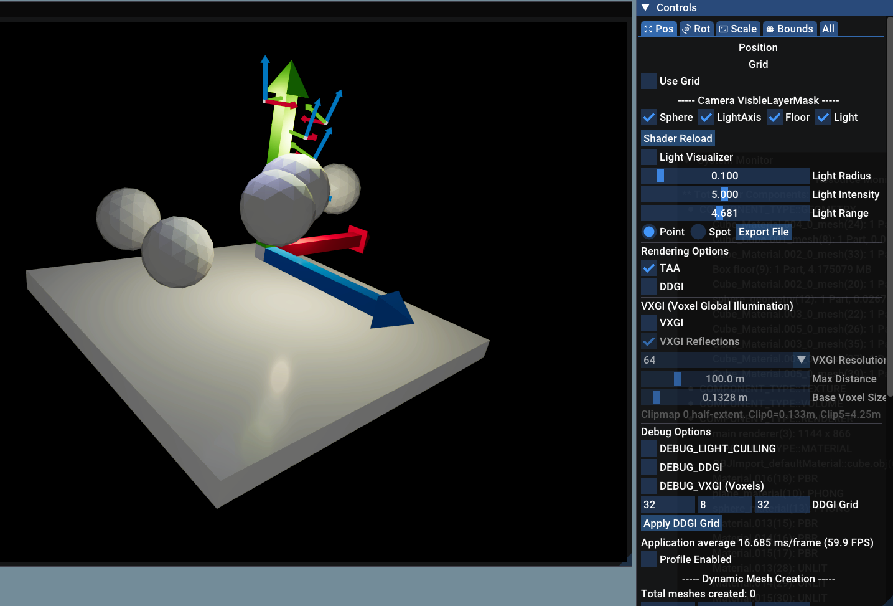
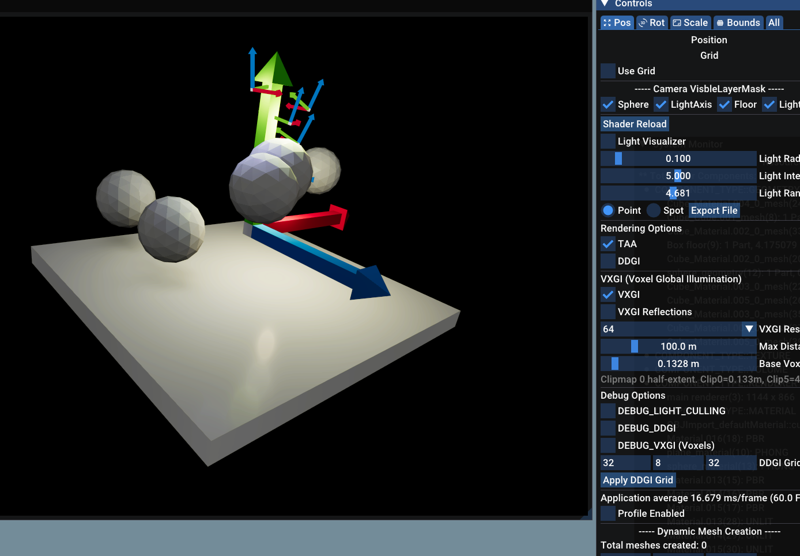
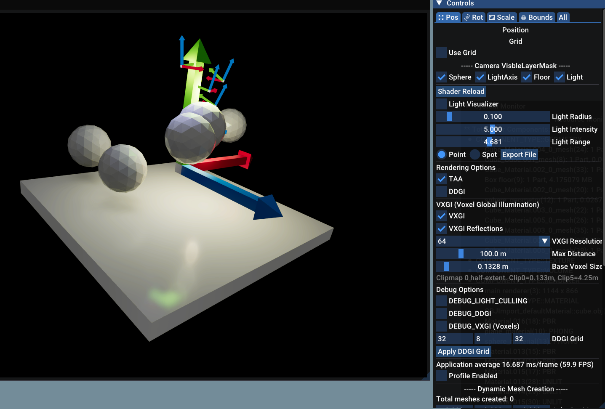
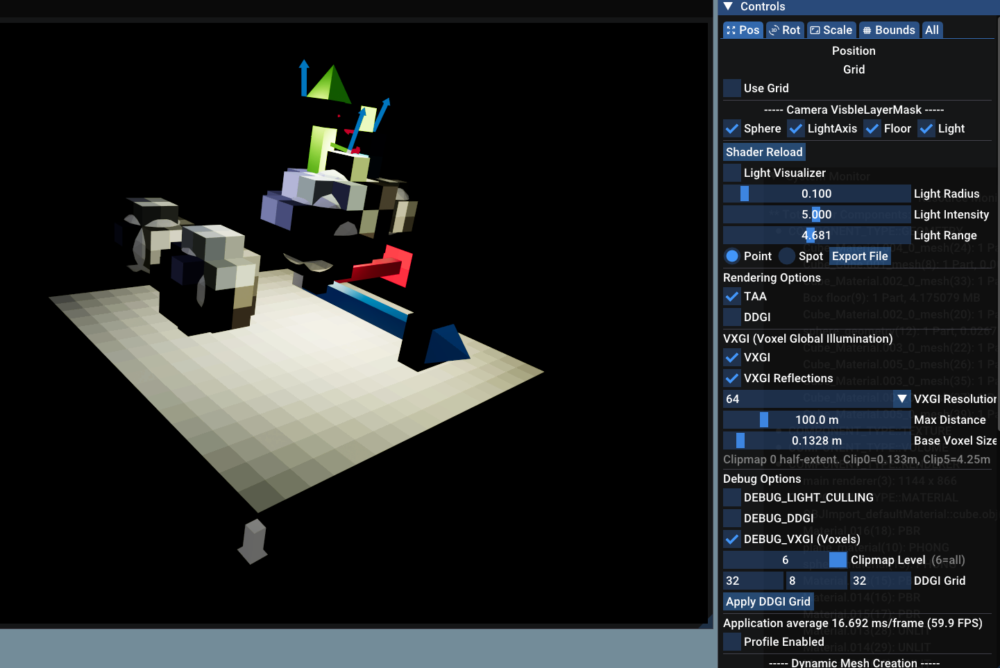
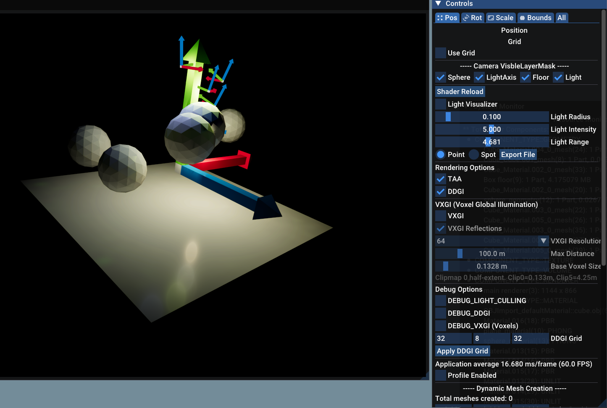

# VizMotive Engine VXGI 구현 분석

> VXGI 이론 및 Wicked Engine 원본 구현 분석: [voxelGI.md](https://github.com/insung52/Wicked-engine-Deep-Dive/blob/main/voxelGI/voxelGI.md)

커밋 `49e845e` ("add vxgi") 기준으로 분석한 VizMotive Engine의 VXGI 구현입니다.

### 원본 scene



### voxelGI 활성화



### voxelGI + Reflections 활성화



### voxelGI debug 활성화



### DDGI 활성화 (비교용)



---

## 1. 개요

VXGI는 복셀 기반 Cone Tracing으로 실시간 GI를 계산하는 시스템입니다.
씬을 복셀 그리드로 래스터화하고, 각 표면에서 복셀 텍스처를 향해 원뿔(cone)을 쏘아 간접광을 근사합니다.

**주요 특징:**
- **6단계 Clipmap 캐스케이드** — 각 단계마다 voxelSize 2배씩 증가 (카메라 근거리~원거리 커버)
- **Anisotropic 6면 radiance** — ±X/Y/Z 방향별로 독립 radiance 저장
- **16개 Diffuse cone 방향 프리컴퓨팅** — temporal CS에서 미리 가중치 합산 저장
- **Temporal Blending** (BLEND_SPEED = 0.05) — 프레임 간 안정성 확보
- **Jump Flood Algorithm(JFA) SDF** — specular cone의 empty space skipping
- **그리드 스크롤(Grid Scroll)** — 카메라 이동 시 복셀 그리드 오프셋 처리

---

## 2. GPU 텍스처 레이아웃

### 2.1 `texture_atomic` — 복셀화 원자 쓰기 버퍼

```
포맷: R32_UINT
크기: (6 × res,  res,  res × VOXELIZATION_CHANNEL_COUNT)
```

- **X축**: 6개 anisotropic face (face 0=+X, 1=-X, 2=+Y, 3=-Y, 4=+Z, 5=-Z)
- **Z축**: 13개 채널 슬라이스

```
VOXELIZATION_CHANNEL:
  [0] BASECOLOR_R    [1] BASECOLOR_G    [2] BASECOLOR_B    [3] BASECOLOR_A
  [4] EMISSIVE_R     [5] EMISSIVE_G     [6] EMISSIVE_B
  [7] DIRECTLIGHT_R  [8] DIRECTLIGHT_G  [9] DIRECTLIGHT_B
  [10] NORMAL_R      [11] NORMAL_G
  [12] FRAGMENT_COUNTER
```

각 채널에 `InterlockedAdd`로 값을 누적하고, 마지막에 `FRAGMENT_COUNTER`로 나눠 평균.

---

### 2.2 `texture_radiance` — 최종 GI 소스 (Cone Tracing 대상)

```
포맷: R16G16B16A16_FLOAT (half4)
크기: ((6 + DIFFUSE_CONE_COUNT) × res,  VXGI_CLIPMAP_COUNT × res,  res)
     = (22 × res,  6 × res,  res)  [DIFFUSE_CONE_COUNT=16 기준]
```

- **X축 앞 6개**: anisotropic face radiance
- **X축 이후 16개**: 프리컴퓨팅된 diffuse cone 방향별 가중치 합산 슬라이스
- **Y축**: clipmap 인덱스 × res 오프셋으로 6개 clipmap 수직 배치

---

### 2.3 `texture_radiance_prev` — 이전 프레임 시프트 버퍼 (Ping-Pong)

- `texture_radiance`와 동일한 포맷/크기
- `offsetprevCS`가 그리드 스크롤 오프셋을 반영해 기록
- `temporalCS`가 읽기 전용으로 사용 → race condition 없음

---

### 2.4 `texture_sdf` / `texture_sdf_temp` — Signed Distance Field

```
포맷: R16_FLOAT
크기: (res,  VXGI_CLIPMAP_COUNT × res,  res)
```

- specular cone tracing의 empty space skipping에 사용
- `texture_sdf_temp`: JFA ping-pong 중간 버퍼

---

## 3. Clipmap 시스템

### 3.1 구조 정의 (`Scene_Detail.h`)

```cpp
struct ClipMap {
    XMFLOAT3 center;            // 월드 좌표 기준 clipmap 중심
    float voxelSize;            // 복셀 반경 (half-extent)
    int3 offsetfromPrevFrame;   // 그리드 스크롤 오프셋
} clipmaps[6];
```

복셀 스케일:
```
Clipmap 0: voxelSize = baseVoxelSize        (기본 0.125m)
Clipmap 1: voxelSize = baseVoxelSize × 2
...
Clipmap k: voxelSize = baseVoxelSize × 2^k
```

---

### 3.2 Center 스냅핑 (`SceneUpdate_Detail.cpp`)

카메라 이동 시 texelSize 단위로 스냅:

```cpp
float texelSize = voxelSize * 2.0f;  // full voxel size
newCenter = {
    floor(camEye.x / texelSize) * texelSize,
    floor(camEye.y / texelSize) * texelSize,
    floor(camEye.z / texelSize) * texelSize
};
```

---

### 3.3 Grid Scroll Offset 부호 규약

```cpp
offsetfromPrevFrame = {
    round((newCenter.x - prevCenter.x) / texelSize),   // X: new - prev
    round((prevCenter.y - newCenter.y) / texelSize),   // Y: prev - new  ← Y축 반전!
    round((newCenter.z - prevCenter.z) / texelSize)    // Z: new - prev
};
```

Y축만 부호가 반전되는 이유: 텍스처 좌표계에서 Y축이 월드 좌표계와 반대 방향이기 때문.

**`offsetprevCS`에서의 사용:**
```hlsl
// 현재 복셀 DTid의 이전 프레임 위치
int3 prev_dtid = (int3)DTid + push.offsetfromPrevFrame;
```

---

### 3.4 Round-Robin 업데이트

매 프레임 하나의 clipmap 레벨만 업데이트합니다:
```cpp
vxgi.clipmap_to_update = (vxgi.clipmap_to_update + 1) % VXGI_CLIPMAP_COUNT;
```
→ 6프레임 후 모든 clipmap이 갱신 완료.

---

## 4. 렌더 파이프라인 (`GI_Detail.cpp: Update_VXGI`)

매 프레임 아래 순서로 실행됩니다:

```
┌─────────────────────────────────────────────────────────────────────────────┐
│ A. Clear Atomic                                                             │
│    texture_atomic → UAV → ClearUAV(0)                                       │
│                                                                             │
│    이번 프레임 복셀화 결과를 새로 쌓기 위해 atomic 버퍼를 전부 0으로 초기화.         │
├─────────────────────────────────────────────────────────────────────────────┤
│ B. offsetprevCS  (그리드 스크롤 시프트)                                        │
│    입력: t0 = texture_radiance    (SR)                                       │
│    출력: u0 = texture_radiance_prev (UAV)                                    │
│                                                                             │
│    카메라가 이동하면 복셀 그리드도 스냅 이동한다. 이전 프레임 radiance를            │
│    offsetfromPrevFrame만큼 좌표 시프트해서 prev 버퍼에 복사.                    │
│    그리드 밖으로 밀려난 복셀은 0으로 초기화해 ghost를 방지.                       │
├─────────────────────────────────────────────────────────────────────────────┤
│ C. Voxelize  (래스터라이즈)                                                   │
│    DrawScene(RENDERPASS_VOXELIZE)                                           │
│    출력: u0 = texture_atomic  (UAV, 원자 쓰기)                                │
│                                                                             │
│    씬 메시를 복셀 해상도로 래스터화. Pixel Shader에서 각 복셀에 해당하는            │
│    basecolor, emissive, direct light 값을 InterlockedAdd로 원자적 누적.       │
│    GS가 XY/YZ/ZX 3축 중 투영 면적이 최대인 축으로 방향을 선택.                    │
├─────────────────────────────────────────────────────────────────────────────┤
│ D. temporalCS  (Temporal Blend)                                             │
│    입력: t0 = texture_radiance_prev (SR)                                     │
│            t1 = texture_atomic      (SR)                                    │
│    출력: u0 = texture_radiance      (UAV)                                    │
│                                                                             │
│    atomic 버퍼의 누적값을 fragment count로 나눠 평균 radiance를 계산.            │
│    geometry가 있으면 prev와 lerp(BLEND_SPEED=0.05)로 temporal 안정화.          │
│    geometry가 없으면 0으로 즉시 초기화 (메시 이동 시 ghost 방지).                 │
│    anisotropic 6면 외에 diffuse cone 슬라이스 16개도 함께 프리컴퓨팅.            │
├─────────────────────────────────────────────────────────────────────────────┤
│ E. SDF JFA                                                                  │
│    Init 패스: texture_radiance alpha → texture_sdf                           │
│    JFA 패스: step = res/2 → ... → 1  (ping-pong)                             │
│    출력: texture_sdf (SR)                                                    │
│                                                                             │
│    specular cone tracing의 empty space skipping용 SDF를 생성.                 │
│    radiance alpha > 0.1인 복셀을 filled(=0), 나머지를 empty(=res)로 초기화한    │
│    뒤, JFA로 각 복셀에서 가장 가까운 geometry까지의 거리를 전파.                  │
└─────────────────────────────────────────────────────────────────────────────┘
SR (Shader Resource View, 읽기전용)
UAV (Unordered Access View, 읽기 + 쓰기)
```

이후 `Renderer.cpp`에서:
```
F. vxgi_resolve_diffuseCS
   입력: t0 = depthBuffer_Copy,  t1 = texture_normals
   출력: rtVXGI_diffuse (UAV) — 스크린 공간 GI 결과

   스크린 각 픽셀의 depth/normal로 월드 좌표를 복원한 뒤,
   해당 위치에서 ConeTraceDiffuse를 호출해 2D 텍스처에 GI 결과를 기록.
```

---

## 5. 각 셰이더 상세 분석

파이프라인 실행 순서(B→C→D→E→F)에 맞춰 정리합니다.

---

### 5.1 `vxgi_offsetprevCS.hlsl` — 그리드 시프트 (B)

```hlsl
int3 prev_dtid = (int3)DTid + push.offsetfromPrevFrame;
bool is_new = !all(prev_dtid >= 0) || !all(prev_dtid < (int)res);

for (uint i = 0; i < 6 + DIFFUSE_CONE_COUNT; ++i) {
    uint3 dst = uint3(DTid.x + i * res, DTid.y + clip * res, DTid.z);

    if (is_new)
        output_prev[dst] = (half4)0;  // 새 복셀 → 0으로 초기화 (ghosting 방지)
    else {
        uint3 src = uint3(prev_dtid.x + i * res, prev_dtid.y + clip * res, prev_dtid.z);
        output_prev[dst] = input_radiance[src];
    }
}
```

---

### 5.2 `meshPS_voxelizer.hlsl` — 복셀화 픽셀 셰이더 (C)

- Geometry Shader가 3축 중 가장 면적이 큰 축으로 투영 방향 선택
- ForwardLighting으로 direct light 계산 후 `VoxelAtomicAverage`로 원자 쓰기:

```hlsl
// 채널별로 값 누적, FRAGMENT_COUNTER에 카운트 누적
InterlockedAdd(output_atomic[ac + BASECOLOR_R], PackVoxelChannel(color.r * frag));
InterlockedAdd(output_atomic[ac + FRAGMENT_COUNTER], 1);
```

- `DISABLE_VOXELGI` 정의로 voxelizer 내부에서 재귀 VoxelGI 호출 차단

---

### 5.3 `vxgi_temporalCS.hlsl` — Temporal Blend (D)

**1단계: atomic 데이터 언패킹 (면별 평균)**

```hlsl
float inv = 1.0f / (float)frag;
float3 basecolor  = float3(UnpackVoxelChannel(R), ...) * inv;
float3 directlight = float3(UnpackVoxelChannel(DR), ...) * inv;
float3 emissive    = float3(UnpackVoxelChannel(ER), ...) * inv;
float alpha        = UnpackVoxelChannel(A) * inv;

float4 newVal = float4(basecolor * directlight + emissive, alpha);
```

**2단계: Temporal blend**

```hlsl
const float BLEND_SPEED = 0.05f;
float4 prev = (float4)input_prev_radiance[oc];
radiance = (half4)lerp(prev, newVal, BLEND_SPEED);
```

geometry가 없는 복셀은 즉시 `0`으로 초기화합니다.
prev_radiance를 보존하면 메시가 이동한 경로에 ghost 복셀이 영구 잔류하는 문제가 생깁니다.
Wicked Engine도 동일하게 `radiance = 0` 처리합니다.

**3단계: Diffuse cone 슬라이스 프리컴퓨팅**

```hlsl
// 로컬 aniso_colors[6]에서 cone 방향 가중치 합산
for (uint ci = 0; ci < DIFFUSE_CONE_COUNT; ci++) {
    float3 weights = abs(DIFFUSE_CONE_DIRECTIONS[ci]);
    sam = aniso_colors[face_x] * weights.x
        + aniso_colors[face_y] * weights.y
        + aniso_colors[face_z] * weights.z;
    output_radiance[DTid + (6 + ci) * res] = sam;
}
```

---

### 5.4 `vxgi_sdf_jumpfloodCS.hlsl` — SDF 생성 (E)

**Init 패스** (`isInit = true`):
```hlsl
half4 rad = input_radiance[rad_coord];
output_sdf[sdf_coord] = rad.a > 0.1h ? 0.0f : (float)res;
// filled voxel = 0, empty = res (최대 거리)
```

**JFA 패스** (`step = res/2 → 1`):
```hlsl
float minDist = input_sdf[sdf_coord];
for (dz=-1..1) for (dy=-1..1) for (dx=-1..1) {
    int3 neighbor = (int3)DTid + int3(dx,dy,dz) * step;
    float d = input_sdf[neighbor] + length(float3(dx,dy,dz) * step);
    if (d < minDist) minDist = d;
}
// 복셀 단위 → 월드 공간 변환
output_sdf[sdf_coord] = minDist * clipmap.voxelSize * 2.0f;
```

ping-pong: `texture_sdf` ↔ `texture_sdf_temp` 스왑.

---

### 5.5 `vxgi_resolve_diffuseCS.hlsl` — 스크린 GI 계산 (F)

스크린 각 픽셀에서 depth/normal을 읽어 월드 좌표를 복원한 뒤 `ConeTraceDiffuse`를 호출합니다:

```hlsl
float2 uv = ((float2)DTid.xy + 0.5f) * GetCamera().internal_resolution_rcp;
float4 clipPos = float4(uv * float2(2, -2) + float2(-1, 1), depth, 1);
float4 worldPos = mul(GetCamera().inverse_view_projection, clipPos);
float3 P = worldPos.xyz / worldPos.w;

float3 N = normalize((float3)decode_oct((half2)input_normal[DTid.xy].xy));

Texture3D<half4> voxels = bindless_textures3D_half4[descriptor_index(GetFrame().vxgi.texture_radiance)];
float4 result = ConeTraceDiffuse(voxels, P, N);
output[DTid.xy] = (half4)result;
```

---

### 5.6 `voxelConeTracingHF.hlsli` — Cone Tracing 핵심 (헬퍼)

F 단계에서 호출되며, 조각 셰이더의 `VoxelGI()`에서도 직접 사용합니다.

#### Self-occlusion 방지 (startVoxelSize)

P가 속한 clipmap의 실제 voxelSize로 startPos 오프셋을 결정합니다:

```hlsl
float startVoxelSize = voxelSize0;
for (uint ci = 0; ci < VXGI_CLIPMAP_COUNT; ++ci) {
    if (is_saturated(world_to_clipmap(P, clipmaps[ci]))) {
        startVoxelSize = clipmaps[ci].voxelSize * 2;
        break;
    }
}
float3 startPos = P + N * startVoxelSize;
// dist는 항상 voxelSize0 유지 → lod 계산 기준 일관성 보장
float dist = voxelSize0;
```

#### LOD 계산

```hlsl
float diameter = max(voxelSize0, coneCoefficient * dist);
float lod = clamp(log2(diameter * voxelSize0_rcp), clipmap_index0, VXGI_CLIPMAP_COUNT - 1);
float clipmap_blend = frac(lod);

// clipmap 경계에서 두 레벨을 blending
float4 sam = SampleVoxelClipMap(..., floor(lod), ...);
if (clipmap_blend > 0 && clipmap_index < VXGI_CLIPMAP_COUNT - 1)
    sam = lerp(sam, SampleVoxelClipMap(..., floor(lod) + 1, ...), clipmap_blend);
```

#### Anisotropic 샘플링

```hlsl
float3 face_offsets = float3(
    aniso_direction.x > 0 ? 0 : 1,
    aniso_direction.y > 0 ? 2 : 3,
    aniso_direction.z > 0 ? 4 : 5
) / (6.0 + DIFFUSE_CONE_COUNT);

sam =
    voxels.SampleLevel(..., tc + face_offsets.x, ...) * direction_weights.x +
    voxels.SampleLevel(..., tc + face_offsets.y, ...) * direction_weights.y +
    voxels.SampleLevel(..., tc + face_offsets.z, ...) * direction_weights.z;
```

Diffuse cone은 precomputed_direction을 이용해 1회 샘플로 대체:
```hlsl
uint precomputed_direction = 6 + i;
// SampleVoxelClipMap에서 precomputed_direction != 0이면 단순 tc 샘플
```

#### Correction

```hlsl
sam *= step_dist / clipmap.voxelSize;
```

#### Front-to-Back 블렌딩

```hlsl
float a = 1 - alpha;
color += a * sam.rgb;
alpha += a * sam.a;
```

#### SDF Stepping (Specular)

```hlsl
float sdf = texture_sdf.SampleLevel(...).r;
stepSizeCurrent = max(stepSize, sdf - diameter);
step_dist = diameter * stepSizeCurrent;
```

---

## 6. GI 적용 (`lightingHF.hlsli` / `shadingHF.hlsli`)

```hlsl
// VoxelGI() in lightingHF.hlsli
half4 trace = (half4)ConeTraceDiffuse(voxels, surface.P, surface.N);
lighting.indirect.diffuse = mad(lighting.indirect.diffuse, 1 - trace.a, trace.rgb);
surface.SetGIApplied(true);

// Specular (OPTION_BIT_VXGI_REFLECTIONS_ENABLED 플래그 필요)
half4 traceSpec = (half4)ConeTraceSpecular(voxels, P, N, V, roughness, pixel);
lighting.indirect.specular = mad(lighting.indirect.specular, 1 - traceSpec.a, traceSpec.rgb);
```

**`shadingHF.hlsli` 변경사항:**
- 이전: opaque는 별도 패스, transparent만 `VoxelGI()` 직접 호출
- 현재: opaque/transparent 모두 `VoxelGI()` 직접 호출 (별도 패스 없음)

---

## 7. C++ 파일 구조

| 파일 | 역할 |
|------|------|
| `GI_Detail.cpp` | `Update_VXGI()` — A~E 전체 GPU 파이프라인 |
| `SceneUpdate_Detail.cpp` | Clipmap center 업데이트 + GPU 텍스처 생성/해제 |
| `RenderPath3D_Detail.cpp` | FrameCB VXGI 바인딩 + resolve diffuse CS dispatch |
| `Scene_Detail.h` | `GSceneDetails::VXGI` 구조체 |
| `Renderer.h` | `isVXGIEnabled`, `isVXGIReflectionsEnabled`, `VXGI_DEBUG_CLIPMAP` |
| `ShaderEngine.cpp` | 전역 변수 초기화 + config 파일에서 로드 |
| `ShaderLoader.cpp` | CSO 로드 등록 + `DEBUG_RENDERING_VOXEL` PSO 등록 |
| `DebugVisualizer_Detail.cpp` | 복셀 디버그 draw call |
| `Examples/Sample014/sample14.cpp` | ImGui UI |

---

## 8. 설정 파라미터

### Config 옵션 (ShaderEngine.cpp → config)

| Key | 타입 | 기본값 | 설명 |
|-----|------|--------|------|
| `VXGI_ENABLED` | bool | false | VXGI 전체 활성화 |
| `VXGI_REFLECTIONS_ENABLED` | bool | false | Specular cone tracing 활성화 |
| `VXGI_DEBUG_CLIPMAP` | int | 6 (전체) | 디버그 시각화 클립맵 선택 |

### Scene Option (SceneUpdate_Detail.cpp)

| Key | 설명 | 변경 시 |
|-----|------|---------|
| `VXGI_RESOLUTION` | 복셀 그리드 해상도 (8~256, 2의 거듭제곱) | GPU 텍스처 재생성 |
| `VXGI_MAX_DISTANCE` | Cone tracing 최대 거리 (m) | 즉시 반영 |
| `VXGI_BASE_VOXEL_SIZE` | Clipmap 0의 복셀 반경 (m, 기본 0.125) | GPU 텍스처 재생성 + clipmap 리셋 |

---

## 9. 알려진 이슈 및 제한 사항

| 이슈 | 원인 | 상태 |
|------|------|------|
| Clipmap 경계 밝기 불연속 | Clipmap 레벨별 self-occlusion 정도 차이 | startVoxelSize로 일부 완화, 완전 해결 미완, wicked engine 에서도 동일한 현상 존재 |
| 구 메시 복셀 커버리지 불완전 | Conservative Rasterization 미사용 | 근본 한계, 필요 시 `VOXELIZATION_CONSERVATIVE_RASTERIZATION_ENABLED` 활성화 |
| 빠른 씬 변화에 지연 | 6프레임 후 전체 클립맵 갱신 | Round-robin 구조의 근본 특성 |
