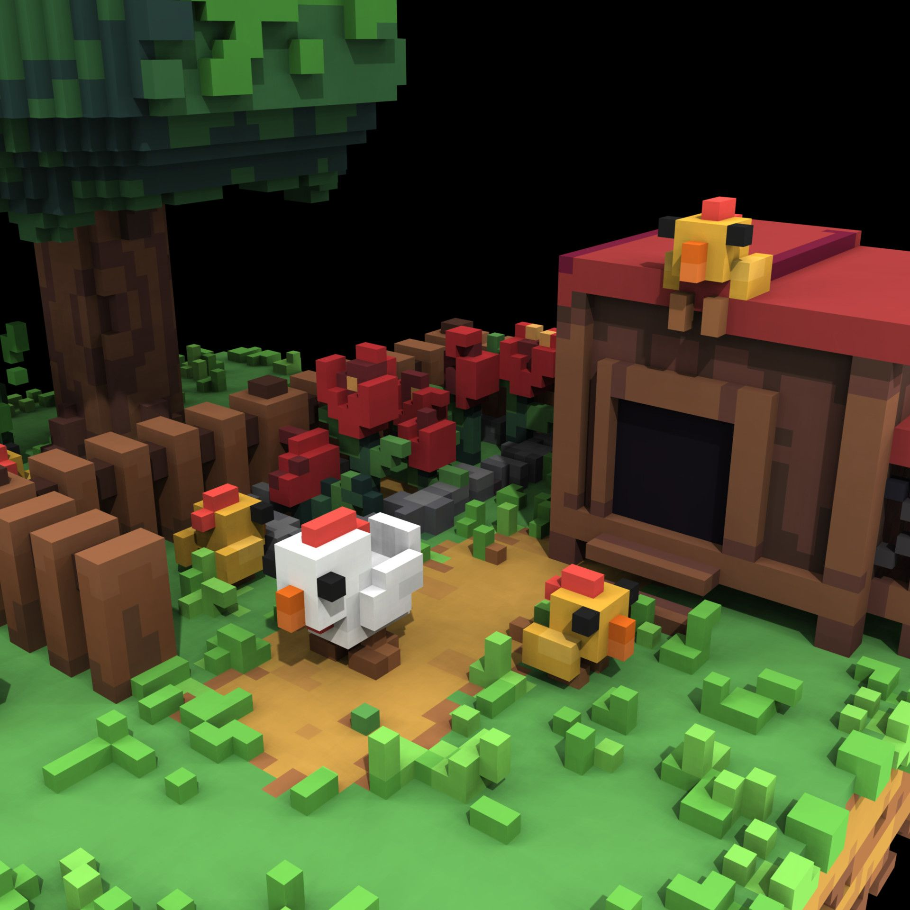

# voxel GI

# 0. 이론

## Voxel : Volumetric Pixel



definition : 3차원 공간에서 정규 격자 단위의 값을 나타내는 체적 요소

격자 형태로 배치됨

ex. MRI는 인체를 평면 단위로 스캔한 후 Voxel로 조합해 3D 구조를 재현함

🌐 Voxel GI란?

**Voxel GI**는 씬 전체를 **Voxel(3D 격자 단위)**로 나눈 뒤, 그 안에서 **빛의 확산과 반사**를 시뮬레이션해서 **간접광을 실시간으로 표현**하는 기술이야.

- **직접광**은 광원이 바로 비추는 빛이고,
- **간접광**은 표면에 반사되어 다른 곳을 비추는 빛인데,
- Voxel GI는 이 **간접광을 빠르게 계산**해서 현실적인 조명 효과를 만들어줘.

🔧 작동 방식 요약

1. **Voxelization**
씬의 지오메트리를 3D 격자(Voxel Grid)로 변환.
각 Voxel은 색상, 반사율, 투명도 같은 정보를 가짐.
2. **광원 주입(Light Injection)**
광원에서 나오는 빛을 Voxel에 주입.
직접광이 닿는 Voxel에 에너지를 저장함.
3. **빛 확산(Light Propagation)**
주입된 빛을 주변 Voxel로 퍼뜨림.
이 과정을 반복해서 간접광을 시뮬레이션.
4. **샘플링(Sampling)**
카메라에서 보이는 픽셀마다 Voxel 데이터를 샘플링해서 조명 계산.

Clipmap : 3d 공간을 다단계 해상도로 표현하는 텍스쳐 구조

# 1. 작동

## 간략한 Voxel GI pass 호출 과정

```glsl
// 매 프레임마다
  VXGI_Voxelize(scene, cmd);
  {
      1. Voxelization ✓         // 매 프레임
      2. Temporal Processing ✓  // 매 프레임
      3. SDF Jump Flood ✓       // 매 프레임
      4. Resolve Diffuse ✓      // 매 프레임
      5. Resolve Specular ✓     // 매 프레임
  }
    // ClipMap 업데이트는 로테이션
  scene.vxgi.clipmap_to_update = (scene.vxgi.clipmap_to_update + 1) % VXGI_CLIPMAP_COUNT;
```

매 프레임마다 하나의 clipmap 만 업데이트하여 최적화

wicked engine 은 deferred rendering 이용 → G-buffer 응용

## [0] 복셀 좌표계 구조

1. 논리적 복셀 좌표
- (0,0,0) ~ (resolution-1, resolution-1, resolution-1)
    - resolution : 64 기본값
    - 복셀 반지름 : 0.125 기본값, Editor 에서 조정 가능
- 예시: (64, 32, 127) - 64번째, 32번째, 127번째 복셀
- gpu thread 병렬 처리시 사용 (12번 thread 가 1,0,6 위치의 복셀 담당)
    
    ```glsl
    // cpu 에서 Dispatch
    // wiRenderer.cpp:9770, 9822, 9850
    device->Dispatch(scene.vxgi.res / 8, scene.vxgi.res / 8, scene.vxgi.res / 8, cmd);
    //               ↑ 64/8 = 8개     ↑ 64/8 = 8개     ↑ 64/8 = 8개 워크그룹
    
    // hlsl 코드에서
    [numthreads(8, 8, 8)]  // thread group 정의
    void main(uint3 DTid : SV_DispatchThreadID)  // 모든 복셀에서 실행
    {
    ```
    
    
    
1. 물리적 복셀 좌표 (Physical Voxel Coordinate)
    - 기준: 3D 텍스처의 실제 메모리 주소
    - (0,0,0) ~ (resolution * 22, resolution * 6, resolution)
    - 단위: 텍셀 인덱스
    - 예시:
    논리적 (10, 20, 30) → 물리적 (266, 148, 390)
    // X: 10 + 2**128 = 266 (방향 오프셋)
    // Y: 20 + 1**128 = 148 (clipmap 레벨 오프셋)
    // Z: 30 * 13 = 390 (채널 오프셋)
    
    
    
2. ClipMap 좌표계
    - 기준: 정규화된 [0,1] 범위
    - 중심: ClipMap의 center (월드 좌표 기준 카메라 위치)
    - 범위: [0,1] × [0,1] × [0,1]
    - 단위: 정규화된 비율

복셀 그리드는 양자화 되어 중심 좌표가 카메라와 함께 움직임

1. 카메라가 조금 움직인 경우

프레임 1: 카메라 (100.0, 200.0, 300.0) → clipmap 중심 (100.0, 200.0, 300.0)
프레임 2: 카메라 (100.3, 200.1, 300.2) → clipmap 중심 (100.0, 200.0, 300.0) // 변화 없음!

offsetfromPrevFrame = (0, 0, 0)  // 복셀 그리드 위치 변화 없음
→ 모든 복셀이 1:1 대응됨

1. 카메라가 texelSize 이상 움직인 경우

프레임 1: 카메라 (100.0, 200.0, 300.0) → clipmap 중심 (100.0, 200.0, 300.0)
프레임 2: 카메라 (101.0, 200.0, 300.0) → clipmap 중심 (101.0, 200.0, 300.0) // 변화!

offsetfromPrevFrame = (복셀단위로, 0, 0)  // 그리드가 시프트됨

구체적인 예시

그리드 시프트 상황

이전 프레임 복셀 그리드:

     0 1 2 3 4
    ┌─┬─┬─┬─┬─┐
    │0│1│2│3│4│
    └─┴─┴─┴─┴─┘


현재 프레임 복셀 그리드 (1칸 오른쪽으로 시프트):

     1 2 3 4 5
    ┌─┬─┬─┬─┬─┐
    │0│1│2│3│4│
    └─┴─┴─┴─┴─┘

이전 프레임의 복셀 1 → 현재 프레임의 복셀 0에 대응
이전 프레임의 복셀 2 → 현재 프레임의 복셀 1에 대응

```glsl
// wiScene.cpp:799-801
// 1. 새로운 중심점 계산 (카메라 위치 기반)
const float texelSize = clipmap.voxelsize * 2;
XMFLOAT3 center = XMFLOAT3(
    std::floor(camera.Eye.x / texelSize) * texelSize,
    std::floor(camera.Eye.y / texelSize) * texelSize,
    std::floor(camera.Eye.z / texelSize) * texelSize
);

// 2. 이전 중심점과의 차이 계산 및  gpu 전달 (시프트량)
clipmap.offsetfromPrevFrame.x = int((clipmap.center.x - center.x) / texelSize);
clipmap.offsetfromPrevFrame.y = -int((clipmap.center.y - center.y) / texelSize);  // Y축 뒤집기
clipmap.offsetfromPrevFrame.z = int((clipmap.center.z - center.z) / texelSize);

// 3. 새로운 중심점으로 업데이트
clipmap.center = center;
```

복셀 그리드 해상도 및 전체 크기는 고정값 (씬 크기에 따라 동적으로 변화x)

## [1] Voxelization

### Vertex Shader (objectVS_voxelizer.hlsl)

- 호출
    1. 최상위 호출: wiRenderPath3D.cpp:1243
    
    ```glsl
    // wiRenderPath3D.cpp:1239-1243
    if (wi::renderer::GetVXGIEnabled() && getSceneUpdateEnabled())
    {
    	cmd = device->BeginCommandList();
    	wi::jobsystem::Execute(ctx, [cmd, this](wi::jobsystem::JobArgs args) {
    		wi::renderer::VXGI_Voxelize(visibility_main, cmd);  // ← 여기서 시작
    	});
    }
    ```
    
    1. VXGI 복셀화 호출:
    
    ```glsl
    // wiRenderer.cpp:9680-9800
    void VXGI_Voxelize(const Visibility& vis, CommandList cmd)
    {
    	// 9690: GPU 이벤트 시작
    	device->EventBegin("VXGI - Voxelize", cmd);
      // 9694-9720: ClipMap 범위 내 오브젝트들을 renderQueue에 수집
      const Scene::VXGI::ClipMap& clipmap = scene.vxgi.clipmaps[scene.vxgi.clipmap_to_update];
      // ... 오브젝트 컬링 ...
      AABB bbox;
    	bbox.createFromHalfWidth(clipmap.center, clipmap.extents);
    	
    	renderQueue.init();
    	for (size_t i = 0; i < scene.aabb_objects.size(); ++i)
    	{
    		const AABB& aabb = scene.aabb_objects[i];
    		if (bbox.intersects(aabb))
    		{
    			const ObjectComponent& object = scene.objects[i];
    			if (object.IsRenderable() && (scene.vxgi.clipmap_to_update < (VXGI_CLIPMAP_COUNT - object.cascadeMask)))
    			{
    				renderQueue.add(object.mesh_index, uint32_t(i), 0, object.sort_bits);
    			}
    		}
    	}
    	
      // ...
      
    	#ifdef VOXELIZATION_GEOMETRY_SHADER_ENABLED
    	const uint32_t frustum_count = 1; // 메시 1번만 최적의 방향으로 렌더링
    	#else
    		const uint32_t frustum_count = 3; // 3개의 축 선택
    	#endif // VOXELIZATION_GEOMETRY_SHADER_ENABLED
      // 9800: 실제 메시 렌더링 (여기서 objectPS_voxelizer 실행!)
      RenderMeshes(vis, renderQueue, RENDERPASS_VOXELIZE, FILTER_OPAQUE, cmd, 0, frustum_count);
    }
    ```
    
    1. RenderMeshes 내부:
    
    ```glsl
    // wiRenderer.cpp:668-669
    // Shader 선택 로직
    case RENDERPASS_VOXELIZE:
    	realVS = VSTYPE_VOXELIZER;  // objectVS_voxelizer 선택
    	break;
    // GS, PS 도 동일
    ```
    
- 입력
    
    VertexInput 구조체
    
    ```glsl
    struct VertexInput  // objectHF.hlsli:118-209
      {
          uint vertexID : SV_VertexID;      // 현재 버텍스의 인덱스
          uint instanceID : SV_InstanceID;  // 현재 인스턴스의 인덱스
      }
    ```
    
    VertexInput은 실제 데이터를 저장하지 않고, vertexID와 instanceID만 가지고 있으면서 필요할 때 버텍스 버퍼에서 데이터를 로드하는 구조입니다.
    
- surface 데이터 생성 및 출력 설정
    
    ```glsl
    VSOut main(VertexInput input)
      {
          VertexSurface surface;
          surface.create(GetMaterial(), input);
          // Material 정보와 정점 데이터를 합쳐서 표면 속성 계산
    			
    			// 출력 설정
          VSOut Out;
          Out.pos = surface.position;  // 월드 공간 위치
          Out.color = surface.color;
          Out.uvsets = surface.uvsets;
          Out.N = surface.normal;
    ```
    
    VertexInput 은 현재 버텍스, 인스턴스의 인덱스만 가지고 있음.
    
    따라서 surface.create()를 통해 필요한 데이터 추출
    
    - VertexSurface.create()
        - 로컬 → 월드 변환
        - 정점 색상 x Material 색상, 버텍스 컬러 블렌딩
        - UV 좌표 처리
        - 법선 변환 로컬 → 월드
        - 모든 셰이더에서 동일한 방식으로 표면 속성 계산 (코드 재사용)
        
        ```glsl
        struct VertexSurface  // objectHF.hlsli:212-222
          {
              float4 position;    // 월드 공간 위치
              float4 uvsets;      // UV 좌표들
              float2 atlas;       // 아틀라스 좌표
              half4 color;        // 색상
              float3 normal;      // 법선
              float4 tangent;     // 탄젠트
              half ao;            // AO
              half wet;           // Wetmap
        
              inline void create(in ShaderMaterial material, in VertexInput input)
        			{
        				float4 pos_wind = input.GetPositionWind();
        				position = float4(pos_wind.xyz, 1);
        				normal = input.GetNormal();
        				color = half4(material.GetBaseColor() * input.GetInstance().GetColor());
        				color.a *= half(1 - input.GetInstancePointer().GetDither());
        		
        				[branch]
        				if (material.IsUsingVertexColors())
        				{
        					color *= input.GetVertexColor();
        				}
        		
        				[branch]
        				if (material.IsUsingVertexAO())
        				{
        					ao = input.GetVertexAO();
        				}
        				else
        				{
        					ao = 1;
        				}
        		
        				normal = mul(input.GetInstance().transformRaw.GetMatrixAdjoint(), normal);
        				normal = any(normal) ? normalize(normal) : 0;
        		
        				tangent = input.GetTangent();
        				tangent.xyz = mul(input.GetInstance().transformRaw.GetMatrixAdjoint(), tangent.xyz);
        				tangent.xyz = any(tangent.xyz) ? normalize(tangent.xyz) : 0;
        				
        				uvsets = input.GetUVSets();
        				uvsets.xy = mad(uvsets.xy, material.texMulAdd.xy, material.texMulAdd.zw);
        		
        				atlas = input.GetAtlasUV();
        		
        				position = mul(input.GetInstance().transform.GetMatrix(), position);
        		
        				wet = input.GetWetmap();
        		
        		#ifndef DISABLE_WIND
        				[branch]
        				if (material.IsUsingWind())
        				{
        					position.xyz += sample_wind(position.xyz, pos_wind.w);
        				}
        		#endif // DISABLE_WIND
        			}
          };
        ```
        
- ~~위치 변환, 6축 투영~~ (생략)
    
    ```glsl
    #ifndef VOXELIZATION_GEOMETRY_SHADER_ENABLED
    	Out.P = surface.position.xyz;
    
    	VoxelClipMap clipmap = GetFrame().vxgi.clipmaps[g_xVoxelizer.clipmap_index];
    
    	// World space -> Voxel grid space:
    	Out.pos.xyz = (Out.pos.xyz - clipmap.center) / clipmap.voxelSize;
    
    	// Project onto dominant axis:
    	const uint frustum_index = input.GetInstancePointer().GetCameraIndex();
    	switch (frustum_index)
    	{
    	default:
    	case 0:
    		Out.pos.xyz = Out.pos.xyz;
    		break;
    	case 1:
    		Out.pos.xyz = Out.pos.zyx;
    		break;
    	case 2:
    		Out.pos.xyz = Out.pos.xzy;
    		break;
    		...
    	Out.pos.xy *= GetFrame().vxgi.resolution_rcp;
    	Out.pos.zw = 1;
    #endif
    ```
    
- 출력: VSOut 구조체 (복셀화용)
    
    ```glsl
    struct VSOut  // objectVS_voxelizer.hlsl:5-14
      {
          float4 pos : SV_POSITION;      // 클립 공간 위치
          float4 uvsets : UVSETS;        // UV 좌표들
          half4 color : COLOR;           // 색상
          float3 N : NORMAL;             // 법선
      #ifndef VOXELIZATION_GEOMETRY_SHADER_ENABLED
          float3 P : POSITION3D;         // 월드 공간 위치 (GS 비활성화시)
      #endif
      };
    ```
    

### Geometry Shader (objectGS_voxelizer.hlsl)

- 입력
    
    ```glsl
    struct GSInput
    {
    	float4 pos : SV_POSITION;
    	float4 uvsets : UVSETS;
    	half4 color : COLOR;
    	float3 nor : NORMAL;
    };  // 삼각형 이므로 3개 입력받음
    
    [maxvertexcount(3)]  // subdivision 없이 최대 3개 정점만 출력 가능
    void main(
    	triangle GSInput input[3],  // VS에서 온 삼각형 3개 정점 (월드 좌표, Material)
    	inout TriangleStream< GSOutput > outputStream  // 출력 : 0개 이상의 삼각형들
    )  // 제한되어 있으므로 최대 1개의 삼각형 출력 가능
    {
    	VoxelClipMap clipmap = GetFrame().vxgi.clipmaps[g_xVoxelizer.clipmap_index];
    ```
    
- 지배적 축 계산
    
    ```glsl
    	float3 facenormal = abs(input[0].nor + input[1].nor + input[2].nor);
    	// 삼각형 법선들의 평균 절댓값
    	uint maxi = facenormal[1] > facenormal[0] ? 1 : 0;
    	maxi = facenormal[2] > facenormal[maxi] ? 2 : maxi;
    	// 가장 큰 성분 찾기 : 삼각형이 어느 축에 가장 잘 보이는지 판단
    ```
    
- ~~삼각형 AABB 계산~~ - 사용 안됨
    
    ```glsl
    	float3 aabb_min = min(input[0].pos.xyz, min(input[1].pos.xyz, input[2].pos.xyz));
    	float3 aabb_max = max(input[0].pos.xyz, max(input[1].pos.xyz, input[2].pos.xyz));
    	// Conservative Rasterization용 삼각형 경계 박스
    ```
    
- 각 정점 변환
    
    ```glsl
    GSOutput output[3];
    
    	uint i = 0;
    	for (i = 0; i < 3; ++i)
    	{
    		// World space -> Voxel grid space:
    		output[i].pos.xyz = (input[i].pos.xyz - clipmap.center) / clipmap.voxelSize;
    
    		// Project onto dominant axis:
    		[flatten]
    		if (maxi == 0)
    		{
    			output[i].pos.xyz = output[i].pos.zyx;  // X 축이 지배적 -> YZ 평면 투영
    		}
    		else if (maxi == 1)
    		{
    			output[i].pos.xyz = output[i].pos.xzy;  // Y 축이 지배적 -> XZ 평면 투영
    		}  // Z 축이 지배적 -> XY 평면 (변환 없음)
    	}
    
    ```
    
- ~~Conservative Rasterization~~ (옵션, 주석처리됨)
    
    ```glsl
    #ifdef VOXELIZATION_CONSERVATIVE_RASTERIZATION_ENABLED
    	// Expand triangle to get fake Conservative Rasterization:
    	// 삼각형을 약간 확장해서 더 많은 픽셀 커버
    	float2 side0N = normalize(output[1].pos.xy - output[0].pos.xy);
    	float2 side1N = normalize(output[2].pos.xy - output[1].pos.xy);
    	float2 side2N = normalize(output[0].pos.xy - output[2].pos.xy);
    	output[0].pos.xy += normalize(side2N - side0N);
    	output[1].pos.xy += normalize(side0N - side1N);
    	output[2].pos.xy += normalize(side1N - side2N);
    	// ... 각 변의 법선 방향으로 정점들을 밖으로 확장
    #endif // VOXELIZATION_CONSERVATIVE_RASTERIZATION_ENABLED
    ```
    
- 최종 변환 및 출력
    
    ```glsl
    	for (i = 0; i < 3; ++i)
    	{
    		// 복셀 그리드 → 클립 공간
    		output[i].pos.xy *= GetFrame().vxgi.resolution_rcp;
    		output[i].pos.zw = 1;
    
    		// Append the rest of the parameters as is:
    		output[i].color = input[i].color;
    		output[i].uvsets = input[i].uvsets;
    		output[i].N = input[i].nor;
    		output[i].P = input[i].pos.xyz;  // 월드 위치 보존
    
    #ifdef VOXELIZATION_CONSERVATIVE_RASTERIZATION_ENABLED
    		output[i].aabb_min = aabb_min;
    		output[i].aabb_max = aabb_max;
    #endif // VOXELIZATION_CONSERVATIVE_RASTERIZATION_ENABLED
    
    		outputStream.Append(output[i]);  // PS로 전달
    	}
    }
    
    // Note: centroid interpolation is used to avoid floating voxels in some cases
    struct GSOutput
    {
    	float4 pos : SV_POSITION;  // 축 변형된 좌표, PS 실행 복셀 결정
    	centroid float4 uvsets : UVSETS;
    	centroid half4 color : COLOR;
    	centroid float3 N : NORMAL;
    	centroid float3 P : POSITION3D;  // 월드 위치 보존
    
    #ifdef VOXELIZATION_CONSERVATIVE_RASTERIZATION_ENABLED
    	nointerpolation float3 aabb_min : AABB_MIN;
    	nointerpolation float3 aabb_max : AABB_MAX;
    #endif // VOXELIZATION_CONSERVATIVE_RASTERIZATION_ENABLED
    };
    ```
    

삼각형 분석 → 최적의 투영 축 선택 → 정점을 복셀 공간으로 변환

- 래스터화
    - ‘가상의 64*64 (복셀 해상도) 픽셀 스크린’에서 래스터화
    - GS 에서 삼각형은 이 가상의 화면을 가장 많이 채우는 방향으로 축이 변경되었음. (지배적 축 계산)
    - 따라서 더 많은 ’가상의 픽셀(복셀)’ 들이 PS 실행
    - 이후 PS 에서,
        - 래스터화로 선택된 ‘가상의 픽셀’의 위치 정보는 무시됨 (축이 변경되어있으므로)
        - input.P 로 전달받은 원본 월드 좌표 → 해당 위치의 복셀에서 조명 계산 및 텍스처 저장
    - 어떤 복셀이 래스터화 되었는지는 관심 x, 래스터화된 복셀의 개수만 의미있음

### Pixel Shader (objectPS_voxelizer.hlsl)

- 입력
    
    ```glsl
    struct PSInput
    {
    	float4 pos : SV_POSITION;  // 래스터화로 선택된 가상의 픽셀(복셀) 좌표, 사용 안함
    	centroid float4 uvsets : UVSETS;
    	centroid half4 color : COLOR;
    	centroid float3 N : NORMAL;
    	centroid float3 P : POSITION3D;  // 원본 월드 좌표
    
    #ifdef VOXELIZATION_CONSERVATIVE_RASTERIZATION_ENABLED
    	nointerpolation float3 aabb_min : AABB_MIN;
    	nointerpolation float3 aabb_max : AABB_MAX;
    #endif // VOXELIZATION_CONSERVATIVE_RASTERIZATION_ENABLED
    	
    	inline float4 GetUVSets()
    	{
    		float4 ret = uvsets;
    		ret.xy = mad(ret.xy, GetMaterial().texMulAdd.xy, GetMaterial().texMulAdd.zw);
    		return ret;
    	}
    };
    ```
    
- 동작
    - 픽셀 위치가 현재 프레임이 처리중인 clipmap 레벨 내부인지 검사
        
        초기 설정 및 클립 테스트 (objectPS_voxelizer.hlsl:64-87)
        
        ```glsl
        void main(PSInput input)
        {
        	ShaderMaterial material = GetMaterial();
        	float4 uvsets = input.GetUVSets();
        	float3 P = input.P;  // 월드 공간 위치
          // 현재 프레임이 처리하는 레벨의 클립맵 영역 내부인지 확인
          VoxelClipMap clipmap = GetFrame().vxgi.clipmaps[g_xVoxelizer.clipmap_index];
          float3 uvw = GetFrame().vxgi.world_to_clipmap(P, clipmap);
          if (!is_saturated(uvw))  // [0,1] 범위를 벗어나면 (현재 픽셀 위치가 clipmap 경계 바깥이면)
              return;              // 이 픽셀은 처리하지 않음
        ```
        
        world_to_clipmap 함수 (ShaderInterop_VXGI.h:38-43):
        
        ```glsl
        
          float3 world_to_clipmap(in float3 P, in VoxelClipMap clipmap)
          {
              float3 diff = (P - clipmap.center) * resolution_rcp / clipmap.voxelSize;
              float3 uvw = diff * float3(0.5f, -0.5f, 0.5f) + 0.5f;
              return uvw;
          }
        ```
        
    - ~~Conservative Rasterization 검증~~ (옵션)
        
        ~~보존적 래스터화 검사 (objectPS_voxelizer.hlsl:76-87)~~
        
        ```glsl
        #ifdef VOXELIZATION_CONSERVATIVE_RASTERIZATION_ENABLED  
        // 보존적 레스터화. 삼각형 내부에 픽셀 중심이 들어가지 않더라도 겹치면 그림
        uint3 clipmap_pixel = uvw * GetFrame().vxgi.resolution;  // 내림 연산 ex. 38.7 -> 38
        float3 clipmap_uvw_center = (clipmap_pixel + 0.5) * GetFrame().vxgi.resolution_rcp;
        // 픽셀 중심에 맞추기 위해 0.5 증가   ex. 38 -> 38.5
        float3 voxel_center = GetFrame().vxgi.clipmap_to_world(clipmap_uvw_center, clipmap);
        // 복셀 AABB와 삼각형 AABB 교집합 테스트
        // 실제로 삼각형이 복셀과 겹치는지 검증 (3D 공간에서)
        AABB voxel_aabb;
        voxel_aabb.c = voxel_center;
        voxel_aabb.e = clipmap.voxelSize;
        AABB triangle_aabb;
        AABBfromMinMax(triangle_aabb, input.aabb_min, input.aabb_max);
        if (!IntersectAABB(voxel_aabb, triangle_aabb))
          return;  // 교집합이 없으면 건너뜀
        #endif
        ```
        
        - 복셀 중심을 월드 좌표로 변환
        - 복셀 AABB 생성
        - 삼각형 AABB 생성
            - input.aabb_min, input.aabb_max : 현재 삼각형을 둘러싸는 최소, 최대 좌표
        - AABB 교집합 테스트 - 보존적 래스터화 결과에서 걸러낼 픽셀 검사
    - Material 데이터 이용, direct lighting 계산
        
        머티리얼 데이터 수집 (objectPS_voxelizer.hlsl:89-122)
        
        ```glsl
        // 기본색 샘플링
        float4 baseColor = input.color;  // VS 에서 전달 받은 버텍스 색상
        if (material.textures[BASECOLORMAP].IsValid()) {
        	float lod_bias = 0;
        	if (material.IsTransparent() || material.GetAlphaTest() > 0) {
        		lod_bias = -10;  // 투명 재질은 디테일 보존을 위해 높은 해상도 사용
        	}
        	baseColor *= material.textures[BASECOLORMAP].SampleBias(sampler_linear_wrap, uvsets, lod_bias);
        }
        
        // 발광색 계산
        float3 emissiveColor = material.GetEmissive();
        if (any(emissiveColor) && material.textures[EMISSIVEMAP].IsValid()) {
        	float4 emissiveMap = material.textures[EMISSIVEMAP].Sample(sampler_linear_wrap, uvsets);
        	emissiveColor *= emissiveMap.rgb * emissiveMap.a;
        }
        ```
        
        조명 계산 (objectPS_voxelizer.hlsl:113-127)
        
        ```glsl
        float3 N = normalize(input.N);
        
        // 간단한 조명 모델 (복셀화용)
        Lighting lighting;
        lighting.create(0, 0, 0, 0);
        
        Surface surface;
        surface.init();
        surface.P = P;
        surface.N = N;
        surface.create(material, baseColor, 0, 0);
        surface.roughness = material.GetRoughness();
        // ... surface 설정
        
        ForwardLighting(surface, lighting);  // 직접광 계산, lighting 구조체에 조명 정보 저장됨
        ```
        
        - 구조체
            
            lighting 구조체
            
            ```glsl
            struct LightingPart {
                  half3 diffuse;   // RGB 확산 반사 (Lambert 반사)
                  half3 specular;  // RGB 정반사 (Phong/Blinn-Phong 반사)
            };
            
            struct Lighting
            {
            	LightingPart direct;    // 직접광 (광원에서 직접 오는 빛)
              LightingPart indirect;  // 간접광 (다른 표면에서 반사되어 오는 빛, 
            												  // 복셀화 에서는 미계산)
            
              inline void create(
                in half3 diffuse_direct,    // 직접 확산광
                in half3 specular_direct,   // 직접 반사광
                in half3 diffuse_indirect,  // 간접 확산광
                in half3 specular_indirect  // 간접 반사광
              );
            };
            ```
            
            직접광과 간접광을 체계적으로 분리하여 관리하는 구조체
            
            - 직접광 결과 저장: lighting.direct.diffuse, lighting.direct.specular
                - 간접광 결과 저장: lighting.indirect.diffuse, lighting.indirect.specular
                - 초기화: 모든 값을 0으로 설정
            
            surface 구조체
            
            ```glsl
            1. 기본 기하학적 속성
            
              struct Surface {
                  // 기본 위치/방향 정보
                  float3 P;                // 월드 공간 위치
                  float3 N;                // 월드 공간 법선 벡터
                  float3 V;                // 월드 공간 뷰 벡터 (카메라 방향)
                  half4 T;                 // 탄젠트 벡터
                  half3 B;                 // 바이탄젠트 벡터
                  half3 facenormal;        // 노멀맵 적용 전 원본 법선
            
              2. 머티리얼 속성 (PBR 파라미터)
            
                  // PBR 핵심 속성들
                  half4 baseColor;         // 기본 색상 (알베도 * 버텍스 색상)
                  half3 albedo;            // 확산 반사율 (디퓨즈)
                  half3 f0;                // 프레넬 반사율 (스펙큘러 색상)
                  half roughness;          // 표면 거칠기 [0:매끄러움 → 1:거침]
                  half occlusion;          // 앰비언트 오클루전 [0 → 1]
                  half opacity;            // 불투명도 [0:투명 → 1:불투명]
                  half transmission;       // 투과율
            
              3. 발광 및 굴절 속성
            
                  half3 emissiveColor;     // 자체 발광 색상
                  float4 refraction;       // 굴절 색상(rgb), 굴절량(a)
            
              4. 서브서피스 스캐터링(SSS)
            
                  half4 sss;               // SSS 색상 * 양
                  half4 sss_inv;           // 1 / (1 + sss) - 계산 최적화용
            
              5. 고급 렌더링 효과
            
                  half3 gi;                // 글로벌 일루미네이션
                  half3 ssgi;              // 스크린 스페이스 GI
                  half3 bumpColor;         // 범프 맵 색상
                  half3 extinction;        // 소멸 계수
                  half3 dominant_lightdir; // 주요 광원 방향
                  half3 dominant_lightcolor; // 주요 광원 색상
            
              6. 화면 좌표 및 픽셀 정보
            
                  min16uint2 pixel;        // 픽셀 좌표 (랜덤 효과용)
                  float2 screenUV;         // UV 공간 픽셀 좌표 [0 → 1]
                  uint layerMask;          // 엔진 레이어 마스크
                  uint uid_validate;       // UID 검증
                  float hit_depth;         // 히트 깊이
            
              7. 계산된 값들 (update() 호출 후)
            
                  // update() 함수에서 계산되는 값들
                  half NdotV;              // 법선과 뷰 벡터 사이 코사인 값
                  half3 R;                 // 반사 벡터
                  half3 F;                 // NdotV로부터 계산된 프레넬 항
            
              8. 불린 플래그들
            
                  bool receiveshadow;          // 그림자 받기 여부
                  bool is_backface;            // 뒷면 여부
                  bool gi_applied;             // GI 적용 여부
                  bool capsuleshadow_disabled; // 캡슐 그림자 비활성화
            ```
            
            주요 함수들
            
            ```glsl
            1. init() 함수 (surfaceHF.hlsli:126-183)
            
              inline void init()
              {
                  P = 0;
                  V = 0;
                  N = 0;
                  baseColor = 1;           // 기본 흰색
                  albedo = 1;              // 완전 반사
                  f0 = 0;                  // 프레넬 없음
                  roughness = 1;           // 완전히 거친 표면
                  occlusion = 1;           // 오클루전 없음
                  opacity = 1;             // 완전 불투명
                  emissiveColor = 0;       // 발광 없음
                  // ... 기타 모든 값을 기본값으로 초기화
              }
            
              2. create() 함수들
            
              기본 create() (surfaceHF.hlsli:185-191)
            
              inline void create(in ShaderMaterial material)
              {
                  sss = material.GetSSS();
                  sss_inv = material.GetSSSInverse();
                  SetReceiveShadow(material.IsReceiveShadow());
                  SetCapsuleShadowDisabled(material.IsCapsuleShadowDisabled());
              }
            
              확장 create() (surfaceHF.hlsli:193-245)
            
              inline void create(
                  in ShaderMaterial material,
                  in half4 _baseColor,
                  in half4 surfaceMap,        // R=AO, G=Roughness, B=Metalness, A=Reflectance
                  in half4 specularMap = 1
              )
              {
                  baseColor = _baseColor;
            
                  // 투명도 설정
                  if (material.IsTransparent() || material.GetAlphaTest() > 0) {
                      opacity = baseColor.a;
                  } else {
                      opacity = 1;
                  }
            
                  // PBR 속성 계산
                  if (material.IsOcclusionEnabled_Primary()) {
                      occlusion *= surfaceMap.r;      // AO 적용
                  }
                  roughness = surfaceMap.g;           // 거칠기
                  const half metalness = surfaceMap.b; // 금속성
                  const half reflectance = surfaceMap.a; // 반사율
            
                  // 알베도와 f0 계산 (PBR 공식)
                  albedo = baseColor.rgb * (1 - max(reflectance, metalness));
                  f0 *= lerp(reflectance.xxx, baseColor.rgb, metalness);
            
                  create(material); // 기본 create() 호출
              }
            
              3. update() 함수 (surfaceHF.hlsli:247-340)
            
              inline void update()
              {
                  roughness = saturate(roughness);  // [0,1] 범위로 클램프
            
                  // 뷰 벡터 정규화
                  V = normalize(V);
            
                  // NdotV 계산 (법선과 뷰 벡터의 내적)
                  NdotV = saturateMediump(abs(dot(N, V)) + 1e-5);
            
                  // 반사 벡터 계산
                  R = -reflect(V, N);
            
                  // 프레넬 항 계산
                  F = F_Schlick(f0, NdotV);
            
                  // 고급 효과들 업데이트 (Sheen, Clearcoat, Anisotropic 등)
              }
            ```
            
            - 현대 PBR 렌더링의 모든 표면 속성을 담는 구조체
            1. 머티리얼 통합: 모든 텍스처와 속성을 하나의 구조체로 통합
            2. PBR 계산 준비: albedo, f0, roughness 등 PBR에 필요한 모든 값 제공
            3. 조명 계산 지원: NdotV, F 등 미리 계산된 값으로 성능 최적화
            4. 고급 효과 지원: SSS, Sheen, Clearcoat 등 다양한 머티리얼 효과
            
        - ForwardLighting 함수 (복셀화)
            - ForwardLighting 함수는 현대 PBR 렌더링의 모든 조명 효과를 계산할 수 있지만, 복셀화에서는 간단한 조명 계산만 수행
            - 복셀화에서 작동 : 복셀 GI의 1차 바운스 조명 데이터를 정확하고 효율적으로 생성
                
                ```glsl
                // shadingHF.hlsli:111-165 중 이 부분만 실행
                  [branch]
                  if (any(xForwardLightMask))
                  {
                      // 광원 순회 및 계산
                      for (uint bucket = first_bucket; bucket <= last_bucket; ++bucket)
                      {
                          uint bucket_bits = xForwardLightMask[bucket];
                
                          while (bucket_bits != 0)
                          {
                              // 각 광원 처리
                              ShaderEntity light = load_entity(lights().first_item() + entity_index);
                
                              switch (light.GetType())
                              {
                              case ENTITY_TYPE_DIRECTIONALLIGHT:
                                  light_directional(light, surface, lighting);  // 태양광
                                  break;
                              case ENTITY_TYPE_POINTLIGHT:
                                  light_point(light, surface, lighting);        // 점광원
                                  break;
                              case ENTITY_TYPE_SPOTLIGHT:
                                  light_spot(light, surface, lighting);         // 스포트라이트
                                  break;
                              case ENTITY_TYPE_RECTLIGHT:
                                  light_rect(light, surface, lighting);         // 면적 광원
                                  break;
                              }
                          }
                      }
                  }
                ```
                
                xForwardLightMask : Forward Rendering 에서 광원 컬링을 위한 비트마스크
                
                ```glsl
                CBUFFER(ForwardEntityMaskCB, CBSLOT_RENDERER_FORWARD_LIGHTMASK)
                  {
                      uint2 xForwardLightMask;    // supports indexing 64 lights
                      uint xForwardDecalMask;     // supports indexing 32 decals
                      uint xForwardEnvProbeMask;  // supports indexing 32 environment probes
                  };
                ```
                
                32개 씩 2개 버킷으로 분할
                
                ```glsl
                // xForwardLightMask[0]: 광원 0-31 (32개)
                // xForwardLightMask[1]: 광원 32-63 (32개)
                
                // 예시:
                xForwardLightMask[0] = 0b00000000000000000000000000001011;  // 광원 0, 1, 3 활성
                xForwardLightMask[1] = 0b00000000000000000000000100000000;  // 광원 40 활성
                ```
                
                CPU 에서 light culling 후 마스크 생성
                
                ```glsl
                ForwardEntityCullingCPU 함수 (wiRenderer.cpp:3021-3082)
                
                  ForwardEntityMaskCB ForwardEntityCullingCPU(const Visibility& vis, const AABB& batch_aabb, RENDERPASS renderPass)
                  {
                      ForwardEntityMaskCB cb;
                      cb.xForwardLightMask.x = 0;  // 초기화
                      cb.xForwardLightMask.y = 0;  // 초기화
                
                      // 현재 배치의 AABB와 교집합 테스트
                      for (size_t i = 0; i < vis.visibleLights.size(); ++i)
                      {
                          const uint32_t lightIndex = vis.visibleLights[i];
                          const LightComponent& light = scene.lights[lightIndex];
                
                          // 광원과 배치 AABB 교집합 테스트
                          if (light.aabb.intersects(batch_aabb))
                          {
                              // 비트마스크에 해당 광원 설정
                              if (lightIndex < 32)
                              {
                                  cb.xForwardLightMask.x |= (1u << lightIndex);
                              }
                              else if (lightIndex < 64)
                              {
                                  cb.xForwardLightMask.y |= (1u << (lightIndex - 32));
                              }
                          }
                      }
                
                      return cb;
                  }
                ```
                
                - 구조체
                    
                    InstancedBatch 구조체 (wiRenderer.cpp:3143-3152)
                    
                    ```glsl
                    struct InstancedBatch
                    {
                      uint32_t meshIndex = ~0u;              // 메쉬 인덱스
                    	uint32_t instanceCount = 0;            // 인스턴스 개수
                      uint32_t dataOffset = 0;               // 데이터 오프셋
                      uint8_t userStencilRefOverride = 0;    // 스텐실 참조값
                      bool forceAlphatestForDithering = false; // 알파 테스트 강제
                      uint8_t lod = 0;                       // LOD 레벨
                      AABB aabb;                             // 배치 전체 AABB
                    };
                    ```
                    
                    배치 : 하나의 드로우콜로 함께 렌더링될 오브젝트들의 그룹
                    
                    - 동일한 메쉬: 같은 지오메트리를 사용
                    - 동일한 LOD: 같은 디테일 레벨
                    - 동일한 렌더 상태: 스텐실 참조값 등
                    - 인스턴스 렌더링: 한 번의 드로우콜로 여러 인스턴스 렌더링
                    
                
                컬링 과정:
                
                1. 현재 드로우콜 배치의 AABB 계산
                2. 씬의 모든 광원과 교집합 테스트
                3. 교집합이 있는 광원만 마스크에 설정
                4. GPU로 전송
                
                광원 계산 코드 (일반적인 조명 계산 사용)
                
                1. Directional Light
                
                ```glsl
                // lightingHF.hlsli:51-xx에서 실행
                  inline void light_directional(in ShaderEntity light, in Surface surface, inout Lighting lighting)
                  {
                      half3 L = light.GetDirection();        // 광원 방향
                      half3 light_color = light.GetColor().rgb; // 광원 색상
                
                      half NdotL = saturate(dot(surface.N, L)); // Lambert 계수
                
                      // 직접 확산광 계산 (간단한 Lambert)
                      lighting.direct.diffuse += light_color * NdotL * surface.albedo;
                
                      // 간단한 Blinn-Phong 반사광 (제한적)
                      if (NdotL > 0)
                      {
                          half3 H = normalize(L + surface.V);
                          half NdotH = saturate(dot(surface.N, H));
                          half spec = pow(NdotH, surface.roughness * 128);
                          lighting.direct.specular += light_color * spec * surface.f0;
                      }
                  }
                ```
                
                1. Point Light
                
                ```glsl
                inline void light_point(in ShaderEntity light, in Surface surface, inout Lighting lighting)
                  {
                      float3 L = light.position - surface.P;   // 표면에서 광원으로의 벡터
                      float dist = length(L);                  // 거리
                      L /= dist;                              // 정규화
                
                      // 거리 감쇠 계산
                      float attenuation = GetDistanceAttenuation(dist, light.GetRange());
                
                      half NdotL = saturate(dot(surface.N, L));
                      half3 light_color = light.GetColor().rgb * attenuation;
                
                      // Lambert 확산광
                      lighting.direct.diffuse += light_color * NdotL * surface.albedo;
                
                      // 간단한 반사광
                      if (NdotL > 0) {
                          // ... Blinn-Phong 계산
                      }
                  }
                ```
                
            
        
    - Z 축 13개 채널로 확장 후, Anisotropic, Atomic 기록
        
        복셀 좌표 계산 (objectPS_voxelizer.hlsl:130-132)
        
        ```glsl
        uint3 writecoord = floor(uvw * GetFrame().vxgi.resolution);
        writecoord.z *= VOXELIZATION_CHANNEL_COUNT;  // 하나의 복셀을 13개 슬라이스로 분할
        ```
        
        - 13 채널
            1. **Base Color (4채널)**: **`BASECOLOR_R`**, **`BASECOLOR_G`**, **`BASECOLOR_B`**, **`BASECOLOR_A`** - 표면의 기본 색상
            2. **Emissive (3채널)**: **`EMISSIVE_R`**, **`EMISSIVE_G`**, **`EMISSIVE_B`** - 자체 발광 색상
            3. **Direct Light (3채널)**: **`DIRECTLIGHT_R`**, **`DIRECTLIGHT_G`**, **`DIRECTLIGHT_B`** - 직접 조명
            4. **Normal (2채널)**: **`NORMAL_R`**, **`NORMAL_G`** - 표면 법선 벡터 (octahedral encoding)
            5. **Fragment Counter (1채널)**: **`FRAGMENT_COUNTER`** - 해당 복셀에 기여한 프래그먼트 수
        
        방향성 데이터 저장
        
        ```glsl
        // objectPS_voxelizer.hlsl:156-225
        // 방향별 오프셋 계산
        // 법선 방향(aniso_direction)에 따라 6개 면 중 어느 면에 데이터를 저장할지 결정
        float3 face_offsets = float3(
        aniso_direction.x > 0 ? 0 : 1,  // X+ = 0, X- = 1
        aniso_direction.y > 0 ? 2 : 3,  // Y+ = 2, Y- = 3
        aniso_direction.z > 0 ? 4 : 5   // Z+ = 4, Z- = 5
        ) * GetFrame().vxgi.resolution;
        
        float3 direction_weights = abs(N);  // 법선 방향별 가중치
        
        // X방향 기여도가 있으면
        if (direction_weights.x > 0)
        {
        	float4 baseColor_direction = baseColor * direction_weights.x;
        	float3 emissive_direction = emissiveColor * direction_weights.x;
        	float3 directLight_direction = lighting.direct.diffuse * direction_weights.x;
        	float2 normal_direction = encode_oct(N * direction_weights.x) * 0.5 + 0.5;
        	// 원자적 연산으로 각 채널에 데이터 누적
          InterlockedAdd(output_atomic[writecoord + uint3(face_offsets.x, 0, VOXELIZATION_CHANNEL_BASECOLOR_R)],
                         PackVoxelChannel(baseColor_direction.r));
          InterlockedAdd(output_atomic[writecoord + uint3(face_offsets.x, 0, VOXELIZATION_CHANNEL_BASECOLOR_G)],
                         PackVoxelChannel(baseColor_direction.g));
          InterlockedAdd(output_atomic[writecoord + uint3(face_offsets.x, 0, VOXELIZATION_CHANNEL_BASECOLOR_B)],
                         PackVoxelChannel(baseColor_direction.b));
          // ... 다른 채널들 (emissive, directLight, normal 등)
          InterlockedAdd(output_atomic[writecoord + uint3(face_offsets.x, 0, VOXELIZATION_CHANNEL_FRAGMENT_COUNTER)], 1);
          // 복셀에 기여한 fragment 수 1 증가, 여러 삼각형이 같은 복셀을 덮을 수 있음
          // 이후 평균화, alpha 처리에 사용
        }
        // Y방향, Z방향도 동일한 방식으로 처리
        
        ```
        
        - InterlockedAdd
            
            ```glsl
            // 하드웨어 지원
            void InterlockedAdd(  
                in out dest,     // 대상 메모리 위치  
                in value,        // 더할 값  
                out original_value  // (선택적) 연산 전 원래 값  
            ); 
            ```
            
        
        핵심 포인트:
        
        - 원자적 연산: 여러 픽셀이 동시에 같은 복셀을 수정할 때 데이터 손실 방지
        - 방향별 가중치: 표면 법선에 따라 각 방향의 기여도 계산
        - 채널 분리: 색상, 법선, 조명 정보를 별도 채널로 저장
        - 프래그먼트 카운터: 나중에 평균 계산을 위한 샘플 수 기록

---

- objectPS_voxelizer 는 일반적인 render target 출력이 없다. (void main)
- 3D 텍스처에 atomic 연산으로 직접 복셀의 lighting 정보를 기록함!
    
    ```glsl
    // wiRenderer.cpp:9794
      device->RenderPassBegin(nullptr, 0, cmd, RenderPassFlags::ALLOW_UAV_WRITES);
      //                     ↑ render target 없음
    // objectPS_voxelizer.hlsl:12
      RWTexture3D<uint> output_atomic : register(u0);  // ← UAV로 3D 텍스처에 직접 기록
    ```
    
    
    
    cone tracing 이전이므로, X 축 (Width) = 64*6
    
    하나의 clipmap level 결과만 전달, Y 축 (Height) = 64
    
- voxelization 파이프라인 예시
    1. objectVS_voxelizer (Vertex Shader)
    
    입력: 정육면체의 앞면 삼각형 1개 (정점 3개)
    정점A: 월드좌표 (10, 5, 8), 법선 (0, 0, 1), 색상 (1, 0, 0)
    정점B: 월드좌표 (12, 5, 8), 법선 (0, 0, 1), 색상 (1, 0, 0)
    정점C: 월드좌표 (11, 7, 8), 법선 (0, 0, 1), 색상 (1, 0, 0)
    
    ```glsl
    // Surface 생성 (Material 적용)
    surface.create(material, input);
    // → 정점 색상 × Material 색상 = 최종 색상
    
    // 단순 전달 (GS 활성화 상태)
    Out.pos = surface.position;    // 월드 좌표 그대로
    Out.color = surface.color;     // 빨간색
    Out.N = surface.normal;        // (0, 0, 1)
    ```
    
    출력: 변환 없이 월드 좌표 그대로 GS로 전달
    
    ---
    
    1. objectGS_voxelizer (Geometry Shader)
    
    입력: VS에서 온 삼각형 1개
    3개 정점 모두 법선이 (0, 0, 1) → Z축 방향
    
    ```glsl
    // 1. 지배적 축 계산
    float3 facenormal = abs((0,0,1) + (0,0,1) + (0,0,1)) = (0,0,3)
    maxi = 2  // Z축이 가장 지배적
    
    // 2. 복셀 공간 변환 (ClipMap center=(10,6,7), voxelSize=0.5)
    정점A: (10,5,8) → ((10-10)/0.5, (5-6)/0.5, (8-7)/0.5) = (0, -2, 2)
    정점B: (12,5,8) → (4, -2, 2)
    정점C: (11,7,8) → (2, 2, 2)
    
    // 3. 축별 투영
    maxi == 2 (Z축) → XY 평면 투영 → 좌표 변환 없음
    
    // 4. 클립 공간 변환 (resolution=64)
    정점A: (0, -2, 2) → (0/64, -2/64, 2) = (0, -0.03, 2)
    정점B: (4, -2, 2) → (0.06, -0.03, 2)
    정점C: (2, 2, 2) → (0.03, 0.03, 2)
    ```
    
    출력: Z축으로 투영된 삼각형 PS로 전달
    
    ---
    
    1. GPU 래스터화
    - 투영된 삼각형을 ~~픽셀~~복셀들로 분해
    - 삼각형이 어떤 복셀과 겹치는지 GPU가 판단
    
    ---
    
    1. objectPS_voxelizer (Pixel Shader)
    
    각 ~~픽셀~~복셀마다 실행:
    
    예시: 복셀 좌표 (32, 30, 2)
    
    ```glsl
    // 1. 복셀 위치 계산
    uint3 writecoord = (32, 30, 2)
    writecoord.z *= 13  // 13개 채널로 확장 → (32, 30, 26)
    
    // 2. Material 계산
    baseColor = (1, 0, 0, 1)  // 빨간색
    
    // 3. 조명 계산
    ForwardLighting(surface, lighting);
    // → lighting.direct.diffuse = (0.8, 0.7, 0.6)  // 씬의 조명 결과
    
    // 4. 방향별 가중치
    direction_weights = abs((0, 0, 1)) = (0, 0, 1)  // Z방향만 영향
    
    // 5. Z방향 면에만 기록 (direction_weights.z > 0)
    face_offset = 4 * 64 = 256  // Z+ 면
    
    // 6. 13개 채널에 atomic 기록
    InterlockedAdd(output_atomic[(32, 30, 26) + (256, 0, 0)], PackVoxelChannel(1.0));    // R
    InterlockedAdd(output_atomic[(32, 30, 26) + (256, 0, 1)], PackVoxelChannel(0.0));    // G
    InterlockedAdd(output_atomic[(32, 30, 26) + (256, 0, 2)], PackVoxelChannel(0.0));    // B
    InterlockedAdd(output_atomic[(32, 30, 26) + (256, 0, 12)], 1);                       // Fragment Counter
    // ... 다른 채널들도 기록
    ```
    
    최종 결과:
    
    - 3D 텍스처에 정육면체의 앞면이 Z+ 방향 복셀들로 기록됨
    - 빨간색 + 조명 정보 + 법선 정보 모두 저장
    - 여러 픽셀이 같은 복셀에 기록되면 atomic add로 누적
    
    핵심: 3D 씬의 표면 → 3D 복셀 데이터로 변환 완료!
    

## [2] Temporal Processing

호출 타이밍

1. 복셀별 병렬 실행
2. voxelization 으로 받은 13채널 조명 데이터 압축
3. Indirect Lighting 계산 (이전 프레임 데이터로 cone tracing)
4. Temporal Blending, clipmap 좌표 이동 보정
5. 16개 cone 방향의 radiance 를 voxelization 으로 얻은 6방향 데이터로 단순하게 미리 계산
6. SDF 텍스처 1차 생성

### vxgi_temporalCS

각 복셀마다 실행

```glsl
// (vxgi_temporalCS.hlsl)
Texture3D<half4> input_previous_radiance : register(t0);
Texture3D<uint> input_render_atomic : register(t1);

RWTexture3D<float4> output_radiance : register(u0);
RWTexture3D<float> output_sdf : register(u1);

static const float blend_speed = 0.5;
[numthreads(8, 8, 8)]
void main(uint3 DTid : SV_DispatchThreadID)
// DTid : 현재 스레드가 처리하는 복셀 좌표
{
	float4 aniso_colors[6];
	// 6개 방향의 radiance 저장 배열

	VoxelClipMap clipmap = GetFrame().vxgi.clipmaps[g_xVoxelizer.clipmap_index];
	// 현재 처리중인 clipmap 가져오기
	float sdf = clipmap.voxelSize * 2 * GetFrame().vxgi.resolution; // sdf 기본값
	// SDF(Signed Distance Field): 각 복셀에서 가장 가까운 표면까지의 거리를 저장하는 필드
			// - 양수: 표면과 거리가 있는 복셀
			// - 0: 표면을 포함한 복셀
			// 초기값 : 매우 큰 양수 (빈 공간)

	for (uint i = 0; i < 6 + DIFFUSE_CONE_COUNT; ++i)
	// 현재 복셀(정사면체)의 6 방향 면 + cone 에 대해서 계산
	// 6개: anisotropic 방향 (±X, ±Y, ±Z)
	// DIFFUSE_CONE_COUNT : 16
	// Atomic 데이터 언패킹
	{
		uint3 src = DTid;  // 현재 프레임에서 복셀화된 atomic 데이터를 읽는 위치
		// 레퍼런스 아님, HLSL 에서는 값만 복사
		
		// 좌표 변형
		// 기존 : x, y, z * 13채널
		// 변형 : x + 방향 정보, y + clipmap 레벨 정보, z * 13
		
		src.x += i * GetFrame().vxgi.resolution; 
		// x 좌표에 방향 정보 확장
		
		uint3 dst = src;  // 쓰기 위치, output_radiance[dst] = 최종 radiance
		dst.y += g_xVoxelizer.clipmap_index * GetFrame().vxgi.resolution;
		// y 좌표에 clipmap 레벨 정보 추가
		half4 radiance = 0;
		if (i < 6)
		{
			src.z *= VOXELIZATION_CHANNEL_COUNT;
			// 복셀 좌표(DTid)를 z 축에 맞게 13 채널 확장 (논리적 복셀 좌표 -> 물리적 텍스쳐 좌표)
			// src : voxelizer 결과 접근용 인덱스
			// dst : 저장용 인덱스
			// x 축 : 6 + 16 방향 확장, src dst 동일
			// y 축 : clipmap 레벨 확장, dst 만
			// z 축 : material, light 정보, src 만 (voxelizer 결과)
			uint count = input_render_atomic[src + uint3(0, 0, VOXELIZATION_CHANNEL_FRAGMENT_COUNTER)];
			// voxelizer 에서 이 복셀에 기여한 '가상의 픽셀' 개수
			if (count > 0)
			{
				half4 baseColor = 0;
				half3 emissive = 0;
				half3 directLight = 0;
				half3 N = 0;
				baseColor.r = UnpackVoxelChannel(input_render_atomic[src + uint3(0, 0, VOXELIZATION_CHANNEL_BASECOLOR_R)]);
				baseColor.g = UnpackVoxelChannel(input_render_atomic[src + uint3(0, 0, VOXELIZATION_CHANNEL_BASECOLOR_G)]);
				baseColor.b = UnpackVoxelChannel(input_render_atomic[src + uint3(0, 0, VOXELIZATION_CHANNEL_BASECOLOR_B)]);
				// 복셀 투명도 계산
				baseColor.a = UnpackVoxelChannel(input_render_atomic[src + uint3(0, 0, VOXELIZATION_CHANNEL_BASECOLOR_A)]);
				baseColor /= count;  // 기여한 픽셀 수 만큼 나누기
			  // 예: 투명한 잎사귀가 3개 겹친 경우
			  // material alpha = 0.5인 프래그먼트 3개
			  // BASECOLOR_A = 0.5 + 0.5 + 0.5 = 1.5
			  // FRAGMENT_COUNTER = 1 + 1 + 1 = 3
			  // 평균 alpha = 1.5 / 3 = 0.5
				
				emissive.r = UnpackVoxelChannel(input_render_atomic[src + uint3(0, 0, VOXELIZATION_CHANNEL_EMISSIVE_R)]);
				emissive.g = UnpackVoxelChannel(input_render_atomic[src + uint3(0, 0, VOXELIZATION_CHANNEL_EMISSIVE_G)]);
				emissive.b = UnpackVoxelChannel(input_render_atomic[src + uint3(0, 0, VOXELIZATION_CHANNEL_EMISSIVE_B)]);
				emissive /= count;
				directLight.r = UnpackVoxelChannel(input_render_atomic[src + uint3(0, 0, VOXELIZATION_CHANNEL_DIRECTLIGHT_R)]);
				directLight.g = UnpackVoxelChannel(input_render_atomic[src + uint3(0, 0, VOXELIZATION_CHANNEL_DIRECTLIGHT_G)]);
				directLight.b = UnpackVoxelChannel(input_render_atomic[src + uint3(0, 0, VOXELIZATION_CHANNEL_DIRECTLIGHT_B)]);
				directLight /= count;
				N.r = UnpackVoxelChannel(input_render_atomic[src + uint3(0, 0, VOXELIZATION_CHANNEL_NORMAL_R)]);
				N.g = UnpackVoxelChannel(input_render_atomic[src + uint3(0, 0, VOXELIZATION_CHANNEL_NORMAL_G)]);
				N /= count;
				N = decode_oct(N.rg * 2 - 1);
				// N : 복셀에 포함된 표면들의 평균 방향
				radiance = baseColor;

				// Voxel indirect lighting: (간접 조명 계산)
				// 현재 복셀의 월드 좌표 계산
				float3 P = GetFrame().vxgi.clipmap_to_world((DTid + 0.5) * GetFrame().vxgi.resolution_rcp, clipmap);
				
				Lighting lighting;
				lighting.create(0, 0, 0, 0);
				lighting.direct.diffuse = directLight;  // 복셀화에서 저장된 직접 조명 가져옴
				
				// 이전 프레임의 복셀 데이터로 Cone Tracing (간접 조명 계산) 수행
				half4 trace = ConeTraceDiffuse(input_previous_radiance, P, N);
				// ConeTraceDiffuse : 주변 복셀들의 radiance를 cone 형태로 샘플링
				// 이전 프레임 복셀 데이터를 추가로 사용
				lighting.indirect.diffuse = trace.rgb;
				lighting.indirect.diffuse += GetAmbient(N) * (1 - trace.a); 
				// ambient 보간
				// trace.a : cone tracing 의 불투명도 (얼마나 많은 간접 조명을 받았는지)
				// 1 - trace.a : 간접 조명이 부족한 정도
				// 이 부족한 부분을 ambient lighting 으로 보완
			
				// 최종 radiance 계산
				// 분리된 13개 채널 합성
				// 최종 결과 = (직접 조명 + 간접 조명) * 기본 색상 + emissive
				radiance.rgb *= lighting.direct.diffuse / PI + lighting.indirect.diffuse;
				radiance.rgb += emissive;
			}
			
			// 시간적 블렌딩
			if (radiance.a > 0)  // 현재 프레임에 유효한 radiance 데이터가 있는 경우
			{
				if (any(g_xVoxelizer.offsetfromPrevFrame))  // 카메라가 움직인 경우
				{
					int3 coord = dst - g_xVoxelizer.offsetfromPrevFrame;  
					// 이전 프레임에서 현재 복셀과 대응되는 복셀의 물리적 텍스쳐 좌표
					
					// 유효 범위 체크
					// 이전 프레임의 해당 위치가 현재와 같은 방향, 레벨 영역에 있는지 확인
					int aniso_face_start_x = i * GetFrame().vxgi.resolution;
					int aniso_face_end_x = aniso_face_start_x + GetFrame().vxgi.resolution;
					// 현재 방향의 x 시작, 끝점
					// 방향 : +X, -X, +Y, -Y, +Z, -Z
					// 확장된 X 좌표는 해당 방향 정보를 가지고 있음
					int clipmap_face_start_y = g_xVoxelizer.clipmap_index * GetFrame().vxgi.resolution;
					int clipmap_face_end_y = clipmap_face_start_y + GetFrame().vxgi.resolution;
					// 현재 레벨의 Y 시작, 끝점
					if (
						coord.x >= aniso_face_start_x && coord.x < aniso_face_end_x &&
						coord.y >= clipmap_face_start_y && coord.y < clipmap_face_end_y &&
						coord.z >= 0 && coord.z < GetFrame().vxgi.resolution
						)
					{  // 유효 범위 통과 시
						radiance = lerp(input_previous_radiance[dst], radiance, blend_speed);
						// static const float blend_speed = 0.5;
						// 이전 프레임, 현재 프레임 50:50 블렌딩
						// 시간적 안정성 확보(깜빡임 방지)
						// 점진적 수렴으로 품질 향상
					}
				}
				else  // 카메라가 정지한 경우
				{
					radiance = lerp(input_previous_radiance[dst], radiance, blend_speed);
				}
			}
			else  // 유효한 radiance 없음
			{
				radiance = 0;
			}
			aniso_colors[i] = radiance;

			if (radiance.a > 0) // 복셀에 데이터가 있으면
			{
				sdf = 0; // 표면으로 설정
			}
		}
		else  // i >= 6, cone 방향 일때
		// Cone Tracing 에서 사용할 방향별 데이터 미리 단순하게 계산
		// Cone Tracing 사용하지 않고, 
		// 6개 면 방향의 radiance 이용 -> cone 방향의 radiance를 가중치 합으로 계산
		{
			// precompute cone sampling:
			float3 coneDirection = DIFFUSE_CONE_DIRECTIONS[i - 6];
			// cone 방향 설정
      // ex. cone 방향이 (0.5, 0.3, -0.8)인 경우
			float3 aniso_direction = -coneDirection;  // ex. (-0.5, -0.3, 0.8)
			// 반대 방향 (빛이 오는 방향)
			
			uint3 face_offsets = float3(
				aniso_direction.x > 0 ? 0 : 1,
				aniso_direction.y > 0 ? 2 : 3,
				aniso_direction.z > 0 ? 4 : 5
			);
			// Anisotropic 면 선택
			
			float3 direction_weights = abs(coneDirection);  // ex. (0.5, 0.3, 0.8)
			// 방향별 가중치 (절댓값)
			
			// 3개 anisotropic 방향에서 가중 평균
			float4 sam =
				aniso_colors[face_offsets.x] * direction_weights.x +  // ex.aniso_colors[1] * 0.5
				aniso_colors[face_offsets.y] * direction_weights.y +  // ex.aniso_colors[3] * 0.3
				aniso_colors[face_offsets.z] * direction_weights.z;  // ex.aniso_colors[4] * 0.8
			radiance = sam;
		}  // 각 방향의 radiance 가중 평균

		output_radiance[dst] = radiance;  // 최종 radiance 저장
	}

	uint3 dst_sdf = DTid;
	dst_sdf.y += g_xVoxelizer.clipmap_index * GetFrame().vxgi.resolution;
	output_sdf[dst_sdf] = sdf;  // SDF 텍스처에 저장
}
```

최종 데이터 : 

output_radiance: 22개 방향별 radiance (6 anisotropic + 16 cone)
output_sdf: 거리 필드 데이터

## [3] Cone Tracing

기본 cone tracing 과정

1. SDF  텍스쳐 빈공간 채우기 (Jump Flood 알고리즘 활용)
2. 각 표면 픽셀에서, 표면 방향에 따른 선택된 방향 cone 에 대해서 cone Tracing 실행 (방향 내적 >0)
	 ![[image 8.png]]
3. 각 cone 에 대해서, cone 방향으로 출발
	1. 단일 Cone Tracing 기본 작동 ConeTrace( )
		- self-occlusion 방지 표면 offset 적용
		- Anisotropic 방향 설정 (6개 면 방향 중 3개 선택)
		- 거리별 LOD 계산 -> cone 직경에 맞는 clipmap 레벨 선택
			
		- 복셀 샘플링 SampleVoxelClipMap( )
			- 옵션 1. 6개 면 중 cone 방향에 맞는 3개의 면 샘플링 후 가중 평균
				- temporal processing 에서 16개 cone 방향 데이터를 미리 계산하는데 사용
				- specular reflection 계산 시 사용
					```
					// 반사 방향 하나만 계산
					float3 coneDirection = reflect(-V, N);  // 1개 방향
					float4 amount = ConeTrace(voxels, P, N, coneDirection, aperture, stepsize, true);
					```
			- 옵션 2. 16개 cone 방향 중 하나를 미리 입력 받고 샘플링
				- 최종 렌더링 단계의 diffuse 조명에 사용 (반구 전체 샘플링)
					```
					// 16개 방향 모두 계산해야 함
					for (uint i = 0; i < DIFFUSE_CONE_COUNT; ++i)  // 16번 반복
					{
						amount += ConeTrace(voxels, P, N, DIFFUSE_CONE_DIRECTIONS[i], aperture, 1, false, precomputed);
					}
					```
				- 미리 계산된 값을 직접 조회 -> 성능 최적화
		- Front-to-Back 블렌딩
			- 최대 (1 - 누적 alpha) 만큼만 새로운 색상이 기여할 수 있음
		 ```
		float a = 1 - alpha;  // 남은 투명도
		color += a * sam.rgb;  // 새로운 색상 추가
		alpha += a * sam.a;  // 새로운 alpha 추가
		  ```
		- 현재 도달 위치의 sdf 값을 이용, step size 조정
		- 누적 alpha 1 이상, 또는 최대 거리 도달 시 까지 반복

### 1. SDF Jump Flood

Jump Flood Algorithm 을 이용해, 각 복셀에서 가장 가까운 표면까지의 정확한 거리 계산
![[voxelGI/image 6.png]]
모든 빈 복셀의 표면 복셀 까지의 정확한 거리(sdf) 계산
![[image9.png]]
- 초기 jump_size = 복셀 해상도/2
- 각 복셀마다 실행 (compute shader 병렬처리)
- jump_size 만큼 27-1개 방향으로 jump
- jump 위치까지의 거리 + jump 위치의 sdf < 현재 복셀의 sdf 라면, 현재 복셀의 sdf 업데이트
- jump_size /=2 (jump_size 1 까지, 총 log2(복셀 해상도) 만큼 반복)


- 동작 예시

초기 상태 (temporal에서)

표면 복셀: sdf = 0
빈 복셀: sdf = 매우 큰 값 (∞)

┌─┬─┬─┬─┬─┐
│∞│∞│0│∞│∞│
├─┼─┼─┼─┼─┤
│∞│0│0│0│∞│
├─┼─┼─┼─┼─┤
│∞│∞│0│∞│∞│
└─┴─┴─┴─┴─┘

출력 결과 (정확한 거리 필드)

┌─┬─┬─┬─┬─┐
│2 │1 │0 │1 │2 │  // 각 숫자 = 가장 가까운 표면까지의 정확한 거리
├─┼─┼─┼─┼─┤
│1 │0 │0 │0 │1 │
├─┼─┼─┼─┼─┤
│2 │1 │0 │1 │2 │
└─┴─┴─┴─┴─┘

```glsl
// wiRenderer.cpp의 VXGI_Voxelize 함수
  {
      device->EventBegin("SDF Jump Flood", cmd);
      device->BindComputeShader(&shaders[CSTYPE_VXGI_SDF_JUMPFLOOD], cmd);

      const Texture* _write = &scene.vxgi.sdf_temp;
      const Texture* _read = &scene.vxgi.sdf;

      int passcount = (int)std::ceil(std::log2((float)scene.vxgi.res));  
      // log2(복셀 해상도) 만큼 반복
      for (int i = 0; i < passcount; ++i)
      {
          float jump_size = std::pow(2.0f, float(passcount - i - 1));
          device->PushConstants(&jump_size, sizeof(jump_size), cmd);

          device->BindUAV(_write, 0, cmd);
          device->BindResource(_read, 0, cmd);

          device->Dispatch(scene.vxgi.res / 8, scene.vxgi.res / 8, scene.vxgi.res / 8, cmd);

          // 텍스처 스왑 및 동기화
          if (i < (passcount - 1))
          {
              std::swap(_read, _write);
          }
      }
  }
```

```glsl
// vxgi_sdf_jumpfloodCS.hlsl
Texture3D<float> input_sdf : register(t0);

RWTexture3D<float> output_sdf : register(u0);

struct Push
{
	float jump_size;
};
PUSHCONSTANT(push, Push);

[numthreads(8, 8, 8)]
void main(uint3 DTid : SV_DispatchThreadID)  // 모든 복셀에서 실행
{
	// 현재 clipmap 레벨의 최대 최소값
	uint clipmap_start = g_xVoxelizer.clipmap_index * GetFrame().vxgi.resolution;
	uint clipmap_end = clipmap_start + GetFrame().vxgi.resolution;
	DTid.y += clipmap_start;
	// DTid 는 현재 clipmap 내 로컬 좌표 이므로, 전체 SDF 텍스처에서의 글로벌 좌표로 변환

	VoxelClipMap clipmap = GetFrame().vxgi.clipmaps[g_xVoxelizer.clipmap_index];
	float voxelSize = clipmap.voxelSize;

	float best_distance = input_sdf[DTid];  // 현재 복셀의 거리값

	for (int x = -1; x <= 1; ++x)
	{
		for (int y = -1; y <= 1; ++y)
		{
			for (int z = -1; z <= 1; ++z)
			{
				int3 offset = int3(x, y, z) * push.jump_size;
				int3 pixel = DTid + offset;
				if (
					pixel.x >= 0 && pixel.x < GetFrame().vxgi.resolution &&
					pixel.y >= clipmap_start && pixel.y < clipmap_end &&
					pixel.z >= 0 && pixel.z < GetFrame().vxgi.resolution
					)  // clipmap 범위 체크
				{
					float sdf = input_sdf[pixel];
					float distance = sdf + length((float3)offset * voxelSize);

					if (distance < best_distance)  // 현재 복셀의 거리 보다 새로운 거리가 작으면 업데이트
					{
						best_distance = distance;
					}
				}
			}
		}
	}

	output_sdf[DTid] = best_distance;
}
```

### 2. 실시간 Cone Tracing 수행

- voxelConeTracingHF.hlsli

    
    
    ```glsl
    static const int DIFFUSE_CONE_COUNT = 16;  // 32 개도 선택 가능
    static const float DIFFUSE_CONE_APERTURE = 0.872665f;
    
    static const float3 DIFFUSE_CONE_DIRECTIONS[16] = {
    	float3(0.57735f, 0.57735f, 0.57735f),
    	float3(0.57735f, -0.57735f, -0.57735f),
    	float3(-0.57735f, 0.57735f, -0.57735f),
    	float3(-0.57735f, -0.57735f, 0.57735f),
    	float3(-0.903007f, -0.182696f, -0.388844f),
    	float3(-0.903007f, 0.182696f, 0.388844f),
    	float3(0.903007f, -0.182696f, 0.388844f),
    	float3(0.903007f, 0.182696f, -0.388844f),
    	float3(-0.388844f, -0.903007f, -0.182696f),
    	float3(0.388844f, -0.903007f, 0.182696f),
    	float3(0.388844f, 0.903007f, -0.182696f),
    	float3(-0.388844f, 0.903007f, 0.182696f),
    	float3(-0.182696f, -0.388844f, -0.903007f),
    	float3(0.182696f, 0.388844f, -0.903007f),
    	float3(-0.182696f, 0.388844f, 0.903007f),
    	float3(0.182696f, -0.388844f, 0.903007f)
    };
    ```
    
    ConeTraceDiffuse (voxelConeTracingHF.hlsli:128)
    
    - 16개 cone 방향 중 법선과 내적이 양수인 cone 에 대해 ConeTrace
    
    ```glsl
    // voxels:			3D Texture containing voxel scene with direct diffuse lighting (or direct + secondary indirect bounce)
    // P:				world-space position of receiving surface (수신 표면의 월드 좌표)
    // N:				world-space normal vector of receiving surface (수신 표면의 법선 벡터)
    // 반환: 간접 diffuse 조명 (RGB + 불투명도)
    inline float4 ConeTraceDiffuse(in Texture3D<half4> voxels, in float3 P, in float3 N)
    {
    	float4 amount = 0;  // 누적 조명 결과
    
    	float sum = 0;  // 가중치 합계 (정규화용)
    	for (uint i = 0; i < DIFFUSE_CONE_COUNT; ++i)  // 16개 Cone
    	{
    		const float3 coneDirection = DIFFUSE_CONE_DIRECTIONS[i];  // 미리 정의된 방향
    		const float cosTheta = dot(N, coneDirection);  // 법선과 cone 방향의 cos
    		
    		// 뒷면 제거
    		if (cosTheta <= 0)
    			continue;  // 법선과 반대 방향의 cone 은 건너뜀
    		const uint precomputed_direction = 6 + i; // optimization, avoids sampling 3 times aniso weights
    		amount += ConeTrace(voxels, P, N, coneDirection, DIFFUSE_CONE_APERTURE, 1, false, precomputed_direction) * cosTheta;
    		// ConeTrace : 표면의 한 점에서 특정 방향으로 coneTracing 수행
    		// DIFFUSE_CONE_APERTURE: cone의 각도 (넓이)
    		// cosTheta: Lambert의 코사인 법칙 가중치
    		// precomputed_direction = 6 + i: temporal에서 미리 계산된 데이터 사용
    		// SDF 최적화 사용 안함 : 모든 방향을 골고루 샘플링
    		sum += cosTheta;
    	}
    	amount /= sum;  // cos 가중치로 정규화
    	// Lambert cos 법칙 : 수신 조명 = 입사 조명 * cos(입사각)
    	amount.rgb = max(0, amount.rgb);  // 음수 제거
    	amount.a = saturate(amount.a);  // 0~1 범위 제한
    
    	return amount;
    }
    ```
    
    ConeTraceSpecular(voxelConeTracingHF.hlsli:155)
    
    ```glsl
    inline float4 ConeTraceSpecular(in Texture3D<half4> voxels, in float3 P, in float3 N, in float3 V, in float roughness, in uint2 pixel)
    {
    	// roughness(거칠기)를 cone 각도로 사용
    	// 매끄러운 표면 : 매우 좁은 cone
    	float aperture = roughness;
    	// coneTraceDiffuse 와 달리, 단일 반사 방향으로 cone 1개 발사
    	float3 coneDirection = reflect(-V, N);
    
    	// some dithering to help with banding at large step size
    	// dithering 으로 노이즈 감소
    	P += coneDirection * (dither(pixel + GetTemporalAASampleRotation()) - 0.5) * GetFrame().vxgi.stepsize;
    	
    	// SDF 최적화 (빈 공간 step 증가) 사용
    	float4 amount = ConeTrace(voxels, P, N, coneDirection, aperture, GetFrame().vxgi.stepsize, true);
    	amount.rgb = max(0, amount.rgb);
    	amount.a = saturate(amount.a);
    
    	return amount;
    }
    ```
    
    ConeTrace(voxelConeTracingHF.hlsli:47)
    
    - 단일 cone trace 을 통해 간접 조명 정보 획득
    - cone 원거리에서 겹치는 여러 복셀들의 경우 : lod 를 통해 더 큰 복셀을 선택
    - 겹치는 모든 복셀을 찾지 않고, 대표 지점 하나만 샘플링
    
    ```glsl
    // coneDirection:	world-space cone direction in the direction to perform the trace
    // coneAperture:	cone width
    // precomputed_direction : avoid 3x anisotropic weight sampling, and instead directly use a slice that has precomputed cone direction weighted data
    inline float4 ConeTrace(in Texture3D<half4> voxels, in float3 P, in float3 N, in float3 coneDirection, in float coneAperture, in float stepSize, bool use_sdf = false, uint precomputed_direction = 0)
    {
    	float3 color = 0;  // 누적 색상 초기값
    	float alpha = 0;  // 누적 불투명도 초기값
    
    	uint clipmap_index0 = 0;
    	VoxelClipMap clipmap0 = GetFrame().vxgi.clipmaps[clipmap_index0];
    	const float voxelSize0 = clipmap0.voxelSize * 2; // full extent
    	const float voxelSize0_rcp = rcp(voxelSize0);
    
    	const float coneCoefficient = 2 * tan(coneAperture * 0.5);  // cone 계수 계산
    	
    	// We need to offset the cone start position to avoid sampling its own voxel (self-occlusion):
    	float dist = voxelSize0; // 첫 샘플 거리
    	float step_dist = dist;
    	float3 startPos = P + N * voxelSize0;  // 법선 방향으로 오프셋
    
    	float3 aniso_direction = -coneDirection;
    	float3 face_offsets = float3(
    		aniso_direction.x > 0 ? 0 : 1,
    		aniso_direction.y > 0 ? 2 : 3,
    		aniso_direction.z > 0 ? 4 : 5
    	) / (6.0 + DIFFUSE_CONE_COUNT);
    	float3 direction_weights = abs(coneDirection);  // 방향별 가중치
    	//float3 direction_weights = sqr(coneDirection);
    
    	// We will break off the loop if the sampling distance is too far for performance reasons:
    	while (dist < GetFrame().vxgi.max_distance && alpha < 1 && clipmap_index0 < VXGI_CLIPMAP_COUNT)
    	// 최대 추적 거리 제한 : 성능 최적화
    	// 불투명도 한계 확인 : cone 이 불투명 - 더이상 뒤의 빛을 받을 수 없음
    	// 유효한 데이터 영역(레벨) 확인
    	{
    		float3 p0 = startPos + coneDirection * dist;  // 현재 샘플 위치
    
    		float diameter = max(voxelSize0, coneCoefficient * dist);  // cone 직경(거리에 따라 증가)
    		float lod = clamp(log2(diameter * voxelSize0_rcp), clipmap_index0, VXGI_CLIPMAP_COUNT - 1);
    		// cone 이 클수록 -> 높은 LOD -> 큰 clipmap(낮은 해상도)
    		// cone이 작을수록 → 낮은 LOD → 작은 clipmap (높은 해상도)
    		float clipmap_index = floor(lod);  // clipmap 레벨 선택
    		float clipmap_blend = frac(lod);  // 보간 비율
    
    		VoxelClipMap clipmap = GetFrame().vxgi.clipmaps[clipmap_index];
    		float3 tc = GetFrame().vxgi.world_to_clipmap(p0, clipmap);
    		// world 좌표 -> clipmap 좌표 [0~1]
    		if (!is_saturated(tc)) // 현재 clipmap 범위 밖
    		{
    			clipmap_index0++;
    			continue;
    		}
    
    		// sample first clipmap level:
    		float4 sam = SampleVoxelClipMap(voxels, p0, clipmap_index, step_dist, face_offsets, direction_weights, precomputed_direction);
    		// 주 clipmap 에서 샘플링
    		// sample second clipmap if needed and perform trilinear blend:
    		if(clipmap_blend > 0 && clipmap_index < VXGI_CLIPMAP_COUNT - 1)
    		{
    			// 1 높은 레벨의 clipmap 과 trilinear blenging
    			sam = lerp(sam, SampleVoxelClipMap(voxels, p0, clipmap_index + 1, step_dist, face_offsets, direction_weights, precomputed_direction), clipmap_blend);
    		}
    
    		// front-to back blending: 앞에서 뒤로 순서대로 색상을 누적
    		float a = 1 - alpha;  // 현재 남은 투명도
    		// 의미:
        // alpha = 0.3 (30% 불투명) → a = 0.7 (70% 투명)
        // 남은 70%만 새로운 색상이 기여할 수 있음
    		color += a * sam.rgb;  // 색상 누적
    		alpha += a * sam.a;  // 불투명도 누적
    		//  블렌딩 원리:
    		//  샘플 1: color = 0 + (1-0) * 0.3 = 0.3, alpha = 0 + (1-0) * 0.2 = 0.2
    		//  샘플 2: color = 0.3 + (1-0.2) * 0.4 = 0.62, alpha = 0.2 + (1-0.2) * 0.3 = 0.44
    		float stepSizeCurrent = stepSize;
    		
    		// SDF 최적화
    		if (use_sdf)
    		{
    			// half texel correction is applied to avoid sampling over current clipmap:
    			// 텍스처 경계 보정
    			const float half_texel = 0.5 * GetFrame().vxgi.resolution_rcp;
    			float3 tc0 = clamp(tc, half_texel, 1 - half_texel);
    			
    			// SDF 텍처의 clipmap 영역으로 매핑
    			tc0.y = (tc0.y + clipmap_index) / VXGI_CLIPMAP_COUNT; // remap into clipmap
    			float sdf = bindless_textures3D[descriptor_index(GetFrame().vxgi.texture_sdf)].SampleLevel(sampler_linear_clamp, tc0, 0).r;
    			// SDF 텍스처에서 거리 읽기
    			
    			stepSizeCurrent = max(stepSize, sdf - diameter);
    			// sdf : 표면까지 남은거리, diameter 를 빼서 cone이 표면에 겹치지 않도록 보장 
    			// 빈 공간에서는 큰 스텝
    		}
    		step_dist = diameter * stepSizeCurrent;
    		// cone 직경이 커질수록 더 큰 스텝 : 정확성 보단 대략적인 간접 조명 계산 목적
    
    		// step along ray:
    		dist += step_dist;  // 다음 샘플 위치로 이동
    	}
    
    	return float4(color, alpha);
    }
    ```
    
    SampleVoxelClipMap (voxelConeTracingHF.hlsli)
    
    - cone 이 진행하면서 도달한 특정 위치에서, 주변 8개 복셀들 샘플링
    
    ```glsl
    // voxelConeTracingHF.hlsli:7
    inline float4 SampleVoxelClipMap(in Texture3D<half4> voxels, in float3 P, in uint clipmap_index, float step_dist, in float3 face_offsets, in float3 direction_weights, uint precomputed_direction = 0)
    {
    	// 월드 -> clipmap 좌표 변환
    	VoxelClipMap clipmap = GetFrame().vxgi.clipmaps[clipmap_index];
    	float3 tc = GetFrame().vxgi.world_to_clipmap(P, clipmap);
    
    	// half texel correction is applied to avoid sampling over current clipmap:
    	// 텍스처 경계 보정
    	const float half_texel = 0.5 * GetFrame().vxgi.resolution_rcp;
    	tc = clamp(tc, half_texel, 1 - half_texel);
    	
    	// 3D 텍스처 좌표 매핑 (x: 방향, y: clipmap 레벨)
    	tc.x = (tc.x + precomputed_direction) / (6.0 + DIFFUSE_CONE_COUNT); // remap into anisotropic
    	tc.y = (tc.y + clipmap_index) / VXGI_CLIPMAP_COUNT; // remap into clipmap
    /*
     좌표 변환 예시:
      tc = (0.3, 0.7, 0.2), precomputed_direction = 8, clipmap_index = 2
    
      // X축: 방향 선택
      tc.x = (0.3 + 8) / 22 = 0.377  // cone 8번 방향 영역
    
      // Y축: clipmap 선택
      tc.y = (0.7 + 2) / 6 = 0.45    // clipmap 2 영역
    
      최종 tc = (0.377, 0.45, 0.2)
    */
    	float4 sam;
    	if (precomputed_direction == 0)  // 실시간 Anisotropic 샘플링 (conetraceSpecular)
    	// Specular 간접 조명 계산 시, 동적으로 계산된 반사 방향을 사용함
    	{
    		// sample anisotropically 3 times, weighted by cone direction:
    		// cone 방향으로 들어오는 빛을 3개의 주요 방향의 조합으로 근사
    		sam =
    			voxels.SampleLevel(sampler_linear_clamp, float3(tc.x + face_offsets.x, tc.y, tc.z), 0) * direction_weights.x +
    			voxels.SampleLevel(sampler_linear_clamp, float3(tc.x + face_offsets.y, tc.y, tc.z), 0) * direction_weights.y +
    			voxels.SampleLevel(sampler_linear_clamp, float3(tc.x + face_offsets.z, tc.y, tc.z), 0) * direction_weights.z
    			;
    			// sampleLevel : GPU 하드웨어가 자동으로 주변 8개 복셀 텍스쳐 trilinear interpolation 수행
    	}
    	else  // 미리 계산된 방향 사용 (conetraceDiffuse)
    	// Diffuse 간접 조명 계산 시, 미리 계산된 방향을 사용함
    	{
    		// sample once for precomputed anisotropically weighted cone direction (uses precomputed_direction):
    		sam = voxels.SampleLevel(sampler_linear_clamp, tc, 0);
    	}
    
    	// correction:
    	// 에너지 보정
    	// 큰 step 일수록 더 많은 볼륨을 샘플링 한 것으로 간주
    	sam *= step_dist / clipmap.voxelSize;
    
    	return sam;
    }
    ```
    
    - 실시간 Anisotropic 샘플링 예시
        
        Cone 방향: (0.6, -0.4, 0.8)
        
        ```glsl
        coneDirection = (0.6, -0.4, 0.8)
        aniso_direction = -(0.6, -0.4, 0.8) = (-0.6, 0.4, -0.8)
        
        // Face 선택
        face_offsets.x = -0.6 > 0 ? 0 : 1 = 1    // -X 방향 선택
        face_offsets.y = 0.4 > 0 ? 2 : 3 = 2     // +Y 방향 선택
        face_offsets.z = -0.8 > 0 ? 4 : 5 = 5    // -Z 방향 선택
        
        face_offsets = (1, 2, 5) / 22 = (0.045, 0.091, 0.227)
        
        direction_weights = abs((0.6, -0.4, 0.8)) = (0.6, 0.4, 0.8)
        ```
        
        텍스처 샘플링
        
        tc 좌표가 (0.3, 0.45, 0.2)인 경우
        
        ```glsl
        // 첫 번째 샘플링: -X 방향
        tc1 = (0.3 + 0.045, 0.45, 0.2) = (0.345, 0.45, 0.2)
        sam1 = voxels.SampleLevel(sampler, tc1, 0)  // -X 방향의 radiance
        
        // 두 번째 샘플링: +Y 방향
        tc2 = (0.3 + 0.091, 0.45, 0.2) = (0.391, 0.45, 0.2)
        sam2 = voxels.SampleLevel(sampler, tc2, 0)  // +Y 방향의 radiance
        
        // 세 번째 샘플링: -Z 방향
        tc3 = (0.3 + 0.227, 0.45, 0.2) = (0.527, 0.45, 0.2)
        sam3 = voxels.SampleLevel(sampler, tc3, 0)  // -Z 방향의 radiance
        ```
        
        가중 평균 계산
        
        ```glsl
        sam = sam1 * 0.6 + sam2 * 0.4 + sam3 * 0.8
        ```
        
        물리적 의미
        
        cone 방향 (0.6, -0.4, 0.8)에서 받는 빛은:
        
        - X축 성분 60% (-X 방향에서)
        - Y축 성분 40% (+Y 방향에서)
        - Z축 성분 80% (-Z 방향에서)
        
        의 조합으로 근사
        
        X축 텍스처 구조
        
        X축 레이아웃:
        0~127:   +X 방향 (face_offset = 0/22 = 0.000)
        128~255: -X 방향 (face_offset = 1/22 = 0.045)  ← 선택됨
        256~383: +Y 방향 (face_offset = 2/22 = 0.091)  ← 선택됨
        384~511: -Y 방향 (face_offset = 3/22 = 0.136)
        512~639: +Z 방향 (face_offset = 4/22 = 0.182)
        640~767: -Z 방향 (face_offset = 5/22 = 0.227)  ← 선택됨
        


- Diffuse 간접 조명 계산 vxgi_resolve_diffuseCS.hlsl
    
    화면 각 픽셀에 대해 실시간 Diffuse Cone Tracing 을 수행 - 간접 조명 계산
    
    ```glsl
    // vxgi_resolve_diffuseCS
    PUSHCONSTANT(postprocess, PostProcess);
    
    RWTexture2D<float4> output : register(u0);
    
    [numthreads(8, 8, 1)]  // 2D 화면 처리 (8*8 블록)
    void main(uint3 DTid : SV_DispatchThreadID)
    {
    	const uint2 pixel = DTid.xy;  // 화면 픽셀 좌표
    	const float2 uv = ((float2)pixel + 0.5) * postprocess.resolution_rcp;  // [0,1] uv 좌표
    	const float depth = texture_depth.SampleLevel(sampler_point_clamp, uv, 0); 
    	if (depth == 0)  // 배경 픽셀 건너뜀 
    		return; 
    	const float3 N = decode_oct(texture_normal.SampleLevel(sampler_point_clamp, uv, 0)); 
    	const float3 P = reconstruct_position(uv, depth); // G-Buffer 에서 normal, 위치 복원 
    	// Normal: Octahedral 인코딩된 법선을 3D로 디코딩 
    	// Position: UV + Depth로 월드 좌표 재구성
    	
    	// cone tracing 수행
    	Texture3D<half4> voxels = bindless_textures3D_half4[descriptor_index(GetFrame().vxgi.texture_radiance)];
    	half4 trace = ConeTraceDiffuse(voxels, P, N);
    	// 표면의 한 점에서, 반구 전체 방향의 간접 조명 수집
    	// 최종 색상 계산
    	half4 color = half4(trace.rgb, 1);
    	color.rgb += GetAmbient(N) * (1 - trace.a);  // cone tracing 부족한 부분 환경광으로 보완
    	output[pixel] = color;
    }
    ```
    
- Specular 간접 조명 계산 vxgi_resolve_specularCS.hlsl
    
    ```glsl
    // vxgi_resolve_specularCS.hlsl
    PUSHCONSTANT(postprocess, PostProcess);
    
    RWTexture2D<float4> output : register(u0);
    
    [numthreads(8, 8, 1)]
    void main(uint3 DTid : SV_DispatchThreadID)
    {
    	const uint2 pixel = DTid.xy;
    	const float2 uv = ((float2)pixel + 0.5) * postprocess.resolution_rcp;
    
    	const float depth = texture_depth.SampleLevel(sampler_point_clamp, uv, 0);
    	if (depth == 0)
    		return;
    	
    	// G-Buffer 데이터 복원 ( + roughness(거칠기), V (뷰 벡터: 카메라 -> 표면 방향)
    	const float roughness = texture_roughness.SampleLevel(sampler_point_clamp, uv, 0);
    	const float3 N = decode_oct(texture_normal.SampleLevel(sampler_point_clamp, uv, 0));
    	const float3 P = reconstruct_position(uv, depth);
    	const float3 V = normalize(GetCamera().frustum_corners.screen_to_nearplane(uv) - P); // ortho support
    
    	Texture3D<half4> voxels = bindless_textures3D_half4[descriptor_index(GetFrame().vxgi.texture_radiance)];
    	half4 color = ConeTraceSpecular(voxels, P, N, V, roughness * roughness, pixel);
    	output[pixel] = color;
    }
    
    ```
    
    specular 계산은 Editor 의 VXGI Reflecitons 옵션으로 제어됨
    
    ```glsl
    wiRenderer.cpp:9946-9949에서:
    
      if(VXGI_REFLECTIONS_ENABLED)  // ← 여기서 옵션 체크!
      {
          device->EventBegin("Specular", cmd);
          device->BindComputeShader(&shaders[CSTYPE_VXGI_RESOLVE_SPECULAR], cmd);
          // ...
      }
    ```
    

### 3. 최종 조명 합성

VXGI 결과물 : VXGI Pass 출력

vxgi_resolve_diffuseCS → diffuse_indirect_texture (화면 해상도)
vxgi_resolve_specularCS → specular_indirect_texture (화면 해상도)

Lighting Pass에서 사용

```glsl
// 실제 lighting pass 셰이더에서
float4 lighting_pass_main(...)
	{
	// G-Buffer에서 재질 정보 읽기
	float3 albedo = gbuffer_albedo.Sample(uv).rgb;
	float3 normal = decode_normal(gbuffer_normal.Sample(uv));
  // 직접 조명 계산
  float3 direct_lighting = calculate_direct_lights(...);

  // VXGI 간접 조명 샘플링 (이미 계산된 결과)
  float3 indirect_diffuse = vxgi_diffuse_result.Sample(uv).rgb;
  float3 indirect_specular = vxgi_specular_result.Sample(uv).rgb;

  // 최종 합성
  float3 final_color =
      albedo * (direct_lighting + indirect_diffuse) +
      indirect_specular;

  return float4(final_color, 1.0);
}
```
