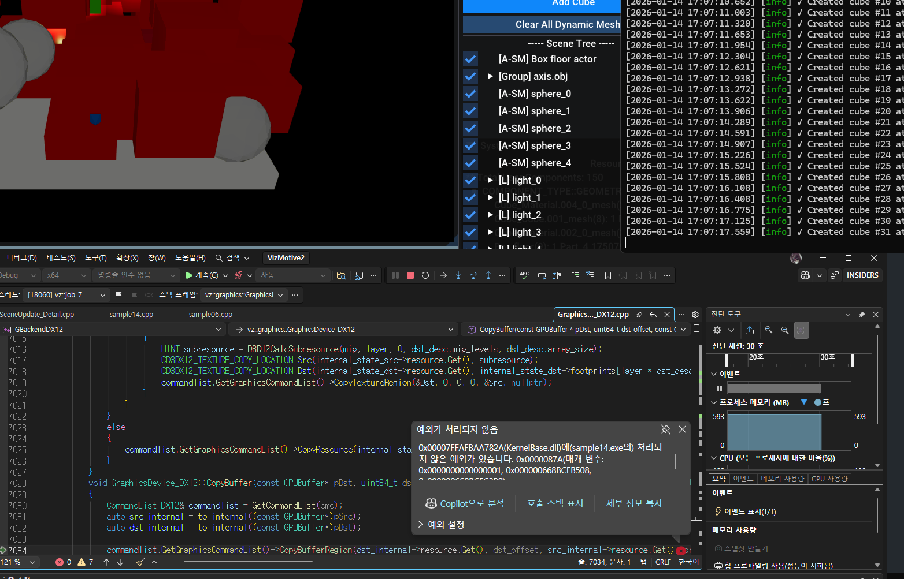
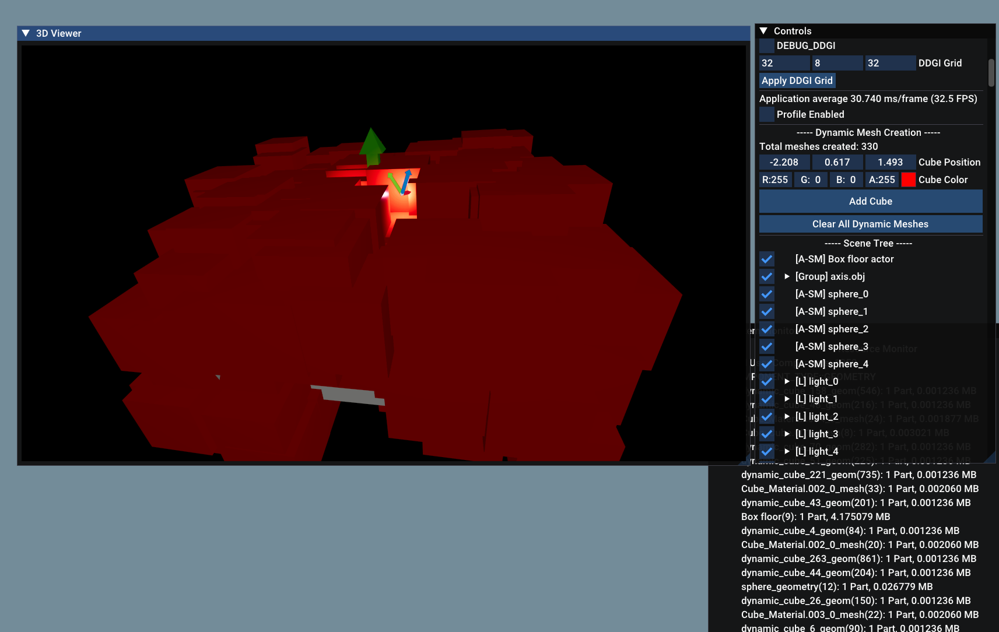

# VizMotive Engine Buffer Overflow Bug 수정 보고서

## 문제 요약

VizMotive 엔진에서 동적으로 메시를 추가할 때 **특정 개수에 도달하면 크래시**가 발생하는 버그 발견 및 수정 완료.

---

## 문제 발생 상황

### 케이스 1: MCP Server (빈 씬 + 3개 메시)
- **환경**: Claude Desktop MCP를 통한 빈 씬 (0개에서 시작)
- **증상**: 3개 cube/sphere 생성 시 크래시
- **버퍼 할당**: 첫 메시 추가 시 2개 버퍼 할당 (32 bytes)
- **크래시 시점**: 3번째 메시 추가 시 (48 bytes 필요, 32 bytes만 있음)

### 케이스 2: Python Viewer (초기 3개 + 추가 4개)
- **환경**: `vz_viewer_standalone.py`
- **초기 상태**: 테스트용 큐브 3개 (`_create_test_cubes`)
- **증상**: 총 7개 메시에서 크래시
- **버퍼 할당**: 초기 3개 → 6개 버퍼 (96 bytes)
- **크래시 시점**: 7번째 큐브 추가 시 (112 bytes 필요)

```
✓ Init cube #1-3 created
✓ Cube #4-6 added successfully
[Adding cube #7]
Calling renderer.render() with scene VID=1, camera VID=3
💥 CRASH (No Python exception, C++ level crash)
```

### 케이스 3: Sample14 (초기 ~30개 + 추가 31개)
- **환경**: VizMotive Sample14 (Debug 빌드), gui에 동적 메시 추가 버튼을 추가하여, 엔진 실행중에 오브젝트를 추가할 수 있게 수정함.
- **초기 상태**:
  - Sphere 5개
  - Light 5개 (각각 axis helper 포함)
  - Floor plane
  - 기타 초기 오브젝트
  - **총 약 30개 geometry instance**
- **크래시 시점**: 31번째 큐브 추가 시
- **버퍼 할당**: 초기 30개 → 60개 버퍼 (960 bytes)
- **필요 크기**: 61개 (976 bytes)



**DirectX 12 에러 메시지**:
```
D3D12 ERROR: ID3D12CommandList::CopyBufferRegion:
The destination region extends past the end of the destination resource.
When DstOffset is 0 and NumBytes is 976, the operation requires the
destination buffer to have 976 bytes, but it only has 960.
[ RESOURCE_MANIPULATION ERROR #841: COPYBUFFERREGION_DSTRANGEOUTOFBOUNDS ]
```

**호출 스택**:
```
GraphicsDevice_DX12.cpp:7034  → CopyBuffer()
RenderPath3D_Detail.cpp:1808  → UpdateRenderData()
SceneUpdate_Detail.cpp:1157   → Buffer size check (버그 위치)
```

---

## 계산 검증

### 버퍼 크기 계산

```cpp
struct alignas(16) ShaderInstanceResLookup {
    uint materialIndex;  // 4 bytes
    int vb_wetmap;       // 4 bytes
    int vb_ao;           // 4 bytes
    uint padding0;       // 4 bytes
};  // 총 16 bytes
```

| 케이스 | 초기 개수 | 버퍼 할당 (×2) | 버퍼 크기 | 크래시 시점 | 필요 크기 | 초과 |
|--------|----------|---------------|----------|-----------|----------|------|
| MCP Server | 0 (빈 씬) | 2개 | 32 bytes | 3번째 | 48 bytes | +16 bytes |
| MCP Server | 3 | 6개 | 96 bytes | 7번째 | 112 bytes | +16 bytes |
| Sample14 | ~30 | 60개 | 960 bytes | 61번째 | 976 bytes | +16 bytes |

### 왜 버퍼 재할당이 안 되었나?

**버그 코드 (SceneUpdate_Detail.cpp:1157)**:
```cpp
if (instanceResLookupUploadBuffer[0].desc.size < (instanceResLookupSize * sizeof(uint)))
//                                                                         ^^^^^^^^^^
//                                                                         4 bytes (잘못됨!)
```

#### MCP Server (3개 크래시) 계산:
```
초기: 빈 씬 (0개)
첫 메시 추가: 1개 → 2개 버퍼 할당 (32 bytes)
세 번째 메시 추가 시:
  버퍼 크기: 32 bytes
  조건 체크: 32 < (3 × 4 = 12) ?  → FALSE ❌
  실제 필요: 3 × 16 = 48 bytes
  결과: 버퍼 재할당 안함 → CopyBuffer 시도 → OVERFLOW
```

#### MCP Server (7개 크래시) 계산:
```
초기화: 3개 큐브 미리 생성 → 6개 버퍼 할당 (96 bytes)
일곱 번째 메시 추가 시:
  버퍼 크기: 96 bytes
  조건 체크: 96 < (7 × 4 = 28) ?  → FALSE ❌
  실제 필요: 7 × 16 = 112 bytes
  결과: 버퍼 재할당 안함 → CopyBuffer 시도 → OVERFLOW
```

#### Sample14 (61개 크래시) 계산:
```
초기: ~30개 오브젝트 → 60개 버퍼 할당 (960 bytes)
61번째 큐브 추가 시:
  버퍼 크기: 960 bytes
  조건 체크: 960 < (61 × 4 = 244) ?  → FALSE ❌
  실제 필요: 61 × 16 = 976 bytes
  결과: 버퍼 재할당 안함 → CopyBuffer 시도 → OVERFLOW
```

**핵심 문제**: 조건문에서 `sizeof(uint)` (4 bytes)를 사용하여 **실제 필요한 크기의 1/4만 체크**함.

---

## 근본 원인

### 1. 버그 코드 위치
**파일**: `EngineShaders/ShaderEngine/SceneUpdate_Detail.cpp`
**라인**: 1157

```cpp
// ❌ 잘못된 코드
if (instanceResLookupUploadBuffer[0].desc.size < (instanceResLookupSize * sizeof(uint)))
{
    GPUBufferDesc desc;
    desc.stride = sizeof(ShaderInstanceResLookup);  // 16 bytes 사용
    desc.size = desc.stride * instanceResLookupSize * 2;
    // ... 버퍼 생성
}
```

### 2. 불일치 분석

| 항목 | 조건문 | 버퍼 생성 | 배수 차이 |
|------|--------|----------|----------|
| 타입 | `sizeof(uint)` | `sizeof(ShaderInstanceResLookup)` | 4배 |
| 크기 | 4 bytes | 16 bytes | 4배 |

**결과**: 버퍼가 실제 필요한 크기의 **4배가 될 때까지 재할당이 안 됨**.

### 3. 동일한 패턴의 정상 코드 비교

| Line | Buffer | 조건문 sizeof | desc.stride sizeof | 상태 |
|------|--------|---------------|-------------------|------|
| 954  | instanceUploadBuffer | `ShaderMeshInstance` | `ShaderMeshInstance` | ✅ 정상 |
| 985  | materialUploadBuffer | `ShaderMaterial` | `ShaderMaterial` | ✅ 정상 |
| 1012 | textureStreamingFeedbackBuffer | `uint32_t` | `uint32_t` | ✅ 정상 |
| 1128 | geometryUploadBuffer | `ShaderGeometry` | `ShaderGeometry` | ✅ 정상 |
| 1157 | **instanceResLookupUploadBuffer** | ❌ `uint` | `ShaderInstanceResLookup` | 🐛 **버그** |
| 1198 | meshletBuffer | `ShaderMeshlet` | `ShaderMeshlet` | ✅ 정상 |

---

## 수정 내용

### 변경 사항

```cpp
// Before (버그)
if (instanceResLookupUploadBuffer[0].desc.size < (instanceResLookupSize * sizeof(uint)))

// After (수정)
if (instanceResLookupUploadBuffer[0].desc.size < (instanceResLookupSize * sizeof(ShaderInstanceResLookup)))
```

**변경 파일**: `EngineShaders/ShaderEngine/SceneUpdate_Detail.cpp:1157`

### 수정 효과

#### 수정 전:
```
instanceResLookupSize = 61
조건: 960 < (61 × 4 = 244) ?  → FALSE
→ 버퍼 재할당 안함 → 976 bytes 복사 시도 → 💥 CRASH
```

#### 수정 후:
```
instanceResLookupSize = 61
조건: 960 < (61 × 16 = 976) ?  → TRUE ✅
→ 버퍼 재할당 (61 × 2 = 122개, 1952 bytes)
→ 정상 복사 → ✅ SUCCESS
```

---

## 검증 결과

### 1. 테스트 환경
- **Sample14 Debug 빌드**
- **Visual Studio 2022 with D3D12 Debug Layer**

### 2. 테스트 결과



| 테스트 | 메시 개수 | 결과 | 비고 |
|--------|----------|------|------|
| 수정 전 | 7개 | ❌ 크래시 | Python viewer |
| 수정 전 | 31개 추가 (총 61개) | ❌ 크래시 | Sample14 |
| 수정 후 | 300개+ | ✅ 정상 | Sample14 |

**결론**: 300개 이상의 메시를 동적으로 추가해도 크래시 없이 정상 작동 확인.

### 3. 전체 코드베이스 검사

전체 프로젝트에서 동일한 패턴의 버그 검색 결과:
- **ShaderEngine**: 1개 발견 (수정 완료)
- **RenderPath3D_Detail.cpp**: 없음
- **GraphicsBackends**: 없음
- **EngineCore**: 없음

**결론**: `instanceResLookupUploadBuffer` 버그가 **유일한 문제**였음.

---

## 기술적 세부사항

### ShaderInstanceResLookup 구조체

```cpp
// 파일: EngineShaders/Shaders/ShaderInterop_Renderer.h:739
struct alignas(16) ShaderInstanceResLookup
{
    uint materialIndex;  // Material 인덱스
    int vb_wetmap;       // Wetmap vertex buffer 인덱스
    int vb_ao;           // AO vertex buffer 인덱스
    uint padding0;       // 16-byte alignment padding

    void Init() {
        materialIndex = ~0u;
        vb_wetmap = -1;
        vb_ao = -1;
    }
};
```

### 용도
- 각 geometry instance마다 material과 추가 vertex buffer를 매핑
- GPU 셰이더에서 `load_instResLookup()` 함수로 접근
- Structured Buffer로 GPU에 전달

### 버퍼 할당 전략
```cpp
desc.size = desc.stride * instanceResLookupSize * 2; // ×2 to grow fast
```
- 현재 필요한 크기의 **2배**를 할당하여 재할당 빈도 감소
- 성능 최적화를 위한 메모리 vs. 속도 트레이드오프

---

## 버그 발생 원인 추정

### 1. Copy-Paste 실수
다른 버퍼 할당 코드를 복사-붙여넣기한 후 `sizeof()` 타입을 수정하지 않았을 가능성.

```cpp
// 올바른 예시 (materialUploadBuffer)
if (materialUploadBuffer[0].desc.size < (materialArraySize * sizeof(ShaderMaterial)))

// 버그 (instanceResLookupUploadBuffer)
if (instanceResLookupUploadBuffer[0].desc.size < (instanceResLookupSize * sizeof(uint)))
//                                                                         ^^^^
//                                                                         복사 후 수정 안함?
```

### 2. 리팩토링 중 실수
`ShaderInstanceResLookup` 구조체 이름이 변경되거나 리팩토링 중에 실수로 `sizeof(uint)`로 변경되었을 가능성.

### 3. 테스트 부족
- 초기 씬 구성이 단순하여 60개 미만의 instance만 사용
- 동적 메시 추가 테스트가 부족하여 버그 발견 안 됨
- 61개 이상의 메시를 동적으로 추가하는 시나리오가 흔하지 않음

---

## 결론

### 수정 요약
- **파일**: `EngineShaders/ShaderEngine/SceneUpdate_Detail.cpp`
- **라인**: 1157
- **변경**: `sizeof(uint)` → `sizeof(ShaderInstanceResLookup)`
- **영향**: D3D12 버퍼 오버플로우 크래시 해결

### 검증 완료
- ✅ 300개+ 메시 추가 테스트 통과
- ✅ 전체 코드베이스에서 동일 패턴 버그 없음 확인
- ✅ D3D12 Debug Layer에서 에러 없음

### 권장 사항
1. **단위 테스트 추가**: 동적 메시 생성 시나리오를 테스트하는 자동화 테스트 추가
2. **코드 리뷰 강화**: 버퍼 할당 코드에서 `sizeof()` 타입 일치 여부 체크
3. **정적 분석 도구**: 이런 타입 불일치를 자동으로 검출하는 도구 도입 검토

---

## 참고 자료

### 관련 파일
- `EngineShaders/ShaderEngine/SceneUpdate_Detail.cpp` (버그 수정)
- `EngineShaders/ShaderEngine/RenderPath3D_Detail.cpp:1808` (CopyBuffer 호출)
- `EngineShaders/Shaders/ShaderInterop_Renderer.h:739` (구조체 정의)
- `GraphicsBackends/GraphicsDevice_DX12.cpp:7034` (실제 크래시 위치)

### 디버깅 로그
- `Examples/viewer_debug_20260113_154342.log` (Python viewer 크래시)
- Sample14 Visual Studio Output (D3D12 에러 메시지)

---

**작성일**: 2026-01-14