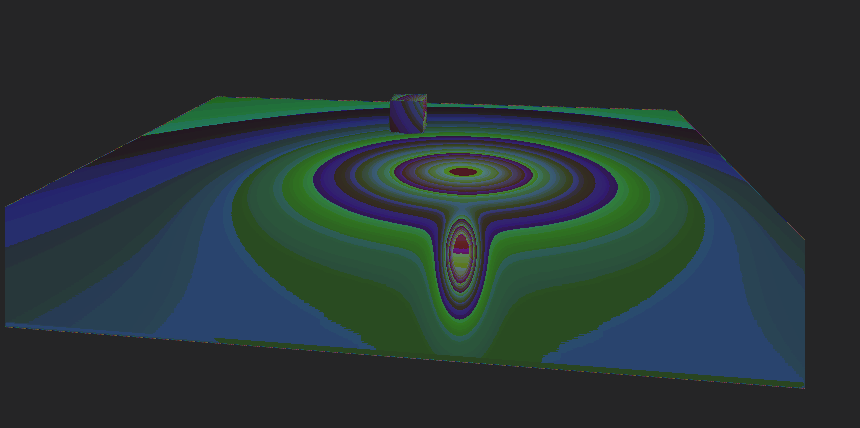

# VizMotive MCP & Python Viewer 개발 문서

## 개요

VizMotive 엔진을 Python에서 제어하고 시각화하기 위한 MCP(Model Context Protocol) 서버 및 독립형 Python 뷰어 개발 기록.


**개발 기간**: 2025년 1월

**시작 커밋**: `7b6e5de` (mcp initialized)

---

## 개발 히스토리

| 커밋 | 설명 |
|------|------|
| `7b6e5de` | MCP 초기화 - pyvizmotive 바인딩 기반 구조 설정 |
| `9697db3` | GUI 추가 - DearPyGui 기반 뷰어 프레임워크 |
| `92b4a3d` | 조명 및 렌더링 추가 |
| `564b084` | GUI 렌더링 구현 |
| `c53e966` | 경로 정리 |
| `bca0a7a` | Assets 폴더 junction 자동 생성 |
| `c3f9086` | PNG 파일 기반 렌더링 뷰어 |
| `355058a` | MCP 서버 초기화 |
| `5a80c1a` | 독립형 뷰어 (MCP 서버와 분리) |
| `9741f52` | 메시 오류 디버깅 |
| `cb5e0e4` | instanceResLookupUploadBuffer 크기 수정 |
| `3a6700d` | 응답 업데이트 |
| `aaff076` | .gitignore에 JSON 추가 |
| `df1bb40` | GUI 뷰어 업데이트 |
| `07c0e88` | 최적화 - R8G8B8A8 포맷 변경 |
| `c0ab640` | 오브젝트 피킹 추가 |
| `826d060` | BVH 기반 피킹 |
| `014165e` | 해상도 조절 가능 |
| - | **Python 모듈화 (vz_core 패키지)** |
| - | **MCP 서버 구조 개선 (headless + start_viewer)** |

---

## 파일 구조

### 현재 구조

```
Examples/Vz_MCP_Sample/
├── vz_core/                          # 공용 Python 모듈 패키지
│   ├── __init__.py                   # 엔진 초기화, 경로 설정
│   ├── camera.py                     # OrbitCamera 클래스
│   ├── render_utils.py               # RGBA8→float 변환 유틸리티
│   └── gui/                          # GUI 컴포넌트
│       ├── __init__.py
│       ├── render_view.py            # RenderView (텍스처 렌더링)
│       ├── panels.py                 # ObjectPanel, PropertyPanel, ControlPanel
│       └── handlers.py               # MouseHandler (카메라/피킹)
│
├── vz_mcp_server.py                  # MCP 서버 (headless, Claude Desktop용)
├── vz_viewer_standalone.py           # 독립형 GUI 뷰어 (MCP 명령 수신)
├── vz_viewer_modular.py              # vz_core 사용 예제 뷰어
├── vz_viewer_test_gui.py             # 테스트 GUI 뷰어
│
├── scene_commands.json               # MCP→뷰어 명령 파일
├── scene_responses.json              # 뷰어→MCP 응답 파일
└── mcp_screenshots/                  # 스크린샷 저장 폴더
```

---

## Python 모듈화 (vz_core)

코드 중복을 제거하고 재사용성을 높이기 위한 공용 패키지.

### vz_core/__init__.py

```python
import pyvizmotive as vzm

def init_engine(headless: bool = False) -> bool:
    """엔진 초기화 (DLL 경로, Assets junction 자동 처리)"""
    if headless:
        return vzm.init_engine_as_headless()
    return vzm.init_engine()

def deinit_engine():
    vzm.deinit_engine()
```

### vz_core/camera.py - OrbitCamera

```python
class OrbitCamera:
    """Blender 스타일 Orbit 카메라 컨트롤러"""

    def __init__(self):
        self.azimuth = 45.0      # 수평 회전
        self.elevation = 30.0    # 수직 회전
        self.distance = 8.0      # 거리
        self.target = [0, 0, 0]  # 타겟 위치

    def orbit(self, dx, dy):
        """마우스 드래그로 회전"""

    def pan(self, dx, dy):
        """Shift+드래그로 이동"""

    def zoom(self, delta):
        """스크롤로 줌"""

    def apply_to_camera(self, camera):
        """VzCamera에 적용"""
```

### vz_core/gui/panels.py

#### ObjectPanel
- Cube, Sphere, Point Light, Directional Light 생성 버튼
- 오브젝트 목록 (Listbox)
- Delete, Clear All 버튼
- `create_floor()` 메서드

#### PropertyPanel
- Position X/Y/Z 편집
- **Rotation X/Y/Z 편집** (Euler angles, degrees)
- Material Color 편집 (메시)
- Shadow Cast/Receive 토글 (메시)
- Light Type/Color/Intensity/Range 편집 (조명)

#### ControlPanel
- DDGI 토글 (`tag="ddgi_checkbox"` - MCP 동기화용)
- Screenshot 버튼
- FPS/Resolution 표시
- 조작법 안내

### vz_core/gui/handlers.py - MouseHandler

```python
class MouseHandler:
    """마우스 입력 핸들러"""

    # 좌클릭: 오브젝트 피킹
    # 우클릭/휠클릭 드래그: 카메라 회전
    # Shift+휠클릭 드래그: 카메라 이동
    # 휠 스크롤: 줌
```

### vz_core/gui/render_view.py - RenderView

```python
class RenderView:
    """렌더링 결과 표시 컴포넌트"""

    # 텍스처 자동 생성/갱신
    # 해상도 드래그 리사이즈
    # FPS 카운터
```

---

## MCP 서버 구조

### 아키텍처

```
┌─────────────────┐     stdio (JSON-RPC)     ┌──────────────────┐
│ Claude Desktop  │ ◄──────────────────────► │  vz_mcp_server   │
└─────────────────┘                          │    (headless)    │
                                             └────────┬─────────┘
                                                      │ 파일 기반 통신
                                    ┌─────────────────┴─────────────────┐
                                    │  scene_commands.json              │
                                    │  scene_responses.json             │
                                    └─────────────────┬─────────────────┘
                                                      │
                                             ┌────────▼─────────┐
                                             │ vz_viewer_       │
                                             │ standalone.py    │
                                             │ (GUI 뷰어)       │
                                             └──────────────────┘
```

### vz_mcp_server.py (Headless)

Claude Desktop이 실행하는 MCP 서버. 뷰어는 별도 프로세스로 실행.

**핵심 특징**:
- stdout 오염 방지 (MCP JSON-RPC 통신용)
- `start_viewer()` 도구로 뷰어 실행
- 파일 기반 양방향 통신

**사용 가능한 MCP 도구**:

| 도구 | 설명 |
|------|------|
| `ping()` | 연결 테스트 |
| `start_viewer()` | GUI 뷰어 시작 |
| `get_viewer_status()` | 뷰어 상태 확인 |
| `create_cube(x, y, z, size, color_r/g/b)` | 큐브 생성 |
| `create_sphere(x, y, z, radius, color_r/g/b)` | 구 생성 |
| `create_light(x, y, z, type, color, intensity, range)` | 조명 생성 |
| `set_object_position(name, x, y, z)` | 위치 변경 |
| `set_object_rotation(name, pitch, yaw, roll)` | 회전 변경 |
| `set_object_scale(name, sx, sy, sz)` | 스케일 변경 |
| `set_object_color(name, r, g, b)` | 색상 변경 |
| `delete_object(name)` | 오브젝트 삭제 |
| `list_objects()` | 오브젝트 목록 |
| `clear_scene(include_floor)` | 씬 클리어 |
| `enable_ddgi(enabled, grid_x/y/z)` | DDGI 토글 |
| `set_render_resolution(width, height)` | 해상도 설정 |
| `render_screenshot(filename)` | 스크린샷 (절대 경로 반환) |
| `set_camera_position(x, y, z, look_at_x/y/z)` | 카메라 설정 |

### Claude Desktop 설정

`%APPDATA%\Claude\claude_desktop_config.json`:

```json
{
  "mcpServers": {
    "vizmotive": {
      "command": "python",
      "args": ["C:/path/to/VizMotive-Engine/Examples/Vz_MCP_Sample/vz_mcp_server.py"]
    }
  }
}
```

---

## 주요 기능 상세

### 1. Python 바인딩 (pyvizmotive)

VizMotive C++ 엔진을 Python에서 사용하기 위한 pybind11 기반 바인딩.

**위치**: `PythonBindings/src/bind_types.cpp`

**주요 클래스**:
- `VzRenderer` - 렌더러 제어
- `VzScene` - 씬 관리
- `VzCamera` - 카메라 제어
- `VzActor` - 액터(오브젝트) 제어
- `VzLight` - 조명 제어

**핵심 API**:
```python
# 엔진 초기화
vzm.init_engine()

# 씬/카메라/렌더러 생성
scene = vzm.new_scene("scene")
camera = vzm.new_camera("camera")
renderer = vzm.new_renderer("renderer")

# 렌더링
renderer.render(scene.get_vid(), camera.get_vid())

# 렌더 결과 가져오기 (R8G8B8A8 버퍼)
buffer_data, w, h = renderer.store_render_target_rgba8()
```

### 2. 오브젝트 회전

엔진의 `set_rotation`은 Euler angles (degrees) 사용:

```python
# [roll, pitch, yaw] in degrees
component.set_rotation([roll, pitch, yaw])
```

**GUI에서**:
- X (pitch): 앞뒤로 기울임
- Y (yaw): 좌우 회전
- Z (roll): 옆으로 기울임

**MCP에서**:
```python
set_object_rotation("mcp_cube_1", pitch=45, yaw=30, roll=0)
```

### 3. DDGI 상태 동기화

MCP로 DDGI 상태 변경 시 GUI 토글도 자동 업데이트:

```python
# vz_viewer_standalone.py
def _enable_ddgi(self, cmd_id, cmd):
    vzm.set_configure({'DDGI_ENABLED': enabled})

    # GUI 토글 동기화
    if dpg.does_item_exist("ddgi_checkbox"):
        dpg.set_value("ddgi_checkbox", enabled)
```

### 4. 오브젝트 피킹

**C++ API**:
```cpp
bool VzRenderer::PickObject(
    const vfloat2& pos,           // 스크린 좌표
    VID& vid,                     // 출력: 오브젝트 ID
    vfloat3& worldPosition,       // 출력: 월드 좌표
    uint32_t* primitiveID,        // 출력: 프리미티브 ID
    uint8_t* maskValue,           // 출력: 마스크 값
    bool useGpuPicking,           // GPU/CPU 피킹 선택
    uint32_t filterFlags,         // 필터 플래그
    float toleranceRadius         // 허용 반경
)
```

**피킹 방식**:
| 방식 | 장점 | 단점 |
|------|------|------|
| GPU 피킹 | 정확함 | 1프레임 지연 |
| BVH 피킹 | 즉각 반응 | CPU 부하 |

---

## 기술적 세부사항

### 렌더 타겟 포맷 변경

- 기존 vizmotive raw buffer (R11G11B10_FLOAT) 를 그대로 RGBA8 를 사용하는 파이썬에서 보여주면 색상이 깨지는 현상 발생



**문제**: R11G11B10_FLOAT 포맷을 Python에서 디코딩하면 FPS가 60 → 20으로 급감

**원인 분석**:
1. R11G11B10_FLOAT → RGBA8 변환을 Python(NumPy)에서 수행 → 느림
2. C++로 이동해도 for 루프 변환은 여전히 느림
3. 변환 자체가 병목

**해결**: 엔진 출력 포맷을 R8G8B8A8_UNORM으로 변경하여 변환 제거

**수정 파일**:

1. `EngineCore/Common/RenderPath3D.h`
```cpp
// Before
constexpr Format formatRendertargetMain = graphics::Format::R11G11B10_FLOAT;
// After
constexpr Format formatRendertargetMain = graphics::Format::R8G8B8A8_UNORM;
```

2. `EngineShaders/ShaderEngine/Renderer.h`
```cpp
// Before
constexpr Format FORMAT_rendertargetMain = Format::R11G11B10_FLOAT;
// After
constexpr Format FORMAT_rendertargetMain = Format::R8G8B8A8_UNORM;
```

**결과**: 변환 없이 직접 사용 가능 → FPS 60 유지

### 렌더 버퍼 전송 API

**C++ API** (`VzRenderer.cpp`):
```cpp
bool VzRenderer::StoreRenderTargetRGBA8(std::vector<uint8_t>& rgbaBuffer, uint32_t* w, uint32_t* h)
{
    // R8G8B8A8_UNORM이면 변환 없이 직접 복사
    if (desc.format == graphics::Format::R8G8B8A8_UNORM ||
        desc.format == graphics::Format::R8G8B8A8_UNORM_SRGB)
    {
        rgbaBuffer = std::move(rawBuffer);  // 변환 없음!
    }
}
```

**Python 사용** (`vz_core/render_utils.py`):
```python
def rgba8_to_float(data, width, height):
    """RGBA8 → float32 변환 (DearPyGui용)"""
    uint8_data = np.frombuffer(data, dtype=np.uint8)
    np.multiply(uint8_data, 1.0 / 255.0, out=_float_buffer, casting="unsafe")
    return _float_buffer
```

---

## 남은 최적화 과제

### 1. saveTextureToMemory 병목 (Helpers2.cpp)

**현재 문제**:
```cpp
// 매 프레임 staging 텍스처 생성 (비용 큼!)
device->CreateTexture(&staging_desc, nullptr, &stagingTex);

// GPU 동기화 - 파이프라인 완전 스톨
device->WaitForGPU();
```

**해결 방안**:
- Staging 텍스처 캐싱/재사용
- 비동기 readback (더블 버퍼링으로 1프레임 지연 사용)

### 2. Python 측 오버헤드

**현재 문제**:
- `rgba8_to_float()`: uint8 → float32 변환 필요 (DearPyGui가 float만 지원)
- `dpg.set_value()`: 대용량 텍스처 업데이트

**해결 방안**:
- DearPyGui가 uint8 지원 시 변환 제거 가능
- 텍스처 더블 버퍼링

### 3. 고해상도 시 FPS 저하

- 해상도를 높이면 FPS가 60 → 30으로 감소
- GPU readback 병목으로 추정

---

## 사용 방법

### 방법 1: 직접 뷰어 실행
```bash
cd Examples/Vz_MCP_Sample
python vz_viewer_standalone.py
```

### 방법 2: Claude Desktop에서 MCP로 제어
1. Claude Desktop 설정에 MCP 서버 등록
2. Claude Desktop 실행
3. "뷰어 시작해줘" → `start_viewer()` 호출
4. "빨간 큐브 만들어줘" → `create_cube(0, 1, 0, color_r=1)`

### 조작법
| 입력 | 동작 |
|------|------|
| LMB 클릭 | 오브젝트 선택 |
| RMB/MMB 드래그 | 카메라 회전 |
| Shift+MMB 드래그 | 카메라 이동 |
| 스크롤 | 줌 |
| 우측 하단 드래그 | 해상도 조절 |

---

## 의존성

- Python 3.10+
- DearPyGui
- NumPy
- FastMCP (MCP 서버용)
- pyvizmotive (빌드 필요)

**pyvizmotive 빌드 위치**: `PythonBindings/out/build/x64-Debug/`

---

## 성능 비교

| 조건 | FPS |
|------|-----|
| Raw buffer (변환 없음, 색상 이상) | 60+ |
| Python NumPy 변환 (R11G11B10→float) | ~20 |
| C++ 변환 (R11G11B10→RGBA8) | ~20 |
| R8G8B8A8 직접 출력 (현재) | ~60 |
| 고해상도 시 | ~30 (추가 최적화 필요) |
