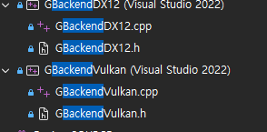

# dx12 6개월 단위로 follow

* Graphics Backend 
  - GBackendDX12 를 Wicked engine DX12 backend update 를 그대로 따라서 진행.

jobsystem - wait

device->WaitCommandList

device->WaitQueue

위 2개 차이 (commandlist, queue)


device->WaitForGPU();

```c
	void GraphicsDevice_DX12::WaitForGPU() const
	{
		ComPtr<ID3D12Fence> fence;
		HRESULT hr = device->CreateFence(0, D3D12_FENCE_FLAG_NONE, PPV_ARGS(fence));
		assert(SUCCEEDED(hr));

		for (auto& queue : queues)
		{
			if (queue.queue == nullptr)
				continue;
			hr = queue.queue->Signal(fence.Get(), 1);
			assert(SUCCEEDED(hr));
			if (fence->GetCompletedValue() < 1)
			{
				hr = fence->SetEventOnCompletion(1, NULL);
				assert(SUCCEEDED(hr));
			}
			fence->Signal(0);
		}
	}
```


fence 해당되는게 

```c

// Preparing the frame:
CommandList cmd = device->BeginCommandList();
// DO NOT 'device->WaitQueue(cmd, QUEUE_COMPUTE)' when there is NO QUEUE_COMPUTE commmand list!
//device->WaitQueue(cmd, QUEUE_COMPUTE);
ProcessDeferredResourceRequests(cmd); // Execute it first thing in the frame here, on main thread, to not allow other thread steal it and execute on different command list!

CommandList cmd_prepareframe = cmd;
// remember GraphicsDevice::BeginCommandList does incur some overhead
//	this is why jobsystem::Execute is used here
jobsystem::Execute(ctx, [this, cmd](jobsystem::JobArgs args) {

	BindCameraCB(*camera, cameraPrevious, cameraReflection, cmd);
	UpdateRenderData(visMain, frameCB, cmd);

	barrierStack.push_back(GPUBarrier::Image(&rtMain, rtMain.desc.layout, ResourceState::UNORDERED_ACCESS));
	barrierStack.push_back(GPUBarrier::Image(&rtPrimitiveID_1, rtPrimitiveID_1.desc.layout, ResourceState::UNORDERED_ACCESS));
	barrierStack.push_back(GPUBarrier::Aliasing(&rtPostprocess, &rtPrimitiveID_1));
	BarrierStackFlush(cmd);

	// These Clear'UAV' must be after the barrier transition to ResourceState::UNORDERED_ACCESS
	device->ClearUAV(&rtMain, 0, cmd);
	device->ClearUAV(&rtPrimitiveID_1, 0, cmd);

	});

cmd = device->BeginCommandList();
device->WaitCommandList(cmd, cmd_prepareframe);

```

indirectBuffer

파라미터를 gpu -> cpu 읽어오는 경우

gpu 에서 직접 읽고 쓰기 가능한 버퍼를 사용

---

16.
pso 살아있을때 shader 리소스를 해제하는 경우?

---

메모리 서브할당

depth 버퍼 32비트

primitive id 쓰는 버퍼가 필요

-> aliasing 을 이용해 depth 버퍼를 대신 사용

wicked 에서 aliasing 사용 상황 찾아보기 

---

copyallocator changes 차이

---

pso caching 명시적 종료 자세히 알아보기



GBackendMetal 새로 프로젝트 만들기
follow 하면서 정리하면서 하기

# 최신버전 기준으로 

* RayTracing 
  - VizMotive 에서는 PathTracing 으로 RenderPath3D 를 상속받아 구현

* GI Shaders
  - VoxelGI, SurfelGI 추가

* 물리엔진 (Jolt)
  - Jolt engine 과 이것의 wrapper APIs VizMotive 에 이식
  - 이 부분에서 VizMotive physics layer 가 향후 Genesis Physics 와 연동될 것을 염두에 두고 진행


* Direct Volume Rendering
  - Medical Viewer 용 (회사 지원)